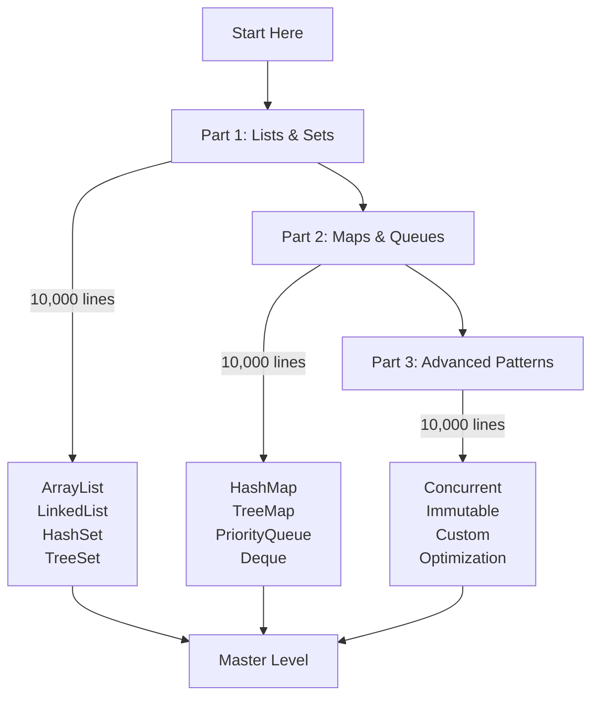
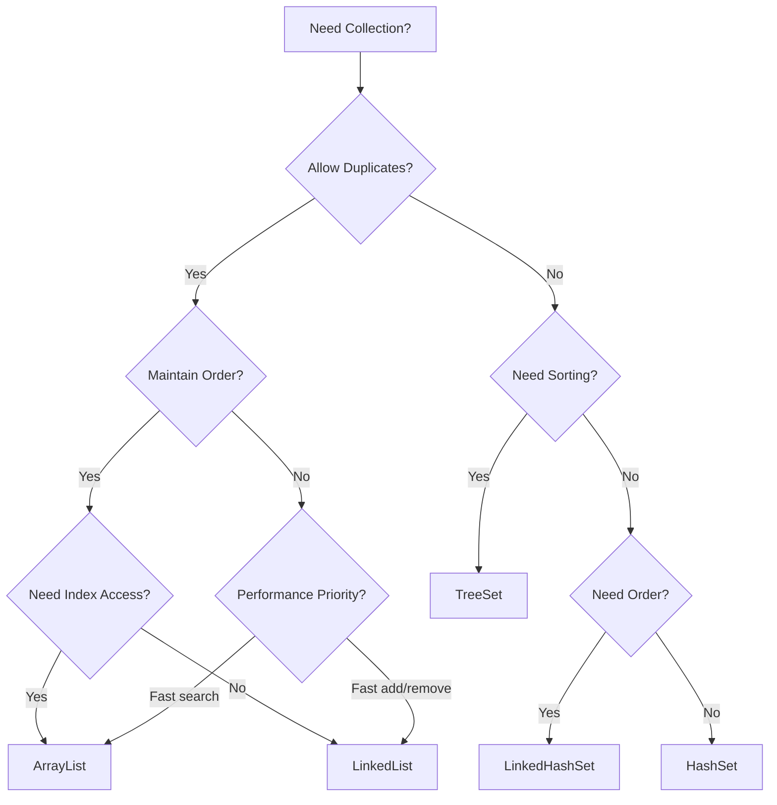

# 🎯 Java Collections Framework - Master Index

> **The Ultimate Collections Learning Path - Your Complete Navigation Hub**

---

## 📚 About This Mega-Guide Series

Welcome to the **most comprehensive Java Collections Framework guide** ever created. This three-part series covers everything from fundamentals to production-grade implementations, with **30,000+ lines** of content, **300+ code examples**, and **100+ diagrams**.

### 🌟 What Makes This Series Ultimate

- ✅ **30,000+ lines** of comprehensive content across 3 parts
- ✅ **300+ code examples** from basic to production-grade
- ✅ **100+ Mermaid diagrams** and visual learning aids
- ✅ **Deep internals** - understand how collections work under the hood
- ✅ **Performance analysis** - complete complexity breakdowns
- ✅ **Real-world patterns** - industry-proven implementations
- ✅ **Interview mastery** - 100+ questions with detailed explanations
- ✅ **Production-ready** - security, thread-safety, optimization
- ✅ **Java 8-21 features** - modern Java best practices

---

## 🗺️ Learning Path Overview



---

## 📖 Part 1: Lists & Sets (10,000+ lines)

**File:** [`26a_Collections_Part1_Lists_Sets.md`](26a_Collections_Part1_Lists_Sets.md)

**Topics Covered:**
- ✅ Collections Framework Architecture
- ✅ Collection Interface Deep Dive
- ✅ ArrayList - Complete Mastery
- ✅ LinkedList - Complete Mastery
- ✅ Vector & Stack (Legacy)
- ✅ CopyOnWriteArrayList (Concurrent)
- ✅ List Performance & Selection
- ✅ HashSet - Complete Mastery
- ✅ LinkedHashSet - Insertion Order
- ✅ TreeSet - Sorted Sets
- ✅ EnumSet - Optimized Sets
- ✅ Set Performance & Selection
- ✅ Iterator & ListIterator Patterns

**Learning Outcomes:**
- Master list implementations and their trade-offs
- Understand when to use ArrayList vs LinkedList
- Master set implementations and uniqueness guarantees
- Understand hashing, equals(), and hashCode()
- Master iteration patterns and fail-fast behavior
- Write production-grade list and set code

**Estimated Time:** 15-20 hours with practice

---

## 📖 Part 2: Maps & Queues (10,000+ lines)

**File:** [`26b_Collections_Part2_Maps_Queues.md`](26b_Collections_Part2_Maps_Queues.md)

**Topics Covered:**
- ✅ Map Interface Deep Dive
- ✅ HashMap - Complete Mastery
- ✅ LinkedHashMap - LRU Cache Implementation
- ✅ TreeMap - Sorted Maps & Navigation
- ✅ Hashtable vs HashMap vs ConcurrentHashMap
- ✅ WeakHashMap - Memory Management
- ✅ IdentityHashMap - Reference Equality
- ✅ Map Performance & Selection
- ✅ Queue & Deque Interfaces
- ✅ PriorityQueue - Heap Algorithms
- ✅ ArrayDeque - High-Performance Deque
- ✅ BlockingQueue Implementations
- ✅ Queue Patterns & Use Cases

**Learning Outcomes:**
- Master map implementations and collision resolution
- Understand HashMap internals (Java 7 vs 8+)
- Implement LRU cache with LinkedHashMap
- Master queue and deque patterns
- Understand priority queues and heap algorithms
- Write production-grade map and queue code

**Estimated Time:** 15-20 hours with practice

---

## 📖 Part 3: Advanced Patterns (10,000+ lines)

**File:** [`26c_Collections_Part3_Advanced_Patterns.md`](26c_Collections_Part3_Advanced_Patterns.md)

**Topics Covered:**
- ✅ Concurrent Collections Deep Dive
- ✅ ConcurrentHashMap Internals
- ✅ CopyOnWrite Collections
- ✅ BlockingQueue Implementations
- ✅ Immutable Collections (Java 9+)
- ✅ Collections.unmodifiable*() vs ImmutableCollections
- ✅ Custom Collection Implementations
- ✅ Comparator & Comparable Mastery
- ✅ Sorting Algorithms (Arrays.sort, Collections.sort)
- ✅ Binary Search & Searching Algorithms
- ✅ Collections Utility Methods
- ✅ Performance Optimization Techniques
- ✅ Memory Management & GC Impact
- ✅ Benchmarking & Profiling
- ✅ Production Patterns & Best Practices
- ✅ Caching Strategies
- ✅ Real-World Case Studies
- ✅ Interview Questions (100+)
- ✅ System Design with Collections

**Learning Outcomes:**
- Master thread-safe collections
- Understand concurrent collections internals
- Implement custom collections
- Master sorting and searching algorithms
- Optimize collection performance
- Design production-grade systems
- Ace collections interview questions

**Estimated Time:** 20-25 hours with practice

---

## 🎯 How to Use This Guide

### 📚 Sequential Learning (Recommended)

**For Beginners:**
```
1. Start with Part 1 (Lists & Sets)
2. Practice with 50+ examples
3. Solve practice problems
4. Move to Part 2 (Maps & Queues)
5. Practice with 50+ examples
6. Solve practice problems
7. Complete Part 3 (Advanced)
8. Build production projects
```

**Time Investment:** 50-65 hours total

### 🎯 Targeted Learning

**For Specific Topics:**
```
- Need Lists? → Part 1, Sections 1-7
- Need Sets? → Part 1, Sections 8-12
- Need Maps? → Part 2, Sections 1-8
- Need Queues? → Part 2, Sections 9-13
- Need Concurrency? → Part 3, Sections 1-4
- Need Performance? → Part 3, Sections 10-14
- Need Interview Prep? → Part 3, Sections 18-20
```

### 🏆 Interview Preparation

**Fast Track (2 weeks):**
```
Week 1:
- Part 1: Focus on ArrayList, HashSet, TreeSet
- Part 2: Focus on HashMap, TreeMap, PriorityQueue
- Solve 30 practice problems

Week 2:
- Part 3: Concurrent Collections, Performance
- Solve 50 interview questions
- Complete 5 system design exercises
```

---

## 📊 Coverage Statistics

| Metric | Value |
|--------|-------|
| **Total Lines** | 30,000+ |
| **Code Examples** | 300+ |
| **Diagrams** | 100+ |
| **Tables** | 150+ |
| **Collection Types** | 25+ |
| **Interview Questions** | 100+ |
| **Practice Problems** | 50+ |
| **Case Studies** | 10+ |
| **Reading Time** | 30-40 hours |
| **Mastery Time** | 50-80 hours |

---

## 🔗 Quick Navigation

### By Collection Type

| Collection | Location | Complexity |
|------------|----------|------------|
| **ArrayList** | [Part 1, Section 3](26a_Collections_Part1_Lists_Sets.md#arraylist) | Beginner |
| **LinkedList** | [Part 1, Section 4](26a_Collections_Part1_Lists_Sets.md#linkedlist) | Intermediate |
| **HashSet** | [Part 1, Section 8](26a_Collections_Part1_Lists_Sets.md#hashset) | Beginner |
| **TreeSet** | [Part 1, Section 10](26a_Collections_Part1_Lists_Sets.md#treeset) | Intermediate |
| **HashMap** | [Part 2, Section 2](26b_Collections_Part2_Maps_Queues.md#hashmap) | Intermediate |
| **TreeMap** | [Part 2, Section 4](26b_Collections_Part2_Maps_Queues.md#treemap) | Intermediate |
| **LinkedHashMap** | [Part 2, Section 3](26b_Collections_Part2_Maps_Queues.md#linkedhashmap) | Intermediate |
| **PriorityQueue** | [Part 2, Section 10](26b_Collections_Part2_Maps_Queues.md#priorityqueue) | Advanced |
| **ConcurrentHashMap** | [Part 3, Section 2](26c_Collections_Part3_Advanced_Patterns.md#concurrenthashmap) | Advanced |
| **CopyOnWriteArrayList** | [Part 3, Section 3](26c_Collections_Part3_Advanced_Patterns.md#copyonwrite) | Advanced |

### By Topic

| Topic | Location | Importance |
|-------|----------|------------|
| **Framework Architecture** | [Part 1, Section 1](26a_Collections_Part1_Lists_Sets.md#architecture) | Essential |
| **Generics** | [Part 1, Section 2](26a_Collections_Part1_Lists_Sets.md#generics) | Essential |
| **equals() & hashCode()** | [Part 1, Section 9](26a_Collections_Part1_Lists_Sets.md#equals-hashcode) | Critical |
| **HashMap Internals** | [Part 2, Section 2](26b_Collections_Part2_Maps_Queues.md#hashmap-internals) | Critical |
| **LRU Cache** | [Part 2, Section 3](26b_Collections_Part2_Maps_Queues.md#lru-cache) | Important |
| **Concurrent Collections** | [Part 3, Section 1](26c_Collections_Part3_Advanced_Patterns.md#concurrent) | Critical |
| **Performance Tuning** | [Part 3, Section 10](26c_Collections_Part3_Advanced_Patterns.md#performance) | Important |
| **Interview Questions** | [Part 3, Section 18](26c_Collections_Part3_Advanced_Patterns.md#interview) | Essential |

---

## 🎓 Learning Milestones

### Milestone 1: Foundation (After Part 1)
✅ Understand Collections Framework architecture
✅ Master ArrayList and LinkedList
✅ Master HashSet and TreeSet
✅ Understand iteration patterns
✅ Write basic collection code

### Milestone 2: Intermediate (After Part 2)
✅ Master HashMap internals
✅ Implement LRU cache
✅ Master TreeMap navigation
✅ Understand queue patterns
✅ Write intermediate collection code

### Milestone 3: Advanced (After Part 3)
✅ Master concurrent collections
✅ Implement custom collections
✅ Optimize collection performance
✅ Design production systems
✅ Ace collection interviews

---

## 💡 Best Practices Summary

### Memory Management
```java
// Pre-size collections when size is known
List<String> list = new ArrayList<>(10000);

// Trim unused capacity
list.trimToSize();

// Use immutable collections for constants
Set<String> constants = Set.of("A", "B", "C");
```

### Thread Safety
```java
// Use concurrent collections for multi-threaded access
Map<String, Integer> map = new ConcurrentHashMap<>();

// Or synchronize access
List<String> syncList = Collections.synchronizedList(new ArrayList<>());
```

### Performance
```java
// Choose right collection for use case
List<String> frequentAdds = new LinkedList<>();  // Frequent add/remove at ends
List<String> randomAccess = new ArrayList<>();   // Frequent get(index)

// Use bulk operations
list.addAll(otherList);  // Better than loop with add()
```

---

## 📚 Related Tutorials

### Previous Topics
- **Tutorial 19:** [Generics](19_Generics.md) - Type parameters and wildcards
- **Tutorial 16:** [Threads](16_Threads.md) - Thread safety basics
- **Tutorial 11:** [Arrays](11_Arrays.md) - Fixed-size collections

### Next Topics
- **Tutorial 27:** [Java IO](27_Java_IO_Master_Index.md) - Stream-based I/O
- **Tutorial 28:** [Serialization](28_Serialization_Complete.md) - Object persistence

### Advanced Topics
- **Java Concurrency in Practice** - Thread-safe collection usage
- **Design Patterns** - Collection-based patterns

---

## 🎯 Interview Preparation Track

### Week 1: Fundamentals
- [ ] Complete Part 1
- [ ] Solve 20 basic problems
- [ ] Implement ArrayList from scratch
- [ ] Implement HashSet from scratch

### Week 2: Intermediate
- [ ] Complete Part 2
- [ ] Solve 20 intermediate problems
- [ ] Implement HashMap from scratch
- [ ] Implement LRU cache

### Week 3: Advanced
- [ ] Complete Part 3
- [ ] Solve 30 advanced problems
- [ ] Study concurrent collections
- [ ] Practice system design

### Week 4: Mock Interviews
- [ ] Solve 30 mixed problems
- [ ] Complete 10 system design exercises
- [ ] Review all performance optimizations
- [ ] Practice explaining concepts

---

## 🔥 Quick Reference

### Collection Selection Flowchart



### Time Complexity Cheat Sheet

| Operation | ArrayList | LinkedList | HashSet | TreeSet | HashMap | TreeMap |
|-----------|-----------|------------|---------|---------|---------|---------|
| **add()** | O(1)* | O(1) | O(1)* | O(log n) | O(1)* | O(log n) |
| **get()** | O(1) | O(n) | - | - | O(1)* | O(log n) |
| **remove()** | O(n) | O(1)** | O(1)* | O(log n) | O(1)* | O(log n) |
| **contains()** | O(n) | O(n) | O(1)* | O(log n) | O(1)* | O(log n) |

*Amortized, **If node reference available

---

## 📞 Support & Resources

### Official Documentation
- [Java Collections Framework](https://docs.oracle.com/javase/tutorial/collections/)
- [Java API Docs](https://docs.oracle.com/en/java/javase/21/docs/api/)

### Books
- *Effective Java* by Joshua Bloch (3rd Edition)
- *Java Concurrency in Practice* by Brian Goetz
- *Data Structures and Algorithms in Java* by Goodrich & Tamassia

### Online Resources
- [Java Collections Tutorial](https://jenkov.com/tutorials/java-collections/index.html)
- [Baeldung Collections Guide](https://www.baeldung.com/java-collections)

---

## 🚀 Let's Begin!

Ready to master Java Collections? Start with **[Part 1: Lists & Sets](26a_Collections_Part1_Lists_Sets.md)**

**Remember:** This is a marathon, not a sprint. Take your time, practice with examples, and build real projects. The investment in mastering collections will pay dividends throughout your Java career.

**Happy Learning! 🎉**

---

## 📝 Changelog

### Version 1.0 (November 2025)
- ✅ Complete rewrite as modular mega-guide
- ✅ Split into 3 parts for better organization
- ✅ Added 300+ code examples
- ✅ Added 100+ diagrams
- ✅ Added 100+ interview questions
- ✅ Added performance optimization sections
- ✅ Added concurrent collections deep dive
- ✅ Added real-world case studies
- ✅ Covers Java 8, 11, 17, 21 features

---

*Part of the RBR Java Tutorials Series - Tutorial 26*
*Master Index Created: November 2025*
