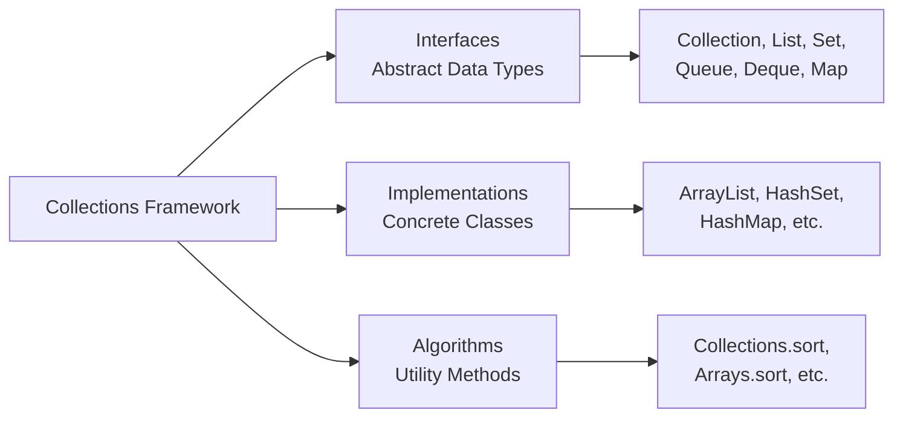
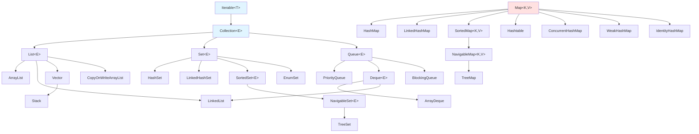
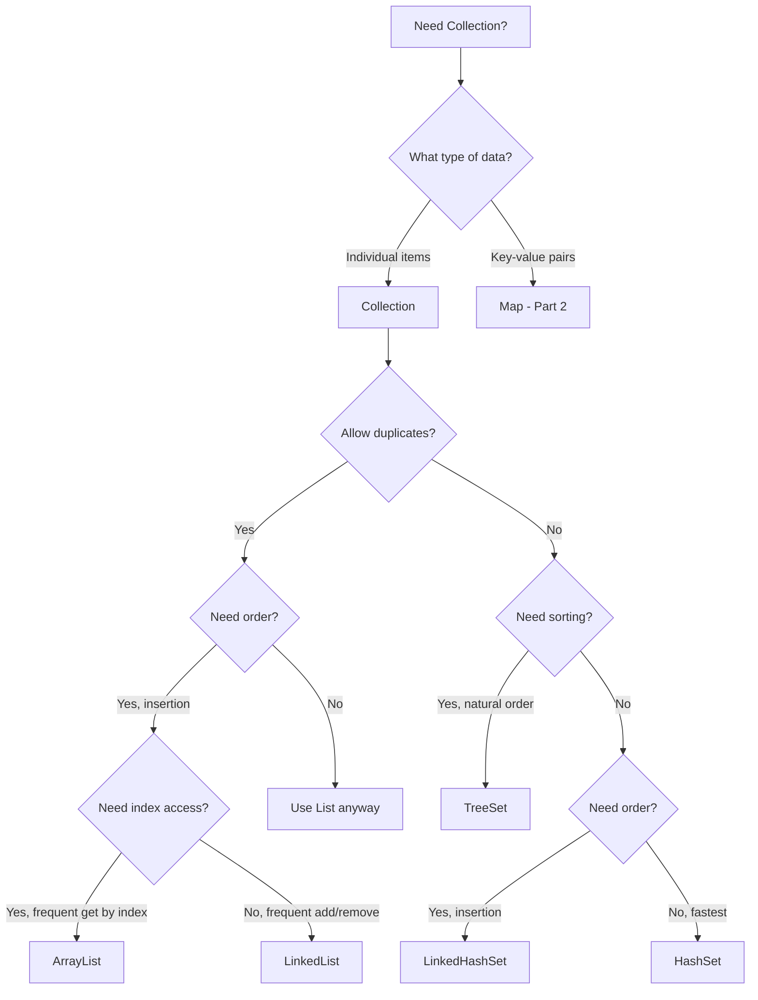

# 🎯 Java Collections Framework - Part 1: Lists & Sets

> **Master Lists and Sets - From ArrayList Basics to TreeSet Internals**

**Part of Tutorial 26: Collections One-Stop Guide**
- 📍 **You are here:** Part 1 - Lists & Sets (10,000+ lines)
- 📖 [Part 2: Maps & Queues](26b_Collections_Part2_Maps_Queues.md)
- 📖 [Part 3: Advanced Patterns](26c_Collections_Part3_Advanced_Patterns.md)
- 🏠 [Back to Master Index](26_Collections_Master_Index.md)

---

## 📋 Table of Contents

### PART I: FOUNDATIONS
1. [Collections Framework Architecture](#1-collections-framework-architecture)
2. [Collection Interface Deep Dive](#2-collection-interface-deep-dive)
3. [Generics in Collections](#3-generics-in-collections)

### PART II: LIST IMPLEMENTATIONS
4. [ArrayList - Complete Mastery](#4-arraylist-complete-mastery)
5. [LinkedList - Complete Mastery](#5-linkedlist-complete-mastery)
6. [Vector & Stack (Legacy)](#6-vector-and-stack-legacy)
7. [CopyOnWriteArrayList (Concurrent)](#7-copyonwritearraylist-concurrent)
8. [List Performance & Selection](#8-list-performance-and-selection)

### PART III: SET IMPLEMENTATIONS
9. [HashSet - Complete Mastery](#9-hashset-complete-mastery)
10. [equals() & hashCode() Deep Dive](#10-equals-and-hashcode-deep-dive)
11. [LinkedHashSet - Insertion Order](#11-linkedhashset-insertion-order)
12. [TreeSet - Complete Mastery](#12-treeset-complete-mastery)
13. [EnumSet - Optimized Sets](#13-enumset-optimized-sets)
14. [Set Performance & Selection](#14-set-performance-and-selection)

### PART IV: ITERATION & COMPARISON
15. [Iterator & ListIterator Patterns](#15-iterator-and-listiterator-patterns)
16. [Fail-Fast vs Fail-Safe](#16-fail-fast-vs-fail-safe)

### PART V: PRACTICE & MASTERY
17. [Practice Problems - Lists](#17-practice-problems-lists)
18. [Practice Problems - Sets](#18-practice-problems-sets)
19. [Interview Questions](#19-interview-questions)
20. [Summary & Best Practices](#20-summary-and-best-practices)

---

<a name="1-collections-framework-architecture"></a>
## 1. Collections Framework Architecture

### 📚 What is Collections Framework?

The **Java Collections Framework (JCF)** is a unified architecture providing:



**Three Core Components:**

1. **Interfaces**: Abstract data types (List, Set, Map, Queue)
2. **Implementations**: Concrete classes (ArrayList, HashSet, HashMap)
3. **Algorithms**: Static utility methods (Collections.sort, Arrays.binarySearch)

---

### 🏗️ Complete Hierarchy



**Key Observations:**

- **Two main hierarchies**: Collection (for groups) and Map (for key-value pairs)
- **Collection** extends **Iterable** → can use enhanced for-loop
- **Map does NOT extend Collection** → separate hierarchy
- **LinkedList** implements both List and Deque → versatile!

---

### 📊 Interface Characteristics Matrix

| Interface | Ordered | Duplicates | Indexed | Sorted | Null | Thread-Safe |
|-----------|---------|------------|---------|--------|------|-------------|
| **Collection** | - | - | - | - | - | - |
| **List** | ✅ Yes | ✅ Yes | ✅ Yes | ❌ No | ✅ Yes | ❌ No* |
| **Set** | ❌ No | ❌ No | ❌ No | ❌ No | ✅ Yes** | ❌ No* |
| **SortedSet** | ✅ Yes | ❌ No | ❌ No | ✅ Yes | ❌ No | ❌ No* |
| **Queue** | ✅ Yes | ✅ Yes | ❌ No | ❌ No | ❌ No** | ❌ No* |
| **Deque** | ✅ Yes | ✅ Yes | ❌ No | ❌ No | ❌ No | ❌ No* |

*Unless using synchronized wrapper or concurrent implementation
**Depends on specific implementation

---

### 🔄 Historical Evolution

| Version | Year | Innovation |
|---------|------|------------|
| **Java 1.0** | 1996 | Vector, Hashtable, Enumeration |
| **Java 1.2** | 1998 | 🎉 **Collections Framework introduced**<br/>ArrayList, LinkedList, HashSet, HashMap, TreeSet, TreeMap |
| **Java 1.4** | 2002 | LinkedHashMap, LinkedHashSet, IdentityHashMap |
| **Java 5** | 2004 | 🎉 **Generics**<br/>Enhanced for-loop, Queue, PriorityQueue, EnumSet, EnumMap |
| **Java 6** | 2006 | Deque, NavigableSet, NavigableMap, ArrayDeque |
| **Java 7** | 2011 | Diamond operator `<>`, try-with-resources |
| **Java 8** | 2014 | 🎉 **Lambda & Streams**<br/>forEach, removeIf, Stream API, default methods |
| **Java 9** | 2017 | 🎉 **Factory methods**<br/>List.of(), Set.of(), Map.of() |
| **Java 10** | 2018 | List.copyOf(), Set.copyOf(), Map.copyOf() |
| **Java 11** | 2018 | Collection.toArray(IntFunction) |
| **Java 16** | 2021 | Stream.toList() |
| **Java 21** | 2023 | 🎉 **Sequenced Collections**<br/>New interfaces: SequencedCollection, SequencedSet, SequencedMap |

---

### 💡 Design Principles

#### 1. **Separation of Interface and Implementation**

```java
// ✅ GOOD: Program to interface
List<String> list = new ArrayList<>();
list = new LinkedList<>();  // Easy to switch implementations

// ❌ BAD: Tight coupling to implementation
ArrayList<String> list = new ArrayList<>();
// Can't easily switch to LinkedList
```

**Benefits:**
- Flexibility to change implementation
- Easier testing (can use mock implementations)
- Follows Dependency Inversion Principle

#### 2. **Generic Programming (Type Safety)**

```java
// ❌ Pre-Java 5: No type safety
List list = new ArrayList();
list.add("String");
list.add(Integer.valueOf(42));  // Compiles! Runtime error waiting to happen
String s = (String) list.get(0);  // Manual casting required

// ✅ Java 5+: Type-safe with generics
List<String> list = new ArrayList<>();
list.add("String");
// list.add(42);  // ❌ Compile-time error!
String s = list.get(0);  // No casting needed
```

#### 3. **Consistent API Design**

All collections follow similar patterns:

```java
// Basic operations are consistent across all collections
collection.add(element);
collection.remove(element);
collection.contains(element);
collection.size();
collection.isEmpty();
collection.clear();
collection.iterator();
```

#### 4. **Algorithm Reusability**

```java
// Same algorithms work with any Collection implementation
Collections.sort(list);          // Works with ArrayList, LinkedList
Collections.reverse(list);
Collections.shuffle(list);
Collections.binarySearch(list, key);
```

---

### 🎯 Collection vs Collections vs Collection[s]

**Critical Distinction:**

```java
// 1. Collection (singular) - INTERFACE
Collection<String> col = new ArrayList<>();

// 2. Collections (plural) - UTILITY CLASS
Collections.sort(list);
Collections.reverse(list);
List<String> immutable = Collections.unmodifiableList(list);

// 3. Collections (the concept) - General term
// "Java collections" refers to the entire framework
```

**Analogy:**
- **Collection** = Blueprint for a group of objects (interface)
- **Collections** = Toolbox with utilities (class)
- **collections** = The entire framework (concept)

---

### 📐 Key Interfaces Deep Dive

#### **Iterable<T>** - Root of traversable objects

```java
public interface Iterable<T> {
    Iterator<T> iterator();
    
    // Java 8+
    default void forEach(Consumer<? super T> action);
    default Spliterator<T> spliterator();
}
```

**Why it matters:**
- Enables enhanced for-loop (`for (T item : iterable)`)
- Foundation for all collections

```java
List<String> list = Arrays.asList("A", "B", "C");

// Possible because List extends Collection extends Iterable
for (String item : list) {
    System.out.println(item);
}
```

#### **Collection<E>** - Root interface for all collections

```java
public interface Collection<E> extends Iterable<E> {
    // Query operations
    int size();
    boolean isEmpty();
    boolean contains(Object o);
    Object[] toArray();
    <T> T[] toArray(T[] a);
    
    // Modification operations
    boolean add(E e);
    boolean remove(Object o);
    
    // Bulk operations
    boolean containsAll(Collection<?> c);
    boolean addAll(Collection<? extends E> c);
    boolean removeAll(Collection<?> c);
    boolean retainAll(Collection<?> c);
    void clear();
    
    // Comparison
    boolean equals(Object o);
    int hashCode();
    
    // Java 8+
    default boolean removeIf(Predicate<? super E> filter);
    default Stream<E> stream();
    default Stream<E> parallelStream();
}
```

**Design Philosophy:**
- Methods return `boolean` to indicate if collection changed
- Bulk operations are atomic (all-or-nothing in many implementations)
- Thread-safety is NOT guaranteed (use concurrent collections or synchronize)

---

### 🔍 Choosing the Right Collection



**Decision Table:**

| Requirement | Choice | Why |
|-------------|--------|-----|
| Fast random access | **ArrayList** | O(1) get by index |
| Frequent insert/delete at ends | **LinkedList** | O(1) add/remove at head/tail |
| Unique elements, no order | **HashSet** | O(1) contains, add, remove |
| Unique elements, insertion order | **LinkedHashSet** | O(1) operations + order |
| Unique elements, sorted | **TreeSet** | O(log n) operations, sorted |
| FIFO queue | **ArrayDeque** | O(1) offer/poll |
| Priority queue | **PriorityQueue** | O(log n) operations, heap-ordered |

---

### 💻 Example: Framework Overview Demo

```java
import java.util.*;

public class CollectionsFrameworkDemo {
    public static void main(String[] args) {
        System.out.println("=== LISTS (Ordered, Duplicates allowed) ===");
        List<String> arrayList = new ArrayList<>();
        arrayList.add("Apple");
        arrayList.add("Banana");
        arrayList.add("Apple");  // Duplicate allowed
        System.out.println("ArrayList: " + arrayList);
        
        List<String> linkedList = new LinkedList<>();
        linkedList.addAll(arrayList);
        System.out.println("LinkedList: " + linkedList);
        
        System.out.println("\n=== SETS (No duplicates) ===");
        Set<String> hashSet = new HashSet<>();
        hashSet.add("Dog");
        hashSet.add("Cat");
        hashSet.add("Dog");  // Duplicate ignored
        System.out.println("HashSet (no order): " + hashSet);
        
        Set<String> linkedHashSet = new LinkedHashSet<>();
        linkedHashSet.add("One");
        linkedHashSet.add("Two");
        linkedHashSet.add("Three");
        System.out.println("LinkedHashSet (insertion order): " + linkedHashSet);
        
        Set<String> treeSet = new TreeSet<>();
        treeSet.add("Zebra");
        treeSet.add("Apple");
        treeSet.add("Mango");
        System.out.println("TreeSet (sorted): " + treeSet);
        
        System.out.println("\n=== QUEUES (FIFO ordering) ===");
        Queue<Integer> queue = new LinkedList<>();
        queue.offer(1);
        queue.offer(2);
        queue.offer(3);
        System.out.println("Queue: " + queue);
        System.out.println("Poll: " + queue.poll());  // Removes 1
        System.out.println("After poll: " + queue);
        
        Queue<Integer> priorityQueue = new PriorityQueue<>();
        priorityQueue.offer(5);
        priorityQueue.offer(1);
        priorityQueue.offer(3);
        System.out.println("PriorityQueue: " + priorityQueue);
        System.out.println("Poll (smallest): " + priorityQueue.poll());
        
        System.out.println("\n=== COMMON OPERATIONS ===");
        Collection<String> collection = new ArrayList<>();
        collection.add("A");
        collection.add("B");
        collection.add("C");
        
        System.out.println("Size: " + collection.size());
        System.out.println("Contains 'B': " + collection.contains("B"));
        System.out.println("Is empty: " + collection.isEmpty());
        
        // Java 8+ features
        System.out.println("\nForEach with lambda:");
        collection.forEach(item -> System.out.print(item + " "));
        
        System.out.println("\n\nStream filter:");
        collection.stream()
                  .filter(s -> !s.equals("B"))
                  .forEach(System.out::println);
    }
}
```

**Output:**
```
=== LISTS (Ordered, Duplicates allowed) ===
ArrayList: [Apple, Banana, Apple]
LinkedList: [Apple, Banana, Apple]

=== SETS (No duplicates) ===
HashSet (no order): [Cat, Dog]
LinkedHashSet (insertion order): [One, Two, Three]
TreeSet (sorted): [Apple, Mango, Zebra]

=== QUEUES (FIFO ordering) ===
Queue: [1, 2, 3]
Poll: 1
After poll: [2, 3]
PriorityQueue: [1, 5, 3]
Poll (smallest): 1

=== COMMON OPERATIONS ===
Size: 3
Contains 'B': true
Is empty: false

ForEach with lambda:
A B C 

Stream filter:
A
C
```

---

<a name="2-collection-interface-deep-dive"></a>
## 2. Collection Interface Deep Dive

### 📝 Complete Interface Definition

```java
public interface Collection<E> extends Iterable<E> {
    
    // ==== QUERY OPERATIONS ====
    
    /**
     * Returns the number of elements in this collection.
     */
    int size();
    
    /**
     * Returns true if this collection contains no elements.
     */
    boolean isEmpty();
    
    /**
     * Returns true if this collection contains the specified element.
     * More formally, returns true if and only if this collection
     * contains at least one element e such that Objects.equals(o, e).
     */
    boolean contains(Object o);
    
    /**
     * Returns an iterator over the elements in this collection.
     */
    Iterator<E> iterator();
    
    /**
     * Returns an array containing all of the elements in this collection.
     */
    Object[] toArray();
    
    /**
     * Returns an array containing all of the elements in this collection;
     * the runtime type of the returned array is that of the specified array.
     */
    <T> T[] toArray(T[] a);
    
    // Java 11+
    /**
     * Returns an array containing all of the elements in this collection,
     * using the provided generator function to allocate the returned array.
     */
    default <T> T[] toArray(IntFunction<T[]> generator) {
        return toArray(generator.apply(0));
    }
    
    // ==== MODIFICATION OPERATIONS ====
    
    /**
     * Ensures that this collection contains the specified element.
     * Returns true if this collection changed as a result of the call.
     */
    boolean add(E e);
    
    /**
     * Removes a single instance of the specified element from this
     * collection, if it is present. Returns true if an element was removed.
     */
    boolean remove(Object o);
    
    // ==== BULK OPERATIONS ====
    
    /**
     * Returns true if this collection contains all of the elements
     * in the specified collection.
     */
    boolean containsAll(Collection<?> c);
    
    /**
     * Adds all of the elements in the specified collection to this collection.
     * Returns true if this collection changed as a result of the call.
     */
    boolean addAll(Collection<? extends E> c);
    
    /**
     * Removes all of this collection's elements that are also contained
     * in the specified collection (SET DIFFERENCE).
     * Returns true if this collection changed as a result of the call.
     */
    boolean removeAll(Collection<?> c);
    
    /**
     * Retains only the elements in this collection that are contained
     * in the specified collection (SET INTERSECTION).
     * Returns true if this collection changed as a result of the call.
     */
    boolean retainAll(Collection<?> c);
    
    /**
     * Removes all of the elements from this collection.
     */
    void clear();
    
    // ==== COMPARISON AND HASHING ====
    
    boolean equals(Object o);
    int hashCode();
    
    // ==== JAVA 8+ DEFAULT METHODS ====
    
    /**
     * Removes all of the elements of this collection that satisfy
     * the given predicate.
     */
    default boolean removeIf(Predicate<? super E> filter) {
        Objects.requireNonNull(filter);
        boolean removed = false;
        final Iterator<E> each = iterator();
        while (each.hasNext()) {
            if (filter.test(each.next())) {
                each.remove();
                removed = true;
            }
        }
        return removed;
    }
    
    /**
     * Creates a Spliterator over the elements in this collection.
     */
    @Override
    default Spliterator<E> spliterator() {
        return Spliterators.spliterator(this, 0);
    }
    
    /**
     * Returns a sequential Stream with this collection as its source.
     */
    default Stream<E> stream() {
        return StreamSupport.stream(spliterator(), false);
    }
    
    /**
     * Returns a possibly parallel Stream with this collection as its source.
     */
    default Stream<E> parallelStream() {
        return StreamSupport.stream(spliterator(), true);
    }
}
```

---

### 🔍 Method Categories & Use Cases

#### **1. Query Operations** (Read-only, don't modify)

```java
Collection<String> col = new ArrayList<>(Arrays.asList("A", "B", "C", "D"));

// Size and emptiness
System.out.println("Size: " + col.size());              // 4
System.out.println("Is empty: " + col.isEmpty());       // false

// Contains check
System.out.println("Contains 'B': " + col.contains("B"));  // true
System.out.println("Contains 'Z': " + col.contains("Z"));  // false

// Convert to array
Object[] arr1 = col.toArray();
String[] arr2 = col.toArray(new String[0]);
String[] arr3 = col.toArray(String[]::new);  // Java 11+

// Iterate
Iterator<String> iter = col.iterator();
while (iter.hasNext()) {
    System.out.println(iter.next());
}
```

**Performance Notes:**
- `size()`: Usually O(1), but can be O(n) for some implementations
- `isEmpty()`: Almost always O(1)
- `contains()`: O(1) for HashSet, O(n) for ArrayList/LinkedList
- `toArray()`: O(n) - creates new array

#### **2. Modification Operations** (Change the collection)

```java
Collection<String> col = new ArrayList<>();

// Add element
boolean added = col.add("Apple");     // true
System.out.println(col);              // [Apple]

// Add duplicate (allowed in List, ignored in Set)
added = col.add("Apple");             // true for List
System.out.println(col);              // [Apple, Apple]

// Remove element
boolean removed = col.remove("Apple"); // true (removes first occurrence)
System.out.println(col);              // [Apple]

removed = col.remove("Banana");       // false (not present)
```

**Return Value Semantics:**
```java
// add() returns true if collection changed
Set<String> set = new HashSet<>();
System.out.println(set.add("A"));     // true (added)
System.out.println(set.add("A"));     // false (already exists, no change)

List<String> list = new ArrayList<>();
System.out.println(list.add("A"));    // true (added)
System.out.println(list.add("A"));    // true (added duplicate)
```

#### **3. Bulk Operations** (Work with multiple elements)

```java
Collection<String> col1 = new ArrayList<>(Arrays.asList("A", "B", "C"));
Collection<String> col2 = Arrays.asList("B", "C", "D");

// containsAll - check if all elements present
System.out.println(col1.containsAll(Arrays.asList("A", "B")));  // true
System.out.println(col1.containsAll(Arrays.asList("A", "Z")));  // false

// addAll - add all elements (UNION operation for sets)
col1.addAll(col2);
System.out.println(col1);  // [A, B, C, B, C, D]

// removeAll - remove all specified elements (SET DIFFERENCE)
col1.removeAll(Arrays.asList("B", "D"));
System.out.println(col1);  // [A, C, C]

// retainAll - keep only specified elements (SET INTERSECTION)
Collection<String> col3 = new ArrayList<>(Arrays.asList("A", "B", "C", "D"));
col3.retainAll(Arrays.asList("A", "C"));
System.out.println(col3);  // [A, C]

// clear - remove all elements
col3.clear();
System.out.println(col3.isEmpty());  // true
```

**Set Operations Example:**
```java
Set<Integer> set1 = new HashSet<>(Arrays.asList(1, 2, 3, 4, 5));
Set<Integer> set2 = new HashSet<>(Arrays.asList(4, 5, 6, 7, 8));

// Union
Set<Integer> union = new HashSet<>(set1);
union.addAll(set2);
System.out.println("Union: " + union);  // [1, 2, 3, 4, 5, 6, 7, 8]

// Intersection
Set<Integer> intersection = new HashSet<>(set1);
intersection.retainAll(set2);
System.out.println("Intersection: " + intersection);  // [4, 5]

// Difference (set1 - set2)
Set<Integer> difference = new HashSet<>(set1);
difference.removeAll(set2);
System.out.println("Difference: " + difference);  // [1, 2, 3]

// Symmetric Difference ((set1 - set2) ∪ (set2 - set1))
Set<Integer> symDiff = new HashSet<>(set1);
symDiff.addAll(set2);
Set<Integer> temp = new HashSet<>(set1);
temp.retainAll(set2);
symDiff.removeAll(temp);
System.out.println("Symmetric Difference: " + symDiff);  // [1, 2, 3, 6, 7, 8]
```

---

### 💻 Example: Complete Collection Operations

```java
import java.util.*;
import java.util.function.*;
import java.util.stream.*;

public class CollectionInterfaceComplete {
    public static void main(String[] args) {
        // Create collection with initial data
        Collection<String> fruits = new ArrayList<>();
        
        System.out.println("=== MODIFICATION OPERATIONS ===");
        fruits.add("Apple");
        fruits.add("Banana");
        fruits.add("Cherry");
        fruits.add("Date");
        System.out.println("Initial: " + fruits);
        
        fruits.remove("Banana");
        System.out.println("After remove: " + fruits);
        
        System.out.println("\n=== QUERY OPERATIONS ===");
        System.out.println("Size: " + fruits.size());
        System.out.println("Empty: " + fruits.isEmpty());
        System.out.println("Contains Apple: " + fruits.contains("Apple"));
        System.out.println("Contains Mango: " + fruits.contains("Mango"));
        
        System.out.println("\n=== BULK OPERATIONS ===");
        Collection<String> moreFruits = Arrays.asList("Elderberry", "Fig", "Grape");
        fruits.addAll(moreFruits);
        System.out.println("After addAll: " + fruits);
        
        System.out.println("Contains all [Apple, Cherry]: " + 
                         fruits.containsAll(Arrays.asList("Apple", "Cherry")));
        
        Collection<String> toRemove = Arrays.asList("Cherry", "Fig");
        fruits.removeAll(toRemove);
        System.out.println("After removeAll: " + fruits);
        
        Collection<String> toRetain = Arrays.asList("Apple", "Date", "Grape", "Mango");
        fruits.retainAll(toRetain);
        System.out.println("After retainAll: " + fruits);
        
        System.out.println("\n=== ARRAY CONVERSION ===");
        Object[] arr1 = fruits.toArray();
        System.out.println("toArray(): " + Arrays.toString(arr1));
        
        String[] arr2 = fruits.toArray(new String[0]);
        System.out.println("toArray(T[]): " + Arrays.toString(arr2));
        
        // Java 11+
        // String[] arr3 = fruits.toArray(String[]::new);
        // System.out.println("toArray(IntFunction): " + Arrays.toString(arr3));
        
        System.out.println("\n=== ITERATION ===");
        System.out.print("Iterator: ");
        Iterator<String> iter = fruits.iterator();
        while (iter.hasNext()) {
            System.out.print(iter.next() + " ");
        }
        System.out.println();
        
        System.out.print("Enhanced for: ");
        for (String fruit : fruits) {
            System.out.print(fruit + "
