# 🎯 Java Collections Framework - Part 1: Lists & Sets

> **Master Lists and Sets - From ArrayList Basics to TreeSet Internals**

**Part of Tutorial 26: Collections One-Stop Guide**
- 📍 **You are here:** Part 1 - Lists & Sets (10,000+ lines)
- 📖 [Part 2: Maps & Queues](26b_Collections_Part2_Maps_Queues.md)
- 📖 [Part 3: Advanced Patterns](26c_Collections_Part3_Advanced_Patterns.md)
- 🏠 [Back to Master Index](26_Collections_Master_Index.md)

---

## 📋 Table of Contents

### PART I: FOUNDATIONS
1. [Collections Framework Architecture](#1-collections-framework-architecture)
2. [Collection Interface Deep Dive](#2-collection-interface-deep-dive)
3. [Generics in Collections](#3-generics-in-collections)

### PART II: LIST IMPLEMENTATIONS
4. [ArrayList - Complete Mastery](#4-arraylist-complete-mastery)
5. [LinkedList - Complete Mastery](#5-linkedlist-complete-mastery)
6. [Vector & Stack (Legacy)](#6-vector-and-stack-legacy)
7. [CopyOnWriteArrayList (Concurrent)](#7-copyonwritearraylist-concurrent)
8. [List Performance & Selection](#8-list-performance-and-selection)

### PART III: SET IMPLEMENTATIONS
9. [HashSet - Complete Mastery](#9-hashset-complete-mastery)
10. [equals() & hashCode() Deep Dive](#10-equals-and-hashcode-deep-dive)
11. [LinkedHashSet - Insertion Order](#11-linkedhashset-insertion-order)
12. [TreeSet - Complete Mastery](#12-treeset-complete-mastery)
13. [EnumSet - Optimized Sets](#13-enumset-optimized-sets)
14. [Set Performance & Selection](#14-set-performance-and-selection)

### PART IV: ITERATION & COMPARISON
15. [Iterator & ListIterator Patterns](#15-iterator-and-listiterator-patterns)
16. [Fail-Fast vs Fail-Safe](#16-fail-fast-vs-fail-safe)

### PART V: PRACTICE & MASTERY
17. [Practice Problems - Lists](#17-practice-problems-lists)
18. [Practice Problems - Sets](#18-practice-problems-sets)
19. [Interview Questions](#19-interview-questions)
20. [Summary & Best Practices](#20-summary-and-best-practices)

---

<a name="1-collections-framework-architecture"></a>
## 1. Collections Framework Architecture

### 📚 What is Collections Framework?

The **Java Collections Framework (JCF)** is a unified architecture providing:


**Three Core Components:**

1. **Interfaces**: Abstract data types (List, Set, Map, Queue)
2. **Implementations**: Concrete classes (ArrayList, HashSet, HashMap)
3. **Algorithms**: Static utility methods (Collections.sort, Arrays.binarySearch)

---

### 🏗️ Complete Hierarchy


**Key Observations:**

- **Two main hierarchies**: Collection (for groups) and Map (for key-value pairs)
- **Collection** extends **Iterable** → can use enhanced for-loop
- **Map does NOT extend Collection** → separate hierarchy
- **LinkedList** implements both List and Deque → versatile!

---

### 📊 Interface Characteristics Matrix

| Interface | Ordered | Duplicates | Indexed | Sorted | Null | Thread-Safe |
|-----------|---------|------------|---------|--------|------|-------------|
| **Collection** | - | - | - | - | - | - |
| **List** | ✅ Yes | ✅ Yes | ✅ Yes | ❌ No | ✅ Yes | ❌ No* |
| **Set** | ❌ No | ❌ No | ❌ No | ❌ No | ✅ Yes** | ❌ No* |
| **SortedSet** | ✅ Yes | ❌ No | ❌ No | ✅ Yes | ❌ No | ❌ No* |
| **Queue** | ✅ Yes | ✅ Yes | ❌ No | ❌ No | ❌ No** | ❌ No* |
| **Deque** | ✅ Yes | ✅ Yes | ❌ No | ❌ No | ❌ No | ❌ No* |

*Unless using synchronized wrapper or concurrent implementation
**Depends on specific implementation

---

### 🔄 Historical Evolution

| Version | Year | Innovation |
|---------|------|------------|
| **Java 1.0** | 1996 | Vector, Hashtable, Enumeration |
| **Java 1.2** | 1998 | 🎉 **Collections Framework introduced**<br/>ArrayList, LinkedList, HashSet, HashMap, TreeSet, TreeMap |
| **Java 1.4** | 2002 | LinkedHashMap, LinkedHashSet, IdentityHashMap |
| **Java 5** | 2004 | 🎉 **Generics**<br/>Enhanced for-loop, Queue, PriorityQueue, EnumSet, EnumMap |
| **Java 6** | 2006 | Deque, NavigableSet, NavigableMap, ArrayDeque |
| **Java 7** | 2011 | Diamond operator `<>`, try-with-resources |
| **Java 8** | 2014 | 🎉 **Lambda & Streams**<br/>forEach, removeIf, Stream API, default methods |
| **Java 9** | 2017 | 🎉 **Factory methods**<br/>List.of(), Set.of(), Map.of() |
| **Java 10** | 2018 | List.copyOf(), Set.copyOf(), Map.copyOf() |
| **Java 11** | 2018 | Collection.toArray(IntFunction) |
| **Java 16** | 2021 | Stream.toList() |
| **Java 21** | 2023 | 🎉 **Sequenced Collections**<br/>New interfaces: SequencedCollection, SequencedSet, SequencedMap |

---

### 💡 Design Principles

#### 1. **Separation of Interface and Implementation**

```java
// ✅ GOOD: Program to interface
List<String> list = new ArrayList<>();
list = new LinkedList<>();  // Easy to switch implementations

// ❌ BAD: Tight coupling to implementation
ArrayList<String> list = new ArrayList<>();
// Can't easily switch to LinkedList
```

**Benefits:**
- Flexibility to change implementation
- Easier testing (can use mock implementations)
- Follows Dependency Inversion Principle

#### 2. **Generic Programming (Type Safety)**

```java
// ❌ Pre-Java 5: No type safety
List list = new ArrayList();
list.add("String");
list.add(Integer.valueOf(42));  // Compiles! Runtime error waiting to happen
String s = (String) list.get(0);  // Manual casting required

// ✅ Java 5+: Type-safe with generics
List<String> list = new ArrayList<>();
list.add("String");
// list.add(42);  // ❌ Compile-time error!
String s = list.get(0);  // No casting needed
```

#### 3. **Consistent API Design**

All collections follow similar patterns:

```java
// Basic operations are consistent across all collections
collection.add(element);
collection.remove(element);
collection.contains(element);
collection.size();
collection.isEmpty();
collection.clear();
collection.iterator();
```

#### 4. **Algorithm Reusability**

```java
// Same algorithms work with any Collection implementation
Collections.sort(list);          // Works with ArrayList, LinkedList
Collections.reverse(list);
Collections.shuffle(list);
Collections.binarySearch(list, key);
```

---

### 🎯 Collection vs Collections vs Collection[s]

**Critical Distinction:**

```java
// 1. Collection (singular) - INTERFACE
Collection<String> col = new ArrayList<>();

// 2. Collections (plural) - UTILITY CLASS
Collections.sort(list);
Collections.reverse(list);
List<String> immutable = Collections.unmodifiableList(list);

// 3. Collections (the concept) - General term
// "Java collections" refers to the entire framework
```

**Analogy:**
- **Collection** = Blueprint for a group of objects (interface)
- **Collections** = Toolbox with utilities (class)
- **collections** = The entire framework (concept)

---

### 📐 Key Interfaces Deep Dive

#### **Iterable<T>** - Root of traversable objects

```java
public interface Iterable<T> {
    Iterator<T> iterator();
    
    // Java 8+
    default void forEach(Consumer<? super T> action);
    default Spliterator<T> spliterator();
}
```

**Why it matters:**
- Enables enhanced for-loop (`for (T item : iterable)`)
- Foundation for all collections

```java
List<String> list = Arrays.asList("A", "B", "C");

// Possible because List extends Collection extends Iterable
for (String item : list) {
    System.out.println(item);
}
```

#### **Collection<E>** - Root interface for all collections

```java
public interface Collection<E> extends Iterable<E> {
    // Query operations
    int size();
    boolean isEmpty();
    boolean contains(Object o);
    Object[] toArray();
    <T> T[] toArray(T[] a);
    
    // Modification operations
    boolean add(E e);
    boolean remove(Object o);
    
    // Bulk operations
    boolean containsAll(Collection<?> c);
    boolean addAll(Collection<? extends E> c);
    boolean removeAll(Collection<?> c);
    boolean retainAll(Collection<?> c);
    void clear();
    
    // Comparison
    boolean equals(Object o);
    int hashCode();
    
    // Java 8+
    default boolean removeIf(Predicate<? super E> filter);
    default Stream<E> stream();
    default Stream<E> parallelStream();
}
```

**Design Philosophy:**
- Methods return `boolean` to indicate if collection changed
- Bulk operations are atomic (all-or-nothing in many implementations)
- Thread-safety is NOT guaranteed (use concurrent collections or synchronize)

---

### 🔍 Choosing the Right Collection


**Decision Table:**

| Requirement | Choice | Why |
|-------------|--------|-----|
| Fast random access | **ArrayList** | O(1) get by index |
| Frequent insert/delete at ends | **LinkedList** | O(1) add/remove at head/tail |
| Unique elements, no order | **HashSet** | O(1) contains, add, remove |
| Unique elements, insertion order | **LinkedHashSet** | O(1) operations + order |
| Unique elements, sorted | **TreeSet** | O(log n) operations, sorted |
| FIFO queue | **ArrayDeque** | O(1) offer/poll |
| Priority queue | **PriorityQueue** | O(log n) operations, heap-ordered |

---

### 💻 Example: Framework Overview Demo

```java
import java.util.*;

public class CollectionsFrameworkDemo {
    public static void main(String[] args) {
        System.out.println("=== LISTS (Ordered, Duplicates allowed) ===");
        List<String> arrayList = new ArrayList<>();
        arrayList.add("Apple");
        arrayList.add("Banana");
        arrayList.add("Apple");  // Duplicate allowed
        System.out.println("ArrayList: " + arrayList);
        
        List<String> linkedList = new LinkedList<>();
        linkedList.addAll(arrayList);
        System.out.println("LinkedList: " + linkedList);
        
        System.out.println("\n=== SETS (No duplicates) ===");
        Set<String> hashSet = new HashSet<>();
        hashSet.add("Dog");
        hashSet.add("Cat");
        hashSet.add("Dog");  // Duplicate ignored
        System.out.println("HashSet (no order): " + hashSet);
        
        Set<String> linkedHashSet = new LinkedHashSet<>();
        linkedHashSet.add("One");
        linkedHashSet.add("Two");
        linkedHashSet.add("Three");
        System.out.println("LinkedHashSet (insertion order): " + linkedHashSet);
        
        Set<String> treeSet = new TreeSet<>();
        treeSet.add("Zebra");
        treeSet.add("Apple");
        treeSet.add("Mango");
        System.out.println("TreeSet (sorted): " + treeSet);
        
        System.out.println("\n=== QUEUES (FIFO ordering) ===");
        Queue<Integer> queue = new LinkedList<>();
        queue.offer(1);
        queue.offer(2);
        queue.offer(3);
        System.out.println("Queue: " + queue);
        System.out.println("Poll: " + queue.poll());  // Removes 1
        System.out.println("After poll: " + queue);
        
        Queue<Integer> priorityQueue = new PriorityQueue<>();
        priorityQueue.offer(5);
        priorityQueue.offer(1);
        priorityQueue.offer(3);
        System.out.println("PriorityQueue: " + priorityQueue);
        System.out.println("Poll (smallest): " + priorityQueue.poll());
        
        System.out.println("\n=== COMMON OPERATIONS ===");
        Collection<String> collection = new ArrayList<>();
        collection.add("A");
        collection.add("B");
        collection.add("C");
        
        System.out.println("Size: " + collection.size());
        System.out.println("Contains 'B': " + collection.contains("B"));
        System.out.println("Is empty: " + collection.isEmpty());
        
        // Java 8+ features
        System.out.println("\nForEach with lambda:");
        collection.forEach(item -> System.out.print(item + " "));
        
        System.out.println("\n\nStream filter:");
        collection.stream()
                  .filter(s -> !s.equals("B"))
                  .forEach(System.out::println);
    }
}
```

**Output:**
```
=== LISTS (Ordered, Duplicates allowed) ===
ArrayList: [Apple, Banana, Apple]
LinkedList: [Apple, Banana, Apple]

=== SETS (No duplicates) ===
HashSet (no order): [Cat, Dog]
LinkedHashSet (insertion order): [One, Two, Three]
TreeSet (sorted): [Apple, Mango, Zebra]

=== QUEUES (FIFO ordering) ===
Queue: [1, 2, 3]
Poll: 1
After poll: [2, 3]
PriorityQueue: [1, 5, 3]
Poll (smallest): 1

=== COMMON OPERATIONS ===
Size: 3
Contains 'B': true
Is empty: false

ForEach with lambda:
A B C 

Stream filter:
A
C
```

---

<a name="2-collection-interface-deep-dive"></a>
## 2. Collection Interface Deep Dive

### 📝 Complete Interface Definition

```java
public interface Collection<E> extends Iterable<E> {
    
    // ==== QUERY OPERATIONS ====
    
    /**
     * Returns the number of elements in this collection.
     */
    int size();
    
    /**
     * Returns true if this collection contains no elements.
     */
    boolean isEmpty();
    
    /**
     * Returns true if this collection contains the specified element.
     * More formally, returns true if and only if this collection
     * contains at least one element e such that Objects.equals(o, e).
     */
    boolean contains(Object o);
    
    /**
     * Returns an iterator over the elements in this collection.
     */
    Iterator<E> iterator();
    
    /**
     * Returns an array containing all of the elements in this collection.
     */
    Object[] toArray();
    
    /**
     * Returns an array containing all of the elements in this collection;
     * the runtime type of the returned array is that of the specified array.
     */
    <T> T[] toArray(T[] a);
    
    // Java 11+
    /**
     * Returns an array containing all of the elements in this collection,
     * using the provided generator function to allocate the returned array.
     */
    default <T> T[] toArray(IntFunction<T[]> generator) {
        return toArray(generator.apply(0));
    }
    
    // ==== MODIFICATION OPERATIONS ====
    
    /**
     * Ensures that this collection contains the specified element.
     * Returns true if this collection changed as a result of the call.
     */
    boolean add(E e);
    
    /**
     * Removes a single instance of the specified element from this
     * collection, if it is present. Returns true if an element was removed.
     */
    boolean remove(Object o);
    
    // ==== BULK OPERATIONS ====
    
    /**
     * Returns true if this collection contains all of the elements
     * in the specified collection.
     */
    boolean containsAll(Collection<?> c);
    
    /**
     * Adds all of the elements in the specified collection to this collection.
     * Returns true if this collection changed as a result of the call.
     */
    boolean addAll(Collection<? extends E> c);
    
    /**
     * Removes all of this collection's elements that are also contained
     * in the specified collection (SET DIFFERENCE).
     * Returns true if this collection changed as a result of the call.
     */
    boolean removeAll(Collection<?> c);
    
    /**
     * Retains only the elements in this collection that are contained
     * in the specified collection (SET INTERSECTION).
     * Returns true if this collection changed as a result of the call.
     */
    boolean retainAll(Collection<?> c);
    
    /**
     * Removes all of the elements from this collection.
     */
    void clear();
    
    // ==== COMPARISON AND HASHING ====
    
    boolean equals(Object o);
    int hashCode();
    
    // ==== JAVA 8+ DEFAULT METHODS ====
    
    /**
     * Removes all of the elements of this collection that satisfy
     * the given predicate.
     */
    default boolean removeIf(Predicate<? super E> filter) {
        Objects.requireNonNull(filter);
        boolean removed = false;
        final Iterator<E> each = iterator();
        while (each.hasNext()) {
            if (filter.test(each.next())) {
                each.remove();
                removed = true;
            }
        }
        return removed;
    }
    
    /**
     * Creates a Spliterator over the elements in this collection.
     */
    @Override
    default Spliterator<E> spliterator() {
        return Spliterators.spliterator(this, 0);
    }
    
    /**
     * Returns a sequential Stream with this collection as its source.
     */
    default Stream<E> stream() {
        return StreamSupport.stream(spliterator(), false);
    }
    
    /**
     * Returns a possibly parallel Stream with this collection as its source.
     */
    default Stream<E> parallelStream() {
        return StreamSupport.stream(spliterator(), true);
    }
}
```

---

### 🔍 Method Categories & Use Cases

#### **1. Query Operations** (Read-only, don't modify)

```java
Collection<String> col = new ArrayList<>(Arrays.asList("A", "B", "C", "D"));

// Size and emptiness
System.out.println("Size: " + col.size());              // 4
System.out.println("Is empty: " + col.isEmpty());       // false

// Contains check
System.out.println("Contains 'B': " + col.contains("B"));  // true
System.out.println("Contains 'Z': " + col.contains("Z"));  // false

// Convert to array
Object[] arr1 = col.toArray();
String[] arr2 = col.toArray(new String[0]);
String[] arr3 = col.toArray(String[]::new);  // Java 11+

// Iterate
Iterator<String> iter = col.iterator();
while (iter.hasNext()) {
    System.out.println(iter.next());
}
```

**Performance Notes:**
- `size()`: Usually O(1), but can be O(n) for some implementations
- `isEmpty()`: Almost always O(1)
- `contains()`: O(1) for HashSet, O(n) for ArrayList/LinkedList
- `toArray()`: O(n) - creates new array

#### **2. Modification Operations** (Change the collection)

```java
Collection<String> col = new ArrayList<>();

// Add element
boolean added = col.add("Apple");     // true
System.out.println(col);              // [Apple]

// Add duplicate (allowed in List, ignored in Set)
added = col.add("Apple");             // true for List
System.out.println(col);              // [Apple, Apple]

// Remove element
boolean removed = col.remove("Apple"); // true (removes first occurrence)
System.out.println(col);              // [Apple]

removed = col.remove("Banana");       // false (not present)
```

**Return Value Semantics:**
```java
// add() returns true if collection changed
Set<String> set = new HashSet<>();
System.out.println(set.add("A"));     // true (added)
System.out.println(set.add("A"));     // false (already exists, no change)

List<String> list = new ArrayList<>();
System.out.println(list.add("A"));    // true (added)
System.out.println(list.add("A"));    // true (added duplicate)
```

#### **3. Bulk Operations** (Work with multiple elements)

```java
Collection<String> col1 = new ArrayList<>(Arrays.asList("A", "B", "C"));
Collection<String> col2 = Arrays.asList("B", "C", "D");

// containsAll - check if all elements present
System.out.println(col1.containsAll(Arrays.asList("A", "B")));  // true
System.out.println(col1.containsAll(Arrays.asList("A", "Z")));  // false

// addAll - add all elements (UNION operation for sets)
col1.addAll(col2);
System.out.println(col1);  // [A, B, C, B, C, D]

// removeAll - remove all specified elements (SET DIFFERENCE)
col1.removeAll(Arrays.asList("B", "D"));
System.out.println(col1);  // [A, C, C]

// retainAll - keep only specified elements (SET INTERSECTION)
Collection<String> col3 = new ArrayList<>(Arrays.asList("A", "B", "C", "D"));
col3.retainAll(Arrays.asList("A", "C"));
System.out.println(col3);  // [A, C]

// clear - remove all elements
col3.clear();
System.out.println(col3.isEmpty());  // true
```

**Set Operations Example:**
```java
Set<Integer> set1 = new HashSet<>(Arrays.asList(1, 2, 3, 4, 5));
Set<Integer> set2 = new HashSet<>(Arrays.asList(4, 5, 6, 7, 8));

// Union
Set<Integer> union = new HashSet<>(set1);
union.addAll(set2);
System.out.println("Union: " + union);  // [1, 2, 3, 4, 5, 6, 7, 8]

// Intersection
Set<Integer> intersection = new HashSet<>(set1);
intersection.retainAll(set2);
System.out.println("Intersection: " + intersection);  // [4, 5]

// Difference (set1 - set2)
Set<Integer> difference = new HashSet<>(set1);
difference.removeAll(set2);
System.out.println("Difference: " + difference);  // [1, 2, 3]

// Symmetric Difference ((set1 - set2) ∪ (set2 - set1))
Set<Integer> symDiff = new HashSet<>(set1);
symDiff.addAll(set2);
Set<Integer> temp = new HashSet<>(set1);
temp.retainAll(set2);
symDiff.removeAll(temp);
System.out.println("Symmetric Difference: " + symDiff);  // [1, 2, 3, 6, 7, 8]
```

---

### 💻 Example: Complete Collection Operations

```java
import java.util.*;
import java.util.function.*;
import java.util.stream.*;

public class CollectionInterfaceComplete {
    public static void main(String[] args) {
        // Create collection with initial data
        Collection<String> fruits = new ArrayList<>();
        
        System.out.println("=== MODIFICATION OPERATIONS ===");
        fruits.add("Apple");
        fruits.add("Banana");
        fruits.add("Cherry");
        fruits.add("Date");
        System.out.println("Initial: " + fruits);
        
        fruits.remove("Banana");
        System.out.println("After remove: " + fruits);
        
        System.out.println("\n=== QUERY OPERATIONS ===");
        System.out.println("Size: " + fruits.size());
        System.out.println("Empty: " + fruits.isEmpty());
        System.out.println("Contains Apple: " + fruits.contains("Apple"));
        System.out.println("Contains Mango: " + fruits.contains("Mango"));
        
        System.out.println("\n=== BULK OPERATIONS ===");
        Collection<String> moreFruits = Arrays.asList("Elderberry", "Fig", "Grape");
        fruits.addAll(moreFruits);
        System.out.println("After addAll: " + fruits);
        
        System.out.println("Contains all [Apple, Cherry]: " + 
                         fruits.containsAll(Arrays.asList("Apple", "Cherry")));
        
        Collection<String> toRemove = Arrays.asList("Cherry", "Fig");
        fruits.removeAll(toRemove);
        System.out.println("After removeAll: " + fruits);
        
        Collection<String> toRetain = Arrays.asList("Apple", "Date", "Grape", "Mango");
        fruits.retainAll(toRetain);
        System.out.println("After retainAll: " + fruits);
        
        System.out.println("\n=== ARRAY CONVERSION ===");
        Object[] arr1 = fruits.toArray();
        System.out.println("toArray(): " + Arrays.toString(arr1));
        
        String[] arr2 = fruits.toArray(new String[0]);
        System.out.println("toArray(T[]): " + Arrays.toString(arr2));
        
        // Java 11+
        // String[] arr3 = fruits.toArray(String[]::new);
        // System.out.println("toArray(IntFunction): " + Arrays.toString(arr3));
        
        System.out.println("\n=== ITERATION ===");
        System.out.print("Iterator: ");
        Iterator<String> iter = fruits.iterator();
        while (iter.hasNext()) {
            System.out.print(iter.next() + " ");
        }
        System.out.println();
        
        System.out.print("Enhanced for: ");
        for (String fruit : fruits) {
            System.out.print(fruit + " ");
        }
        System.out.println();
        
        System.out.print("forEach lambda: ");
        fruits.forEach(f -> System.out.print(f + " "));
        System.out.println();
        
        System.out.println("\n=== JAVA 8+ FEATURES ===");
        
        // removeIf with predicate
        Collection<String> nums = new ArrayList<>(
            Arrays.asList("One", "Two", "Three", "Four", "Five")
        );
        System.out.println("Before removeIf: " + nums);
        nums.removeIf(s -> s.length() > 4);
        System.out.println("After removeIf (length > 4): " + nums);
        
        // Stream operations
        Collection<Integer> numbers = Arrays.asList(1, 2, 3, 4, 5, 6, 7, 8, 9, 10);
        System.out.println("\nOriginal: " + numbers);
        
        System.out.print("Stream filter (even): ");
        numbers.stream()
               .filter(n -> n % 2 == 0)
               .forEach(n -> System.out.print(n + " "));
        
        System.out.print("\nStream map (*2): ");
        numbers.stream()
               .map(n -> n * 2)
               .limit(5)
               .forEach(n -> System.out.print(n + " "));
        
        System.out.print("\nStream reduce (sum): ");
        int sum = numbers.stream()
                         .reduce(0, Integer::sum);
        System.out.println(sum);
        
        // Parallel stream
        System.out.print("Parallel stream processing: ");
        long count = numbers.parallelStream()
                           .filter(n -> n > 5)
                           .count();
        System.out.println(count + " elements > 5");
        
        System.out.println("\n=== CLEAR ===");
        fruits.clear();
        System.out.println("After clear: " + fruits);
        System.out.println("Is empty: " + fruits.isEmpty());
    }
}
```

**Output:**
```
=== MODIFICATION OPERATIONS ===
Initial: [Apple, Banana, Cherry, Date]
After remove: [Apple, Cherry, Date]

=== QUERY OPERATIONS ===
Size: 3
Empty: false
Contains Apple: true
Contains Mango: false

=== BULK OPERATIONS ===
After addAll: [Apple, Cherry, Date, Elderberry, Fig, Grape]
Contains all [Apple, Cherry]: true
After removeAll: [Apple, Date, Elderberry, Grape]
After retainAll: [Apple, Date, Grape]

=== ARRAY CONVERSION ===
toArray(): [Apple, Date, Grape]
toArray(T[]): [Apple, Date, Grape]

=== ITERATION ===
Iterator: Apple Date Grape 
Enhanced for: Apple Date Grape 
forEach lambda: Apple Date Grape 

=== JAVA 8+ FEATURES ===
Before removeIf: [One, Two, Three, Four, Five]
After removeIf (length > 4): [One, Two, Four]

Original: [1, 2, 3, 4, 5, 6, 7, 8, 9, 10]
Stream filter (even): 2 4 6 8 10 
Stream map (*2): 2 4 6 8 10 
Stream reduce (sum): 55
Parallel stream processing: 5 elements > 5

=== CLEAR ===
After clear: []
Is empty: true
```

---

### 🎯 Key Takeaways

1. **Query operations** don't modify the collection
2. **Modification operations** return `boolean` indicating if collection changed
3. **Bulk operations** work on multiple elements at once
4. **Java 8+ features** provide functional programming style
5. **Stream API** enables powerful data processing pipelines

---

<a name="3-generics-in-collections"></a>
## 3. Generics in Collections

### 🎯 Why Generics Matter

**The Problem Before Java 5:**

```java
// Pre-Java 5: Type-unsafe collections
List list = new ArrayList();
list.add("String");
list.add(Integer.valueOf(42));
list.add(new Date());

// Runtime ClassCastException waiting to happen!
String s = (String) list.get(1);  // 💥 Crash at runtime!
```

**The Solution with Generics:**

```java
// Java 5+: Type-safe collections
List<String> list = new ArrayList<>();
list.add("String");
// list.add(42);  // ❌ Compile-time error - caught immediately!
// list.add(new Date());  // ❌ Compile-time error

String s = list.get(0);  // ✅ No cast needed, type-safe
```

---

### 📚 Generic Type Parameters

#### **Single Type Parameter**

```java
// Generic class with one type parameter
class Box<T> {
    private T content;
    
    public void set(T content) {
        this.content = content;
    }
    
    public T get() {
        return content;
    }
}

// Usage
Box<String> stringBox = new Box<>();
stringBox.set("Hello");
String value = stringBox.get();  // No casting!

Box<Integer> intBox = new Box<>();
intBox.set(42);
Integer num = intBox.get();
```

#### **Multiple Type Parameters**

```java
// Generic class with multiple type parameters
class Pair<K, V> {
    private K key;
    private V value;
    
    public Pair(K key, V value) {
        this.key = key;
        this.value = value;
    }
    
    public K getKey() { return key; }
    public V getValue() { return value; }
}

// Usage
Pair<String, Integer> pair = new Pair<>("Age", 25);
String key = pair.getKey();
Integer value = pair.getValue();

// Map uses two type parameters: K and V
Map<String, List<Integer>> map = new HashMap<>();
map.put("numbers", Arrays.asList(1, 2, 3));
```

#### **Bounded Type Parameters**

```java
// Upper bounded: T must be Number or subclass
class NumberBox<T extends Number> {
    private T number;
    
    public NumberBox(T number) {
        this.number = number;
    }
    
    public double doubleValue() {
        return number.doubleValue();  // Can call Number methods!
    }
}

// Usage
NumberBox<Integer> intBox = new NumberBox<>(42);
NumberBox<Double> doubleBox = new NumberBox<>(3.14);
// NumberBox<String> stringBox = new NumberBox<>(""); // ❌ Error!

// Multiple bounds
class Box<T extends Number & Comparable<T>> {
    // T must be both a Number AND Comparable
}
```

---

### 🔥 Wildcard Types

#### **1. Unbounded Wildcard (`?`)**

Use when you don't care about the specific type:

```java
public static void printList(List<?> list) {
    for (Object obj : list) {
        System.out.println(obj);
    }
}

// Can call with any List type
printList(Arrays.asList("A", "B", "C"));
printList(Arrays.asList(1, 2, 3));
printList(Arrays.asList(new Date()));
```

#### **2. Upper Bounded Wildcard (`? extends T`)**

Use when you want to **read** from a structure:

```java
// Can read as Numbers, works with Number and any subclass
public static double sum(List<? extends Number> numbers) {
    double total = 0;
    for (Number num : numbers) {
        total += num.doubleValue();
    }
    return total;
}

// Can pass List<Integer>, List<Double>, List<Long>, etc.
System.out.println(sum(Arrays.asList(1, 2, 3)));           // Integer
System.out.println(sum(Arrays.asList(1.5, 2.5, 3.5)));     // Double
System.out.println(sum(Arrays.asList(1L, 2L, 3L)));        // Long

// But CANNOT add to the list (except null)
public static void cannotAdd(List<? extends Number> list) {
    // list.add(Integer.valueOf(42));  // ❌ Compile error!
    // list.add(Double.valueOf(3.14)); // ❌ Compile error!
    list.add(null);  // ✅ Only null allowed
}
```

**Why can't we add?**
```java
List<? extends Number> list = new ArrayList<Integer>();
// If we could add any Number, we could do:
// list.add(Double.valueOf(3.14));  // Would break type safety!
// The list is actually List<Integer>, can't add Double!
```

#### **3. Lower Bounded Wildcard (`? super T`)**

Use when you want to **write** to a structure:

```java
// Can add Integers (and subclasses), works with Integer and any superclass
public static void addNumbers(List<? super Integer> list) {
    list.add(1);
    list.add(2);
    list.add(3);
    // Can add Integer or subclass
}

// Can pass List<Integer>, List<Number>, List<Object>
List<Integer> intList = new ArrayList<>();
addNumbers(intList);

List<Number> numList = new ArrayList<>();
addNumbers(numList);

List<Object> objList = new ArrayList<>();
addNumbers(objList);

// But reading is restricted to Object
public static void reading(List<? super Integer> list) {
    Object obj = list.get(0);  // ✅ Can only read as Object
    // Integer i = list.get(0);   // ❌ Compile error!
}
```

---

### 📖 PECS Principle: Producer Extends, Consumer Super

**Mnemonic for wildcard usage:**

```java
// Producer Extends: When you READ (produce) from the collection
public static <T> void copy(
    List<? extends T> source,    // Producer: extends (read from)
    List<? super T> dest         // Consumer: super (write to)
) {
    for (T item : source) {      // Read from source
        dest.add(item);          // Write to dest
    }
}

// Example usage
List<Integer> integers = Arrays.asList(1, 2, 3);
List<Number> numbers = new ArrayList<>();
copy(integers, numbers);  // Copy Integer to Number
```

**Complete Example:**

```java
import java.util.*;

public class WildcardDemo {
    // Extends: Read from collection
    public static void processProducer(List<? extends Number> numbers) {
        for (Number n : numbers) {
            System.out.println("Value: " + n.doubleValue());
        }
        // numbers.add(42);  // ❌ Cannot add
    }
    
    // Super: Write to collection
    public static void processConsumer(List<? super Integer> list) {
        list.add(1);
        list.add(2);
        list.add(3);
        // Integer i = list.get(0);  // ❌ Cannot read as Integer
        Object obj = list.get(0);    // ✅ Can only read as Object
    }
    
    // Unbounded: Generic operations
    public static int size(List<?> list) {
        return list.size();
    }
    
    public static void main(String[] args) {
        // Producer example
        List<Integer> ints = Arrays.asList(1, 2, 3);
        List<Double> doubles = Arrays.asList(1.5, 2.5);
        
        processProducer(ints);
        processProducer(doubles);
        
        // Consumer example
        List<Number> numbers = new ArrayList<>();
        List<Object> objects = new ArrayList<>();
        
        processConsumer(numbers);
        processConsumer(objects);
        
        System.out.println("Numbers: " + numbers);
        System.out.println("Objects: " + objects);
        
        // Unbounded example
        System.out.println("Size of ints: " + size(ints));
        System.out.println("Size of doubles: " + size(doubles));
    }
}
```

---

### ⚠️ Type Erasure - Critical Concept

**What is Type Erasure?**

At compile time, generic type information is used for type checking. At runtime, this information is **erased** (removed).

```java
// At compile time
List<String> strings = new ArrayList<String>();
List<Integer> integers = new ArrayList<Integer>();

// At runtime (after type erasure)
List strings = new ArrayList();
List integers = new ArrayList();

// Both are just List at runtime!
```

**Implications:**

```java
// ❌ Cannot do this:
// new ArrayList<T>()           // Type parameter not available at runtime
// if (obj instanceof List<String>)  // Cannot check generic type
// T[] array = new T[10];       // Cannot create generic array

// ✅ Must do this:
ArrayList<T> list = new ArrayList<>();
if (obj instanceof List)        // Check raw type only
Object[] array = new Object[10];

// Cannot have overloaded methods that differ only by generic type
class Test {
    // void method(List<String> list) { }
    // void method(List<Integer> list) { }  // ❌ Error: same erasure!
}
```

**Bridge Methods:**

```java
class Node<T> {
    public T data;
    
    public void setData(T data) {
        this.data = data;
    }
}

class MyNode extends Node<Integer> {
    @Override
    public void setData(Integer data) {  // Specialized method
        super.setData(data);
    }
    
    // Compiler generates bridge method:
    // public void setData(Object data) {
    //     setData((Integer) data);
    // }
}
```

---

### 💻 Example: Complete Generics Usage

```java
import java.util.*;

// Generic utility class
class CollectionUtils {
    // Generic method with type parameter
    public static <T> List<T> createList(T... elements) {
        List<T> list = new ArrayList<>();
        for (T element : elements) {
            list.add(element);
        }
        return list;
    }
    
    // Bounded type parameter
    public static <T extends Comparable<T>> T max(List<T> list) {
        if (list.isEmpty()) {
            throw new IllegalArgumentException("Empty list");
        }
        
        T max = list.get(0);
        for (T element : list) {
            if (element.compareTo(max) > 0) {
                max = element;
            }
        }
        return max;
    }
    
    // Producer (extends) - read from source
    public static <T> void copyAll(
        Collection<? extends T> source,
        Collection<? super T> dest
    ) {
        for (T item : source) {
            dest.add(item);
        }
    }
    
    // Wildcard example
    public static void printCollection(Collection<?> c) {
        for (Object obj : c) {
            System.out.print(obj + " ");
        }
        System.out.println();
    }
}

// Generic class with multiple bounds
class BoundedBox<T extends Number & Comparable<T>> {
    private T value;
    
    public BoundedBox(T value) {
        this.value = value;
    }
    
    public T getValue() {
        return value;
    }
    
    public boolean isGreaterThan(T other) {
        return value.compareTo(other) > 0;
    }
    
    public double doubleValue() {
        return value.doubleValue();
    }
}

public class GenericsComplete {
    public static void main(String[] args) {
        System.out.println("=== GENERIC METHODS ===");
        List<String> strings = CollectionUtils.createList("A", "B", "C");
        List<Integer> numbers = CollectionUtils.createList(1, 2, 3, 4, 5);
        
        System.out.println("Strings: " + strings);
        System.out.println("Numbers: " + numbers);
        
        System.out.println("\n=== BOUNDED TYPE PARAMETERS ===");
        System.out.println("Max string: " + CollectionUtils.max(strings));
        System.out.println("Max number: " + CollectionUtils.max(numbers));
        
        System.out.println("\n=== WILDCARDS ===");
        List<Integer> ints = Arrays.asList(1, 2, 3);
        List<Number> nums = new ArrayList<>();
        
        CollectionUtils.copyAll(ints, nums);
        System.out.println("Copied: " + nums);
        
        CollectionUtils.printCollection(strings);
        CollectionUtils.printCollection(numbers);
        
        System.out.println("\n=== MULTIPLE BOUNDS ===");
        BoundedBox<Integer> box1 = new BoundedBox<>(42);
        BoundedBox<Double> box2 = new BoundedBox<>(3.14);
        
        System.out.println("Box1 > 30: " + box1.isGreaterThan(30));
        System.out.println("Box2 as double: " + box2.doubleValue());
        
        // BoundedBox<String> box3 = new BoundedBox<>("Test"); // ❌ Error!
    }
}
```

---

### 🎯 Best Practices

1. **Always use generics with collections**
```java
List<String> list = new ArrayList<>();  // ✅ Good
List list = new ArrayList();            // ❌ Bad (raw type)
```

2. **Use diamond operator (Java 7+)**
```java
Map<String, List<Integer>> map = new HashMap<>();  // ✅ Concise
Map<String, List<Integer>> map = new HashMap<String, List<Integer>>();  // ❌ Verbose
```

3. **Prefer wildcards for flexibility**
```java
public void process(List<? extends Number> numbers) { }  // ✅ Flexible
public void process(List<Number> numbers) { }  // ❌ Less flexible
```

4. **Remember PECS**
- **Producer** `extends` - when reading/producing
- **Consumer** `super` - when writing/consuming

5. **Avoid raw types**
```java
List list = new ArrayList();  // ❌ Loses type safety
@SuppressWarnings("unchecked")  // Use only when absolutely necessary
```

---

## PART II: LIST IMPLEMENTATIONS

<a name="4-arraylist-complete-mastery"></a>
## 4. ArrayList - Complete Mastery

### 🎯 ArrayList Overview

**ArrayList** is a **resizable-array implementation** of the List interface. It's the most commonly used collection in Java.


---

### 📊 ArrayList Characteristics

| Feature | Value | Explanation |
|---------|-------|-------------|
| **Underlying Structure** | Dynamic Array | Resizable array |
| **Random Access** | O(1) | Direct index access |
| **Add at End** | O(1) amortized | Usually fast, occasional resize |
| **Add at Position** | O(n) | Must shift elements |
| **Remove** | O(n) | Must shift elements |
| **Search** | O(n) | Linear scan |
| **Contains** | O(n) | Linear scan |
| **Thread-Safe** | No | Use Collections.synchronizedList() or CopyOnWriteArrayList |
| **Null Elements** | Yes | Can store nulls |
| **Ordered** | Yes | Maintains insertion order |
| **Indexed** | Yes | 0-based indexing |
| **Memory Overhead** | Low | Just the array + small metadata |
| **Best For** | Random access, iteration | When you need get(index) frequently |

---

### ⚙️ Internal Implementation

#### **Core Fields**

```java
public class ArrayList<E> extends AbstractList<E>
        implements List<E>, RandomAccess, Cloneable, java.io.Serializable {
    
    private static final int DEFAULT_CAPACITY = 10;
    private static final Object[] EMPTY_ELEMENTDATA = {};
    
    transient Object[] elementData;  // The backing array
    private int size;                // Number of elements
    
    // capacity = elementData.length (not exposed)
    // size = actual number of elements (exposed via size())
}
```

**Key Concepts:**
- **Capacity**: Length of internal array (`elementData.length`)
- **Size**: Number of actual elements (`size`)
- **Capacity >= Size** always

```
Capacity: 10
Size: 5
elementData: [A, B, C, D, E, null, null, null, null, null]
             └─────size=5─────┘
             └──────────capacity=10──────────────┘
```

---

### 📈 Growth Strategy

**Initial State:**
```java
List<String> list = new ArrayList<>();  // capacity = 0 initially
list.add("A");  // Grows to capacity = 10
```

**Growth Formula:**
```java
int newCapacity = oldCapacity + (oldCapacity >> 1);  // 1.5x growth
// oldCapacity >> 1 means oldCapacity / 2
```

**Growth Sequence:**
```
Initial: 0
After first add: 10
10 → 15 → 22 → 33 → 49 → 73 → 109 → 163 → 244 → 366 → ...

Formula: new = old + (old / 2) = old * 1.5
```

**Why 1.5x and not 2x?**
- **Memory efficiency**: 2x growth wastes more memory
- **Performance balance**: 1.5x provides good amortized O(1) performance
- **Reuse opportunities**: Freed memory can be reused sooner

---

### 💻 Example 1: Growth Demonstration

```java
import java.lang.reflect.Field;
import java.util.ArrayList;

public class ArrayListGrowth {
    public static void main(String[] args) throws Exception {
        ArrayList<Integer> list = new ArrayList<>();
        
        System.out.println("=== GROWTH DEMONSTRATION ===\n");
        System.out.println("Initial capacity: " + getCapacity(list));
        System.out.println("Initial size: " + list.size());
        
        // Track capacity changes
        int[] checkPoints = {0, 1, 10, 11, 15, 16, 22, 23, 33, 34};
        
        for (int i = 0; i < 50; i++) {
            list.add(i);
            
            for (int checkpoint : checkPoints) {
                if (i == checkpoint) {
                    System.out.printf("After adding element %d: capacity=%d, size=%d%n",
                                    i, getCapacity(list), list.size());
                }
            }
        }
        
        System.out.println("\n=== GROWTH PATTERN ===");
        System.out.println("0 → 10 (first add)");
        System.out.println("10 → 15 (10 + 10/2)");
        System.out.println("15 → 22 (15 + 15/2)");
        System.out.println("22 → 33 (22 + 22/2)");
        System.out.println("33 → 49 (33 + 33/2)");
    }
    
    private static int getCapacity(ArrayList<?> list) throws Exception {
        Field field = ArrayList.class.getDeclaredField("elementData");
        field.setAccessible(true);
        return ((Object[]) field.get(list)).length;
    }
}
```

**Output:**
```
=== GROWTH DEMONSTRATION ===

Initial capacity: 0
Initial size: 0
After adding element 0: capacity=10, size=1
After adding element 1: capacity=10, size=2
After adding element 10: capacity=15, size=11
After adding element 11: capacity=15, size=12
After adding element 15: capacity=22, size=16
After adding element 16: capacity=22, size=17
After adding element 22: capacity=33, size=23
After adding element 23: capacity=33, size=24
After adding element 33: capacity=49, size=34
After adding element 34: capacity=49, size=35

=== GROWTH PATTERN ===
0 → 10 (first add)
10 → 15 (10 + 10/2)
15 → 22 (15 + 15/2)
22 → 33 (22 + 22/2)
33 → 49 (33 + 33/2)
```

---

### 🏗️ Constructors

```java
// 1. No-arg constructor (lazy initialization)
ArrayList<String> list1 = new ArrayList<>();
// capacity = 0 initially, grows to 10 on first add

// 2. Initial capacity constructor
ArrayList<String> list2 = new ArrayList<>(100);
// Pre-allocate space for 100 elements

// 3. Collection constructor
List<String> source = Arrays.asList("A", "B", "C");
ArrayList<String> list3 = new ArrayList<>(source);
// Creates ArrayList with elements from source
```

**Best Practices:**

```java
// ✅ GOOD: Pre-size if you know capacity
ArrayList<String> list = new ArrayList<>(10000);
for (int i = 0; i < 10000; i++) {
    list.add("Item" + i);  // No resizing needed!
}

// ❌ BAD: Let it grow from default
ArrayList<String> list = new ArrayList<>();  // capacity=0
for (int i = 0; i < 10000; i++) {
    list.add("Item" + i);  // Multiple resizes!
}
// Will resize: 0→10→15→22→33→49...→15000+
```

---

### 💻 Example 2: All Constructors

```java
import java.util.*;

public class ArrayListConstructors {
    public static void main(String[] args) {
        System.out.println("=== CONSTRUCTOR 1: No-arg ===");
        ArrayList<String> list1 = new ArrayList<>();
        System.out.println("Initial: " + list1);
        System.out.println("Size: " + list1.size());
        
        list1.add("First");
        System.out.println("After add: " + list1);
        
        System.out.println("\n=== CONSTRUCTOR 2: Initial Capacity ===");
        ArrayList<String> list2 = new ArrayList<>(5);
        System.out.println("Pre-sized to 5: " + list2);
        
        for (int i = 1; i <= 5; i++) {
            list2.add("Item" + i);
        }
        System.out.println("Filled: " + list2);
        
        System.out.println("\n=== CONSTRUCTOR 3: From Collection ===");
        List<String> source = Arrays.asList("A", "B", "C", "D");
        ArrayList<String> list3 = new ArrayList<>(source);
        System.out.println("From collection: " + list3);
        
        // Modify list3 (doesn't affect source)
        list3.add("E");
        System.out.println("After add to list3: " + list3);
        System.out.println("Original source: " + source);
        
        System.out.println("\n=== PERFORMANCE COMPARISON ===");
        long start, end;
        int n = 1000000;
        
        // Without pre-sizing
        start = System.nanoTime();
        ArrayList<Integer> slow = new ArrayList<>();
        for (int i = 0; i < n; i++) {
            slow.add(i);
        }
        end = System.nanoTime();
        System.out.printf("Without pre-sizing: %.2f ms%n", (end - start) / 1_000_000.0);
        
        // With pre-sizing
        start = System.nanoTime();
        ArrayList<Integer> fast = new ArrayList<>(n);
        for (int i = 0; i < n; i++) {
            fast.add(i);
        }
        end = System.nanoTime();
        System.out.printf("With pre-sizing: %.2f ms%n", (end - start) / 1_000_000.0);
    }
}
```

---

### 📝 Core Operations

#### **1. Add Operations**

```java
List<String> list = new ArrayList<>();

// add(E e) - add at end - O(1) amortized
list.add("A");
list.add("B");
list.add("C");
System.out.println(list);  // [A, B, C]

// add(int index, E element) - add at position - O(n)
list.add(1, "X");  // Shifts B and C to the right
System.out.println(list);  // [A, X, B, C]

// addAll(Collection) - add all at end - O(m) where m = collection size
list.addAll(Arrays.asList("D", "E", "F"));
System.out.println(list);  // [A, X, B, C, D, E, F]

// addAll(int index, Collection) - add all at position - O(n + m)
list.addAll(2, Arrays.asList("Y", "Z"));
System.out.println(list);  // [A, X, Y, Z, B, C, D, E, F]
```

**Internals of add(int index, E element):**
```java
// Simplified ArrayList.add(index, element) logic
public void add(int index, E element) {
    // 1. Check bounds
    if (index > size || index < 0)
        throw new IndexOutOfBoundsException();
    
    // 2. Ensure capacity
    if (size == elementData.length)
        grow();  // Resize array
    
    // 3. Shift elements to the right
    System.arraycopy(elementData, index,
                    elementData, index + 1,
                    size - index);
    
    // 4. Insert element
    elementData[index] = element;
    size++;
}
```

#### **2. Get/Set Operations**

```java
List<String> list = new ArrayList<>(Arrays.asList("A", "B", "C", "D"));

// get(int index) - O(1) - Direct array access
String element = list.get(1);
System.out.println("Element at index 1: " + element);  // B

// set(int index, E element) - O(1) - Replace element
String oldValue = list.set(2, "X");
System.out.println("Old value: " + oldValue);  // C
System.out.println("After set: " + list);      // [A, B, X, D]

// IndexOutOfBoundsException for invalid index
try {
    list.get(10);  // Index 10 doesn't exist
} catch (IndexOutOfBoundsException e) {
    System.out.println("Invalid index!");
}
```

**Performance:** Both operations are **O(1)** because they use direct array indexing.

#### **3. Remove Operations**

```java
List<String> list = new ArrayList<>(Arrays.asList("A", "B", "C", "D", "E"));

// remove(int index) - O(n) - must shift elements
String removed = list.remove(2);  // Remove at index 2
System.out.println("Removed: " + removed);  // C
System.out.println("After remove: " + list);  // [A, B, D, E]

// remove(Object o) - O(n) - find then remove
list.add("B");  // [A, B, D, E, B]
boolean wasRemoved = list.remove("B");  // Removes first occurrence
System.out.println("Removed B: " + wasRemoved);  // true
System.out.println("After remove: " + list);  // [A, D, E, B]

// removeAll(Collection) - O(n*m)
list.removeAll(Arrays.asList("A", "B"));
System.out.println("After removeAll: " + list);  // [D, E]

// removeIf(Predicate) - Java 8+ - O(n)
List<Integer> numbers = new ArrayList<>(Arrays.asList(1, 2, 3, 4, 5, 6));
numbers.removeIf(n -> n % 2 == 0);  // Remove even numbers
System.out.println("After removeIf: " + numbers);  // [1, 3, 5]

// clear() - O(n) - sets all elements to null
list.clear();
System.out.println("After clear: " + list);  // []
```

**Internals of remove(int index):**
```java
public E remove(int index) {
    rangeCheck(index);
    
    E oldValue = elementData[index];
    
    int numMoved = size - index - 1;
    if (numMoved > 0) {
        // Shift elements left
        System.arraycopy(elementData, index+1, 
                        elementData, index, numMoved);
    }
    
    elementData[--size] = null;  // Let GC do its work
    return oldValue;
}
```

#### **4. Search Operations**

```java
List<String> list = new ArrayList<>(Arrays.asList("A", "B", "C", "B", "D"));

// indexOf(Object) - O(n) - find first occurrence
int index = list.indexOf("B");
System.out.println("First B at: " + index);  // 1

// lastIndexOf(Object) - O(n) - find last occurrence
index = list.lastIndexOf("B");
System.out.println("Last B at: " + index);  // 3

// contains(Object) - O(n) - uses indexOf internally
boolean hasC = list.contains("C");
System.out.println("Contains C: " + hasC);  // true

boolean hasZ = list.contains("Z");
System.out.println("Contains Z: " + hasZ);  // false

// containsAll(Collection) - O(n*m)
boolean hasAll = list.containsAll(Arrays.asList("A", "B", "C"));
System.out.println("Contains all: " + hasAll);  // true
```

**Performance Note:** All search operations are O(n) because they must scan the entire array in worst case.

---

### 💻 Example 3: ArrayList Advanced Operations

```java
import java.util.*;
import java.util.function.Predicate;

public class ArrayListAdvanced {
    public static void main(String[] args) {
        System.out.println("=== SUBLIST OPERATIONS ===");
        List<Integer> list = new ArrayList<>(Arrays.asList(10, 20, 30, 40, 50, 60));
        
        // subList(from, to) - returns view (not copy!)
        List<Integer> subList = list.subList(1, 4);  // indices 1, 2, 3
        System.out.println("SubList [1,4): " + subList);  // [20, 30, 40]
        
        // Modifications to subList affect original
        subList.set(0, 25);
        System.out.println("After modifying subList: " + list);  // [10, 25, 30, 40, 50, 60]
        
        // Can remove from subList
        subList.remove(Integer.valueOf(30));
        System.out.println("After remove from subList: " + list);  // [10, 25, 40, 50, 60]
        
        System.out.println("\n=== CAPACITY MANAGEMENT ===");
        ArrayList<String> large = new ArrayList<>();
        
        // ensureCapacity - optimize before bulk adds
        large.ensureCapacity(10000);
        long start = System.nanoTime();
        for (int i = 0; i < 10000; i++) {
            large.add("Item" + i);
        }
        long end = System.nanoTime();
        System.out.printf("Time with ensureCapacity: %.2f ms%n", (end - start) / 1_000_000.0);
        
        // trimToSize - reduce capacity to size (save memory)
        ArrayList<String> sparse = new ArrayList<>(1000);
        sparse.add("A");
        sparse.add("B");
        sparse.trimToSize();  // capacity now 2 instead of 1000
        System.out.println("After trimToSize, size: " + sparse.size());
        
        System.out.println("\n=== REPLACEALL & SORT ===");
        List<String> words = new ArrayList<>(Arrays.asList("hello", "world", "java"));
        
        // replaceAll - transform all elements (Java 8+)
        words.replaceAll(String::toUpperCase);
        System.out.println("After replaceAll: " + words);  // [HELLO, WORLD, JAVA]
        
        // sort - in-place sorting (Java 8+)
        List<Integer> nums = new ArrayList<>(Arrays.asList(5, 2, 8, 1, 9, 3));
        nums.sort(Comparator.naturalOrder());
        System.out.println("After sort ascending: " + nums);  // [1, 2, 3, 5, 8, 9]
        
        nums.sort(Comparator.reverseOrder());
        System.out.println("After sort descending: " + nums);  // [9, 8, 5, 3, 2, 1]
        
        // Sort with custom comparator
        List<String> names = new ArrayList<>(Arrays.asList("Alice", "Bob", "Charlie", "David"));
        names.sort(Comparator.comparingInt(String::length));
        System.out.println("Sorted by length: " + names);  // [Bob, Alice, David, Charlie]
        
        System.out.println("\n=== FOREACH & REMOVEIF ===");
        List<Integer> numbers = new ArrayList<>(Arrays.asList(1, 2, 3, 4, 5, 6, 7, 8, 9, 10));
        
        // forEach with lambda
        System.out.print("All numbers: ");
        numbers.forEach(n -> System.out.print(n + " "));
        System.out.println();
        
        // removeIf with predicate
        numbers.removeIf(n -> n % 3 == 0);  // Remove multiples of 3
        System.out.println("After removeIf (n%3==0): " + numbers);  // [1, 2, 4, 5, 7, 8, 10]
        
        System.out.println("\n=== TOARRAY VARIATIONS ===");
        List<String> fruits = new ArrayList<>(Arrays.asList("Apple", "Banana", "Cherry"));
        
        // toArray() - returns Object[]
        Object[] arr1 = fruits.toArray();
        System.out.println("Object[]: " + Arrays.toString(arr1));
        
        // toArray(T[]) - returns typed array
        String[] arr2 = fruits.toArray(new String[0]);
        System.out.println("String[]: " + Arrays.toString(arr2));
        
        // toArray(T[]) with pre-sized array
        String[] arr3 = fruits.toArray(new String[fruits.size()]);
        System.out.println("Pre-sized: " + Arrays.toString(arr3));
        
        // Java 11+ - toArray(IntFunction)
        // String[] arr4 = fruits.toArray(String[]::new);
    }
}
```

---

### 💻 Example 4: ArrayList with Custom Objects

```java
import java.util.*;
import java.util.stream.Collectors;

class Student implements Comparable<Student> {
    private int id;
    private String name;
    private double gpa;
    private String major;
    
    public Student(int id, String name, double gpa, String major) {
        this.id = id;
        this.name = name;
        this.gpa = gpa;
        this.major = major;
    }
    
    // Getters
    public int getId() { return id; }
    public String getName() { return name; }
    public double getGpa() { return gpa; }
    public String getMajor() { return major; }
    
    @Override
    public int compareTo(Student other) {
        return Integer.compare(this.id, other.id);
    }
    
    @Override
    public boolean equals(Object obj) {
        if (this == obj) return true;
        if (!(obj instanceof Student)) return false;
        Student s = (Student) obj;
        return id == s.id;
    }
    
    @Override
    public int hashCode() {
        return Objects.hash(id);
    }
    
    @Override
    public String toString() {
        return String.format("Student[id=%d, name=%s, gpa=%.2f, major=%s]", 
                           id, name, gpa, major);
    }
}

public class ArrayListStudentOperations {
    public static void main(String[] args) {
        ArrayList<Student> students = new ArrayList<>();
        
        // Add students
        students.add(new Student(101, "Alice", 3.8, "CS"));
        students.add(new Student(102, "Bob", 3.2, "Math"));
        students.add(new Student(103, "Charlie", 3.9, "CS"));
        students.add(new Student(104, "Diana", 3.5, "Physics"));
        students.add(new Student(105, "Eve", 3.7, "CS"));
        
        System.out.println("=== ALL STUDENTS ===");
        students.forEach(System.out::println);
        
        System.out.println("\n=== FILTER BY MAJOR (CS) ===");
        students.stream()
                .filter(s -> s.getMajor().equals("CS"))
                .forEach(System.out::println);
        
        System.out.println("\n=== HIGH GPA STUDENTS (>= 3.7) ===");
        students.stream()
                .filter(s -> s.getGpa() >= 3.7)
                .forEach(System.out::println);
        
        System.out.println("\n=== FIND STUDENT BY ID ===");
        int searchId = 103;
        Optional<Student> found = students.stream()
                                          .filter(s -> s.getId() == searchId)
                                          .findFirst();
        found.ifPresent(s -> System.out.println("Found: " + s));
        
        System.out.println("\n=== STATISTICS ===");
        DoubleSummaryStatistics gpaStats = students.stream()
                                                   .mapToDouble(Student::getGpa)
                                                   .summaryStatistics();
        System.out.println("Average GPA: " + String.format("%.2f", gpaStats.getAverage()));
        System.out.println("Min GPA: " + String.format("%.2f", gpaStats.getMin()));
        System.out.println("Max GPA: " + String.format("%.2f", gpaStats.getMax()));
        
        System.out.println("\n=== GROUP BY MAJOR ===");
        Map<String, List<Student>> byMajor = students.stream()
                                                     .collect(Collectors.groupingBy(Student::getMajor));
        byMajor.forEach((major, list) -> {
            System.out.println(major + ": " + list.size() + " students");
        });
        
        System.out.println("\n=== SORT BY GPA (DESCENDING) ===");
        students.sort(Comparator.comparingDouble(Student::getGpa).reversed());
        students.forEach(System.out::println);
        
        System.out.println("\n=== TOP 3 STUDENTS ===");
        students.stream()
                .limit(3)
                .forEach(System.out::println);
        
        System.out.println("\n=== AVERAGE GPA BY MAJOR ===");
        Map<String, Double> avgGpaByMajor = students.stream()
            .collect(Collectors.groupingBy(
                Student::getMajor,
                Collectors.averagingDouble(Student::getGpa)
            ));
        avgGpaByMajor.forEach((major, avg) -> 
            System.out.println(major + ": " + String.format("%.2f", avg))
        );
    }
}
```

---

### 📊 ArrayList vs Array - Detailed Comparison

| Feature | Array | ArrayList |
|---------|-------|-----------|
| **Size** | Fixed at creation | Dynamic, grows as needed |
| **Type** | Primitives + Objects | Objects only (use Integer, not int) |
| **Syntax** | `int[] arr = new int[10]` | `List<Integer> list = new ArrayList<>()` |
| **Access** | `arr[i]` | `list.get(i)` |
| **Modify** | `arr[i] = value` | `list.set(i, value)` |
| **Length** | `arr.length` (field) | `list.size()` (method) |
| **Performance** | Slightly faster (no method calls) | Very close, negligible difference |
| **Generics** | Limited support | Full generics support |
| **Methods** | None (just length) | Rich API (add, remove, contains, etc.) |
| **Multi-dimensional** | Easy: `int[][]` | Nested: `List<List<Integer>>` |
| **Memory** | Compact | Slight overhead (object wrapper) |
| **Null handling** | Can store nulls | Can store nulls |
| **Type safety** | Can use generics | Built-in with generics |
| **Initialization** | `{1, 2, 3}` or loop | Arrays.asList() or loop |
| **Iteration** | for/foreach | for/foreach/iterator/forEach |

**When to use what:**

```java
// ✅ Use Array when:
int[] primitives = new int[1000];           // Working with primitives
int[][] matrix = new int[100][100];          // Multi-dimensional data
byte[] data = readFile();                    // Low-level data, performance critical

// ✅ Use ArrayList when:
List<String> names = new ArrayList<>();      // Dynamic sizing needed
List<Integer> ids = new ArrayList<>();       // Need rich API methods
List<Student> students = new ArrayList<>();  // Working with objects
```

---

### 🔧 ArrayList Best Practices

#### **1. Pre-sizing for Known Capacity**

```java
// ❌ BAD: Default size, multiple resizes
List<String> bad = new ArrayList<>();
for (int i = 0; i < 10000; i++) {
    bad.add("Item" + i);
}
// Will resize: 0→10→15→22→33...

// ✅ GOOD: Pre-size if you know capacity
List<String> good = new ArrayList<>(10000);
for (int i = 0; i < 10000; i++) {
    good.add("Item" + i);
}
// No resizing needed!
```

**Performance improvement:** 20-50% faster for bulk adds.

#### **2. Use Specific Type Over Generic Collection**

```java
// ❌ Less efficient: Extra interface lookup
Collection<String> col = new ArrayList<>();

// ✅ More efficient: Direct implementation access
ArrayList<String> list = new ArrayList<>();

// ✅ Best: Program to List interface (balance flexibility and performance)
List<String> list = new ArrayList<>();
```

#### **3. Avoid Concurrent Modification**

```java
List<Integer> list = new ArrayList<>(Arrays.asList(1, 2, 3, 4, 5));

// ❌ BAD: Concurrent modification exception
for (Integer num : list) {
    if (num % 2 == 0) {
        list.remove(num);  // 💥 ConcurrentModificationException!
    }
}

// ✅ GOOD: Use Iterator.remove()
Iterator<Integer> iter = list.iterator();
while (iter.hasNext()) {
    Integer num = iter.next();
    if (num % 2 == 0) {
        iter.remove();  // ✅ Safe
    }
}

// ✅ BETTER: Use removeIf (Java 8+)
list.removeIf(num -> num % 2 == 0);  // ✅ Safe and clean
```

#### **4. Bulk Operations are Faster**

```java
List<String> target = new ArrayList<>();

// ❌ SLOW: Adding one by one
for (String item : sourceList) {
    target.add(item);
}

// ✅ FAST: Bulk add
target.addAll(sourceList);

// ✅ FASTEST: Constructor
List<String> target = new ArrayList<>(sourceList);
```

#### **5. Use trimToSize() for Long-lived Lists**

```java
// Scenario: Build list, then keep it around
ArrayList<String> config = new ArrayList<>(1000);
// ... add only 10 items ...
config.add("setting1");
config.add("setting2");
// ... total 10 items

// Now capacity=1000, size=10 (wasting 990 slots!)
config.trimToSize();  // ✅ Reduce capacity to 10
// Saves memory for long-lived objects
```

#### **6. Consider Array for Fixed-size, Primitive-heavy Data**

```java
// If you have fixed-size primitive data:
// ❌ Inefficient: Boxing overhead
List<Integer> numbers = new ArrayList<>(1000000);
for (int i = 0; i < 1000000; i++) {
    numbers.add(i);  // Autoboxing: int → Integer
}

// ✅ Efficient: No boxing
int[] numbers = new int[1000000];
for (int i = 0; i < 1000000; i++) {
    numbers[i] = i;  // Direct primitive storage
}
```

---

### ⚠️ ArrayList Common Pitfalls

#### **Pitfall 1: Modifying While Iterating**

```java
List<Integer> list = new ArrayList<>(Arrays.asList(1, 2, 3, 4, 5));

// ❌ WRONG: Throws ConcurrentModificationException
for (Integer num : list) {
    if (num == 3) {
        list.remove(num);  // 💥 Error!
    }
}

// ✅ CORRECT: Use Iterator or removeIf
list.removeIf(num -> num == 3);
```

#### **Pitfall 2: Removing by Index in Loop**

```java
List<Integer> list = new ArrayList<>(Arrays.asList(1, 2, 2, 3, 4));

// ❌ WRONG: Skips elements after removal
for (int i = 0; i < list.size(); i++) {
    if (list.get(i) == 2) {
        list.remove(i);  // Problem: indices shift!
    }
}
// Result: [1, 2, 3, 4] - only removed first 2!

// ✅ CORRECT: Iterate backwards
for (int i = list.size() - 1; i >= 0; i--) {
    if (list.get(i) == 2) {
        list.remove(i);
    }
}

// ✅ BETTER: Use removeIf
list.removeIf(n -> n == 2);
```

#### **Pitfall 3: Confusing remove(int) vs remove(Object)**

```java
List<Integer> list = new ArrayList<>(Arrays.asList(1, 2, 3, 4, 5));

// ❌ WRONG: Removes by index, not value!
list.remove(2);  // Removes element at index 2 (which is 3)
System.out.println(list);  // [1, 2, 4, 5]

// ✅ CORRECT: Remove by value
list.remove(Integer.valueOf(2));  // Removes the value 2
System.out.println(list);  // [1, 3, 4, 5]
```

#### **Pitfall 4: Returning subList() Reference**

```java
public List<String> getSubset(List<String> list) {
    // ❌ WRONG: Returns view, not copy!
    return list.subList(0, 3);  // Changes affect original!
}

// ✅ CORRECT: Return copy
public List<String> getSubset(List<String> list) {
    return new ArrayList<>(list.subList(0, 3));
}
```

#### **Pitfall 5: Not Pre-sizing Large Lists**

```java
// ❌ SLOW: Many resize operations
List<String> large = new ArrayList<>();
for (int i = 0; i < 1000000; i++) {
    large.add("Item" + i);
}

// ✅ FAST: Single allocation
List<String> large = new ArrayList<>(1000000);
for (int i = 0; i < 1000000; i++) {
    large.add("Item" + i);
}
```

---

### 🎯 ArrayList Summary

**Key Takeaways:**

1. **Best for:** Random access, frequent reads, iteration
2. **Growth:** 1.5x capacity increase (efficient memory usage)
3. **Performance:** O(1) for get/set, O(n) for add/remove at position
4. **Thread Safety:** NOT thread-safe (use synchronization or CopyOnWriteArrayList)
5. **Pre-sizing:** Always pre-size if you know capacity
6. **Iteration:** Use Iterator.remove() or removeIf() for safe modification

**When to use ArrayList:**
- ✅ Frequent random access by index
- ✅ Iteration over elements
- ✅ Unknown final size but grows incrementally
- ✅ Read-heavy workloads
- ✅ Simple, straightforward use cases

**When NOT to use ArrayList:**
- ❌ Frequent insertions/deletions in middle (use LinkedList)
- ❌ Multi-threaded writes (use CopyOnWriteArrayList or synchronize)
- ❌ Fixed size with primitives (use arrays)
- ❌ Queue/Deque operations (use ArrayDeque or LinkedList)

---

<a name="5-linkedlist-complete-mastery"></a>
## 5. LinkedList - Complete Mastery

### 🎯 LinkedList Overview

**LinkedList** is a **doubly-linked list** implementation that implements both **List** and **Deque** interfaces.

```mermaid
flowchart LR
    NULL1[null] --> N1[Node1<br/>prev│data│next]
    N1 --> N2[Node2<br/>prev│data│next]
    N2 --> N3[Node3<br/>prev│data│next]
    N3 --> NULL2[null]
    
    N2 -.prev.-> N1
    N3 -.prev.-> N2
```



---

### 📊 LinkedList Characteristics

| Feature | Value | Explanation |
|---------|-------|-------------|
| **Underlying Structure** | Doubly Linked List | Nodes with prev/next pointers |
| **Random Access** | O(n) | Must traverse from head/tail |
| **Add at Ends** | O(1) | Direct head/tail access |
| **Add at Position** | O(n) | Must traverse + O(1) insertion |
| **Remove at Ends** | O(1) | Direct head/tail access |
| **Remove at Position** | O(n) | Must traverse + O(1) removal |
| **Search** | O(n) | Must traverse list |
| **Contains** | O(n) | Linear search |
| **Thread-Safe** | No | Use synchronization or concurrent alternatives |
| **Null Elements** | Yes | Can store nulls |
| **Ordered** | Yes | Maintains insertion order |
| **Indexed** | Yes | 0-based, but slow access |
| **Memory Overhead** | High | Extra pointers per node (prev, next) |
| **Best For** | Frequent insert/delete at ends | When you need queue/deque operations |

---

### ⚙️ Internal Structure

```java
public class LinkedList<E> extends AbstractSequentialList<E>
        implements List<E>, Deque<E>, Cloneable, java.io.Serializable {
    
    transient int size = 0;
    transient Node<E> first;  // Head pointer
    transient Node<E> last;   // Tail pointer
    
    private static class Node<E> {
        E item;
        Node<E> next;
        Node<E> prev;
        
        Node(Node<E> prev, E element, Node<E> next) {
            this.item = element;
            this.next = next;
            this.prev = prev;
        }
    }
}
```

**Memory Layout:**

```
Empty LinkedList:
first → null
last → null
size = 0

After adding "A", "B", "C":
first → [null|A|→] ⇄ [←|B|→] ⇄ [←|C|null] ← last
size = 3

Each node uses: 3 references (prev, item, next) + object overhead ≈ 40-48 bytes per node
```

---

### 💻 Example 1: LinkedList as List

```java
import java.util.*;

public class LinkedListAsList {
    public static void main(String[] args) {
        LinkedList<String> list = new LinkedList<>();
        
        System.out.println("=== ADD OPERATIONS ===");
        list.add("A");
        list.add("B");
        list.add("C");
        System.out.println("After adds: " + list);  // [A, B, C]
        
        // Add at position - O(n) for traversal + O(1) for insertion
        list.add(1, "X");
        System.out.println("After add at index 1: " + list);  // [A, X, B, C]
        
        System.out.println("\n=== GET/SET OPERATIONS ===");
        // get(index) - O(n) - must traverse
        String element = list.get(2);
        System.out.println("Element at index 2: " + element);  // B
        
        // set(index, element) - O(n)
        String oldValue = list.set(1, "Y");
        System.out.println("Old value: " + oldValue);  // X
        System.out.println("After set: " + list);  // [A, Y, B, C]
        
        System.out.println("\n=== REMOVE OPERATIONS ===");
        // remove(index) - O(n)
        String removed = list.remove(2);
        System.out.println("Removed: " + removed);  // B
        System.out.println("After remove: " + list);  // [A, Y, C]
        
        // remove(Object) - O(n)
        boolean wasRemoved = list.remove("Y");
        System.out.println("Removed Y: " + wasRemoved);
        System.out.println("After remove: " + list);  // [A, C]
        
        System.out.println("\n=== SEARCH OPERATIONS ===");
        list.addAll(Arrays.asList("D", "E", "D"));
        System.out.println("List: " + list);  // [A, C, D, E, D]
        
        System.out.println("indexOf D: " + list.indexOf("D"));  // 2
        System.out.println("lastIndexOf D: " + list.lastIndexOf("D"));  // 4
        System.out.println("contains C: " + list.contains("C"));  // true
    }
}
```

---

### 💻 Example 2: LinkedList as Deque

LinkedList implements Deque, making it perfect for queue and stack operations:

```java
import java.util.*;

public class LinkedListAsDeque {
    public static void main(String[] args) {
        LinkedList<Integer> deque = new LinkedList<>();
        
        System.out.println("=== DEQUE OPERATIONS (BOTH ENDS) ===");
        
        // Add at both ends - O(1)
        deque.addFirst(1);   // [1]
        deque.addLast(5);    // [1, 5]
        deque.addFirst(0);   // [0, 1, 5]
        deque.addLast(6);    // [0, 1, 5, 6]
        System.out.println("Deque: " + deque);
        
        // Peek at both ends - O(1) - doesn't remove
        System.out.println("First: " + deque.peekFirst());  // 0
        System.out.println("Last: " + deque.peekLast());    // 6
        System.out.println("Deque unchanged: " + deque);
        
        // Remove from both ends - O(1)
        System.out.println("Removed first: " + deque.removeFirst());  // 0
        System.out.println("Removed last: " +
