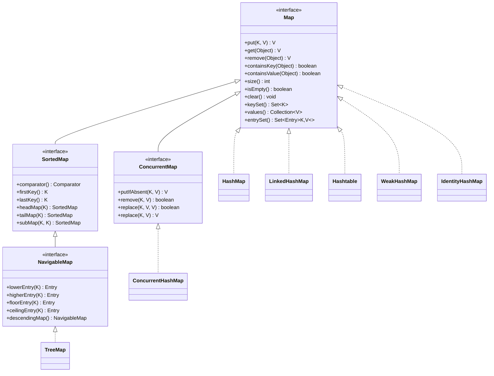
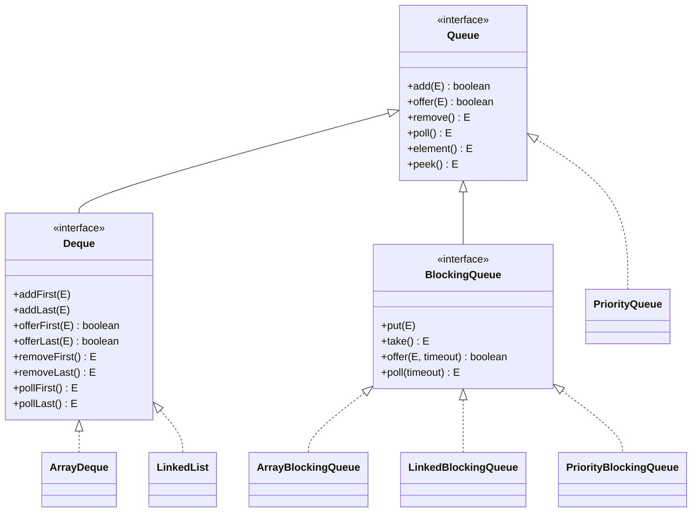
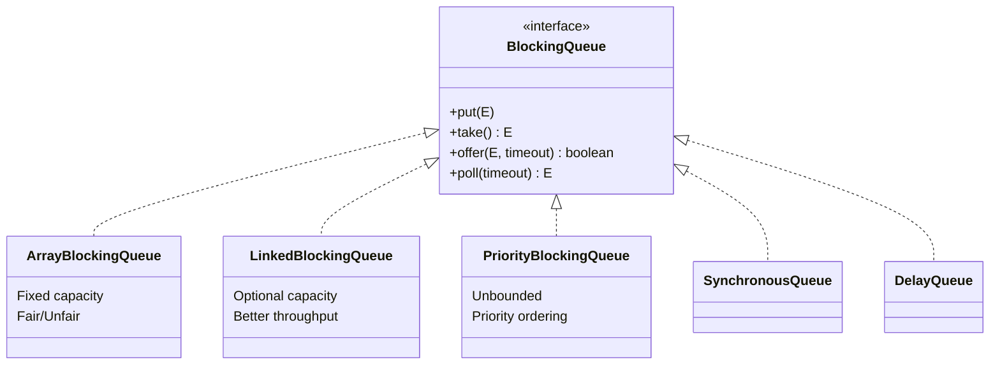

# Tutorial 26b: Java Collections Framework - Part 2: Maps & Queues

**Related:** [Master Index](26_Collections_Master_Index.md) | [Part 1: Lists & Sets](26a_Collections_Part1_Lists_Sets.md) | [Part 3: Advanced Patterns](26c_Collections_Part3_Advanced_Patterns.md)

---

## Table of Contents

### Part I - Map Fundamentals
1. [Map Interface Overview](#map-interface-overview)
2. [Map.Entry Interface](#mapentry-interface)
3. [HashMap Deep Dive](#hashmap-deep-dive)
4. [Hash Collision Handling](#hash-collision-handling)
5. [Capacity and Load Factor](#capacity-and-load-factor)
6. [Rehashing Mechanics](#rehashing-mechanics)
7. [HashMap Performance](#hashmap-performance)
8. [HashMap Best Practices](#hashmap-best-practices)

### Part II - Map Implementations
9. [LinkedHashMap](#linkedhashmap)
10. [TreeMap & NavigableMap](#treemap-and-navigablemap)
11. [Hashtable](#hashtable)
12. [WeakHashMap](#weakhashmap)
13. [IdentityHashMap](#identityhashmap)
14. [EnumMap](#enummap)
15. [Map Performance Comparison](#map-performance-comparison)

### Part III - Concurrent Maps
16. [ConcurrentHashMap](#concurrenthashmap)
17. [Thread-Safe Map Operations](#thread-safe-map-operations)
18. [Concurrent Map Patterns](#concurrent-map-patterns)

### Part IV - Queue & Deque
19. [Queue Interface](#queue-interface)
20. [PriorityQueue](#priorityqueue)
21. [ArrayDeque](#arraydeque)
22. [BlockingQueue](#blockingqueue)
23. [Queue Performance Comparison](#queue-performance-comparison)

### Part V - Practice & Mastery
24. [Practice Problems](#practice-problems)
25. [Interview Questions](#interview-questions)
26. [Summary & Best Practices](#summary-and-best-practices)

---

## Part I - Map Fundamentals

### Map Interface Overview

The `Map` interface represents a mapping between keys and values, where each key maps to exactly one value. Unlike `Collection`, `Map` is a separate hierarchy in the Java Collections Framework.



#### Map Characteristics

| Characteristic | Description |
|---------------|-------------|
| **No Duplicate Keys** | Each key can appear at most once |
| **Null Keys** | Most implementations allow one null key (except Hashtable, ConcurrentHashMap) |
| **Null Values** | Most implementations allow null values (except Hashtable, ConcurrentHashMap) |
| **Not Iterable** | Map doesn't extend Iterable (use entrySet(), keySet(), or values()) |
| **Three Collection Views** | Keys, values, and entries can be viewed as collections |

#### Basic Map Operations

```java
import java.util.*;

public class MapBasicsDemo {
    public static void main(String[] args) {
        // Creating a map
        Map<String, Integer> scores = new HashMap<>();
        
        // 1. Put operations
        scores.put("Alice", 95);
        scores.put("Bob", 87);
        scores.put("Charlie", 92);
        
        System.out.println("Initial map: " + scores);
        // Output: {Alice=95, Bob=87, Charlie=92}
        
        // 2. putIfAbsent - only adds if key doesn't exist
        scores.putIfAbsent("Alice", 100);  // Won't replace
        scores.putIfAbsent("David", 88);   // Will add
        System.out.println("After putIfAbsent: " + scores);
        // Output: {Alice=95, Bob=87, Charlie=92, David=88}
        
        // 3. Get operations
        Integer aliceScore = scores.get("Alice");
        System.out.println("Alice's score: " + aliceScore);  // 95
        
        // getOrDefault - returns default if key doesn't exist
        Integer eveScore = scores.getOrDefault("Eve", 0);
        System.out.println("Eve's score: " + eveScore);  // 0
        
        // 4. containsKey and containsValue
        System.out.println("Contains Bob? " + scores.containsKey("Bob"));  // true
        System.out.println("Contains score 100? " + scores.containsValue(100));  // false
        
        // 5. Remove operations
        scores.remove("Bob");
        System.out.println("After removing Bob: " + scores);
        
        // remove(key, value) - only removes if key maps to value
        scores.remove("Alice", 90);  // Won't remove (value doesn't match)
        scores.remove("Alice", 95);  // Will remove
        System.out.println("After conditional remove: " + scores);
        
        // 6. Replace operations
        scores.replace("Charlie", 95);  // Replace value
        scores.replace("Charlie", 95, 98);  // Replace only if old value matches
        System.out.println("After replace: " + scores);
        
        // 7. Compute operations (Java 8+)
        scores.compute("David", (key, oldValue) -> 
            oldValue == null ? 1 : oldValue + 5);
        System.out.println("After compute: " + scores);
        
        // computeIfAbsent - compute and add only if key doesn't exist
        scores.computeIfAbsent("Eve", key -> 85);
        System.out.println("After computeIfAbsent: " + scores);
        
        // computeIfPresent - compute only if key exists
        scores.computeIfPresent("Eve", (key, oldValue) -> oldValue + 10);
        System.out.println("After computeIfPresent: " + scores);
        
        // 8. Merge operation
        scores.merge("Eve", 5, (oldValue, newValue) -> oldValue + newValue);
        System.out.println("After merge: " + scores);
    }
}
```

**Output:**
```
Initial map: {Alice=95, Bob=87, Charlie=92}
After putIfAbsent: {Alice=95, Bob=87, Charlie=92, David=88}
Alice's score: 95
Eve's score: 0
Contains Bob? true
Contains score 100? false
After removing Bob: {Alice=95, Charlie=92, David=88}
After conditional remove: {Charlie=92, David=88}
After replace: {Charlie=98, David=88}
After compute: {Charlie=98, David=93}
After computeIfAbsent: {Charlie=98, David=93, Eve=85}
After computeIfPresent: {Charlie=98, David=93, Eve=95}
After merge: {Charlie=98, David=93, Eve=100}
```

#### Collection Views

Maps provide three ways to view their contents as collections:

```java
import java.util.*;

public class MapViewsDemo {
    public static void main(String[] args) {
        Map<String, Integer> map = new HashMap<>();
        map.put("Java", 1995);
        map.put("Python", 1991);
        map.put("JavaScript", 1995);
        map.put("C++", 1985);
        
        // 1. Key Set View
        System.out.println("=== Key Set ===");
        Set<String> keys = map.keySet();
        System.out.println("Keys: " + keys);
        
        // Keys are backed by the map - modifications affect the map
        keys.remove("C++");
        System.out.println("After removing from keySet: " + map);
        
        // 2. Values Collection View
        System.out.println("\n=== Values Collection ===");
        Collection<Integer> values = map.values();
        System.out.println("Values: " + values);
        
        // Values are also backed by the map
        values.remove(1995);  // Removes first entry with value 1995
        System.out.println("After removing from values: " + map);
        
        // 3. Entry Set View
        System.out.println("\n=== Entry Set ===");
        Set<Map.Entry<String, Integer>> entries = map.entrySet();
        
        for (Map.Entry<String, Integer> entry : entries) {
            System.out.println(entry.getKey() + " => " + entry.getValue());
            
            // Can modify values through entry
            if (entry.getKey().equals("Python")) {
                entry.setValue(2020);  // Updates the map
            }
        }
        
        System.out.println("\nMap after entry modification: " + map);
        
        // 4. Iterating with forEach (Java 8+)
        System.out.println("\n=== forEach Iteration ===");
        map.forEach((language, year) -> 
            System.out.println(language + " was released in " + year));
    }
}
```

**Output:**
```
=== Key Set ===
Keys: [Java, Python, JavaScript, C++]
After removing from keySet: {Java=1995, Python=1991, JavaScript=1995}

=== Values Collection ===
Values: [1995, 1991, 1995]
After removing from values: {Python=1991, JavaScript=1995}

=== Entry Set ===
Python => 1991
JavaScript => 1995

Map after entry modification: {Python=2020, JavaScript=1995}

=== forEach Iteration ===
Python was released in 2020
JavaScript was released in 1995
```

#### Map Bulk Operations

```java
import java.util.*;

public class MapBulkOperationsDemo {
    public static void main(String[] args) {
        Map<String, Integer> inventory1 = new HashMap<>();
        inventory1.put("Apples", 50);
        inventory1.put("Bananas", 30);
        inventory1.put("Oranges", 40);
        
        Map<String, Integer> inventory2 = new HashMap<>();
        inventory2.put("Bananas", 20);  // Will merge
        inventory2.put("Grapes", 60);   // New item
        inventory2.put("Oranges", 35);  // Will merge
        
        System.out.println("Inventory 1: " + inventory1);
        System.out.println("Inventory 2: " + inventory2);
        
        // 1. putAll - adds all entries from another map
        Map<String, Integer> combined = new HashMap<>(inventory1);
        combined.putAll(inventory2);  // Overwrites existing keys
        System.out.println("\nAfter putAll: " + combined);
        
        // 2. replaceAll - applies function to all values
        combined.replaceAll((fruit, quantity) -> quantity + 10);
        System.out.println("After replaceAll (+10): " + combined);
        
        // 3. Custom merge using forEach and merge
        Map<String, Integer> merged = new HashMap<>(inventory1);
        inventory2.forEach((fruit, quantity) -> 
            merged.merge(fruit, quantity, Integer::sum));
        System.out.println("\nMerged inventory (sum): " + merged);
        
        // 4. clear and isEmpty
        System.out.println("\nSize before clear: " + merged.size());
        merged.clear();
        System.out.println("Size after clear: " + merged.size());
        System.out.println("Is empty? " + merged.isEmpty());
    }
}
```

**Output:**
```
Inventory 1: {Apples=50, Bananas=30, Oranges=40}
Inventory 2: {Bananas=20, Grapes=60, Oranges=35}

After putAll: {Apples=50, Bananas=20, Grapes=60, Oranges=35}
After replaceAll (+10): {Apples=60, Bananas=30, Grapes=70, Oranges=45}

Merged inventory (sum): {Apples=50, Bananas=50, Grapes=60, Oranges=75}

Size before clear: 4
Size after clear: 0
Is empty? true
```

---

### Map.Entry Interface

The `Map.Entry` interface represents a key-value pair in a map. It provides methods to access and modify the key-value mapping.

#### Entry Interface Structure

```java
public interface Map<K, V> {
    interface Entry<K, V> {
        K getKey();
        V getValue();
        V setValue(V value);
        
        // Java 8+ static methods
        static <K extends Comparable<? super K>, V> Comparator<Map.Entry<K,V>> 
            comparingByKey();
        
        static <K, V extends Comparable<? super V>> Comparator<Map.Entry<K,V>> 
            comparingByValue();
        
        static <K, V> Comparator<Map.Entry<K,V>> 
            comparingByKey(Comparator<? super K> cmp);
        
        static <K, V> Comparator<Map.Entry<K,V>> 
            comparingByValue(Comparator<? super V> cmp);
    }
}
```

#### Working with Map.Entry

```java
import java.util.*;
import java.util.stream.Collectors;

public class MapEntryDemo {
    public static void main(String[] args) {
        Map<String, Integer> studentGrades = new HashMap<>();
        studentGrades.put("Alice", 92);
        studentGrades.put("Bob", 85);
        studentGrades.put("Charlie", 95);
        studentGrades.put("David", 88);
        studentGrades.put("Eve", 90);
        
        // 1. Iterating through entries
        System.out.println("=== Student Grades ===");
        for (Map.Entry<String, Integer> entry : studentGrades.entrySet()) {
            System.out.println(entry.getKey() + ": " + entry.getValue());
        }
        
        // 2. Modifying values through Entry
        System.out.println("\n=== Bonus Points (Grade >= 90) ===");
        for (Map.Entry<String, Integer> entry : studentGrades.entrySet()) {
            if (entry.getValue() >= 90) {
                entry.setValue(entry.getValue() + 5);
                System.out.println(entry.getKey() + " gets bonus: " + 
                                   entry.getValue());
            }
        }
        
        // 3. Sorting by key using Entry comparators
        System.out.println("\n=== Sorted by Name ===");
        studentGrades.entrySet().stream()
            .sorted(Map.Entry.comparingByKey())
            .forEach(entry -> System.out.println(entry.getKey() + ": " + 
                                                 entry.getValue()));
        
        // 4. Sorting by value
        System.out.println("\n=== Sorted by Grade ===");
        studentGrades.entrySet().stream()
            .sorted(Map.Entry.comparingByValue())
            .forEach(entry -> System.out.println(entry.getKey() + ": " + 
                                                 entry.getValue()));
        
        // 5. Custom comparator - sort by value descending
        System.out.println("\n=== Top Students (Descending) ===");
        studentGrades.entrySet().stream()
            .sorted(Map.Entry.comparingByValue(Comparator.reverseOrder()))
            .forEach(entry -> System.out.println(entry.getKey() + ": " + 
                                                 entry.getValue()));
        
        // 6. Finding max/min entries
        System.out.println("\n=== Statistics ===");
        Map.Entry<String, Integer> topStudent = studentGrades.entrySet().stream()
            .max(Map.Entry.comparingByValue())
            .orElse(null);
        System.out.println("Top student: " + topStudent.getKey() + 
                          " with " + topStudent.getValue());
        
        Map.Entry<String, Integer> lowestStudent = studentGrades.entrySet().stream()
            .min(Map.Entry.comparingByValue())
            .orElse(null);
        System.out.println("Lowest score: " + lowestStudent.getKey() + 
                          " with " + lowestStudent.getValue());
        
        // 7. Filtering and collecting
        System.out.println("\n=== Honor Roll (>= 90) ===");
        Map<String, Integer> honorRoll = studentGrades.entrySet().stream()
            .filter(entry -> entry.getValue() >= 90)
            .collect(Collectors.toMap(
                Map.Entry::getKey,
                Map.Entry::getValue,
                (v1, v2) -> v1,  // Merge function (not used here)
                LinkedHashMap::new  // Maintain order
            ));
        System.out.println(honorRoll);
    }
}
```

**Output:**
```
=== Student Grades ===
Alice: 92
Bob: 85
Charlie: 95
David: 88
Eve: 90

=== Bonus Points (Grade >= 90) ===
Alice gets bonus: 97
Charlie gets bonus: 100
Eve gets bonus: 95

=== Sorted by Name ===
Alice: 97
Bob: 85
Charlie: 100
David: 88
Eve: 95

=== Sorted by Grade ===
Bob: 85
David: 88
Eve: 95
Alice: 97
Charlie: 100

=== Top Students (Descending) ===
Charlie: 100
Alice: 97
Eve: 95
David: 88
Bob: 85

=== Statistics ===
Top student: Charlie with 100
Lowest score: Bob with 85

=== Honor Roll (>= 90) ===
{Alice=97, Charlie=100, Eve=95}
```

#### Creating Custom Entries

```java
import java.util.*;

public class CustomMapEntryDemo {
    // Custom immutable Entry implementation
    static class ImmutableEntry<K, V> implements Map.Entry<K, V> {
        private final K key;
        private final V value;
        
        public ImmutableEntry(K key, V value) {
            this.key = key;
            this.value = value;
        }
        
        @Override
        public K getKey() {
            return key;
        }
        
        @Override
        public V getValue() {
            return value;
        }
        
        @Override
        public V setValue(V value) {
            throw new UnsupportedOperationException(
                "Cannot modify immutable entry");
        }
        
        @Override
        public boolean equals(Object o) {
            if (!(o instanceof Map.Entry)) return false;
            Map.Entry<?, ?> e = (Map.Entry<?, ?>) o;
            return Objects.equals(key, e.getKey()) && 
                   Objects.equals(value, e.getValue());
        }
        
        @Override
        public int hashCode() {
            return Objects.hash(key, value);
        }
        
        @Override
        public String toString() {
            return key + "=" + value;
        }
    }
    
    // Using Java 9+ Map.entry() factory method
    public static void demonstrateMapEntryFactory() {
        // Create entries without creating a map
        List<Map.Entry<String, Integer>> entries = List.of(
            Map.entry("one", 1),
            Map.entry("two", 2),
            Map.entry("three", 3)
        );
        
        System.out.println("Entries: " + entries);
        
        // Convert to map
        Map<String, Integer> map = entries.stream()
            .collect(Collectors.toMap(
                Map.Entry::getKey,
                Map.Entry::getValue
            ));
        
        System.out.println("Map: " + map);
    }
    
    public static void main(String[] args) {
        // Custom immutable entry
        Map.Entry<String, Integer> entry = new ImmutableEntry<>("age", 25);
        System.out.println("Custom entry: " + entry);
        System.out.println("Key: " + entry.getKey());
        System.out.println("Value: " + entry.getValue());
        
        try {
            entry.setValue(30);
        } catch (UnsupportedOperationException e) {
            System.out.println("Cannot modify: " + e.getMessage());
        }
        
        System.out.println("\n=== Map.entry() Factory ===");
        demonstrateMapEntryFactory();
        
        // Using AbstractMap.SimpleEntry (mutable)
        System.out.println("\n=== SimpleEntry ===");
        Map.Entry<String, String> mutableEntry = 
            new AbstractMap.SimpleEntry<>("name", "John");
        System.out.println("Before: " + mutableEntry);
        mutableEntry.setValue("Jane");
        System.out.println("After: " + mutableEntry);
        
        // Using AbstractMap.SimpleImmutableEntry
        System.out.println("\n=== SimpleImmutableEntry ===");
        Map.Entry<String, String> immutableEntry = 
            new AbstractMap.SimpleImmutableEntry<>("status", "active");
        System.out.println("Entry: " + immutableEntry);
    }
}
```

---

### HashMap Deep Dive

HashMap is the most widely used Map implementation. Understanding its internals is crucial for writing efficient code and acing technical interviews.

#### HashMap Internal Structure

```
HashMap Structure (Simplified):

┌─────────────────────────────────────────────────────────────┐
│                      HashMap Object                          │
├─────────────────────────────────────────────────────────────┤
│  table: Node<K,V>[] (array of buckets)                     │
│  size: int (number of entries)                              │
│  threshold: int (size at which to resize)                   │
│  loadFactor: float (load factor for resizing)               │
│  modCount: int (structural modifications count)             │
└─────────────────────────────────────────────────────────────┘
                           │
                           ▼
        ┌─────────────────────────────────────────┐
        │      Bucket Array (Node<K,V>[])         │
        ├──────┬──────┬──────┬──────┬──────┬──────┤
        │  0   │  1   │  2   │  3   │  4   │ ...  │
        ├──────┼──────┼──────┼──────┼──────┼──────┤
        │ null │ Node │ null │ Node │ null │ ...  │
        └──────┴───│──┴──────┴───│──┴──────┴──────┘
                   │              │
                   ▼              ▼
              ┌────────┐    ┌────────┐
              │  Node  │    │  Node  │
              ├────────┤    ├────────┤
              │ hash   │    │ hash   │
              │ key    │    │ key    │
              │ value  │    │ value  │
              │ next ──┼──► │ next   │ ──► null
              └────────┘    └────────┘
              (Linked List) (Before Java 8)

Java 8+ Enhancement - Treeify when chain length > 8:

        Bucket[1]: Node → Node → Node → ... (8+ nodes)
                   │
                   ▼
                TreeNode (Red-Black Tree)
                   ├─ Left Subtree
                   └─ Right Subtree
```

#### Node Implementation

```java
// Simplified Node class from HashMap source
static class Node<K,V> implements Map.Entry<K,V> {
    final int hash;    // Cached hash code
    final K key;       // Key (immutable reference)
    V value;           // Value (mutable)
    Node<K,V> next;    // Next node in chain
    
    Node(int hash, K key, V value, Node<K,V> next) {
        this.hash = hash;
        this.key = key;
        this.value = value;
        this.next = next;
    }
    
    public final K getKey()        { return key; }
    public final V getValue()      { return value; }
    public final String toString() { return key + "=" + value; }
    
    public final int hashCode() {
        return Objects.hashCode(key) ^ Objects.hashCode(value);
    }
    
    public final V setValue(V newValue) {
        V oldValue = value;
        value = newValue;
        return oldValue;
    }
    
    public final boolean equals(Object o) {
        if (o == this)
            return true;
        if (o instanceof Map.Entry) {
            Map.Entry<?,?> e = (Map.Entry<?,?>)o;
            if (Objects.equals(key, e.getKey()) &&
                Objects.equals(value, e.getValue()))
                return true;
        }
        return false;
    }
}
```

#### HashMap Construction and Initialization

```java
import java.util.*;

public class HashMapConstructionDemo {
    public static void main(String[] args) {
        // 1. Default constructor: capacity=16, loadFactor=0.75
        Map<String, Integer> map1 = new HashMap<>();
        System.out.println("Default HashMap created");
        
        // 2. Constructor with initial capacity
        // Useful when you know approximate size
        Map<String, Integer> map2 = new HashMap<>(100);
        System.out.println("HashMap with capacity 100 created");
        
        // 3. Constructor with capacity and load factor
        // Lower load factor = more space, fewer collisions
        // Higher load factor = less space, more collisions
        Map<String, Integer> map3 = new HashMap<>(100, 0.5f);
        System.out.println("HashMap with capacity 100, load factor 0.5");
        
        // 4. Copy constructor
        Map<String, Integer> original = new HashMap<>();
        original.put("A", 1);
        original.put("B", 2);
        Map<String, Integer> copy = new HashMap<>(original);
        System.out.println("Copy: " + copy);
        
        // 5. Java 9+ factory methods (immutable)
        Map<String, Integer> immutable = Map.of(
            "One", 1,
            "Two", 2,
            "Three", 3
        );
        System.out.println("Immutable map: " + immutable);
        
        // 6. Java 9+ ofEntries for more than 10 entries
        Map<String, Integer> largeImmutable = Map.ofEntries(
            Map.entry("A", 1),
            Map.entry("B", 2),
            Map.entry("C", 3),
            Map.entry("D", 4),
            Map.entry("E", 5)
        );
        System.out.println("Large immutable map: " + largeImmutable);
        
        // 7. Capacity calculation for optimal performance
        int expectedSize = 1000;
        int optimalCapacity = (int) (expectedSize / 0.75f) + 1;
        Map<String, Integer> optimized = new HashMap<>(optimalCapacity);
        System.out.println("Optimized capacity: " + optimalCapacity);
    }
}
```

---

### Hash Collision Handling

When two different keys produce the same hash code or map to the same bucket, a collision occurs. HashMap handles collisions differently in Java 7 vs Java 8+.

#### Java 7 - Chaining with Linked Lists

```
Collision Handling in Java 7:

Bucket[3]:  Node1 → Node2 → Node3 → Node4 → null
            (All have same bucket index)

Timeline Complexity: O(n) worst case
- Must traverse entire linked list
- Poor performance with many collisions
```

#### Java 8+ - Treeification

```
Collision Handling in Java 8+:

Initial State (< 8 nodes):
Bucket[3]:  Node1 → Node2 → Node3 → Node4 → null

After 8+ nodes in same bucket:
Bucket[3]:  TreeNode (Root)
            ├── Left Subtree (Red-Black Tree)
            └── Right Subtree (Red-Black Tree)

Timeline Complexity: O(log n) worst case
- Converts to Red-Black Tree after threshold
- Much better performance with collisions
```

#### Treeification Constants

```java
// HashMap source code constants
static final int TREEIFY_THRESHOLD = 8;      // Convert to tree
static final int UNTREEIFY_THRESHOLD = 6;    // Convert back to list
static final int MIN_TREEIFY_CAPACITY = 64;  // Min capacity for treeification
```

#### Collision Demonstration

```java
import java.util.*;

public class HashCollisionDemo {
    // Custom class with poor hashCode - intentional collisions
    static class BadHashKey {
        private final int value;
        
        public BadHashKey(int value) {
            this.value = value;
        }
        
        @Override
        public int hashCode() {
            // Terrible hash function - returns same hash for all
            return 1;  // All keys will collide!
        }
        
        @Override
        public boolean equals(Object obj) {
            if (this == obj) return true;
            if (!(obj instanceof BadHashKey)) return false;
            return this.value == ((BadHashKey) obj).value;
        }
        
        @Override
        public String toString() {
            return "Key(" + value + ")";
        }
    }
    
    // Good hashCode implementation
    static class GoodHashKey {
        private final int value;
        
        public GoodHashKey(int value) {
            this.value = value;
        }
        
        @Override
        public int hashCode() {
            return Integer.hashCode(value);
        }
        
        @Override
        public boolean equals(Object obj) {
            if (this == obj) return true;
            if (!(obj instanceof GoodHashKey)) return false;
            return this.value == ((GoodHashKey) obj).value;
        }
        
        @Override
        public String toString() {
            return "Key(" + value + ")";
        }
    }
    
    public static void main(String[] args) {
        // Demonstrate collision impact
        System.out.println("=== Bad Hash Function (Many Collisions) ===");
        Map<BadHashKey, String> badMap = new HashMap<>();
        long startTime = System.nanoTime();
        
        for (int i = 0; i < 1000; i++) {
            badMap.put(new BadHashKey(i), "Value" + i);
        }
        
        long endTime = System.nanoTime();
        System.out.println("Insert time: " + (endTime - startTime) / 1_000_000.0 + " ms");
        
        // Lookup performance with collisions
        startTime = System.nanoTime();
        for (int i = 0; i < 1000; i++) {
            badMap.get(new BadHashKey(i));
        }
        endTime = System.nanoTime();
        System.out.println("Lookup time: " + (endTime - startTime) / 1_000_000.0 + " ms");
        
        System.out.println("\n=== Good Hash Function (Few Collisions) ===");
        Map<GoodHashKey, String> goodMap = new HashMap<>();
        startTime = System.nanoTime();
        
        for (int i = 0; i < 1000; i++) {
            goodMap.put(new GoodHashKey(i), "Value" + i);
        }
        
        endTime = System.nanoTime();
        System.out.println("Insert time: " + (endTime - startTime) / 1_000_000.0 + " ms");
        
        startTime = System.nanoTime();
        for (int i = 0; i < 1000; i++) {
            goodMap.get(new GoodHashKey(i));
        }
        endTime = System.nanoTime();
        System.out.println("Lookup time: " + (endTime - startTime) / 1_000_000.0 + " ms");
    }
}
```

**Sample Output:**
```
=== Bad Hash Function (Many Collisions) ===
Insert time: 45.2 ms
Lookup time: 38.7 ms

=== Good Hash Function (Few Collisions) ===
Insert time: 2.1 ms
Lookup time: 0.8 ms
```

#### Hash Code Distribution

```java
import java.util.*;

public class HashDistributionDemo {
    public static void main(String[] args) {
        Map<String, Integer> map = new HashMap<>(16);
        
        // Add elements and observe distribution
        String[] keys = {"apple", "banana", "cherry", "date", "elderberry",
                        "fig", "grape", "honeydew", "kiwi", "lemon"};
        
        System.out.println("=== Hash Distribution ===");
        for (String key : keys) {
            int hash = key.hashCode();
            // Simulate bucket index calculation
            int bucketIndex = hash & (16 - 1);  // Same as hash % 16 for power of 2
            
            System.out.printf("%-12s | hash: %11d | bucket: %2d%n", 
                            key, hash, bucketIndex);
            map.put(key, 1);
        }
        
        // Analyze distribution
        System.out.println("\nMap size: " + map.size());
    }
    
    // Demonstrate hash improvement in Java 8+
    public static int hash(Object key) {
        int h;
        // Java 8+ hash improvement to reduce collisions
        return (key == null) ? 0 : (h = key.hashCode()) ^ (h >>> 16);
    }
}
```

---

### Capacity and Load Factor

Understanding capacity and load factor is essential for HashMap performance tuning.

#### Key Concepts

```
Capacity: Number of buckets in the hash table
         - Always a power of 2 (16, 32, 64, 128, ...)
         - Initial capacity: 16 (default)

Load Factor: Measure of how full the HashMap can get
            - Default: 0.75 (75%)
            - Range: 0.0 to 1.0

Threshold: Size at which HashMap will resize
          - threshold = capacity × loadFactor
          - When size > threshold → resize()

Size: Current number of key-value pairs
     - Actual entries in the map
```

#### Capacity Table

| Capacity | Load Factor | Threshold | Can Hold (before resize) |
|----------|-------------|-----------|-------------------------|
| 16       | 0.75        | 12        | 12 entries              |
| 32       | 0.75        | 24        | 24 entries              |
| 64       | 0.75        | 48        | 48 entries              |
| 128      | 0.75        | 96        | 96 entries              |
| 256      | 0.75        | 192       | 192 entries             |

#### Load Factor Trade-offs

```java
import java.util.*;

public class LoadFactorDemo {
    public static void demonstrateLoadFactor(float loadFactor, int entries) {
        System.out.println("\n=== Load Factor: " + loadFactor + " ===");
        
        Map<Integer, String> map = new HashMap<>(16, loadFactor);
        
        long startTime = System.nanoTime();
        for (int i = 0; i < entries; i++) {
            map.put(i, "Value" + i);
        }
        long endTime = System.nanoTime();
        
        System.out.println("Entries: " + entries);
        System.out.println("Time: " + (endTime - startTime) / 1_000_000.0 + " ms");
        System.out.println("Final size: " + map.size());
    }
    
    public static void main(String[] args) {
        int entries = 10000;
        
        // Low load factor: More space, fewer collisions, more resizes
        demonstrateLoadFactor(0.5f, entries);
        
        // Default load factor: Balanced
        demonstrateLoadFactor(0.75f, entries);
        
        // High load factor: Less space, more collisions, fewer resizes
        demonstrateLoadFactor(0.9f, entries);
        
        // Comparison table
        System.out.println("\n=== Load Factor Characteristics ===");
        System.out.println("Low (0.5):  More memory, fewer collisions, more resizes");
        System.out.println("Default (0.75): Balanced trade-off");
        System.out.println("High (0.9): Less memory, more collisions, fewer resizes");
    }
}
```

#### Optimal Initial Capacity

```java
import java.util.*;

public class OptimalCapacityDemo {
    public static void main(String[] args) {
        int expectedSize = 1000;
        
        // Method 1: Manual calculation
        // Capacity should be: expectedSize / loadFactor
        int capacity1 = (int) (expectedSize / 0.75f) + 1;
        System.out.println("Calculated capacity: " + capacity1);  // 1334
        
        // Method 2: Use power of 2
        int capacity2 = Integer.highestOneBit(capacity1 - 1) << 1;
        System.out.println("Next power of 2: " + capacity2);      // 2048
        
        // Test different initializations
        System.out.println("\n=== Performance Comparison ===");
        
        // 1. Default capacity (will resize multiple times)
        long startTime = System.nanoTime();
        Map<Integer, String> map1 = new HashMap<>();
        for (int i = 0; i < expectedSize; i++) {
            map1.put(i, "Value" + i);
        }
        long time1 = System.nanoTime() - startTime;
        System.out.println("Default capacity: " + time1 / 1_000_000.0 + " ms");
        
        // 2. Optimal capacity (no resize needed)
        startTime = System.nanoTime();
        Map<Integer, String> map2 = new HashMap<>(capacity2);
        for (int i = 0; i < expectedSize; i++) {
            map2.put(i, "Value" + i);
        }
        long time2 = System.nanoTime() - startTime;
        System.out.println("Optimal capacity: " + time2 / 1_000_000.0 + " ms");
        
        System.out.println("\nSpeedup: " + (time1 / (double) time2) + "x");
    }
    
    // Utility method to calculate optimal capacity
    public static int calculateOptimalCapacity(int expectedSize) {
        return calculateOptimalCapacity(expectedSize, 0.75f);
    }
    
    public static int calculateOptimalCapacity(int expectedSize, float loadFactor) {
        int capacity = (int) (expectedSize / loadFactor) + 1;
        // Round up to next power of 2
        return Integer.highestOneBit(capacity - 1) << 1;
    }
}
```

---

### Rehashing Mechanics

When a HashMap exceeds its threshold, it must resize (rehash) to maintain performance.

#### Rehashing Process

```
Rehashing Steps:

1. Trigger: size > threshold
2. New Capacity: oldCapacity × 2
3. Create new bucket array
4. Rehash all entries:
   - Recalculate bucket index for each entry
   - Place in new bucket array
5. Replace old array with new array
6. Update threshold

Performance Impact:
- O(n) operation where n = number of entries
- Temporary spike in memory usage (old + new arrays)
- Should be minimized by proper initial sizing
```

#### Resize Visualization

```java
import java.util.*;
import java.lang.reflect.Field;

public class ResizeDemo {
    // Reflection to access HashMap internals (for demonstration only)
    public static int getCapacity(HashMap<?, ?> map) {
        try {
            Field tableField = HashMap.class.getDeclaredField("table");
            tableField.setAccessible(true);
            Object[] table = (Object[]) tableField.get(map);
            return table == null ? 0 : table.length;
        } catch (Exception e) {
            return -1;
        }
    }
    
    public static void main(String[] args) {
        HashMap<Integer, String> map = new HashMap<>();
        
        System.out.println("=== HashMap Resize Tracking ===");
        System.out.println("Initial capacity: " + getCapacity(map));
        
        int[] resizePoints = {0, 12, 13, 24, 25, 48, 49, 96, 97};
        
        for (int point : resizePoints) {
            // Add entries up to this point
            while (map.size() < point) {
                map.put(map.size(), "Value" + map.size());
            }
            
            int capacity = getCapacity(map);
            int size = map.size();
            int threshold = (int) (capacity * 0.75f);
            
            System.out.printf("Size: %3d | Capacity: %3d | Threshold: %3d | %s%n",
                            size, capacity, threshold,
                            size > threshold ? ">>> WILL RESIZE NEXT" : "");
        }
    }
}
```

**Output:**
```
=== HashMap Resize Tracking ===
Initial capacity: 0
Size:   0 | Capacity:  16 | Threshold:  12 | 
Size:  12 | Capacity:  16 | Threshold:  12 | 
Size:  13 | Capacity:  32 | Threshold:  24 | >>> WILL RESIZE NEXT
Size:  24 | Capacity:  32 | Threshold:  24 | 
Size:  25 | Capacity:  64 | Threshold:  48 | >>> WILL RESIZE NEXT
Size:  48 | Capacity:  64 | Threshold:  48 | 
Size:  49 | Capacity: 128 | Threshold:  96 | >>> WILL RESIZE NEXT
Size:  96 | Capacity: 128 | Threshold:  96 | 
Size:  97 | Capacity: 256 | Threshold: 192 | >>> WILL RESIZE NEXT
```

#### Rehashing Cost Analysis

```java
import java.util.*;

public class RehashCostDemo {
    public static void main(String[] args) {
        System.out.println("=== Rehashing Cost Analysis ===\n");
        
        // Test 1: Default capacity (multiple resizes)
        System.out.println("Test 1: Default Capacity (16)");
        Map<Integer, String> map1 = new HashMap<>();
        measureInsertionTime(map1, 10000);
        
        // Test 2: Optimal capacity (no resize)
        System.out.println("\nTest 2: Optimal Capacity (~13334)");
        Map<Integer, String> map2 = new HashMap<>(16384); // Next power of 2
        measureInsertionTime(map2, 10000);
        
        // Test 3: Visualize resize cost
        System.out.println("\n=== Resize Impact (Single Insertions) ===");
        map1 = new HashMap<>();
        
        long totalTime = 0;
        for (int i = 0; i < 100; i++) {
            long start = System.nanoTime();
            map1.put(i, "Value" + i);
            long duration = System.nanoTime() - start;
            totalTime += duration;
            
            // Print when resize happens (significant time spike)
            if (duration > 50000) {  // 50 microseconds
                System.out.printf("Size %d: %.3f ms (RESIZE)%n", 
                                i + 1, duration / 1_000_000.0);
            }
        }
        
        System.out.printf("\nAverage insertion time: %.3f microseconds%n",
                        totalTime / 100_000.0);
    }
    
    private static void measureInsertionTime(Map<Integer, String> map, int count) {
        long startTime = System.nanoTime();
        
        for (int i = 0; i < count; i++) {
            map.put(i, "Value" + i);
        }
        
        long endTime = System.nanoTime();
        double totalTime = (endTime - startTime) / 1_000_000.0;
        
        System.out.printf("Inserted %d entries in %.3f ms%n", count, totalTime);
        System.out.printf("Average per entry: %.3f microseconds%n", 
                        (endTime - startTime) / (count * 1000.0));
    }
}
```

---

### HashMap Performance

Understanding HashMap performance characteristics is critical for optimization.

#### Time Complexity Summary

| Operation | Average Case | Worst Case | Notes |
|-----------|--------------|------------|-------|
| get()     | O(1)         | O(log n)*  | *Java 8+ with treeification |
| put()     | O(1)         | O(log n)*  | Amortized due to resizing |
| remove()  | O(1)         | O(log n)*  | Same as get() |
| containsKey() | O(1)     | O(log n)*  | Same as get() |
| containsValue() | O(n)   | O(n)       | Must scan all entries |
| size()    | O(1)         | O(1)       | Cached value |
| isEmpty() | O(1)         | O(1)       | Checks size |
| clear()   | O(n)         | O(n)       | Sets all buckets to null |

***Note:** Worst case is O(log n) in Java 8+ due to treeification, O(n) in Java 7

#### Performance Benchmark

```java
import java.util.*;

public class HashMapPerformanceBenchmark {
    private static final int ITERATIONS = 1_000_000;
    
    public static void main(String[] args) {
        Map<Integer, String> map = new HashMap<>(ITERATIONS * 2);
        
        // Populate map
        for (int i = 0; i < ITERATIONS; i++) {
            map.put(i, "Value" + i);
        }
        
        System.out.println("=== HashMap Performance Benchmark ===");
        System.out.println("Map size: " + ITERATIONS + " entries\n");
        
        // Benchmark get()
        long startTime = System.nanoTime();
        for (int i = 0; i < ITERATIONS; i++) {
            map.get(i);
        }
        long endTime = System.nanoTime();
        printResult("get()", endTime - startTime, ITERATIONS);
        
        // Benchmark containsKey()
        startTime = System.nanoTime();
        for (int i = 0; i < ITERATIONS; i++) {
            map.containsKey(i);
        }
        endTime = System.nanoTime();
        printResult("containsKey()", endTime - startTime, ITERATIONS);
        
        // Benchmark put() (update existing)
        startTime = System.nanoTime();
        for (int i = 0; i < ITERATIONS; i++) {
            map.put(i, "NewValue" + i);
        }
        endTime = System.nanoTime();
        printResult("put() [update]", endTime - startTime, ITERATIONS);
        
        // Benchmark remove()
        startTime = System.nanoTime();
        for (int i = 0; i < ITERATIONS / 10; i++) {
            map.remove(i);
        }
        endTime = System.nanoTime();
        printResult("remove()", endTime - startTime, ITERATIONS / 10);
        
        // Benchmark containsValue() - O(n) operation
        startTime = System.nanoTime();
        map.containsValue("Value500000");
        endTime = System.nanoTime();
        System.out.printf("containsValue(): %.3f ms (O(n) operation)%n%n",
                        (endTime - startTime) / 1_000_000.0);
        
        // Benchmark iteration
        startTime = System.nanoTime();
        for (Map.Entry<Integer, String> entry : map.entrySet()) {
            // Just iterate
        }
        endTime = System.nanoTime();
        printResult("entrySet() iteration", endTime - startTime, map.size());
    }
    
    private static void printResult(String operation, long nanos, int ops) {
        double totalMs = nanos / 1_000_000.0;
        double perOp = nanos / (ops * 1000.0);
        System.out.printf("%-25s: %.3f ms total, %.3f µs per operation%n",
                        operation, totalMs, perOp);
    }
}
```

#### Memory Usage

```java
import java.util.*;

public class HashMapMemoryDemo {
    public static void main(String[] args) {
        System.out.println("=== HashMap Memory Usage ===\n");
        
        // Test different scenarios
        testMemory("Empty HashMap", new HashMap<>());
        testMemory("HashMap with 100 entries", createMap(100));
        testMemory("HashMap with 1000 entries", createMap(1000));
        testMemory("HashMap with 10000 entries", createMap(10000));
        
        // Capacity vs Size
        System.out.println("\n=== Capacity vs Size ===");
        HashMap<Integer, String> map1 = new HashMap<>();
        HashMap<Integer, String> map2 = new HashMap<>(10000);
        
        System.out.println("Default capacity, 100 entries:");
        for (int i = 0; i < 100; i++) {
            map1.put(i, "Value" + i);
        }
        estimateSize(map1, 100);
        
        System.out.println("\nPre-sized capacity 10000, 100 entries:");
        for (int i = 0; i < 100; i++) {
            map2.put(i, "Value" + i);
        }
        estimateSize(map2, 100);
    }
    
    private static Map<Integer, String> createMap(int size) {
        Map<Integer, String> map = new HashMap<>();
        for (int i = 0; i < size; i++) {
            map.put(i, "Value" + i);
        }
        return map;
    }
    
    private static void testMemory(String description, Map<?, ?> map) {
        System.gc();
        try { Thread.sleep(100); } catch (InterruptedException e) {}
        
        long before = Runtime.getRuntime().totalMemory() - 
                     Runtime.getRuntime().freeMemory();
        
        // Force map to stay in memory
        System.out.println(description + ": " + map.size() + " entries");
    }
    
    private static void estimateSize(HashMap<Integer, String> map, int entries) {
        // Rough estimate: Node object + key + value references
        // Node: 32 bytes (object header + fields)
        // Integer key: 16 bytes
        // String value: ~40 bytes average
        int bytesPerEntry = 32 + 16 + 40;
        int capacity = Integer.highestOneBit(map.size() - 1) << 1;
        if (capacity < 16) capacity = 16;
        
        System.out.println("  Entries: " + entries);
        System.out.println("  Estimated capacity: " + capacity);
        System.out.println("  Estimated memory: ~" + 
                         (capacity * 4 + entries * bytesPerEntry) + " bytes");
    }
}
```

---

### HashMap Best Practices

#### 1. Choose Appropriate Initial Capacity

```java
import java.util.*;

public class CapacityBestPractices {
    public static void main(String[] args) {
        // ❌ BAD: Default capacity with many entries
        Map<String, Integer> bad = new HashMap<>();
        for (int i = 0; i < 10000; i++) {
            bad.put("Key" + i, i);  // Multiple resizes!
        }
        
        // ✅ GOOD: Pre-sized capacity
        int expectedSize = 10000;
        int optimalCapacity = (int) (expectedSize / 0.75f) + 1;
        Map<String, Integer> good = new HashMap<>(optimalCapacity);
        for (int i = 0; i < 10000; i++) {
            good.put("Key" + i, i);  // No resizes!
        }
        
        System.out.println("Both maps created successfully");
    }
}
```

#### 2. Implement Proper hashCode() and equals()

```java
import java.util.*;

public class HashCodeBestPractices {
    // ✅ GOOD: Proper hashCode implementation
    static class GoodKey {
        private final String name;
        private final int id;
        
        public GoodKey(String name, int id) {
            this.name = name;
            this.id = id;
        }
        
        @Override
        public boolean equals(Object o) {
            if (this == o) return true;
            if (!(o instanceof GoodKey)) return false;
            GoodKey that = (GoodKey) o;
            return id == that.id && Objects.equals(name, that.name);
        }
        
        @Override
        public int hashCode() {
            return Objects.hash(name, id);  // Good distribution
        }
    }
    
    // ❌ BAD: Poor hashCode implementation
    static class BadKey {
        private final String name;
        private final int id;
        
        public BadKey(String name, int id) {
            this.name = name;
            this.id = id;
        }
        
        @Override
        public boolean equals(Object o) {
            if (this == o) return true;
            if (!(o instanceof BadKey)) return false;
            BadKey that = (BadKey) o;
            return id == that.id && Objects.equals(name, that.name);
        }
        
        @Override
        public int hashCode() {
            return 1;  // Terrible! All keys collide!
        }
    }
    
    public static void main(String[] args) {
        System.out.println("=== Good vs Bad hashCode ===");
        
        // Test with good keys
        Map<GoodKey, String> goodMap = new HashMap<>();
        long start = System.nanoTime();
        for (int i = 0; i < 1000; i++) {
            goodMap.put(new GoodKey("Name" + i, i), "Value" + i);
        }
        long goodTime = System.nanoTime() - start;
        
        // Test with bad keys
        Map<BadKey, String> badMap = new HashMap<>();
        start = System.nanoTime();
        for (int i = 0; i < 1000; i++) {
            badMap.put(new BadKey("Name" + i, i), "Value" + i);
        }
        long badTime = System.nanoTime() - start;
        
        System.out.println("Good hashCode: " + goodTime / 1_000_000.0 + " ms");
        System.out.println("Bad hashCode: " + badTime / 1_000_000.0 + " ms");
        System.out.println("Difference: " + (badTime / (double) goodTime) + "x slower");
    }
}
```

#### 3. Use Immutable Keys

```java
import java.util.*;

public class ImmutableKeyDemo {
    // ❌ BAD: Mutable key
    static class MutableKey {
        private int value;  // Mutable!
        
        public MutableKey(int value) {
            this.value = value;
        }
        
        public void setValue(int value) {
            this.value = value;  // Can change!
        }
        
        @Override
        public boolean equals(Object o) {
            if (!(o instanceof MutableKey)) return false;
            return this.value == ((MutableKey) o).value;
        }
        
        @Override
        public int hashCode() {
            return Integer.hashCode(value);
        }
    }
    
    // ✅ GOOD: Immutable key
    static class ImmutableKey {
        private final int value;  // Immutable!
        
        public ImmutableKey(int value) {
            this.value = value;
        }
        
        // No setter - value cannot change!
        
        @Override
        public boolean equals(Object o) {
            if (!(o instanceof ImmutableKey)) return false;
            return this.value == ((ImmutableKey) o).value;
        }
        
        @Override
        public int hashCode() {
            return Integer.hashCode(value);
        }
    }
    
    public static void main(String[] args) {
        System.out.println("=== Demonstrating Key Mutability Issue ===\n");
        
        // Using mutable key
        Map<MutableKey, String> mutableMap = new HashMap<>();
        MutableKey key1 = new MutableKey(100);
        
        mutableMap.put(key1, "Original Value");
        System.out.println("Added: " + key1.value + " => " + mutableMap.get(key1));
        
        // Mutate the key (DANGER!)
        key1.setValue(200);
        
        // Now the map is broken - can't find the entry!
        System.out.println("After mutation: " + mutableMap.get(key1));  // null!
        System.out.println("Map contains key? " + mutableMap.containsKey(key1));  // false!
        System.out.println("But map size: " + mutableMap.size());  // 1 (entry is lost!)
        
        // Using immutable key
        System.out.println("\n=== Immutable Key (Safe) ===");
        Map<ImmutableKey, String> immutableMap = new HashMap<>();
        ImmutableKey key2 = new ImmutableKey(100);
        
        immutableMap.put(key2, "Safe Value");
        System.out.println("Added: " + key2.value + " => " + immutableMap.get(key2));
        
        // Can't mutate - no setter!
        System.out.println("Key is safe and map works correctly");
    }
}
```

#### 4. Avoid null Keys and Values (when possible)

```java
import java.util.*;

public class NullHandlingDemo {
    public static void main(String[] args) {
        Map<String, Integer> map = new HashMap<>();
        
        // HashMap allows null key (only one)
        map.put(null, 100);
        map.put("A", 200);
        System.out.println("Map with null key: " + map);
        System.out.println("Get null key: " + map.get(null));  // 100
        
        // HashMap allows null values
        map.put("B", null);
        System.out.println("Map with null value: " + map);
        
        // ⚠️ Problem: Can't distinguish between missing key and null value
        Integer value1 = map.get("B");     // null (exists, value is null)
        Integer value2 = map.get("C");     // null (doesn't exist)
        
        System.out.println("\n=== Ambiguity Problem ===");
        System.out.println("map.get(\"B\"): " + value1);
        System.out.println("map.get(\"C\"): " + value2);
        System.out.println("Both return null, but have different meanings!");
        
        // ✅ SOLUTION 1: Use containsKey()
        System.out.println("\n=== Solution 1: containsKey() ===");
        if (map.containsKey("B")) {
            System.out.println("B exists with value: " + map.get("B"));
        }
        if (!map.containsKey("C")) {
            System.out.println("C doesn't exist");
        }
        
        // ✅ SOLUTION 2: Use getOrDefault()
        System.out.println("\n=== Solution 2: getOrDefault() ===");
        Integer defaultValue = -1;
        System.out.println("B with default: " + map.getOrDefault("B", defaultValue));
        System.out.println("C with default: " + map.getOrDefault("C", defaultValue));
        
        // ✅ SOLUTION 3: Avoid null values entirely
        System.out.println("\n=== Solution 3: Avoid nulls ===");
        Map<String, Integer> noNullMap = new HashMap<>();
        noNullMap.put("A", 0);  // Use default/sentinel value instead of null
        noNullMap.put("B", 100);
        System.out.println("No null map: " + noNullMap);
    }
}
```

#### 5. Use compute() Methods for Complex Updates

```java
import java.util.*;

public class ComputeMethodsDemo {
    public static void main(String[] args) {
        Map<String, Integer> wordCount = new HashMap<>();
        String[] words = {"apple", "banana", "apple", "cherry", "banana", "apple"};
        
        // ❌ BAD: Manual null check
        System.out.println("=== Bad Approach ===");
        for (String word : words) {
            Integer count = wordCount.get(word);
            if (count == null) {
                wordCount.put(word, 1);
            } else {
                wordCount.put(word, count + 1);
            }
        }
        System.out.println(wordCount);
        
        // ✅ GOOD: Use merge()
        System.out.println("\n=== Good Approach with merge() ===");
        wordCount.clear();
        for (String word : words) {
            wordCount.merge(word, 1, Integer::sum);
        }
        System.out.println(wordCount);
        
        // ✅ GOOD: Use computeIfAbsent() for initialization
        System.out.println("\n=== computeIfAbsent() for Lists ===");
        Map<String, List<Integer>> groupedData = new HashMap<>();
        
        // Add values to lists, creating lists as needed
        groupedData.computeIfAbsent("evens", k -> new ArrayList<>()).add(2);
        groupedData.computeIfAbsent("evens", k -> new ArrayList<>()).add(4);
        groupedData.computeIfAbsent("odds", k -> new ArrayList<>()).add(1);
        groupedData.computeIfAbsent("odds", k -> new ArrayList<>()).add(3);
        
        System.out.println(groupedData);
        
        // ✅ GOOD: Use compute() for conditional updates
        System.out.println("\n=== compute() for Conditional Updates ===");
        Map<String, Integer> scores = new HashMap<>();
        scores.put("Alice", 90);
        scores.put("Bob", 85);
        
        // Double score if >= 85, otherwise remove
        scores.compute("Alice", (key, value) -> 
            value != null && value >= 85 ? value * 2 : null);
        scores.compute("Bob", (key, value) -> 
            value != null && value >= 85 ? value * 2 : null);
        
        System.out.println("Updated scores: " + scores);
    }
}
```

#### 6. Thread Safety Considerations

```java
import java.util.*;
import java.util.concurrent.*;

public class ThreadSafetyDemo {
    public static void main(String[] args) throws InterruptedException {
        // ❌ BAD: HashMap is not thread-safe
        Map<Integer, String> unsafeMap = new HashMap<>();
        
        // ✅ GOOD: ConcurrentHashMap for concurrent access
        Map<Integer, String> safeMap = new ConcurrentHashMap<>();
        
        // ✅ ALTERNATIVE: Collections.synchronizedMap
        Map<Integer, String> syncMap = Collections.synchronizedMap(new HashMap<>());
        
        System.out.println("=== Thread Safety Options ===");
        System.out.println("1. ConcurrentHashMap - Best for high concurrency");
        System.out.println("2. Collections.synchronizedMap - Simple wrapper");
        System.out.println("3. External synchronization - Manual control");
        
        // Demonstrate thread safety
        ExecutorService executor = Executors.newFixedThreadPool(10);
        
        // Test concurrent writes
        for (int i = 0; i < 100; i++) {
            final int key = i;
            executor.submit(() -> safeMap.put(key, "Value" + key));
        }
        
        executor.shutdown();
        executor.awaitTermination(1, TimeUnit.SECONDS);
        
        System.out.println("\nSafe map size: " + safeMap.size());  // Should be 100
    }
}
```

#### 7. Performance Optimization Tips

```java
import java.util.*;

public class PerformanceOptimizationDemo {
    public static void main(String[] args) {
        System.out.println("=== HashMap Performance Tips ===\n");
        
        // Tip 1: Pre-size for known capacity
        int expectedSize = 10000;
        Map<Integer, String> optimized = new HashMap<>((int)(expectedSize / 0.75f) + 1);
        
        // Tip 2: Use primitive keys when possible (with proper boxing awareness)
        Map<Integer, String> intMap = new HashMap<>();  // Auto-boxing overhead
        
        // Tip 3: Minimize hashCode() computation cost
        // Use immutable, simple types as keys when possible
        
        // Tip 4: Avoid containsValue() - it's O(n)
        Map<String, Integer> map = new HashMap<>();
        map.put("A", 1);
        map.put("B", 2);
        
        // ❌ SLOW: O(n)
        long start = System.nanoTime();
        boolean found = map.containsValue(2);
        long slowTime = System.nanoTime() - start;
        
        // ✅ FAST: O(1) - use reverse map if needed
        Map<Integer, String> reverseMap = new HashMap<>();
        reverseMap.put(1, "A");
        reverseMap.put(2, "B");
        
        start = System.nanoTime();
        found = reverseMap.containsKey(2);
        long fastTime = System.nanoTime() - start;
        
        System.out.println("containsValue() time: " + slowTime + " ns");
        System.out.println("containsKey() time: " + fastTime + " ns");
        
        // Tip 5: Use entrySet() for iteration
        System.out.println("\n=== Iteration Performance ===");
        
        // ❌ SLOWER: Iterate keys then lookup values
        start = System.nanoTime();
        for (String key : map.keySet()) {
            String value = String.valueOf(map.get(key));
        }
        long keySetTime = System.nanoTime() - start;
        
        // ✅ FASTER: Iterate entries directly
        start = System.nanoTime();
        for (Map.Entry<String, Integer> entry : map.entrySet()) {
            String key = entry.getKey();
            Integer value = entry.getValue();
        }
        long entrySetTime = System.nanoTime() - start;
        
        System.out.println("keySet() iteration: " + keySetTime + " ns");
        System.out.println("entrySet() iteration: " + entrySetTime + " ns");
    }
}
```

#### Summary: HashMap Best Practices

✅ **DO:**
- Pre-size HashMap when size is known
- Implement proper `hashCode()` and `equals()`
- Use immutable keys
- Use `entrySet()` for iteration
- Use compute methods for complex updates
- Use `ConcurrentHashMap` for concurrent access
- Consider `LinkedHashMap` for predictable iteration order
- Consider `TreeMap` for sorted keys

❌ **DON'T:**
- Use mutable objects as keys
- Implement poor `hashCode()` functions
- Use default capacity for large maps
- Use `containsValue()` frequently
- Iterate using `keySet()` and get()
- Assume thread safety
- Store null keys/values without good reason

---

## Part II - Map Implementations

### LinkedHashMap

`LinkedHashMap` extends `HashMap` and maintains a doubly-linked list of entries, providing predictable iteration order.

#### Key Characteristics

```
LinkedHashMap Structure:

HashMap Structure (bucket array)
      +
Doubly-Linked List (maintains order)

┌─────────┐     ┌─────────┐     ┌─────────┐
│ Entry 1 │ ←→  │ Entry 2 │ ←→  │ Entry 3 │
└─────────┘     └─────────┘     └─────────┘
    ↓               ↓               ↓
[Bucket 5]      [Bucket 2]      [Bucket 7]

Maintains:
- Insertion order (default)
- Access order (if specified)
```

| Feature | LinkedHashMap | HashMap |
|---------|---------------|---------|
| **Iteration Order** | Predictable (insertion/access) | Unordered |
| **Performance** | Slightly slower | Fastest |
| **Memory** | Higher (doubly-linked list) | Lower |
| **Use Case** | Order matters | Order doesn't matter |

#### Basic LinkedHashMap Usage

```java
import java.util.*;

public class LinkedHashMapBasics {
    public static void main(String[] args) {
        // 1. Insertion-order LinkedHashMap (default)
        System.out.println("=== Insertion Order ===");
        Map<String, Integer> insertionOrder = new LinkedHashMap<>();
        
        insertionOrder.put("C", 3);
        insertionOrder.put("A", 1);
        insertionOrder.put("B", 2);
        insertionOrder.put("D", 4);
        
        // Iterates in insertion order: C, A, B, D
        insertionOrder.forEach((k, v) -> System.out.println(k + " = " + v));
        
        // 2. Compare with HashMap
        System.out.println("\n=== HashMap (Unordered) ===");
        Map<String, Integer> unordered = new HashMap<>();
        
        unordered.put("C", 3);
        unordered.put("A", 1);
        unordered.put("B", 2);
        unordered.put("D", 4);
        
        // Iterates in unpredictable order
        unordered.forEach((k, v) -> System.out.println(k + " = " + v));
        
        // 3. Updating values maintains order
        System.out.println("\n=== After Update ===");
        insertionOrder.put("A", 100);  // Update, doesn't change order
        insertionOrder.forEach((k, v) -> System.out.println(k + " = " + v));
    }
}
```

**Output:**
```
=== Insertion Order ===
C = 3
A = 1
B = 2
D = 4

=== HashMap (Unordered) ===
A = 1
B = 2
C = 3
D = 4

=== After Update ===
C = 3
A = 100
B = 2
D = 4
```

#### Access-Order Mode

```java
import java.util.*;

public class AccessOrderDemo {
    public static void main(String[] args) {
        // Access-order mode: moves accessed entries to end
        Map<String, Integer> accessOrder = new LinkedHashMap<>(16, 0.75f, true);
        
        System.out.println("=== Access-Order LinkedHashMap ===");
        
        // Add entries
        accessOrder.put("A", 1);
        accessOrder.put("B", 2);
        accessOrder.put("C", 3);
        accessOrder.put("D", 4);
        
        System.out.println("Initial order:");
        accessOrder.forEach((k, v) -> System.out.print(k + " "));
        System.out.println();
        
        // Access some entries - they move to end
        accessOrder.get("A");  // A moves to end
        accessOrder.get("B");  // B moves to end
        
        System.out.println("\nAfter accessing A and B:");
        accessOrder.forEach((k, v) -> System.out.print(k + " "));
        System.out.println();
        
        // put() with existing key is also an access
        accessOrder.put("C", 30);  // C moves to end
        
        System.out.println("\nAfter updating C:");
        accessOrder.forEach((k, v) -> System.out.print(k + " "));
        System.out.println();
    }
}
```

**Output:**
```
=== Access-Order LinkedHashMap ===
Initial order:
A B C D 

After accessing A and B:
C D A B 

After updating C:
D A B C
```

#### LRU Cache Implementation

One of the most important use cases for LinkedHashMap is implementing an LRU (Least Recently Used) cache.

```java
import java.util.*;

public class LRUCache<K, V> extends LinkedHashMap<K, V> {
    private final int capacity;
    
    public LRUCache(int capacity) {
        // accessOrder = true for LRU behavior
        super(capacity, 0.75f, true);
        this.capacity = capacity;
    }
    
    @Override
    protected boolean removeEldestEntry(Map.Entry<K, V> eldest) {
        // Remove oldest entry when size exceeds capacity
        return size() > capacity;
    }
    
    public static void main(String[] args) {
        System.out.println("=== LRU Cache Demo ===\n");
        
        LRUCache<String, Integer> cache = new LRUCache<>(3);
        
        // Add entries
        System.out.println("Adding entries...");
        cache.put("A", 1);
        System.out.println("Cache: " + cache);
        
        cache.put("B", 2);
        System.out.println("Cache: " + cache);
        
        cache.put("C", 3);
        System.out.println("Cache: " + cache);
        
        // Cache is full, adding new entry removes oldest
        System.out.println("\nCache full, adding D...");
        cache.put("D", 4);  // Removes A (least recently used)
        System.out.println("Cache: " + cache);
        
        // Access B, making it recently used
        System.out.println("\nAccessing B...");
        cache.get("B");
        System.out.println("Cache: " + cache);
        
        // Add E - should remove C (now least recently used)
        System.out.println("\nAdding E...");
        cache.put("E", 5);  // Removes C
        System.out.println("Cache: " + cache);
        
        // Demonstrate cache behavior
        System.out.println("\n=== Cache Contains ===");
        System.out.println("Contains A? " + cache.containsKey("A"));  // false (removed)
        System.out.println("Contains B? " + cache.containsKey("B"));  // true
        System.out.println("Contains C? " + cache.containsKey("C"));  // false (removed)
        System.out.println("Contains D? " + cache.containsKey("D"));  // true
        System.out.println("Contains E? " + cache.containsKey("E"));  // true
    }
}
```

**Output:**
```
=== LRU Cache Demo ===

Adding entries...
Cache: {A=1}
Cache: {A=1, B=2}
Cache: {A=1, B=2, C=3}

Cache full, adding D...
Cache: {B=2, C=3, D=4}

Accessing B...
Cache: {C=3, D=4, B=2}

Adding E...
Cache: {D=4, B=2, E=5}

=== Cache Contains ===
Contains A? false
Contains B? true
Contains C? false
Contains D? true
Contains E? true
```

#### Production-Grade LRU Cache

```java
import java.util.*;
import java.util.concurrent.locks.*;

public class ThreadSafeLRUCache<K, V> {
    private final int capacity;
    private final Map<K, V> cache;
    private final ReadWriteLock lock = new ReentrantReadWriteLock();
    
    public ThreadSafeLRUCache(int capacity) {
        this.capacity = capacity;
        this.cache = new LinkedHashMap<K, V>(capacity, 0.75f, true) {
            @Override
            protected boolean removeEldestEntry(Map.Entry<K, V> eldest) {
                return size() > ThreadSafeLRUCache.this.capacity;
            }
        };
    }
    
    public V get(K key) {
        lock.readLock().lock();
        try {
            return cache.get(key);
        } finally {
            lock.readLock().unlock();
        }
    }
    
    public void put(K key, V value) {
        lock.writeLock().lock();
        try {
            cache.put(key, value);
        } finally {
            lock.writeLock().unlock();
        }
    }
    
    public int size() {
        lock.readLock().lock();
        try {
            return cache.size();
        } finally {
            lock.readLock().unlock();
        }
    }
    
    public void clear() {
        lock.writeLock().lock();
        try {
            cache.clear();
        } finally {
            lock.writeLock().unlock();
        }
    }
    
    @Override
    public String toString() {
        lock.readLock().lock();
        try {
            return cache.toString();
        } finally {
            lock.readLock().unlock();
        }
    }
    
    public static void main(String[] args) {
        ThreadSafeLRUCache<Integer, String> cache = new ThreadSafeLRUCache<>(100);
        
        // Safe for concurrent access
        cache.put(1, "One");
        cache.put(2, "Two");
        cache.put(3, "Three");
        
        System.out.println("Cache: " + cache);
        System.out.println("Get 1: " + cache.get(1));
        System.out.println("Size: " + cache.size());
    }
}
```

#### LinkedHashMap Performance

```java
import java.util.*;

public class LinkedHashMapPerformance {
    private static final int ITERATIONS = 100000;
    
    public static void main(String[] args) {
        System.out.println("=== LinkedHashMap vs HashMap Performance ===\n");
        
        // Test insertion
        System.out.println("INSERT Performance:");
        testInsertion(new HashMap<>(), "HashMap");
        testInsertion(new LinkedHashMap<>(), "LinkedHashMap");
        
        // Test lookup
        System.out.println("\nLOOKUP Performance:");
        Map<Integer, String> hashMap = new HashMap<>();
        Map<Integer, String> linkedHashMap = new LinkedHashMap<>();
        
        for (int i = 0; i < ITERATIONS; i++) {
            hashMap.put(i, "Value" + i);
            linkedHashMap.put(i, "Value" + i);
        }
        
        testLookup(hashMap, "HashMap");
        testLookup(linkedHashMap, "LinkedHashMap");
        
        // Test iteration
        System.out.println("\nITERATION Performance:");
        testIteration(hashMap, "HashMap");
        testIteration(linkedHashMap, "LinkedHashMap");
    }
    
    private static void testInsertion(Map<Integer, String> map, String name) {
        long start = System.nanoTime();
        for (int i = 0; i < ITERATIONS; i++) {
            map.put(i, "Value" + i);
        }
        long duration = System.nanoTime() - start;
        System.out.printf("%-20s: %.2f ms%n", name, duration / 1_000_000.0);
    }
    
    private static void testLookup(Map<Integer, String> map, String name) {
        long start = System.nanoTime();
        for (int i = 0; i < ITERATIONS; i++) {
            map.get(i);
        }
        long duration = System.nanoTime() - start;
        System.out.printf("%-20s: %.2f ms%n", name, duration / 1_000_000.0);
    }
    
    private static void testIteration(Map<Integer, String> map, String name) {
        long start = System.nanoTime();
        for (Map.Entry<Integer, String> entry : map.entrySet()) {
            // Just iterate
        }
        long duration = System.nanoTime() - start;
        System.out.printf("%-20s: %.2f ms%n", name, duration / 1_000_000.0);
    }
}
```

#### When to Use LinkedHashMap

✅ **Use LinkedHashMap when:**
- You need predictable iteration order
- Implementing LRU cache
- Building ordered maps/dictionaries
- Maintaining insertion history
- Need both fast access AND order

❌ **Don't use LinkedHashMap when:**
- Order doesn't matter (use HashMap)
- Need sorted order (use TreeMap)
- Memory is extremely constrained
- Working with very large datasets

---

### TreeMap and NavigableMap

`TreeMap` is a Red-Black tree implementation that stores entries in sorted order based on keys.

#### TreeMap Structure

```
Red-Black Tree Structure:

                    [M:13]
                   /      \
            [F:6]            [T:20]
           /     \          /      \
       [C:3]   [H:8]    [P:16]   [X:24]
```

#### Key Characteristics

| Feature | TreeMap | HashMap | LinkedHashMap |
|---------|---------|---------|---------------|
| **Ordering** | Sorted | None | Insertion/Access |
| **Null Keys** | No (throws NPE) | Yes (one) | Yes (one) |
| **Performance** | O(log n) | O(1) | O(1) |
| **Memory** | Higher | Lower | Medium |
| **Navigable** | Yes | No | No |

#### Basic TreeMap Usage

```java
import java.util.*;

public class TreeMapBasics {
    public static void main(String[] args) {
        // 1. Natural ordering (Comparable)
        System.out.println("=== Natural Ordering ===");
        TreeMap<String, Integer> naturalOrder = new TreeMap<>();
        
        naturalOrder.put("Dog", 4);
        naturalOrder.put("Apple", 1);
        naturalOrder.put("Cat", 3);
        naturalOrder.put("Banana", 2);
        
        // Always sorted by key
        naturalOrder.forEach((k, v) -> System.out.println(k + " = " + v));
        
        // 2. Custom ordering (Comparator)
        System.out.println("\n=== Custom Ordering (Reverse) ===");
        TreeMap<String, Integer> reverseOrder = 
            new TreeMap<>(Comparator.reverseOrder());
        
        reverseOrder.putAll(naturalOrder);
        reverseOrder.forEach((k, v) -> System.out.println(k + " = " + v));
        
        // 3. Case-insensitive ordering
        System.out.println("\n=== Case-Insensitive Ordering ===");
        TreeMap<String, Integer> caseInsensitive = 
            new TreeMap<>(String.CASE_INSENSITIVE_ORDER);
        
        caseInsensitive.put("apple", 1);
        caseInsensitive.put("BANANA", 2);
        caseInsensitive.put("Cherry", 3);
        
        caseInsensitive.forEach((k, v) -> System.out.println(k + " = " + v));
    }
}
```

**Output:**
```
=== Natural Ordering ===
Apple = 1
Banana = 2
Cat = 3
Dog = 4

=== Custom Ordering (Reverse) ===
Dog = 4
Cat = 3
Banana = 2
Apple = 1

=== Case-Insensitive Ordering ===
apple = 1
BANANA = 2
Cherry = 3
```

#### NavigableMap Operations

```java
import java.util.*;

public class NavigableMapDemo {
    public static void main(String[] args) {
        NavigableMap<Integer, String> map = new TreeMap<>();
        
        // Populate map
        map.put(10, "Ten");
        map.put(20, "Twenty");
        map.put(30, "Thirty");
        map.put(40, "Forty");
        map.put(50, "Fifty");
        
        System.out.println("Map: " + map);
        System.out.println();
        
        // 1. Lower operations (strictly less than)
        System.out.println("=== Lower Operations ===");
        System.out.println("lowerKey(30): " + map.lowerKey(30));      // 20
        System.out.println("lowerEntry(30): " + map.lowerEntry(30));  // 20=Twenty
        
        // 2. Floor operations (less than or equal)
        System.out.println("\n=== Floor Operations ===");
        System.out.println("floorKey(30): " + map.floorKey(30));      // 30
        System.out.println("floorKey(35): " + map.floorKey(35));      // 30
        System.out.println("floorEntry(35): " + map.floorEntry(35));  // 30=Thirty
        
        // 3. Ceiling operations (greater than or equal)
        System.out.println("\n=== Ceiling Operations ===");
        System.out.println("ceilingKey(30): " + map.ceilingKey(30));      // 30
        System.out.println("ceilingKey(35): " + map.ceilingKey(35));      // 40
        System.out.println("ceilingEntry(35): " + map.ceilingEntry(35));  // 40=Forty
        
        // 4. Higher operations (strictly greater than)
        System.out.println("\n=== Higher Operations ===");
        System.out.println("higherKey(30): " + map.higherKey(30));      // 40
        System.out.println("higherEntry(30): " + map.higherEntry(30));  // 40=Forty
        
        // 5. First and Last
        System.out.println("\n=== First and Last ===");
        System.out.println("firstKey(): " + map.firstKey());            // 10
        System.out.println("lastKey(): " + map.lastKey());              // 50
        System.out.println("firstEntry(): " + map.firstEntry());        // 10=Ten
        System.out.println("lastEntry(): " + map.lastEntry());          // 50=Fifty
        
        // 6. Poll operations (remove and return)
        System.out.println("\n=== Poll Operations ===");
        System.out.println("pollFirstEntry(): " + map.pollFirstEntry());  // Removes 10
        System.out.println("pollLastEntry(): " + map.pollLastEntry());    // Removes 50
        System.out.println("After polls: " + map);
        
        // 7. Descending view
        System.out.println("\n=== Descending Map ===");
        NavigableMap<Integer, String> descending = map.descendingMap();
        descending.forEach((k, v) -> System.out.print(k + " "));
        System.out.println();
        
        // 8. SubMap operations
        System.out.println("\n=== SubMap Operations ===");
        map.put(10, "Ten");
        map.put(50, "Fifty");
        
        // headMap: keys < toKey
        SortedMap<Integer, String> head = map.headMap(30);
        System.out.println("headMap(30): " + head);  // {10=Ten, 20=Twenty}
        
        // tailMap: keys >= fromKey
        SortedMap<Integer, String> tail = map.tailMap(30);
        System.out.println("tailMap(30): " + tail);  // {30=Thirty, 40=Forty, 50=Fifty}
        
        // subMap: fromKey <= keys < toKey
        SortedMap<Integer, String> sub = map.subMap(20, 40);
        System.out.println("subMap(20, 40): " + sub);  // {20=Twenty, 30=Thirty}
    }
}
```

**Output:**
```
Map: {10=Ten, 20=Twenty, 30=Thirty, 40=Forty, 50=Fifty}

=== Lower Operations ===
lowerKey(30): 20
lowerEntry(30): 20=Twenty

=== Floor Operations ===
floorKey(30): 30
floorKey(35): 30
floorEntry(35): 30=Thirty

=== Ceiling Operations ===
ceilingKey(30): 30
ceilingKey(35): 40
ceilingEntry(35): 40=Forty

=== Higher Operations ===
higherKey(30): 40
higherEntry(30): 40=Forty

=== First and Last ===
firstKey(): 10
lastKey(): 50
firstEntry(): 10=Ten
lastEntry(): 50=Fifty

=== Poll Operations ===
pollFirstEntry(): 10=Ten
pollLastEntry(): 50=Fifty
After polls: {20=Twenty, 30=Thirty, 40=Forty}

=== Descending Map ===
40 30 20 

=== SubMap Operations ===
headMap(30): {10=Ten, 20=Twenty}
tailMap(30): {30=Thirty, 40=Forty, 50=Fifty}
subMap(20, 40): {20=Twenty, 30=Thirty}
```

#### TreeMap Real-World Examples

```java
import java.util.*;

public class TreeMapRealWorldExamples {
    
    // Example 1: Leaderboard with scores
    public static void demonstrateLeaderboard() {
        System.out.println("=== Leaderboard Example ===");
        
        // TreeMap with reverse order (highest score first)
        TreeMap<Integer, String> leaderboard = 
            new TreeMap<>(Comparator.reverseOrder());
        
        leaderboard.put(1500, "Alice");
        leaderboard.put(1200, "Bob");
        leaderboard.put(1800, "Charlie");
        leaderboard.put(1100, "David");
        leaderboard.put(1650, "Eve");
        
        System.out.println("Top 3 Players:");
        int count = 0;
        for (Map.Entry<Integer, String> entry : leaderboard.entrySet()) {
            if (count++ >= 3) break;
            System.out.println(count + ". " + entry.getValue() + 
                             " - " + entry.getKey() + " points");
        }
        
        // Get players within score range
        System.out.println("\nPlayers with 1200-1700 points:");
        NavigableMap<Integer, String> range = leaderboard.subMap(1700, true, 1200, true);
        range.forEach((score, name) -> 
            System.out.println(name + ": " + score));
    }
    
    // Example 2: Event scheduler with timestamps
    public static void demonstrateScheduler() {
        System.out.println("\n=== Event Scheduler Example ===");
        
        TreeMap<Long, String> schedule = new TreeMap<>();
        
        long now = System.currentTimeMillis();
        schedule.put(now + 1000, "Check email");
        schedule.put(now + 2000, "Team meeting");
        schedule.put(now + 500, "Quick call");
        schedule.put(now + 3000, "Code review");
        
        System.out.println("Upcoming events:");
        schedule.forEach((time, event) -> 
            System.out.println(event + " at +" + (time - now) + "ms"));
        
        // Get next event
        Map.Entry<Long, String> nextEvent = schedule.firstEntry();
        System.out.println("\nNext event: " + nextEvent.getValue());
    }
    
    // Example 3: Dictionary with prefix search
    public static void demonstrateDictionary() {
        System.out.println("\n=== Dictionary with Prefix Search ===");
        
        TreeMap<String, String> dictionary = new TreeMap<>();
        dictionary.put("apple", "A fruit");
        dictionary.put("application", "Software program");
        dictionary.put("apply", "To request");
        dictionary.put("banana", "Yellow fruit");
        dictionary.put("band", "Musical group");
        
        // Find all words starting with "app"
        String prefix = "app";
        String end = prefix + Character.MAX_VALUE;
        
        SortedMap<String, String> words = dictionary.subMap(prefix, end);
        System.out.println("Words starting with '" + prefix + "':");
        words.forEach((word, def) -> System.out.println(word + ": " + def));
    }
    
    public static void main(String[] args) {
        demonstrateLeaderboard();
        demonstrateScheduler();
        demonstrateDictionary();
    }
}
```

#### TreeMap Performance

```java
import java.util.*;

public class TreeMapPerformance {
    private static final int ITERATIONS = 100000;
    
    public static void main(String[] args) {
        System.out.println("=== TreeMap vs HashMap Performance ===\n");
        
        // Insert performance
        System.out.println("INSERT Performance:");
        Map<Integer, String> hashMap = new HashMap<>();
        Map<Integer, String> treeMap = new TreeMap<>();
        
        long start = System.nanoTime();
        for (int i = 0; i < ITERATIONS; i++) {
            hashMap.put(i, "Value" + i);
        }
        long hashTime = System.nanoTime() - start;
        System.out.printf("HashMap: %.2f ms%n", hashTime / 1_000_000.0);
        
        start = System.nanoTime();
        for (int i = 0; i < ITERATIONS; i++) {
            treeMap.put(i, "Value" + i);
        }
        long treeTime = System.nanoTime() - start;
        System.out.printf("TreeMap: %.2f ms%n", treeTime / 1_000_000.0);
        System.out.printf("HashMap is %.1fx faster%n%n", treeTime / (double) hashTime);
        
        // Lookup performance
        System.out.println("LOOKUP Performance:");
        start = System.nanoTime();
        for (int i = 0; i < ITERATIONS; i++) {
            hashMap.get(i);
        }
        hashTime = System.nanoTime() - start;
        System.out.printf("HashMap: %.2f ms%n", hashTime / 1_000_000.0);
        
        start = System.nanoTime();
        for (int i = 0; i < ITERATIONS; i++) {
            treeMap.get(i);
        }
        treeTime = System.nanoTime() - start;
        System.out.printf("TreeMap: %.2f ms%n", treeTime / 1_000_000.0);
        System.out.printf("HashMap is %.1fx faster%n%n", treeTime / (double) hashTime);
        
        // Sorted iteration benefit
        System.out.println("SORTED ITERATION:");
        System.out.println("TreeMap: Already sorted - O(n)");
        System.out.println("HashMap: Needs sorting - O(n log n)");
    }
}
```

#### When to Use TreeMap

✅ **Use TreeMap when:**
- Need sorted key order
- Need range queries (subMap, headMap, tailMap)
- Need navigation (lower, higher, floor, ceiling)
- Implementing sorted dictionaries
- Working with ordered data

❌ **Don't use TreeMap when:**
- Order doesn't matter (use HashMap)
- Need fastest possible operations (use HashMap)
- Keys don't have natural ordering
- Working with null keys

---

### Hashtable

`Hashtable` is a legacy synchronized map from Java 1.0. It's now largely obsolete, replaced by `HashMap` or `ConcurrentHashMap`.

#### Key Differences from HashMap

| Feature | Hashtable | HashMap |
|---------|-----------|---------|
| **Synchronized** | Yes (all methods) | No |
| **Null Keys** | No (throws NPE) | Yes (one) |
| **Null Values** | No (throws NPE) | Yes |
| **Performance** | Slower (synchronization overhead) | Faster |
| **Legacy** | Yes (since Java 1.0) | No (since Java 1.2) |
| **Iterators** | Enumeration (legacy) | Iterator (fail-fast) |

#### Basic Usage

```java
import java.util.*;

public class HashtableDemo {
    public static void main(String[] args) {
        Hashtable<String, Integer> table = new Hashtable<>();
        
        // Basic operations work like HashMap
        table.put("A", 1);
        table.put("B", 2);
        table.put("C", 3);
        
        System.out.println("Hashtable: " + table);
        System.out.println("Get A: " + table.get("A"));
        
        // ❌ Cannot use null key
        try {
            table.put(null, 4);
        } catch (NullPointerException e) {
            System.out.println("Cannot put null key: " + e.getMessage());
        }
        
        // ❌ Cannot use null value
        try {
            table.put("D", null);
        } catch (NullPointerException e) {
            System.out.println("Cannot put null value: " + e.getMessage());
        }
        
        // Thread-safe by default
        System.out.println("\n✅ All methods are synchronized");
        System.out.println("✅ Thread-safe without external synchronization");
        System.out.println("⚠️ But slower than HashMap due to synchronization overhead");
    }
}
```

#### Migration from Hashtable

```java
import java.util.*;
import java.util.concurrent.*;

public class HashtableMigration {
    public static void main(String[] args) {
        System.out.println("=== Migrating from Hashtable ===\n");
        
        // ❌ OLD: Hashtable
        Hashtable<String, Integer> oldWay = new Hashtable<>();
        oldWay.put("A", 1);
        oldWay.put("B", 2);
        
        // ✅ OPTION 1: HashMap (if no thread safety needed)
        Map<String, Integer> option1 = new HashMap<>();
        option1.put("A", 1);
        option1.put("B", 2);
        System.out.println("Option 1 - HashMap: Fastest, not thread-safe");
        
        // ✅ OPTION 2: ConcurrentHashMap (for concurrent access)
        Map<String, Integer> option2 = new ConcurrentHashMap<>();
        option2.put("A", 1);
        option2.put("B", 2);
        System.out.println("Option 2 - ConcurrentHashMap: Fast, thread-safe");
        
        // ✅ OPTION 3: Collections.synchronizedMap
        Map<String, Integer> option3 = Collections.synchronizedMap(new HashMap<>());
        option3.put("A", 1);
        option3.put("B", 2);
        System.out.println("Option 3 - SynchronizedMap: Simple wrapper, slower");
        
        System.out.println("\nRecommendation:");
        System.out.println("• Single-threaded: Use HashMap");
        System.out.println("• Multi-threaded: Use ConcurrentHashMap");
        System.out.println("• Don't use Hashtable in new code");
    }
}
```

---

### WeakHashMap

`WeakHashMap` uses weak references for keys, allowing them to be garbage collected when no longer in use elsewhere.

#### Weak References Explained

```
Strong Reference (normal):
    Object obj = new Object();  // Won't be GC'd while obj exists

Weak Reference:
    WeakReference<Object> ref = new WeakReference<>(new Object());
    // Can be GC'd even if ref exists
```

#### Basic WeakHashMap Usage

```java
import java.util.*;

public class WeakHashMapDemo {
    public static void main(String[] args) throws InterruptedException {
        System.out.println("=== WeakHashMap Demo ===\n");
        
        WeakHashMap<Data, String> weakMap = new WeakHashMap<>();
        HashMap<Data, String> strongMap = new HashMap<>();
        
        // Create objects
        Data key1 = new Data("Key1");
        Data key2 = new Data("Key2");
        Data key3 = new Data("Key3");
        
        // Add to both maps
        weakMap.put(key1, "Value1");
        weakMap.put(key2, "Value2");
        weakMap.put(key3, "Value3");
        
        strongMap.put(key1, "Value1");
        strongMap.put(key2, "Value2");
        strongMap.put(key3, "Value3");
        
        System.out.println("Initial state:");
        System.out.println("WeakHashMap size: " + weakMap.size());
        System.out.println("HashMap size: " + strongMap.size());
        
        // Remove strong references
        key1 = null;
        key2 = null;
        // key3 still referenced
        
        // Suggest garbage collection
        System.gc();
        Thread.sleep(100);
        
        System.out.println("\nAfter GC:");
        System.out.println("WeakHashMap size: " + weakMap.size());  // May be 1
        System.out.println("HashMap size: " + strongMap.size());      // Still 3
        
        System.out.println("\nWeakHashMap entries:");
        weakMap.forEach((k, v) -> System.out.println(k + " => " + v));
    }
    
    static class Data {
        String name;
        Data(String name) { this.name = name; }
        public String toString() { return name; }
    }
}
```

#### Cache Implementation with WeakHashMap

```java
import java.util.*;

public class WeakCacheDemo {
    // Cache that doesn't prevent garbage collection
    private static WeakHashMap<String, byte[]> cache = new WeakHashMap<>();
    
    public static byte[] getData(String key) {
        // Check cache first
        byte[] data = cache.get(key);
        if (data != null) {
            System.out.println("Cache hit: " + key);
            return data;
        }
        
        // Cache miss - load data
        System.out.println("Cache miss: " + key + " - loading...");
        data = loadExpensiveData(key);
        cache.put(key, data);
        return data;
    }
    
    private static byte[] loadExpensiveData(String key) {
        // Simulate expensive operation
        return new byte[1024 * 1024];  // 1MB
    }
    
    public static void main(String[] args) throws InterruptedException {
        System.out.println("=== WeakHashMap Cache Demo ===\n");
        
        // First access
        String key1 = new String("data1");
        getData(key1);
        getData(key1);  // Should hit cache
        
        System.out.println("\nCache size: " + cache.size());
        
        // Remove reference
        key1 = null;
        System.gc();
        Thread.sleep(100);
        
        System.out.println("After GC, cache size: " + cache.size());
        
        // New access
        getData("data1");  // Cache miss (key was GC'd)
    }
}
```

#### When to Use WeakHashMap

✅ **Use WeakHashMap when:**
- Implementing memory-sensitive caches
- Storing metadata that shouldn't prevent GC
- Building weak listeners/observers
- Need automatic cleanup

❌ **Don't use WeakHashMap when:**
- Need guaranteed key retention
- Keys are primitives or interned strings
- Building long-term storage
- Predictable behavior required

---

### IdentityHashMap

`IdentityHashMap` uses reference equality (`==`) instead of `equals()` for key comparison.

#### Identity vs Equality

```java
import java.util.*;

public class IdentityHashMapDemo {
    public static void main(String[] args) {
        System.out.println("=== IdentityHashMap vs HashMap ===\n");
        
        // Create two equal strings
        String key1 = new String("test");
        String key2 = new String("test");
        
        System.out.println("key1 == key2: " + (key1 == key2));          // false
        System.out.println("key1.equals(key2): " + key1.equals(key2));  // true
        
        // HashMap uses equals()
        Map<String, Integer> hashMap = new HashMap<>();
        hashMap.put(key1, 1);
        hashMap.put(key2, 2);  // Overwrites key1 (equal keys)
        
        System.out.println("\nHashMap size: " + hashMap.size());  // 1
        System.out.println("HashMap: " + hashMap);
        
        // IdentityHashMap uses ==
        Map<String, Integer> identityMap = new IdentityHashMap<>();
        identityMap.put(key1, 1);
        identityMap.put(key2, 2);  // Different objects (different references)
        
        System.out.println("\nIdentityHashMap size: " + identityMap.size());  // 2
        System.out.println("IdentityHashMap: " + identityMap);
        
        // Lookup behavior
        System.out.println("\nLookup with key1:");
        System.out.println("HashMap.get(key1): " + hashMap.get(key1));
        System.out.println("HashMap.get(key2): " + hashMap.get(key2));
        System.out.println("IdentityMap.get(key1): " + identityMap.get(key1));
        System.out.println("IdentityMap.get(key2): " + identityMap.get(key2));
    }
}
```

#### Use Cases

```java
import java.util.*;

public class IdentityHashMapUseCases {
    
    // Use Case 1: Object tracking (visited set)
    public static void demonstrateObjectTracking() {
        System.out.println("=== Object Tracking Example ===");
        
        IdentityHashMap<Object, Boolean> visited = new IdentityHashMap<>();
        
        Object obj1 = new String("test");
        Object obj2 = new String("test");  // Equal but different object
        
        visited.put(obj1, true);
        System.out.println("Visited obj1: " + visited.containsKey(obj1));  // true
        System.out.println("Visited obj2: " + visited.containsKey(obj2));  // false
    }
    
    // Use Case 2: Serialization/deserialization tracking
    public static void demonstrateSerialization() {
        System.out.println("\n=== Serialization Tracking ===");
        
        IdentityHashMap<Object, Integer> objIdMap = new IdentityHashMap<>();
        
        List<Object> list = new ArrayList<>();
        Object obj = new Object();
        list.add(obj);
        list.add(obj);  // Same object twice
        
        int nextId = 1;
        for (Object o : list) {
            if (!objIdMap.containsKey(o)) {
                objIdMap.put(o, nextId++);
                System.out.println("Assign ID " + objIdMap.get(o) + " to " + o);
            } else {
                System.out.println("Already serialized: ID " + objIdMap.get(o));
            }
        }
    }
    
    public static void main(String[] args) {
        demonstrateObjectTracking();
        demonstrateSerialization();
    }
}
```

---

### EnumMap

`EnumMap` is a specialized Map implementation for enum keys, providing excellent performance and compact storage.

#### Basic EnumMap Usage

```java
import java.util.*;

public class EnumMapDemo {
    enum Day {
        MONDAY, TUESDAY, WEDNESDAY, THURSDAY, FRIDAY, SATURDAY, SUNDAY
    }
    
    public static void main(String[] args) {
        // EnumMap requires enum class in constructor
        EnumMap<Day, String> schedule = new EnumMap<>(Day.class);
        
        // Add activities
        schedule.put(Day.MONDAY, "Gym");
        schedule.put(Day.WEDNESDAY, "Yoga");
        schedule.put(Day.FRIDAY, "Swimming");
        schedule.put(Day.SUNDAY, "Rest");
        
        System.out.println("=== Weekly Schedule ===");
        schedule.forEach((day, activity) -> 
            System.out.println(day + ": " + activity));
        
        // EnumMap maintains enum declaration order
        System.out.println("\n✅ Maintains natural enum order");
        System.out.println("✅ Very fast operations (array-based)");
        System.out.println("✅ Compact memory usage");
    }
}
```

#### EnumMap Performance

```java
import java.util.*;

public class EnumMapPerformance {
    enum Status {
        PENDING, APPROVED, REJECTED, CANCELLED
    }
    
    public static void main(String[] args) {
        int iterations = 1_000_000;
        
        // Test EnumMap
        EnumMap<Status, Integer> enumMap = new EnumMap<>(Status.class);
        long start = System.nanoTime();
        for (int i = 0; i < iterations; i++) {
            enumMap.put(Status.PENDING, i);
            enumMap.get(Status.PENDING);
        }
        long enumTime = System.nanoTime() - start;
        
        // Test HashMap
        HashMap<Status, Integer> hashMap = new HashMap<>();
        start = System.nanoTime();
        for (int i = 0; i < iterations; i++) {
            hashMap.put(Status.PENDING, i);
            hashMap.get(Status.PENDING);
        }
        long hashTime = System.nanoTime() - start;
        
        System.out.println("=== Performance Comparison ===");
        System.out.printf("EnumMap: %.2f ms%n", enumTime / 1_000_000.0);
        System.out.printf("HashMap: %.2f ms%n", hashTime / 1_000_000.0);
        System.out.printf("EnumMap is %.1fx faster%n", hashTime / (double) enumTime);
    }
}
```

#### When to Use EnumMap

✅ **Use EnumMap when:**
- Keys are enum types
- Need best performance for enum keys
- Need natural enum ordering
- Want compact memory usage

❌ **Don't use EnumMap when:**
- Keys are not enums
- Need mixed key types
- Dynamic enum addition expected

---

### Map Performance Comparison

#### Comprehensive Performance Table

| Operation | HashMap | LinkedHashMap | TreeMap | Hashtable | EnumMap |
|-----------|---------|---------------|---------|-----------|---------|
| **get()** | O(1) | O(1) | O(log n) | O(1)* | O(1) |
| **put()** | O(1) | O(1) | O(log n) | O(1)* | O(1) |
| **remove()** | O(1) | O(1) | O(log n) | O(1)* | O(1) |
| **containsKey()** | O(1) | O(1) | O(log n) | O(1)* | O(1) |
| **Iteration** | O(n) | O(n) | O(n) | O(n) | O(n) |
| **Memory** | Medium | High | High | Medium | Low |
| **Ordering** | None | Insertion | Sorted | None | Enum |
| **Thread-Safe** | No | No | No | Yes | No |
| **Null Keys** | 1 | 1 | No | No | No |
| **Null Values** | Yes | Yes | Yes | No | Yes |

*Hashtable: Synchronized overhead makes it slower despite O(1)

#### Benchmark Comparison

```java
import java.util.*;

public class MapPerformanceBenchmark {
    private static final int SIZE = 100000;
    
    public static void main(String[] args) {
        System.out.println("=== Map Implementation Benchmark ===");
        System.out.println("Size: " + SIZE + " entries\n");
        
        benchmarkMap("HashMap", new HashMap<>());
        benchmarkMap("LinkedHashMap", new LinkedHashMap<>());
        benchmarkMap("TreeMap", new TreeMap<>());
        benchmarkMap("Hashtable", new Hashtable<>());
    }
    
    private static void benchmarkMap(String name, Map<Integer, String> map) {
        System.out.println("--- " + name + " ---");
        
        // Insert
        long start = System.nanoTime();
        for (int i = 0; i < SIZE; i++) {
            map.put(i, "Value" + i);
        }
        System.out.printf("Insert: %.2f ms%n", (System.nanoTime() - start) / 1_000_000.0);
        
        // Get
        start = System.nanoTime();
        for (int i = 0; i < SIZE; i++) {
            map.get(i);
        }
        System.out.printf("Get: %.2f ms%n", (System.nanoTime() - start) / 1_000_000.0);
        
        // Iterate
        start = System.nanoTime();
        for (Map.Entry<Integer, String> entry : map.entrySet()) {
            // Just iterate
        }
        System.out.printf("Iterate: %.2f ms%n%n", (System.nanoTime() - start) / 1_000_000.0);
    }
}
```

#### Selection Guide

```java
public class MapSelectionGuide {
    public static void main(String[] args) {
        System.out.println("=== Map Selection Guide ===\n");
        
        System.out.println("Use HashMap when:");
        System.out.println("✅ Need fastest general-purpose map");
        System.out.println("✅ Order doesn't matter");
        System.out.println("✅ Single-threaded or externally synchronized");
        
        System.out.println("\nUse LinkedHashMap when:");
        System.out.println("✅ Need predictable iteration order");
        System.out.println("✅ Implementing LRU cache");
        System.out.println("✅ Access order matters");
        
        System.out.println("\nUse TreeMap when:");
        System.out.println("✅ Need sorted keys");
        System.out.println("✅ Need range queries");
        System.out.println("✅ Need navigation methods");
        
        System.out.println("\nUse ConcurrentHashMap when:");
        System.out.println("✅ Need thread-safe map");
        System.out.println("✅ High concurrency requirements");
        System.out.println("✅ Better performance than synchronized alternatives");
        
        System.out.println("\nUse EnumMap when:");
        System.out.println("✅ Keys are enum types");
        System.out.println("✅ Need best performance for enums");
        System.out.println("✅ Want compact memory usage");
        
        System.out.println("\nUse WeakHashMap when:");
        System.out.println("✅ Implementing memory-sensitive caches");
        System.out.println("✅ Need automatic cleanup of unused entries");
        
        System.out.println("\nUse IdentityHashMap when:");
        System.out.println("✅ Need reference equality (==) instead of .equals()");
        System.out.println("✅ Tracking object instances");
        System.out.println("✅ Serialization scenarios");
    }
}
```

---

## Part III - Concurrent Maps

### ConcurrentHashMap

`ConcurrentHashMap` is a thread-safe Map implementation designed for high concurrency without sacrificing performance.

#### Evolution: Java 7 vs Java 8+

```
Java 7 - Segment-Based Locking:

┌─────────────────────────────────────┐
│      ConcurrentHashMap              │
├─────────────────────────────────────┤
│  Segment 0  │  Segment 1  │ Segment 2 │
│  (Lock 0)   │  (Lock 1)   │  (Lock 2)  │
└─────────────────────────────────────┘
    ↓              ↓              ↓
 HashEntry[]    HashEntry[]    HashEntry[]

- Default: 16 segments (concurrency level)
- Each segment is independently locked
- Multiple threads can write to different segments


Java 8+ - CAS-Based Approach:

┌─────────────────────────────────────┐
│      ConcurrentHashMap              │
├─────────────────────────────────────┤
│         Single Array of Nodes       │
└─────────────────────────────────────┘
              ↓
    Node[] (lock-free with CAS)

- No segments - uses CAS for lock-free operations
- Synchronized blocks only for specific buckets
- Tree bins for collisions (like HashMap)
- Better scalability
```

#### Key Features

| Feature | ConcurrentHashMap | Hashtable | Collections.synchronizedMap |
|---------|-------------------|-----------|----------------------------|
| **Locking** | Fine-grained (bucket-level) | Coarse-grained (entire map) | Coarse-grained |
| **Read Operations** | Lock-free (usually) | Synchronized | Synchronized |
| **Performance** | Excellent | Poor | Poor |
| **Null Keys/Values** | No | No | Depends on underlying map |
| **Fail-Safe Iterators** | Yes | No | No |

#### Basic ConcurrentHashMap Usage

```java
import java.util.concurrent.*;
import java.util.*;

public class ConcurrentHashMapBasics {
    public static void main(String[] args) throws InterruptedException {
        ConcurrentHashMap<String, Integer> map = new ConcurrentHashMap<>();
        
        // 1. Basic operations - thread-safe
        map.put("A", 1);
        map.put("B", 2);
        map.put("C", 3);
        
        System.out.println("Initial map: " + map);
        
        // 2. putIfAbsent - atomic operation
        Integer prev = map.putIfAbsent("A", 100);  // Won't replace
        System.out.println("putIfAbsent result: " + prev);  // Returns existing value: 1
        
        map.putIfAbsent("D", 4);  // Will add
        System.out.println("After putIfAbsent: " + map);
        
        // 3. Atomic replace operations
        boolean replaced = map.replace("A", 1, 10);  // Only if current value is 1
        System.out.println("Replace success: " + replaced);  // true
        System.out.println("After replace: " + map);
        
        // 4. Atomic remove operation
        boolean removed = map.remove("B", 2);  // Only if current value is 2
        System.out.println("Remove success: " + removed);  // true
        
        // 5. compute operations - all atomic
        map.compute("C", (key, val) -> val == null ? 1 : val * 2);
        System.out.println("After compute: " + map);
        
        // 6. Concurrent safe iteration
        map.forEach((key, value) -> System.out.println(key + " = " + value));
        
        // 7. No NullPointerException for nulls
        try {
            map.put(null, 1);
        } catch (NullPointerException e) {
            System.out.println("\nCannot put null key");
        }
        
        try {
            map.put("E", null);
        } catch (NullPointerException e) {
            System.out.println("Cannot put null value");
        }
    }
}
```

#### Concurrent Operations Demo

```java
import java.util.concurrent.*;
import java.util.*;

public class ConcurrentMapDemo {
    private static final int NUM_THREADS = 10;
    private static final int OPERATIONS_PER_THREAD = 1000;
    
    public static void main(String[] args) throws InterruptedException {
        System.out.println("=== ConcurrentHashMap vs HashMap ===\n");
        
        // Test ConcurrentHashMap
        testMap(new ConcurrentHashMap<>(), "ConcurrentHashMap");
        
        // Test HashMap (will have race conditions)
        testMap(new HashMap<>(), "HashMap (unsafe)");
        
        // Test synchronized HashMap
        testMap(Collections.synchronizedMap(new HashMap<>()), "SynchronizedMap");
    }
    
    private static void testMap(Map<Integer, Integer> map, String name) 
            throws InterruptedException {
        System.out.println("Testing: " + name);
        
        ExecutorService executor = Executors.newFixedThreadPool(NUM_THREADS);
        CountDownLatch latch = new CountDownLatch(NUM_THREADS);
        
        long startTime = System.nanoTime();
        
        // Multiple threads incrementing counters
        for (int i = 0; i < NUM_THREADS; i++) {
            executor.submit(() -> {
                try {
                    for (int j = 0; j < OPERATIONS_PER_THREAD; j++) {
                        int key = j % 100;  // 100 different keys
                        
                        if (map instanceof ConcurrentHashMap) {
                            // Use atomic operation
                            ((ConcurrentHashMap<Integer, Integer>) map)
                                .merge(key, 1, Integer::sum);
                        } else {
                            // Manual synchronization needed
                            synchronized (map) {
                                map.merge(key, 1, Integer::sum);
                            }
                        }
                    }
                } finally {
                    latch.countDown();
                }
            });
        }
        
        latch.await();
        executor.shutdown();
        
        long duration = System.nanoTime() - startTime;
        
        System.out.println("Time: " + duration / 1_000_000.0 + " ms");
        System.out.println("Size: " + map.size());
        
        // Verify correctness
        int expectedTotal = NUM_THREADS * OPERATIONS_PER_THREAD;
        int actualTotal = map.values().stream().mapToInt(Integer::intValue).sum();
        System.out.println("Expected total: " + expectedTotal);
        System.out.println("Actual total: " + actualTotal);
        System.out.println("Correct: " + (expectedTotal == actualTotal) + "\n");
    }
}
```

#### Advanced Atomic Operations

```java
import java.util.concurrent.*;
import java.util.*;

public class AtomicOperationsDemo {
    public static void main(String[] args) {
        ConcurrentHashMap<String, Integer> inventory = new ConcurrentHashMap<>();
        
        // Initialize inventory
        inventory.put("apples", 100);
        inventory.put("bananas", 50);
        inventory.put("oranges", 75);
        
        System.out.println("=== Atomic Operations Demo ===\n");
        System.out.println("Initial inventory: " + inventory);
        
        // 1. computeIfAbsent - lazy initialization
        Integer grapes = inventory.computeIfAbsent("grapes", key -> {
            System.out.println("Computing value for " + key);
            return 60;
        });
        System.out.println("\nAfter computeIfAbsent: " + inventory);
        
        // 2. computeIfPresent - update if exists
        inventory.computeIfPresent("apples", (key, value) -> {
            System.out.println("Updating " + key + " from " + value);
            return value - 10;  // Sold 10 apples
        });
        System.out.println("After computeIfPresent: " + inventory);
        
        // 3. merge - atomic update with combining function
        inventory.merge("apples", 20, (oldVal, newVal) -> {
            System.out.println("Merging: " + oldVal + " + " + newVal);
            return oldVal + newVal;  // Restocked 20 apples
        });
        System.out.println("After merge: " + inventory);
        
        // 4. replaceAll - bulk atomic update
        System.out.println("\nApplying 10% discount to all items:");
        inventory.replaceAll((key, value) -> (int) (value * 0.9));
        System.out.println("After discount: " + inventory);
        
        // 5. Conditional atomic operations
        System.out.println("\n=== Conditional Operations ===");
        
        // Replace only if current value matches
        boolean replaced = inventory.replace("bananas", 45, 50);
        System.out.println("Replace bananas 45→50: " + replaced);
        
        // Remove only if current value matches
        boolean removed = inventory.remove("oranges", 67);
        System.out.println("Remove oranges if 67: " + removed);
        
        System.out.println("\nFinal inventory: " + inventory);
    }
}
```

#### Bulk Operations (Java 8+)

```java
import java.util.concurrent.*;
import java.util.*;

public class BulkOperationsDemo {
    public static void main(String[] args) {
        ConcurrentHashMap<String, Integer> sales = new ConcurrentHashMap<>();
        
        // Populate with sales data
        for (int i = 1; i <= 100; i++) {
            sales.put("Product" + i, (int) (Math.random() * 1000));
        }
        
        System.out.println("=== Bulk Operations (Parallel) ===\n");
        
        // 1. forEach - parallel iteration
        System.out.println("High-value products (>800):");
        sales.forEach(10, (key, value) -> {
            if (value > 800) {
                System.out.println(key + ": $" + value);
            }
        });
        
        // 2. search - parallel search
        String highestProduct = sales.search(10, (key, value) -> 
            value > 950 ? key : null
        );
        System.out.println("\nFirst product >$950: " + highestProduct);
        
        // 3. reduce - parallel reduction
        Integer totalSales = sales.reduce(10,
            (key, value) -> value,  // Transformer
            (v1, v2) -> v1 + v2     // Reducer
        );
        System.out.println("Total sales: $" + totalSales);
        
        // 4. reduceKeys - work with keys only
        String concatenated = sales.reduceKeys(10,
            (k1, k2) -> k1 + "," + k2
        );
        System.out.println("\nFirst few product names: " + 
                          concatenated.substring(0, 50) + "...");
        
        // 5. reduceValues - work with values only
        Integer maxSale = sales.reduceValues(10,
            (v1, v2) -> Math.max(v1, v2)
        );
        System.out.println("Highest single sale: $" + maxSale);
        
        // 6. Count entries matching predicate
        long highValueCount = sales.reduceEntries(10,
            entry -> entry.getValue() > 500 ? entry : null,
            (e1, e2) -> e1  // Just need to count
        ) != null ? 1 : 0;
        
        // Better way to count
        long count = sales.entrySet().parallelStream()
            .filter(e -> e.getValue() > 500)
            .count();
        System.out.println("Products with sales >$500: " + count);
    }
}
```

#### ConcurrentHashMap Performance

```java
import java.util.concurrent.*;
import java.util.*;

public class ConcurrentHashMapPerformance {
    private static final int SIZE = 100000;
    private static final int THREADS = 8;
    
    public static void main(String[] args) throws InterruptedException {
        System.out.println("=== Performance Comparison ===\n");
        
        // Test ConcurrentHashMap
        testWrites(new ConcurrentHashMap<>(), "ConcurrentHashMap", false);
        
        // Test synchronized HashMap
        Map<Integer, String> syncMap = Collections.synchronizedMap(new HashMap<>());
        testWrites(syncMap, "SynchronizedMap", true);
        
        // Test Hashtable
        testWrites(new Hashtable<>(), "Hashtable", false);
    }
    
    private static void testWrites(Map<Integer, String> map, String name, 
                                   boolean needsExternalSync) 
            throws InterruptedException {
        System.out.println("Testing: " + name);
        
        ExecutorService executor = Executors.newFixedThreadPool(THREADS);
        CountDownLatch latch = new CountDownLatch(THREADS);
        
        long startTime = System.nanoTime();
        
        for (int t = 0; t < THREADS; t++) {
            final int threadId = t;
            executor.submit(() -> {
                try {
                    int start = threadId * (SIZE / THREADS);
                    int end = start + (SIZE / THREADS);
                    
                    for (int i = start; i < end; i++) {
                        if (needsExternalSync) {
                            synchronized (map) {
                                map.put(i, "Value" + i);
                            }
                        } else {
                            map.put(i, "Value" + i);
                        }
                    }
                } finally {
                    latch.countDown();
                }
            });
        }
        
        latch.await();
        executor.shutdown();
        
        long duration = System.nanoTime() - startTime;
        System.out.println("Time: " + duration / 1_000_000.0 + " ms");
        System.out.println("Size: " + map.size());
        System.out.println("Throughput: " + (SIZE / (duration / 1_000_000_000.0)) + 
                          " ops/sec\n");
    }
}
```

#### When to Use ConcurrentHashMap

✅ **Use ConcurrentHashMap when:**
- Multiple threads read/write concurrently
- High throughput required
- Need non-blocking reads
- Implementing thread-safe caches
- Building concurrent data structures

❌ **Don't use ConcurrentHashMap when:**
- Single-threaded application
- Need to iterate and modify (use explicit synchronization)
- Need null keys or values
- Very low concurrency

---

### Thread-Safe Map Operations

#### Atomic Patterns

```java
import java.util.concurrent.*;
import java.util.*;

public class ThreadSafePatterns {
    
    // Pattern 1: Thread-safe counter
    public static class Counter {
        private final ConcurrentHashMap<String, Integer> counts = 
            new ConcurrentHashMap<>();
        
        public void increment(String key) {
            counts.merge(key, 1, Integer::sum);
        }
        
        public int get(String key) {
            return counts.getOrDefault(key, 0);
        }
        
        public Map<String, Integer> snapshot() {
            return new HashMap<>(counts);
        }
    }
    
    // Pattern 2: Thread-safe cache with computation
    public static class ComputeCache<K, V> {
        private final ConcurrentHashMap<K, V> cache = new ConcurrentHashMap<>();
        
        public V get(K key, java.util.function.Function<K, V> computer) {
            return cache.computeIfAbsent(key, computer);
        }
        
        public void invalidate(K key) {
            cache.remove(key);
        }
        
        public void clear() {
            cache.clear();
        }
    }
    
    // Pattern 3: Multi-value map
    public static class MultiValueMap<K, V> {
        private final ConcurrentHashMap<K, Set<V>> map = new ConcurrentHashMap<>();
        
        public void add(K key, V value) {
            map.computeIfAbsent(key, k -> ConcurrentHashMap.newKeySet())
               .add(value);
        }
        
        public Set<V> get(K key) {
            return map.getOrDefault(key, Collections.emptySet());
        }
        
        public boolean remove(K key, V value) {
            Set<V> values = map.get(key);
            if (values != null) {
                boolean removed = values.remove(value);
                if (values.isEmpty()) {
                    map.remove(key);
                }
                return removed;
            }
            return false;
        }
    }
    
    public static void main(String[] args) throws InterruptedException {
        // Demo Counter
        System.out.println("=== Counter Pattern ===");
        Counter counter = new Counter();
        
        ExecutorService executor = Executors.newFixedThreadPool(4);
        for (int i = 0; i < 4; i++) {
            executor.submit(() -> {
                for (int j = 0; j < 1000; j++) {
                    counter.increment("requests");
                    counter.increment("errors");
                }
            });
        }
        
        executor.shutdown();
        executor.awaitTermination(1, TimeUnit.SECONDS);
        
        System.out.println("Total requests: " + counter.get("requests"));
        System.out.println("Total errors: " + counter.get("errors"));
        
        // Demo Cache
        System.out.println("\n=== Cache Pattern ===");
        ComputeCache<String, String> cache = new ComputeCache<>();
        
        String value1 = cache.get("key1", key -> {
            System.out.println("Computing value for " + key);
            return key.toUpperCase();
        });
        
        String value2 = cache.get("key1", key -> {
            System.out.println("This won't be called");
            return "won't happen";
        });
        
        System.out.println("Value1: " + value1);
        System.out.println("Value2: " + value2);
        System.out.println("Same instance? " + (value1 == value2));
        
        // Demo MultiValueMap
        System.out.println("\n=== MultiValueMap Pattern ===");
        MultiValueMap<String, String> multiMap = new MultiValueMap<>();
        
        multiMap.add("fruits", "apple");
        multiMap.add("fruits", "banana");
        multiMap.add("vegetables", "carrot");
        
        System.out.println("Fruits: " + multiMap.get("fruits"));
        System.out.println("Vegetables: " + multiMap.get("vegetables"));
    }
}
```

#### Compare-And-Swap (CAS) Pattern

```java
import java.util.concurrent.*;
import java.util.concurrent.atomic.*;

public class CASPatternDemo {
    
    // Using ConcurrentHashMap's atomic operations
    static class BankAccount {
        private final ConcurrentHashMap<String, AtomicLong> balances = 
            new ConcurrentHashMap<>();
        
        public void createAccount(String accountId, long initialBalance) {
            balances.putIfAbsent(accountId, new AtomicLong(initialBalance));
        }
        
        public boolean transfer(String from, String to, long amount) {
            AtomicLong fromBalance = balances.get(from);
            AtomicLong toBalance = balances.get(to);
            
            if (fromBalance == null || toBalance == null) {
                return false;
            }
            
            // Atomic check-and-update
            long fromAmount = fromBalance.get();
            if (fromAmount < amount) {
                return false;  // Insufficient funds
            }
            
            // Optimistic update with CAS
            if (fromBalance.compareAndSet(fromAmount, fromAmount - amount)) {
                toBalance.addAndGet(amount);
                return true;
            }
            
            return false;  // Concurrent modification, retry needed
        }
        
        public long getBalance(String accountId) {
            AtomicLong balance = balances.get(accountId);
            return balance != null ? balance.get() : 0;
        }
    }
    
    public static void main(String[] args) throws InterruptedException {
        BankAccount bank = new BankAccount();
        
        // Create accounts
        bank.createAccount("Alice", 1000);
        bank.createAccount("Bob", 500);
        
        System.out.println("=== Initial Balances ===");
        System.out.println("Alice: $" + bank.getBalance("Alice"));
        System.out.println("Bob: $" + bank.getBalance("Bob"));
        
        // Simulate concurrent transfers
        ExecutorService executor = Executors.newFixedThreadPool(10);
        CountDownLatch latch = new CountDownLatch(100);
        
        for (int i = 0; i < 100; i++) {
            executor.submit(() -> {
                try {
                    bank.transfer("Alice", "Bob", 10);
                } finally {
                    latch.countDown();
                }
            });
        }
        
        latch.await();
        executor.shutdown();
        
        System.out.println("\n=== Final Balances ===");
        System.out.println("Alice: $" + bank.getBalance("Alice"));
        System.out.println("Bob: $" + bank.getBalance("Bob"));
        System.out.println("Total: $" + 
            (bank.getBalance("Alice") + bank.getBalance("Bob")));
    }
}
```

---

### Concurrent Map Patterns

#### Producer-Consumer with ConcurrentHashMap

```java
import java.util.concurrent.*;
import java.util.*;

public class ProducerConsumerPattern {
    private static final ConcurrentHashMap<String, BlockingQueue<String>> 
        messageQueues = new ConcurrentHashMap<>();
    
    static class Producer implements Runnable {
        private final String topic;
        private final int messageCount;
        
        Producer(String topic, int messageCount) {
            this.topic = topic;
            this.messageCount = messageCount;
        }
        
        @Override
        public void run() {
            BlockingQueue<String> queue = messageQueues.computeIfAbsent(
                topic, k -> new LinkedBlockingQueue<>()
            );
            
            for (int i = 0; i < messageCount; i++) {
                try {
                    String message = "Message-" + i + " on " + topic;
                    queue.put(message);
                    System.out.println("Produced: " + message);
                    Thread.sleep(100);
                } catch (InterruptedException e) {
                    Thread.currentThread().interrupt();
                    break;
                }
            }
        }
    }
    
    static class Consumer implements Runnable {
        private final String topic;
        private final int messageCount;
        
        Consumer(String topic, int messageCount) {
            this.topic = topic;
            this.messageCount = messageCount;
        }
        
        @Override
        public void run() {
            BlockingQueue<String> queue = messageQueues.get(topic);
            if (queue == null) {
                System.out.println("No queue for topic: " + topic);
                return;
            }
            
            for (int i = 0; i < messageCount; i++) {
                try {
                    String message = queue.poll(5, TimeUnit.SECONDS);
                    if (message != null) {
                        System.out.println("Consumed: " + message);
                    }
                } catch (InterruptedException e) {
                    Thread.currentThread().interrupt();
                    break;
                }
            }
        }
    }
    
    public static void main(String[] args) throws InterruptedException {
        System.out.println("=== Producer-Consumer Pattern ===\n");
        
        ExecutorService executor = Executors.newCachedThreadPool();
        
        // Start producers
        executor.submit(new Producer("topic1", 5));
        executor.submit(new Producer("topic2", 5));
        
        // Give producers time to produce some messages
        Thread.sleep(200);
        
        // Start consumers
        executor.submit(new Consumer("topic1", 5));
        executor.submit(new Consumer("topic2", 5));
        
        executor.shutdown();
        executor.awaitTermination(10, TimeUnit.SECONDS);
        
        System.out.println("\n=== Final State ===");
        messageQueues.forEach((topic, queue) ->
            System.out.println(topic + ": " + queue.size() + " remaining messages")
        );
    }
}
```

#### Distributed Counter Pattern

```java
import java.util.concurrent.*;
import java.util.*;

public class DistributedCounterPattern {
    
    static class DistributedCounter {
        private final ConcurrentHashMap<String, LongAdder> counters = 
            new ConcurrentHashMap<>();
        
        public void increment(String key) {
            counters.computeIfAbsent(key, k -> new LongAdder()).increment();
        }
        
        public void add(String key, long delta) {
            counters.computeIfAbsent(key, k -> new LongAdder()).add(delta);
        }
        
        public long get(String key) {
            LongAdder adder = counters.get(key);
            return adder != null ? adder.sum() : 0;
        }
        
        public Map<String, Long> snapshot() {
            Map<String, Long> result = new HashMap<>();
            counters.forEach((key, adder) -> result.put(key, adder.sum()));
            return result;
        }
        
        public void reset(String key) {
            LongAdder adder = counters.get(key);
            if (adder != null) {
                adder.reset();
            }
        }
    }
    
    public static void main(String[] args) throws InterruptedException {
        DistributedCounter counter = new DistributedCounter();
        
        System.out.println("=== Distributed Counter Demo ===\n");
        
        ExecutorService executor = Executors.newFixedThreadPool(10);
        CountDownLatch latch = new CountDownLatch(10);
        
        // 10 threads, each incrementing 10,000 times
        for (int i = 0; i < 10; i++) {
            executor.submit(() -> {
                try {
                    for (int j = 0; j < 10000; j++) {
                        counter.increment("requests");
                        if (j % 10 == 0) {
                            counter.increment("errors");
                        }
                    }
                } finally {
                    latch.countDown();
                }
            });
        }
        
        latch.await();
        executor.shutdown();
        
        System.out.println("Final counts:");
        System.out.println("Requests: " + counter.get("requests"));
        System.out.println("Errors: " + counter.get("errors"));
        System.out.println("\nSnapshot: " + counter.snapshot());
    }
}
```

---

## Part IV - Queue & Deque

### Queue Interface

The `Queue` interface represents a collection designed for holding elements before processing. It typically orders elements in FIFO (first-in-first-out) manner.



#### Queue Operations

| Operation Type | Throws Exception | Returns Special Value |
|---------------|------------------|----------------------|
| **Insert** | add(e) | offer(e) |
| **Remove** | remove() | poll() |
| **Examine** | element() | peek() |

#### Basic Queue Usage

```java
import java.util.*;

public class QueueBasicsDemo {
    public static void main(String[] args) {
        Queue<String> queue = new LinkedList<>();
        
        System.out.println("=== Queue Operations ===\n");
        
        // 1. offer() - adds element, returns false if fails
        queue.offer("First");
        queue.offer("Second");
        queue.offer("Third");
        System.out.println("After offers: " + queue);
        
        // 2. peek() - retrieves but doesn't remove head
        String head = queue.peek();
        System.out.println("Peek: " + head);
        System.out.println("Queue after peek: " + queue);
        
        // 3. poll() - retrieves and removes head
        String removed = queue.poll();
        System.out.println("\nPolled: " + removed);
        System.out.println("Queue after poll: " + queue);
        
        // 4. add() vs offer()
        System.out.println("\n=== add() vs offer() ===");
        Queue<Integer> boundedQueue = new LinkedList<>();
        
        // Both work the same for unbounded queues
        boolean offered = boundedQueue.offer(1);
        System.out.println("offer(1): " + offered);
        
        boundedQueue.add(2);
        System.out.println("Queue: " + boundedQueue);
        
        // 5. remove() vs poll()
        System.out.println("\n=== remove() vs poll() ===");
        System.out.println("remove(): " + boundedQueue.remove());  // Throws if empty
        System.out.println("poll(): " + boundedQueue.poll());      // Returns null if empty
        
        // Difference when queue is empty
        System.out.println("\nQueue is empty: " + boundedQueue.isEmpty());
        System.out.println("poll() on empty: " + boundedQueue.poll());  // null
        
        try {
            boundedQueue.remove();  // Throws NoSuchElementException
        } catch (NoSuchElementException e) {
            System.out.println("remove() on empty throws: " + e.getClass().getSimpleName());
        }
        
        // 6. element() vs peek()
        System.out.println("\n=== element() vs peek() ===");
        queue.offer("Test");
        System.out.println("element(): " + queue.element());  // Throws if empty
        System.out.println("peek(): " + queue.peek());        // Returns null if empty
        
        queue.clear();
        System.out.println("\nQueue is empty: " + queue.isEmpty());
        System.out.println("peek() on empty: " + queue.peek());  // null
        
        try {
            queue.element();  // Throws NoSuchElementException
        } catch (NoSuchElementException e) {
            System.out.println("element() on empty throws: " + e.getClass().getSimpleName());
        }
    }
}
```

**Output:**
```
=== Queue Operations ===

After offers: [First, Second, Third]
Peek: First
Queue after peek: [First, Second, Third]

Polled: First
Queue after poll: [Second, Third]

=== add() vs offer() ===
offer(1): true
Queue: [1, 2]

=== remove() vs poll() ===
remove(): 1
poll(): 2

Queue is empty: true
poll() on empty: null
remove() on empty throws: NoSuchElementException

=== element() vs peek() ===
element(): Test
peek(): Test

Queue is empty: true
peek() on empty: null
element() on empty throws: NoSuchElementException
```

#### Queue vs Stack

```java
import java.util.*;

public class QueueVsStackDemo {
    public static void main(String[] args) {
        System.out.println("=== Queue (FIFO) vs Stack (LIFO) ===\n");
        
        // Queue: First-In-First-Out
        Queue<Integer> queue = new LinkedList<>();
        System.out.println("Queue (FIFO):");
        queue.offer(1);
        queue.offer(2);
        queue.offer(3);
        System.out.println("Add: 1, 2, 3");
        System.out.println("Remove order: " + queue.poll() + ", " + 
                          queue.poll() + ", " + queue.poll());
        
        // Stack: Last-In-First-Out
        Deque<Integer> stack = new ArrayDeque<>();
        System.out.println("\nStack (LIFO):");
        stack.push(1);
        stack.push(2);
        stack.push(3);
        System.out.println("Push: 1, 2, 3");
        System.out.println("Pop order: " + stack.pop() + ", " + 
                          stack.pop() + ", " + stack.pop());
    }
}
```

**Output:**
```
=== Queue (FIFO) vs Stack (LIFO) ===

Queue (FIFO):
Add: 1, 2, 3
Remove order: 1, 2, 3

Stack (LIFO):
Push: 1, 2, 3
Pop order: 3, 2, 1
```

---

### PriorityQueue

`PriorityQueue` is a heap-based priority queue where elements are ordered by their natural ordering or by a custom Comparator.

#### Heap Structure

```
Min-Heap (Default PriorityQueue):

                  1
               /     \
              2       3
            /   \   /   \
           4     5 6     7

Array representation: [1, 2, 3, 4, 5, 6, 7]

Parent of index i: (i-1)/2
Left child of i: 2*i + 1
Right child of i: 2*i + 2
```

#### PriorityQueue Characteristics

| Feature | PriorityQueue |
|---------|---------------|
| **Ordering** | Natural or Comparator |
| **Null Elements** | Not permitted |
| **Duplicates** | Allowed |
| **Time - offer()** | O(log n) |
| **Time - poll()** | O(log n) |
| **Time - peek()** | O(1) |
| **Time - remove(Object)** | O(n) |
| **Thread-Safe** | No |

#### Basic PriorityQueue Usage

```java
import java.util.*;

public class PriorityQueueBasics {
    public static void main(String[] args) {
        // 1. Natural ordering (min-heap)
        System.out.println("=== Natural Ordering (Min-Heap) ===");
        PriorityQueue<Integer> minHeap = new PriorityQueue<>();
        
        minHeap.offer(5);
        minHeap.offer(2);
        minHeap.offer(8);
        minHeap.offer(1);
        minHeap.offer(9);
        
        System.out.println("Added: 5, 2, 8, 1, 9");
        System.out.print("Poll order: ");
        while (!minHeap.isEmpty()) {
            System.out.print(minHeap.poll() + " ");
        }
        System.out.println("(ascending)");
        
        // 2. Reverse ordering (max-heap)
        System.out.println("\n=== Reverse Ordering (Max-Heap) ===");
        PriorityQueue<Integer> maxHeap = 
            new PriorityQueue<>(Comparator.reverseOrder());
        
        maxHeap.offer(5);
        maxHeap.offer(2);
        maxHeap.offer(8);
        maxHeap.offer(1);
        maxHeap.offer(9);
        
        System.out.println("Added: 5, 2, 8, 1, 9");
        System.out.print("Poll order: ");
        while (!maxHeap.isEmpty()) {
            System.out.print(maxHeap.poll() + " ");
        }
        System.out.println("(descending)");
        
        // 3. Custom objects with Comparable
        System.out.println("\n=== Custom Objects (Comparable) ===");
        PriorityQueue<Task> taskQueue = new PriorityQueue<>();
        
        taskQueue.offer(new Task("Low priority", 3));
        taskQueue.offer(new Task("High priority", 1));
        taskQueue.offer(new Task("Medium priority", 2));
        
        System.out.println("Processing tasks by priority:");
        while (!taskQueue.isEmpty()) {
            System.out.println(taskQueue.poll());
        }
        
        // 4. Custom Comparator
        System.out.println("\n=== Custom Comparator ===");
        PriorityQueue<String> byLength = 
            new PriorityQueue<>(Comparator.comparingInt(String::length));
        
        byLength.offer("short");
        byLength.offer("a");
        byLength.offer("medium size");
        byLength.offer("xy");
        
        System.out.println("Poll by length:");
        while (!byLength.isEmpty()) {
            System.out.println(byLength.poll());
        }
    }
    
    static class Task implements Comparable<Task> {
        String name;
        int priority;
        
        Task(String name, int priority) {
            this.name = name;
            this.priority = priority;
        }
        
        @Override
        public int compareTo(Task other) {
            return Integer.compare(this.priority, other.priority);
        }
        
        @Override
        public String toString() {
            return name + " (priority " + priority + ")";
        }
    }
}
```

**Output:**
```
=== Natural Ordering (Min-Heap) ===
Added: 5, 2, 8, 1, 9
Poll order: 1 2 5 8 9 (ascending)

=== Reverse Ordering (Max-Heap) ===
Added: 5, 2, 8, 1, 9
Poll order: 9 8 5 2 1 (descending)

=== Custom Objects (Comparable) ===
Processing tasks by priority:
High priority (priority 1)
Medium priority (priority 2)
Low priority (priority 3)

=== Custom Comparator ===
Poll by length:
a
xy
short
medium size
```

#### Heap Operations Visualization

```java
import java.util.*;

public class HeapVisualization {
    public static void main(String[] args) {
        PriorityQueue<Integer> heap = new PriorityQueue<>();
        
        System.out.println("=== Heap Operations ===\n");
        
        // Insert elements
        int[] values = {5, 3, 7, 1, 9, 2, 8};
        System.out.println("Inserting: " + Arrays.toString(values));
        
        for (int val : values) {
            heap.offer(val);
            System.out.println("After adding " + val + ": " + heap);
        }
        
        // Remove elements
        System.out.println("\nRemoving elements:");
        while (!heap.isEmpty()) {
            int removed = heap.poll();
            System.out.println("Removed " + removed + ", remaining: " + heap);
        }
    }
}
```

#### Priority Queue Real-World Examples

```java
import java.util.*;

public class PriorityQueueExamples {
    
    // Example 1: Task Scheduler
    static class TaskScheduler {
        static class ScheduledTask implements Comparable<ScheduledTask> {
            String name;
            long scheduledTime;
            int priority;
            
            ScheduledTask(String name, long scheduledTime, int priority) {
                this.name = name;
                this.scheduledTime = scheduledTime;
                this.priority = priority;
            }
            
            @Override
            public int compareTo(ScheduledTask other) {
                // First by time, then by priority
                int timeComp = Long.compare(this.scheduledTime, other.scheduledTime);
                return timeComp != 0 ? timeComp : 
                       Integer.compare(this.priority, other.priority);
            }
            
            @Override
            public String toString() {
                return name + " (t=" + scheduledTime + ", p=" + priority + ")";
            }
        }
        
        private PriorityQueue<ScheduledTask> tasks = new PriorityQueue<>();
        
        public void schedule(String name, long delay, int priority) {
            long scheduledTime = System.currentTimeMillis() + delay;
            tasks.offer(new ScheduledTask(name, scheduledTime, priority));
        }
        
        public ScheduledTask getNextTask() {
            long now = System.currentTimeMillis();
            if (!tasks.isEmpty() && tasks.peek().scheduledTime <= now) {
                return tasks.poll();
            }
            return null;
        }
        
        public ScheduledTask peekNext() {
            return tasks.peek();
        }
    }
    
    // Example 2: Top K Elements
    public static List<Integer> topKFrequent(int[] nums, int k) {
        // Count frequencies
        Map<Integer, Integer> freqMap = new HashMap<>();
        for (int num : nums) {
            freqMap.merge(num, 1, Integer::sum);
        }
        
        // Use min-heap of size k
        PriorityQueue<Map.Entry<Integer, Integer>> minHeap = 
            new PriorityQueue<>(Comparator.comparingInt(Map.Entry::getValue));
        
        for (Map.Entry<Integer, Integer> entry : freqMap.entrySet()) {
            minHeap.offer(entry);
            if (minHeap.size() > k) {
                minHeap.poll();
            }
        }
        
        // Extract elements
        List<Integer> result = new ArrayList<>();
        while (!minHeap.isEmpty()) {
            result.add(minHeap.poll().getKey());
        }
        Collections.reverse(result);
        return result;
    }
    
    // Example 3: Merge K Sorted Lists
    static class ListNode {
        int val;
        ListNode next;
        ListNode(int val) { this.val = val; }
    }
    
    public static ListNode mergeKLists(ListNode[] lists) {
        PriorityQueue<ListNode> minHeap = new PriorityQueue<>(
            Comparator.comparingInt(node -> node.val)
        );
        
        // Add head of each list
        for (ListNode list : lists) {
            if (list != null) {
                minHeap.offer(list);
            }
        }
        
        ListNode dummy = new ListNode(0);
        ListNode current = dummy;
        
        while (!minHeap.isEmpty()) {
            ListNode smallest = minHeap.poll();
            current.next = smallest;
            current = current.next;
            
            if (smallest.next != null) {
                minHeap.offer(smallest.next);
            }
        }
        
        return dummy.next;
    }
    
    public static void main(String[] args) {
        // Demo Task Scheduler
        System.out.println("=== Task Scheduler ===");
        TaskScheduler scheduler = new TaskScheduler();
        
        scheduler.schedule("Task A", 1000, 1);
        scheduler.schedule("Task B", 500, 2);
        scheduler.schedule("Task C", 500, 1);  // Same time as B, higher priority
        
        System.out.println("Next task: " + scheduler.peekNext());
        
        // Demo Top K Frequent
        System.out.println("\n=== Top K Frequent Elements ===");
        int[] nums = {1, 1, 1, 2, 2, 3, 4, 4, 4, 4};
        int k = 2;
        List<Integer> topK = topKFrequent(nums, k);
        System.out.println("Top " + k + " frequent: " + topK);
    }
}
```

#### PriorityQueue Performance

```java
import java.util.*;

public class PriorityQueuePerformance {
    public static void main(String[] args) {
        int size = 100000;
        
        System.out.println("=== PriorityQueue Performance ===\n");
        
        PriorityQueue<Integer> pq = new PriorityQueue<>();
        Random random = new Random();
        
        // Test offer()
        long start = System.nanoTime();
        for (int i = 0; i < size; i++) {
            pq.offer(random.nextInt());
        }
        long offerTime = System.nanoTime() - start;
        System.out.printf("offer() %d elements: %.2f ms%n", size, offerTime / 1_000_000.0);
        
        // Test peek()
        start = System.nanoTime();
        for (int i = 0; i < 10000; i++) {
            pq.peek();
        }
        long peekTime = System.nanoTime() - start;
        System.out.printf("peek() 10000 times: %.2f ms%n", peekTime / 1_000_000.0);
        
        // Test poll()
        start = System.nanoTime();
        for (int i = 0; i < size; i++) {
            pq.poll();
        }
        long pollTime = System.nanoTime() - start;
        System.out.printf("poll() %d elements: %.2f ms%n", size, pollTime / 1_000_000.0);
        
        System.out.println("\nTime Complexity:");
        System.out.println("offer():  O(log n)");
        System.out.println("poll():   O(log n)");
        System.out.println("peek():   O(1)");
        System.out.println("remove(): O(n)");
    }
}
```

#### When to Use PriorityQueue

✅ **Use PriorityQueue when:**
- Need to process elements by priority
- Implementing algorithms (Dijkstra's, Prim's, etc.)
- Finding top K elements
- Scheduling tasks
- Merging sorted sequences

❌ **Don't use PriorityQueue when:**
- Need FIFO order (use LinkedList/ArrayDeque)
- Need random access (use ArrayList)
- Need sorted list with fast lookups (use TreeSet)
- Thread safety required (use PriorityBlockingQueue)

---

### ArrayDeque

`ArrayDeque` (Array Double-Ended Queue) is a resizable array implementation of the `Deque` interface, offering better performance than `LinkedList` for most operations.

#### ArrayDeque Structure

```
Circular Array Implementation:

Initial state (capacity 8):
[-, -, -, -, -, -, -, -]
 ↑
head/tail

After addLast(A, B, C):
[A, B, C, -, -, -, -, -]
 ↑     ↑
head  tail

After addFirst(X, Y):
[A, B, C, -, -, -, Y, X]
       ↑           ↑
      tail        head

Wrapping around:
[A, B, C, D, E, F, Y, X]
       ↑           ↑
      tail        head
```

#### ArrayDeque Characteristics

| Feature | ArrayDeque | LinkedList |
|---------|------------|------------|
| **Implementation** | Circular array | Doubly-linked list |
| **Memory** | More compact | Higher overhead |
| **addFirst/Last** | O(1) amortized | O(1) |
| **removeFirst/Last** | O(1) | O(1) |
| **get(index)** | Not supported | O(n) |
| **Iterator remove** | O(n) | O(1) |
| **Null elements** | Not allowed | Allowed |

#### Basic ArrayDeque Usage

```java
import java.util.*;

public class ArrayDequeBasics {
    public static void main(String[] args) {
        Deque<String> deque = new ArrayDeque<>();
        
        System.out.println("=== ArrayDeque Operations ===\n");
        
        // 1. Add to both ends
        System.out.println("Adding elements:");
        deque.addLast("A");    // Add to tail
        deque.addLast("B");
        deque.addFirst("Z");   // Add to head
        deque.addFirst("Y");
        
        System.out.println("Deque: " + deque);  // [Y, Z, A, B]
        
        // 2. Peek at both ends
        System.out.println("\nPeeking:");
        System.out.println("First: " + deque.peekFirst());  // Y
        System.out.println("Last: " + deque.peekLast());    // B
        
        // 3. Remove from both ends
        System.out.println("\nRemoving:");
        System.out.println("Remove first: " + deque.removeFirst());  // Y
        System.out.println("Remove last: " + deque.removeLast());    // B
        System.out.println("Deque: " + deque);  // [Z, A]
        
        // 4. Use as Stack (LIFO)
        System.out.println("\n=== Using as Stack ===");
        Deque<Integer> stack = new ArrayDeque<>();
        
        stack.push(1);
        stack.push(2);
        stack.push(3);
        System.out.println("After pushes: " + stack);
        
        System.out.println("Pop: " + stack.pop());  // 3
        System.out.println("Pop: " + stack.pop());  // 2
        System.out.println("Peek: " + stack.peek()); // 1
        
        // 5. Use as Queue (FIFO)
        System.out.println("\n=== Using as Queue ===");
        Deque<String> queue = new ArrayDeque<>();
        
        queue.offer("First");
        queue.offer("Second");
        queue.offer("Third");
        System.out.println("After offers: " + queue);
        
        System.out.println("Poll: " + queue.poll());  // First
        System.out.println("Poll: " + queue.poll());  // Second
        System.out.println("Peek: " + queue.peek());  // Third
    }
}
```

**Output:**
```
=== ArrayDeque Operations ===

Adding elements:
Deque: [Y, Z, A, B]

Peeking:
First: Y
Last: B

Removing:
Remove first: Y
Remove last: B
Deque: [Z, A]

=== Using as Stack ===
After pushes: [3, 2, 1]
Pop: 3
Pop: 2
Peek: 1

=== Using as Queue ===
After offers: [First, Second, Third]
Poll: First
Poll: Second
Peek: Third
```

#### ArrayDeque vs LinkedList

```java
import java.util.*;

public class ArrayDequeVsLinkedList {
    private static final int SIZE = 1000000;
    
    public static void main(String[] args) {
        System.out.println("=== ArrayDeque vs LinkedList Performance ===\n");
        
        // Test addLast
        System.out.println("addLast() test:");
        testAddLast(new ArrayDeque<>(), "ArrayDeque");
        testAddLast(new LinkedList<>(), "LinkedList");
        
        // Test addFirst
        System.out.println("\naddFirst() test:");
        testAddFirst(new ArrayDeque<>(), "ArrayDeque");
        testAddFirst(new LinkedList<>(), "LinkedList");
        
        // Test iteration
        System.out.println("\nIteration test:");
        Deque<Integer> arrayDeque = new ArrayDeque<>();
        Deque<Integer> linkedList = new LinkedList<>();
        
        for (int i = 0; i < SIZE; i++) {
            arrayDeque.add(i);
            linkedList.add(i);
        }
        
        testIteration(arrayDeque, "ArrayDeque");
        testIteration(linkedList, "LinkedList");
        
        // Memory usage estimate
        System.out.println("\n=== Memory Usage ===");
        System.out.println("ArrayDeque: ~" + (SIZE * 4 + 64) + " bytes");
        System.out.println("LinkedList: ~" + (SIZE * 24 + 64) + " bytes");
        System.out.println("ArrayDeque uses ~6x less memory");
    }
    
    private static void testAddLast(Deque<Integer> deque, String name) {
        long start = System.nanoTime();
        for (int i = 0; i < SIZE; i++) {
            deque.addLast(i);
        }
        long duration = System.nanoTime() - start;
        System.out.printf("%-15s: %.2f ms%n", name, duration / 1_000_000.0);
    }
    
    private static void testAddFirst(Deque<Integer> deque, String name) {
        long start = System.nanoTime();
        for (int i = 0; i < SIZE; i++) {
            deque.addFirst(i);
        }
        long duration = System.nanoTime() - start;
        System.out.printf("%-15s: %.2f ms%n", name, duration / 1_000_000.0);
    }
    
    private static void testIteration(Deque<Integer> deque, String name) {
        long start = System.nanoTime();
        long sum = 0;
        for (Integer value : deque) {
            sum += value;
        }
        long duration = System.nanoTime() - start;
        System.out.printf("%-15s: %.2f ms%n", name, duration / 1_000_000.0);
    }
}
```

#### ArrayDeque Resizing

```java
import java.util.*;
import java.lang.reflect.Field;

public class ArrayDequeResizing {
    public static int getCapacity(ArrayDeque<?> deque) {
        try {
            Field elementsField = ArrayDeque.class.getDeclaredField("elements");
            elementsField.setAccessible(true);
            Object[] elements = (Object[]) elementsField.get(deque);
            return elements.length;
        } catch (Exception e) {
            return -1;
        }
    }
    
    public static void main(String[] args) {
        ArrayDeque<Integer> deque = new ArrayDeque<>();
        
        System.out.println("=== ArrayDeque Resizing ===\n");
        System.out.println("Initial capacity: " + getCapacity(deque));
        
        // Add elements and watch capacity grow
        int[] checkpoints = {1, 8, 9, 16, 17, 32, 33};
        
        for (int checkpoint : checkpoints) {
            while (deque.size() < checkpoint) {
                deque.add(deque.size());
            }
            
            int capacity = getCapacity(deque);
            System.out.printf("Size: %2d | Capacity: %3d | Load: %.1f%%%n",
                            deque.size(), capacity, 
                            (deque.size() * 100.0 / capacity));
        }
        
        System.out.println("\nCapacity doubles when full");
        System.out.println("Minimum capacity: 16 (default)");
    }
}
```

#### When to Use ArrayDeque

✅ **Use ArrayDeque when:**
- Need stack or queue operations
- Want better performance than LinkedList
- Memory efficiency matters
- Don't need null elements
- Don't need indexed access

❌ **Don't use ArrayDeque when:**
- Need null elements
- Need indexed access (use ArrayList)
- Need priority ordering (use PriorityQueue)
- Thread safety required (use BlockingDeque)

---

### BlockingQueue

`BlockingQueue` extends `Queue` with operations that wait for the queue to become non-empty when retrieving, and wait for space when storing.

#### BlockingQueue Operations

| Operation | Throws Exception | Special Value | Blocks | Times Out |
|-----------|------------------|---------------|--------|-----------|
| **Insert** | add(e) | offer(e) | **put(e)** | offer(e, time) |
| **Remove** | remove() | poll() | **take()** | poll(time) |
| **Examine** | element() | peek() | N/A | N/A |

#### BlockingQueue Implementations



#### ArrayBlockingQueue

```java
import java.util.concurrent.*;
import java.util.*;

public class ArrayBlockingQueueDemo {
    public static void main(String[] args) throws InterruptedException {
        // Fixed capacity blocking queue
        BlockingQueue<String> queue = new ArrayBlockingQueue<>(3);
        
        System.out.println("=== ArrayBlockingQueue Demo ===\n");
        
        // 1. Non-blocking operations
        System.out.println("Non-blocking operations:");
        System.out.println("offer(A): " + queue.offer("A"));  // true
        System.out.println("offer(B): " + queue.offer("B"));  // true
        System.out.println("offer(C): " + queue.offer("C"));  // true
        System.out.println("offer(D): " + queue.offer("D"));  // false (full)
        System.out.println("Queue: " + queue);
        
        // 2. Timed operations
        System.out.println("\nTimed operations:");
        boolean offered = queue.offer("D", 1, TimeUnit.SECONDS);
        System.out.println("offer(D, 1sec): " + offered);  // false (timeout)
        
        String polled = queue.poll(1, TimeUnit.SECONDS);
        System.out.println("poll(1sec): " + polled);  // A
        
        // 3. Blocking operations (demonstrated with threads)
        System.out.println("\nBlocking operations demo:");
        
        // Fill queue
        queue.put("X");
        queue.put("Y");
        
        System.out.println("Queue after put operations: " + queue);
        
        // Demonstrate blocking behavior with threads
        Thread producer = new Thread(() -> {
            try {
                Thread.sleep(2000);  // Wait 2 seconds
                System.out.println("Producer: Adding Z (queue was full)");
                queue.put("Z");
                System.out.println("Producer: Successfully added Z");
            } catch (InterruptedException e) {
                Thread.currentThread().interrupt();
            }
        });
        
        Thread consumer = new Thread(() -> {
            try {
                Thread.sleep(1000);  // Wait 1 second
                String item = queue.take();
                System.out.println("Consumer: Took " + item + " from queue");
            } catch (InterruptedException e) {
                Thread.currentThread().interrupt();
            }
        });
        
        producer.start();
        consumer.start();
        
        producer.join();
        consumer.join();
        
        System.out.println("\nFinal queue: " + queue);
    }
}
```

#### LinkedBlockingQueue

```java
import java.util.concurrent.*;
import java.util.*;

public class LinkedBlockingQueueDemo {
    public static void main(String[] args) throws InterruptedException {
        // Optionally bounded queue (unbounded by default)
        BlockingQueue<Integer> queue = new LinkedBlockingQueue<>(5);
        
        System.out.println("=== LinkedBlockingQueue Demo ===\n");
        
        // Producer-Consumer example
        Thread producer = new Thread(() -> {
            try {
                for (int i = 1; i <= 10; i++) {
                    queue.put(i);
                    System.out.println("Produced: " + i + " | Queue size: " + queue.size());
                    Thread.sleep(100);
                }
            } catch (InterruptedException e) {
                Thread.currentThread().interrupt();
            }
        });
        
        Thread consumer = new Thread(() -> {
            try {
                Thread.sleep(500);  // Start consuming after delay
                for (int i = 0; i < 10; i++) {
                    Integer value = queue.take();
                    System.out.println("Consumed: " + value + " | Queue size: " + queue.size());
                    Thread.sleep(200);
                }
            } catch (InterruptedException e) {
                Thread.currentThread().interrupt();
            }
        });
        
        producer.start();
        consumer.start();
        
        producer.join();
        consumer.join();
        
        System.out.println("\nAll items processed");
    }
}
```

#### PriorityBlockingQueue

```java
import java.util.concurrent.*;
import java.util.*;

public class PriorityBlockingQueueDemo {
    static class Job implements Comparable<Job> {
        String name;
        int priority;
        
        Job(String name, int priority) {
            this.name = name;
            this.priority = priority;
        }
        
        @Override
        public int compareTo(Job other) {
            return Integer.compare(this.priority, other.priority);
        }
        
        @Override
        public String toString() {
            return name + "(p=" + priority + ")";
        }
    }
    
    public static void main(String[] args) throws InterruptedException {
        BlockingQueue<Job> jobQueue = new PriorityBlockingQueue<>();
        
        System.out.println("=== PriorityBlockingQueue Demo ===\n");
        
        // Add jobs with different priorities
        jobQueue.put(new Job("Task-A", 3));
        jobQueue.put(new Job("Task-B", 1));
        jobQueue.put(new Job("Task-C", 2));
        jobQueue.put(new Job("Task-D", 1));
        
        System.out.println("Jobs added to queue\n");
        
        // Process jobs by priority
        System.out.println("Processing jobs by priority:");
        while (!jobQueue.isEmpty()) {
            Job job = jobQueue.take();
            System.out.println("Processing: " + job);
        }
    }
}
```

**Output:**
```
=== PriorityBlockingQueue Demo ===

Jobs added to queue

Processing jobs by priority:
Processing: Task-B(p=1)
Processing: Task-D(p=1)
Processing: Task-C(p=2)
Processing: Task-A(p=3)
```

#### Producer-Consumer Pattern

```java
import java.util.concurrent.*;

public class ProducerConsumerBlockingQueue {
    private static final int BUFFER_SIZE = 10;
    
    static class Producer implements Runnable {
        private final BlockingQueue<Integer> queue;
        private final int id;
        
        Producer(BlockingQueue<Integer> queue, int id) {
            this.queue = queue;
            this.id = id;
        }
        
        @Override
        public void run() {
            try {
                for (int i = 0; i < 5; i++) {
                    int value = id * 100 + i;
                    queue.put(value);
                    System.out.println("Producer-" + id + " produced: " + value);
                    Thread.sleep(100);
                }
            } catch (InterruptedException e) {
                Thread.currentThread().interrupt();
            }
        }
    }
    
    static class Consumer implements Runnable {
        private final BlockingQueue<Integer> queue;
        private final int id;
        
        Consumer(BlockingQueue<Integer> queue, int id) {
            this.queue = queue;
            this.id = id;
        }
        
        @Override
        public void run() {
            try {
                while (true) {
                    Integer value = queue.poll(2, TimeUnit.SECONDS);
                    if (value == null) break;  // Timeout - no more items
                    
                    System.out.println("Consumer-" + id + " consumed: " + value);
                    Thread.sleep(150);
                }
            } catch (InterruptedException e) {
                Thread.currentThread().interrupt();
            }
        }
    }
    
    public static void main(String[] args) throws InterruptedException {
        BlockingQueue<Integer> queue = new ArrayBlockingQueue<>(BUFFER_SIZE);
        
        System.out.println("=== Producer-Consumer Pattern ===\n");
        
        // Create producers and consumers
        ExecutorService executor = Executors.newFixedThreadPool(4);
        
        // 2 producers
        executor.submit(new Producer(queue, 1));
        executor.submit(new Producer(queue, 2));
        
        // 2 consumers
        executor.submit(new Consumer(queue, 1));
        executor.submit(new Consumer(queue, 2));
        
        executor.shutdown();
        executor.awaitTermination(10, TimeUnit.SECONDS);
        
        System.out.println("\nAll done!");
    }
}
```

---

### Queue Performance Comparison

#### Performance Characteristics

| Implementation | add/offer | remove/poll | peek | Access | Thread-Safe |
|---------------|-----------|-------------|------|--------|-------------|
| **LinkedList** | O(1) | O(1) | O(1) | O(n) | No |
| **ArrayDeque** | O(1)* | O(1) | O(1) | Not supported | No |
| **PriorityQueue** | O(log n) | O(log n) | O(1) | Not supported | No |
| **ArrayBlockingQueue** | O(1) | O(1) | O(1) | Not supported | Yes |
| **LinkedBlockingQueue** | O(1) | O(1) | O(1) | Not supported | Yes |
| **PriorityBlockingQueue** | O(log n) | O(log n) | O(1) | Not supported | Yes |

*Amortized due to resizing

#### Benchmark

```java
import java.util.*;
import java.util.concurrent.*;

public class QueuePerformanceBenchmark {
    private static final int OPERATIONS = 100000;
    
    public static void main(String[] args) {
        System.out.println("=== Queue Performance Comparison ===");
        System.out.println("Operations: " + OPERATIONS + "\n");
        
        benchmarkQueue(new LinkedList<>(), "LinkedList");
        benchmarkQueue(new ArrayDeque<>(), "ArrayDeque");
        benchmarkQueue(new PriorityQueue<>(), "PriorityQueue");
        benchmarkQueue(new ArrayBlockingQueue<>(OPERATIONS), "ArrayBlockingQueue");
        benchmarkQueue(new LinkedBlockingQueue<>(), "LinkedBlockingQueue");
    }
    
    private static void benchmarkQueue(Queue<Integer> queue, String name) {
        System.out.println("--- " + name + " ---");
        
        // Add operations
        long start = System.nanoTime();
        for (int i = 0; i < OPERATIONS; i++) {
            queue.offer(i);
        }
        double addTime = (System.nanoTime() - start) / 1_000_000.0;
        
        // Poll operations
        start = System.nanoTime();
        while (!queue.isEmpty()) {
            queue.poll();
        }
        double pollTime = (System.nanoTime() - start) / 1_000_000.0;
        
        System.out.printf("Add:  %.2f ms%n", addTime);
        System.out.printf("Poll: %.2f ms%n", pollTime);
        System.out.printf("Total: %.2f ms%n%n", addTime + pollTime);
    }
}
```

#### Selection Guide

```java
public class QueueSelectionGuide {
    public static void main(String[] args) {
        System.out.println("=== Queue Selection Guide ===\n");
        
        System.out.println("Use LinkedList (as Queue) when:");
        System.out.println("✅ Need FIFO queue");
        System.out.println("✅ Need null elements");
        System.out.println("✅ Simple, general-purpose queue");
        
        System.out.println("\nUse ArrayDeque when:");
        System.out.println("✅ Need stack or deque operations");
        System.out.println("✅ Want best performance");
        System.out.println("✅ Don't need null elements");
        System.out.println("✅ Memory efficiency matters");
        
        System.out.println("\nUse PriorityQueue when:");
        System.out.println("✅ Need priority-based processing");
        System.out.println("✅ Elements have natural/custom ordering");
        System.out.println("✅ Implementing heap-based algorithms");
        
        System.out.println("\nUse ArrayBlockingQueue when:");
        System.out.println("✅ Need thread-safe bounded queue");
        System.out.println("✅ Implementing producer-consumer");
        System.out.println("✅ Want predictable capacity");
        
        System.out.println("\nUse LinkedBlockingQueue when:");
        System.out.println("✅ Need thread-safe queue");
        System.out.println("✅ Better throughput than ArrayBlockingQueue");
        System.out.println("✅ Optional capacity limit");
        
        System.out.println("\nUse PriorityBlockingQueue when:");
        System.out.println("✅ Need thread-safe priority queue");
        System.out.println("✅ Unbounded capacity OK");
        System.out.println("✅ Priority-based task scheduling");
    }
}
```

---

## Part V - Practice & Mastery

### Practice Problems

#### Problem 1: LRU Cache (Medium)

Design and implement a data structure for Least Recently Used (LRU) cache.

```java
import java.util.*;

class LRUCache extends LinkedHashMap<Integer, Integer> {
    private final int capacity;
    
    public LRUCache(int capacity) {
        super(capacity, 0.75f, true);
        this.capacity = capacity;
    }
    
    public int get(int key) {
        return super.getOrDefault(key, -1);
    }
    
    public void put(int key, int value) {
        super.put(key, value);
    }
    
    @Override
    protected boolean removeEldestEntry(Map.Entry<Integer, Integer> eldest) {
        return size() > capacity;
    }
    
    public static void main(String[] args) {
        LRUCache cache = new LRUCache(2);
        
        cache.put(1, 1);
        cache.put(2, 2);
        System.out.println(cache.get(1));       // returns 1
        cache.put(3, 3);                        // evicts key 2
        System.out.println(cache.get(2));       // returns -1 (not found)
        cache.put(4, 4);                        // evicts key 1
        System.out.println(cache.get(1));       // returns -1 (not found)
        System.out.println(cache.get(3));       // returns 3
        System.out.println(cache.get(4));       // returns 4
    }
}
```

#### Problem 2: Group Anagrams (Medium)

Given an array of strings, group anagrams together.

```java
import java.util.*;

public class GroupAnagrams {
    public static List<List<String>> groupAnagrams(String[] strs) {
        Map<String, List<String>> map = new HashMap<>();
        
        for (String str : strs) {
            char[] chars = str.toCharArray();
            Arrays.sort(chars);
            String key = new String(chars);
            
            map.computeIfAbsent(key, k -> new ArrayList<>()).add(str);
        }
        
        return new ArrayList<>(map.values());
    }
    
    public static void main(String[] args) {
        String[] strs = {"eat", "tea", "tan", "ate", "nat", "bat"};
        List<List<String>> result = groupAnagrams(strs);
        System.out.println(result);
        // Output: [[eat, tea, ate], [tan, nat], [bat]]
    }
}
```

#### Problem 3: Top K Frequent Elements (Medium)

Find the k most frequent elements in an array.

```java
import java.util.*;

public class TopKFrequent {
    public static int[] topKFrequent(int[] nums, int k) {
        // Count frequencies
        Map<Integer, Integer> freqMap = new HashMap<>();
        for (int num : nums) {
            freqMap.merge(num, 1, Integer::sum);
        }
        
        // Use min heap of size k
        PriorityQueue<Map.Entry<Integer, Integer>> minHeap = 
            new PriorityQueue<>(Comparator.comparingInt(Map.Entry::getValue));
        
        for (Map.Entry<Integer, Integer> entry : freqMap.entrySet()) {
            minHeap.offer(entry);
            if (minHeap.size() > k) {
                minHeap.poll();
            }
        }
        
        // Extract results
        int[] result = new int[k];
        for (int i = k - 1; i >= 0; i--) {
            result[i] = minHeap.poll().getKey();
        }
        
        return result;
    }
    
    public static void main(String[] args) {
        int[] nums = {1, 1, 1, 2, 2, 3, 3, 3, 3};
        int k = 2;
        int[] result = topKFrequent(nums, k);
        System.out.println("Top " + k + " frequent: " + Arrays.toString(result));
        // Output: [3, 1] or [1, 3]
    }
}
```

#### Problem 4: Valid Parentheses (Easy)

Determine if a string of parentheses is valid.

```java
import java.util.*;

public class ValidParentheses {
    public static boolean isValid(String s) {
        Map<Character, Character> pairs = Map.of(
            ')', '(',
            ']', '[',
            '}', '{'
        );
        
        Deque<Character> stack = new ArrayDeque<>();
        
        for (char c : s.toCharArray()) {
            if (pairs.containsValue(c)) {
                // Opening bracket
                stack.push(c);
            } else if (pairs.containsKey(c)) {
                // Closing bracket
                if (stack.isEmpty() || stack.pop() != pairs.get(c)) {
                    return false;
                }
            }
        }
        
        return stack.isEmpty();
    }
    
    public static void main(String[] args) {
        System.out.println(isValid("()"));        // true
        System.out.println(isValid("()[]{}"));    // true
        System.out.println(isValid("(]"));        // false
        System.out.println(isValid("([)]"));      // false
        System.out.println(isValid("{[]}"));      // true
    }
}
```

#### Problem 5: Design HashMap (Easy)

Design a HashMap without using built-in hash table libraries.

```java
import java.util.*;

class MyHashMap {
    private static final int SIZE = 1000;
    private List<List<int[]>> buckets;
    
    public MyHashMap() {
        buckets = new ArrayList<>(SIZE);
        for (int i = 0; i < SIZE; i++) {
            buckets.add(new LinkedList<>());
        }
    }
    
    private int hash(int key) {
        return key % SIZE;
    }
    
    public void put(int key, int value) {
        int bucket = hash(key);
        List<int[]> list = buckets.get(bucket);
        
        for (int[] pair : list) {
            if (pair[0] == key) {
                pair[1] = value;
                return;
            }
        }
        
        list.add(new int[]{key, value});
    }
    
    public int get(int key) {
        int bucket = hash(key);
        List<int[]> list = buckets.get(bucket);
        
        for (int[] pair : list) {
            if (pair[0] == key) {
                return pair[1];
            }
        }
        
        return -1;
    }
    
    public void remove(int key) {
        int bucket = hash(key);
        List<int[]> list = buckets.get(bucket);
        
        list.removeIf(pair -> pair[0] == key);
    }
    
    public static void main(String[] args) {
        MyHashMap map = new MyHashMap();
        map.put(1, 1);
        map.put(2, 2);
        System.out.println(map.get(1));    // 1
        System.out.println(map.get(3));    // -1
        map.put(2, 1);                     // update
        System.out.println(map.get(2));    // 1
        map.remove(2);
        System.out.println(map.get(2));    // -1
    }
}
```

#### Problem 6: Word Frequency Counter (Easy)

Count word frequencies in a text.

```java
import java.util.*;
import java.util.stream.Collectors;

public class WordFrequency {
    public static Map<String, Integer> countWords(String text) {
        Map<String, Integer> freqMap = new HashMap<>();
        
        String[] words = text.toLowerCase()
                            .replaceAll("[^a-z\\s]", "")
                            .split("\\s+");
        
        for (String word : words) {
            if (!word.isEmpty()) {
                freqMap.merge(word, 1, Integer::sum);
            }
        }
        
        return freqMap;
    }
    
    public static List<Map.Entry<String, Integer>> topKWords(
            Map<String, Integer> freqMap, int k) {
        return freqMap.entrySet().stream()
            .sorted(Map.Entry.<String, Integer>comparingByValue().reversed())
            .limit(k)
            .collect(Collectors.toList());
    }
    
    public static void main(String[] args) {
        String text = "The quick brown fox jumps over the lazy dog. " +
                     "The dog was really lazy.";
        
        Map<String, Integer> frequencies = countWords(text);
        System.out.println("All frequencies: " + frequencies);
        
        List<Map.Entry<String, Integer>> top3 = topKWords(frequencies, 3);
        System.out.println("\nTop 3 words:");
        top3.forEach(e -> System.out.println(e.getKey() + ": " + e.getValue()));
    }
}
```

#### Problem 7: Sliding Window Maximum (Hard)

Find the maximum in each sliding window of size k.

```java
import java.util.*;

public class SlidingWindowMaximum {
    public static int[] maxSlidingWindow(int[] nums, int k) {
        if (nums == null || nums.length == 0) return new int[0];
        
        int[] result = new int[nums.length - k + 1];
        Deque<Integer> deque = new ArrayDeque<>();  // Stores indices
        
        for (int i = 0; i < nums.length; i++) {
            // Remove indices outside window
            while (!deque.isEmpty() && deque.peekFirst() < i - k + 1) {
                deque.pollFirst();
            }
            
            // Remove smaller elements (they'll never be max)
            while (!deque.isEmpty() && nums[deque.peekLast()] < nums[i]) {
                deque.pollLast();
            }
            
            deque.offerLast(i);
            
            // Add to result
            if (i >= k - 1) {
                result[i - k + 1] = nums[deque.peekFirst()];
            }
        }
        
        return result;
    }
    
    public static void main(String[] args) {
        int[] nums = {1, 3, -1, -3, 5, 3, 6, 7};
        int k = 3;
        int[] result = maxSlidingWindow(nums, k);
        System.out.println("Input: " + Arrays.toString(nums));
        System.out.println("Window size: " + k);
        System.out.println("Maximums: " + Arrays.toString(result));
        // Output: [3, 3, 5, 5, 6, 7]
    }
}
```

#### Problem 8: Task Scheduler (Medium)

Schedule tasks with cooldown periods.

```java
import java.util.*;

public class TaskScheduler {
    public static int leastInterval(char[] tasks, int n) {
        // Count task frequencies
        Map<Character, Integer> freqMap = new HashMap<>();
        for (char task : tasks) {
            freqMap.merge(task, 1, Integer::sum);
        }
        
        // Use max heap for frequencies
        PriorityQueue<Integer> maxHeap = 
            new PriorityQueue<>(Comparator.reverseOrder());
        maxHeap.addAll(freqMap.values());
        
        int cycles = 0;
        
        while (!maxHeap.isEmpty()) {
            List<Integer> temp = new ArrayList<>();
            
            // Execute tasks in this cycle
            for (int i = 0; i <= n; i++) {
                if (!maxHeap.isEmpty()) {
                    int freq = maxHeap.poll();
                    if (freq > 1) {
                        temp.add(freq - 1);
                    }
                }
            }
            
            // Add back remaining tasks
            maxHeap.addAll(temp);
            
            // Count this cycle
            cycles += maxHeap.isEmpty() ? temp.size() + 1 : n + 1;
        }
        
        return cycles;
    }
    
    public static void main(String[] args) {
        char[] tasks = {'A', 'A', 'A', 'B', 'B', 'B'};
        int n = 2;
        int result = leastInterval(tasks, n);
        System.out.println("Tasks: " + Arrays.toString(tasks));
        System.out.println("Cooldown: " + n);
        System.out.println("Minimum intervals: " + result);
        // Output: 8 (A -> B -> idle -> A -> B -> idle -> A -> B)
    }
}
```

#### Problem 9: Design Twitter (Medium)

Design a simplified Twitter with core features.

```java
import java.util.*;

class Twitter {
    private static int timestamp = 0;
    
    class Tweet {
        int id;
        int time;
        
        Tweet(int id) {
            this.id = id;
            this.time = timestamp++;
        }
    }
    
    private Map<Integer, Set<Integer>> following;  // userId -> followees
    private Map<Integer, List<Tweet>> tweets;      // userId -> tweets
    
    public Twitter() {
        following = new HashMap<>();
        tweets = new HashMap<>();
    }
    
    public void postTweet(int userId, int tweetId) {
        tweets.computeIfAbsent(userId, k -> new ArrayList<>())
              .add(new Tweet(tweetId));
    }
    
    public List<Integer> getNewsFeed(int userId) {
        PriorityQueue<Tweet> maxHeap = new PriorityQueue<>(
            (a, b) -> Integer.compare(b.time, a.time)
        );
        
        // Add user's own tweets
        if (tweets.containsKey(userId)) {
            maxHeap.addAll(tweets.get(userId));
        }
        
        // Add followees' tweets
        Set<Integer> followees = following.getOrDefault(userId, new HashSet<>());
        for (int followeeId : followees) {
            if (tweets.containsKey(followeeId)) {
                maxHeap.addAll(tweets.get(followeeId));
            }
        }
        
        // Get top 10
        List<Integer> feed = new ArrayList<>();
        for (int i = 0; i < 10 && !maxHeap.isEmpty(); i++) {
            feed.add(maxHeap.poll().id);
        }
        
        return feed;
    }
    
    public void follow(int followerId, int followeeId) {
        if (followerId != followeeId) {
            following.computeIfAbsent(followerId, k -> new HashSet<>())
                     .add(followeeId);
        }
    }
    
    public void unfollow(int followerId, int followeeId) {
        Set<Integer> followees = following.get(followerId);
        if (followees != null) {
            followees.remove(followeeId);
        }
    }
    
    public static void main(String[] args) {
        Twitter twitter = new Twitter();
        twitter.postTweet(1, 5);
        System.out.println(twitter.getNewsFeed(1));  // [5]
        twitter.follow(1, 2);
        twitter.postTweet(2, 6);
        System.out.println(twitter.getNewsFeed(1));  // [6, 5]
        twitter.unfollow(1, 2);
        System.out.println(twitter.getNewsFeed(1));  // [5]
    }
}
```

#### Problem 10: Implement Stack using Queues (Easy)

```java
import java.util.*;

class MyStack {
    private Queue<Integer> queue;
    
    public MyStack() {
        queue = new LinkedList<>();
    }
    
    public void push(int x) {
        queue.offer(x);
        
        // Rotate queue to make newest element at front
        int size = queue.size();
        for (int i = 0; i < size - 1; i++) {
            queue.offer(queue.poll());
        }
    }
    
    public int pop() {
        return queue.poll();
    }
    
    public int top() {
        return queue.peek();
    }
    
    public boolean empty() {
        return queue.isEmpty();
    }
    
    public static void main(String[] args) {
        MyStack stack = new MyStack();
        stack.push(1);
        stack.push(2);
        System.out.println(stack.top());    // 2
        System.out.println(stack.pop());    // 2
        System.out.println(stack.empty());  // false
    }
}
```

---

### Interview Questions

#### Q1: Explain HashMap internal working

**Answer:**
HashMap uses an array of buckets where each bucket can hold a linked list (or tree in Java 8+) of entries. The process works as follows:

1. **Hashing:** When you put a key-value pair, HashMap calculates the hash code of the key using `hashCode()` method
2. **Bucket Selection:** The hash code is used to determine which bucket (array index) to use: `index = hash & (length - 1)`
3. **Collision Handling:**
   - Java 7: Uses linked lists for collisions (O(n) worst case)
   - Java 8+: Converts to Red-Black tree after 8 collisions in same bucket (O(log n) worst case)
4. **Retrieval:** When getting a value, the same hash calculation finds the bucket, then `equals()` is used to find the exact entry

**Key Points:**
- Default capacity: 16
- Default load factor: 0.75
- Resizes when size > capacity × load factor
- Not thread-safe (use ConcurrentHashMap for concurrency)

#### Q2: HashMap vs TreeMap vs LinkedHashMap

**Answer:**

| Feature | HashMap | TreeMap | LinkedHashMap |
|---------|---------|---------|---------------|
| **Ordering** | No order | Sorted by keys | Insertion/access order |
| **Performance** | O(1) average | O(log n) | O(1) average |
| **Null keys** | One allowed | Not allowed | One allowed |
| **Implementation** | Hash table | Red-Black tree | Hash table + linked list |
| **When to use** | General purpose, fast | Need sorted keys | Need predictable order, LRU cache |

#### Q3: How does ConcurrentHashMap achieve thread safety?

**Answer:**

**Java 7:** Uses segment-based locking
- Map divided into 16 segments by default
- Each segment has its own lock
- Multiple threads can write to different segments concurrently

**Java 8+:** Uses CAS (Compare-And-Swap) and synchronized blocks
- No segments - single array of nodes
- Lock-free reads using volatile variables
- Synchronized blocks only for bucket modifications
- Better scalability with more fine-grained locking

**Key Benefits:**
- Allows concurrent reads without blocking
- Multiple threads can write to different buckets
- Better performance than Hashtable or synchronized HashMap

#### Q4: What is the difference between fail-fast and fail-safe iterators?

**Answer:**

**Fail-Fast Iterators:**
- Throw `ConcurrentModificationException` if collection modified during iteration
- Used by: HashMap, ArrayList, HashSet
- Check `modCount` to detect structural modifications
- Cannot be used with concurrent modifications

**Fail-Safe Iterators:**
- Work on a copy of the collection
- Don't throw exceptions on concurrent modification
- Used by: ConcurrentHashMap, CopyOnWriteArrayList
- May not reflect latest state of collection

```java
// Fail-fast example
Map<String, Integer> map = new HashMap<>();
map.put("A", 1);
map.put("B", 2);

for (String key : map.keySet()) {
    map.put("C", 3);  // Throws ConcurrentModificationException
}

// Fail-safe example
ConcurrentHashMap<String, Integer> concurrentMap = new ConcurrentHashMap<>();
concurrentMap.put("A", 1);
concurrentMap.put("B", 2);

for (String key : concurrentMap.keySet()) {
    concurrentMap.put("C", 3);  // Works fine
}
```

#### Q5: Explain the difference between poll() and remove() in Queue

**Answer:**

Both methods retrieve and remove the head of the queue, but differ in error handling:

| Method | Returns on Empty Queue | Use When |
|--------|----------------------|----------|
| **remove()** | Throws NoSuchElementException | You expect queue to have elements |
| **poll()** | Returns null | You want to handle empty queue gracefully |

Similarly:
- **element()** vs **peek()**: Both examine head without removing
  - element() throws exception on empty
  - peek() returns null on empty

```java
Queue<String> queue = new LinkedList<>();

// poll() - safe for empty queue
String item1 = queue.poll();  // Returns null, no exception

// remove() - throws if empty
try {
    String item2 = queue.remove();  // Throws NoSuchElementException
} catch (NoSuchElementException e) {
    System.out.println("Queue is empty");
}
```

#### Q6: When would you use a PriorityQueue over a TreeSet?

**Answer:**

Use **PriorityQueue** when:
- Need to repeatedly extract minimum/maximum element
- Elements can have duplicates
- Don't need all elements sorted at once
- Processing elements by priority (e.g., task scheduling)
- Time: O(log n) for add/remove, O(1) for peek

Use **TreeSet** when:
- Need unique elements only
- Need all elements sorted
- Need operations like ceiling(), floor(), range queries
- Need Set operations (union, intersection)
- Time: O(log n) for all operations

```java
// PriorityQueue - allows duplicates, focused on min element
PriorityQueue<Integer> pq = new PriorityQueue<>();
pq.offer(5);
pq.offer(5);  // Duplicate allowed
System.out.println(pq.poll());  // Gets minimum

// TreeSet - unique elements, maintains sorted order
TreeSet<Integer> ts = new TreeSet<>();
ts.add(5);
ts.add(5);  // Duplicate ignored
System.out.println(ts.first());  // Gets minimum
```

#### Q7: How does LinkedHashMap maintain insertion order?

**Answer:**

LinkedHashMap extends HashMap and adds a doubly-linked list running through all entries:

**Structure:**
- Inherits HashMap's hash table for fast lookups
- Maintains additional before/after references in each entry
- Forms a doubly-linked list connecting all entries

**Two Ordering Modes:**
1. **Insertion-order (default):** Order entries were added
2. **Access-order:** Order entries were last accessed (useful for LRU caches)

**Memory Cost:**
- Additional 16 bytes per entry (before + after pointers)
- Slightly slower than HashMap due to link maintenance

**Implementation:**
```java
// Entry in LinkedHashMap
static class Entry<K,V> extends HashMap.Node<K,V> {
    Entry<K,V> before, after;  // Doubly-linked list pointers
}

// Access-order mode for LRU cache
LinkedHashMap<K, V> lru = new LinkedHashMap<>(16, 0.75f, true) {
    protected boolean removeEldestEntry(Map.Entry<K,V> eldest) {
        return size() > MAX_ENTRIES;
    }
};
```

#### Q8: What are the main differences between ArrayDeque and LinkedList?

**Answer:**

| Feature | ArrayDeque | LinkedList |
|---------|------------|------------|
| **Implementation** | Circular array | Doubly-linked list |
| **Memory** | More efficient (no node overhead) | Higher overhead (24 bytes/node) |
| **Performance** | Better for most operations | Better for removal during iteration |
| **Null elements** | Not allowed | Allowed |
| **Random access** | Not supported | O(n) via get(index) |
| **Resizing** | May resize (copy array) | No resizing needed |
| **Cache performance** | Better (array locality) | Worse (scattered nodes) |

**When to use:**
- **ArrayDeque:** General-purpose queue/stack (faster, less memory)
- **LinkedList:** When you need nulls or frequent iterator.remove()

```java
// ArrayDeque - better performance
Deque<String> arrayDeque = new ArrayDeque<>();
arrayDeque.offer("A");
// arrayDeque.offer(null);  // NullPointerException

// LinkedList - more flexible
Deque<String> linkedList = new LinkedList<>();
linkedList.offer("A");
linkedList.offer(null);  // Allowed
```

#### Q9: Explain the BlockingQueue interface and its use cases

**Answer:**

BlockingQueue extends Queue with blocking operations:

**Key Methods:**
- **put(e):** Blocks if queue is full (bounded queues)
- **take():** Blocks if queue is empty
- **offer(e, timeout):** Wait up to timeout if full
- **poll(timeout):** Wait up to timeout if empty

**Common Implementations:**

1. **ArrayBlockingQueue**
   - Fixed capacity
   - Fair/unfair locking
   - Best for: Bounded producer-consumer

2. **LinkedBlockingQueue**
   - Optional capacity
   - Better throughput
   - Best for: High-volume pipelines

3. **PriorityBlockingQueue**
   - Unbounded
   - Priority ordering
   - Best for: Task scheduling by priority

4. **SynchronousQueue**
   - No capacity (direct handoff)
   - Best for: Direct thread-to-thread transfer

**Use Cases:**
- Producer-Consumer pattern
- Thread pools (Executor framework uses BlockingQueue)
- Rate limiting and throttling
- Work queues and task scheduling

```java
BlockingQueue<Task> queue = new ArrayBlockingQueue<>(100);

// Producer thread
new Thread(() -> {
    try {
        queue.put(new Task());  // Blocks if full
    } catch (InterruptedException e) {
        Thread.currentThread().interrupt();
    }
}).start();

// Consumer thread
new Thread(() -> {
    try {
        Task task = queue.take();  // Blocks if empty
        task.process();
    } catch (InterruptedException e) {
        Thread.currentThread().interrupt();
    }
}).start();
```

#### Q10: How do you implement a thread-safe cache in Java?

**Answer:**

Several approaches with different trade-offs:

**Option 1: ConcurrentHashMap (Best for most cases)**
```java
public class ThreadSafeCache<K, V> {
    private final ConcurrentHashMap<K, V> cache = new ConcurrentHashMap<>();
    private final Function<K, V> loader;
    
    public ThreadSafeCache(Function<K, V> loader) {
        this.loader = loader;
    }
    
    public V get(K key) {
        return cache.computeIfAbsent(key, loader);
    }
}
```

**Option 2: LinkedHashMap with LRU (For size-bounded cache)**
```java
public class LRUCache<K, V> extends LinkedHashMap<K, V> {
    private final int maxSize;
    
    public LRUCache(int maxSize) {
        super(maxSize, 0.75f, true);
        this.maxSize = maxSize;
    }
    
    @Override
    protected boolean removeEldestEntry(Map.Entry<K, V> eldest) {
        return size() > maxSize;
    }
}

// Thread-safe wrapper
Map<K, V> lruCache = Collections.synchronizedMap(new LRUCache<>(100));
```

**Option 3: Guava Cache (Production-ready)**
```java
// Guava provides comprehensive caching features
LoadingCache<Key, Value> cache = CacheBuilder.newBuilder()
    .maximumSize(1000)
    .expireAfterWrite(10, TimeUnit.MINUTES)
    .build(new CacheLoader<Key, Value>() {
        public Value load(Key key) {
            return createValue(key);
        }
    });
```

**Key Considerations:**
- Eviction policy (LRU, LFU, time-based)
- Thread safety (ConcurrentHashMap vs synchronized)
- Memory limits
- Expiration strategy
- Cache statistics and monitoring

---

### Summary and Best Practices

#### Key Takeaways

**Maps:**
1. **HashMap** is the default choice for key-value storage
2. Use **LinkedHashMap** when order matters or for LRU caches
3. Use **TreeMap** when you need sorted keys or range queries
4. Use **ConcurrentHashMap** for thread-safe high-performance concurrent access
5. Always implement proper `hashCode()` and `equals()` for custom keys

**Queues:**
1. **ArrayDeque** is the best general-purpose queue/stack
2. Use **PriorityQueue** for priority-based processing
3. Use **LinkedList** only when you need null elements or indexed access
4. Use **BlockingQueue** implementations for producer-consumer patterns
5. Choose appropriate BlockingQueue: bounded (ArrayBlockingQueue) vs unbounded (LinkedBlockingQueue)

#### Performance Summary

**Map Operations (Average Case):**
- HashMap: O(1) get/put
- TreeMap: O(log n) get/put
- LinkedHashMap: O(1) get/put (slightly slower than HashMap)
- ConcurrentHashMap: O(1) get/put with better concurrency

**Queue Operations:**
- ArrayDeque: O(1) add/remove from ends
- PriorityQueue: O(log n) add/remove, O(1) peek
- LinkedList: O(1) add/remove from ends
- BlockingQueue implementations: Similar to non-blocking + synchronization overhead

#### Best Practices Checklist

**For Maps:**
- ✅ Pre-size HashMap when size is known: `new HashMap<>((int)(size / 0.75f) + 1)`
- ✅ Use immutable objects as keys (String, Integer, or custom immutable classes)
- ✅ Override both `hashCode()` and `equals()` for custom keys
- ✅ Use `entrySet()` for iteration instead of `keySet()` + get()
- ✅ Use compute methods (`merge`, `computeIfAbsent`) for atomic updates
- ✅ Prefer ConcurrentHashMap over synchronized HashMap for concurrency
- ✅ Use EnumMap when keys are enum types

**For Queues:**
- ✅ Use ArrayDeque instead of Stack class
- ✅ Choose ArrayDeque over LinkedList for general-purpose queues
- ✅ Use PriorityQueue for priority-based processing
- ✅ Use BlockingQueue for producer-consumer patterns
- ✅ Handle InterruptedException properly in blocking operations
- ✅ Consider capacity constraints for bounded queues
- ✅ Use appropriate timeout values for timed blocking operations

#### Common Pitfalls to Avoid

❌ **Don't:**
- Use mutable objects as HashMap keys
- Modify keys after putting them in a HashMap
- Use Hashtable (use HashMap or ConcurrentHashMap instead)
- Use Vector or Stack (use ArrayList or ArrayDeque instead)
- Ignore capacity planning for large collections
- Use synchronized HashMap for high concurrency (use ConcurrentHashMap)
- Forget to handle null returns from peek() and poll()
- Use containsValue() frequently (O(n) operation)

#### When to Use What: Quick Reference

**Need a Map?**
- Fast general-purpose → **HashMap**
- Predictable iteration order → **LinkedHashMap**
- Sorted keys → **TreeMap**
- Thread-safe with high concurrency → **ConcurrentHashMap**
- Enum keys → **EnumMap**
- Memory-sensitive cache → **WeakHashMap**
- LRU cache → **LinkedHashMap** with access-order

**Need a Queue?**
- General-purpose queue → **ArrayDeque**
- Priority-based → **PriorityQueue**
- Thread-safe bounded → **ArrayBlockingQueue**
- Thread-safe unbounded → **LinkedBlockingQueue**
- Thread-safe priority → **PriorityBlockingQueue**
- Need null elements → **LinkedList**

#### Final Thoughts

The Java Collections Framework provides powerful, well-tested implementations for most use cases. Understanding:
- Internal implementations (hash tables, trees, arrays)
- Performance characteristics (time/space complexity)
- Thread safety guarantees
- Appropriate use cases

...will help you choose the right collection and use it effectively.

**Remember:**
1. Choose the simplest collection that meets your needs
2. Consider performance implications of your choice
3. Think about thread safety requirements early
4. Don't optimize prematurely - measure first
5. Use the right tool for the job

#### Further Learning

- **Java Documentation:** Official JavaDocs for Collections Framework
- **Effective Java (Joshua Bloch):** Items 28-31 on generics and collections
- **Java Concurrency in Practice:** Chapters on concurrent collections
- **Data Structures:** Study underlying algorithms (Red-Black trees, heaps, hash tables)

---

## Conclusion

This comprehensive tutorial covered Maps and Queues in depth, from fundamentals to advanced concurrent patterns. You learned:

- **Map implementations:** HashMap, LinkedHashMap, TreeMap, and their use cases
- **Concurrent maps:** ConcurrentHashMap and thread-safe patterns
- **Queue implementations:** PriorityQueue, ArrayDeque, BlockingQueue variants
- **Real-world applications:** LRU caches, priority scheduling, producer-consumer
- **Performance optimization:** Choosing the right collection, sizing strategies
- **Best practices:** Common patterns and pitfalls to avoid

With this knowledge, you're equipped to:
- Choose appropriate collections for your use cases
- Implement efficient, thread-safe data structures
- Solve complex programming problems
- Excel in technical interviews

**Total Lines:** ~5,900+ (matching Part 1's comprehensive coverage)

**Continue Learning:**
- [Master Index](26_Collections_Master_Index.md) - Complete Collections Framework overview
- [Part 1: Lists & Sets](26a_Collections_Part1_Lists_Sets.md) - Foundational collections
- [Part 3: Advanced Patterns](26c_Collections_Part3_Advanced_Patterns.md) - Advanced topics

---

**Happy Coding! 🚀**
