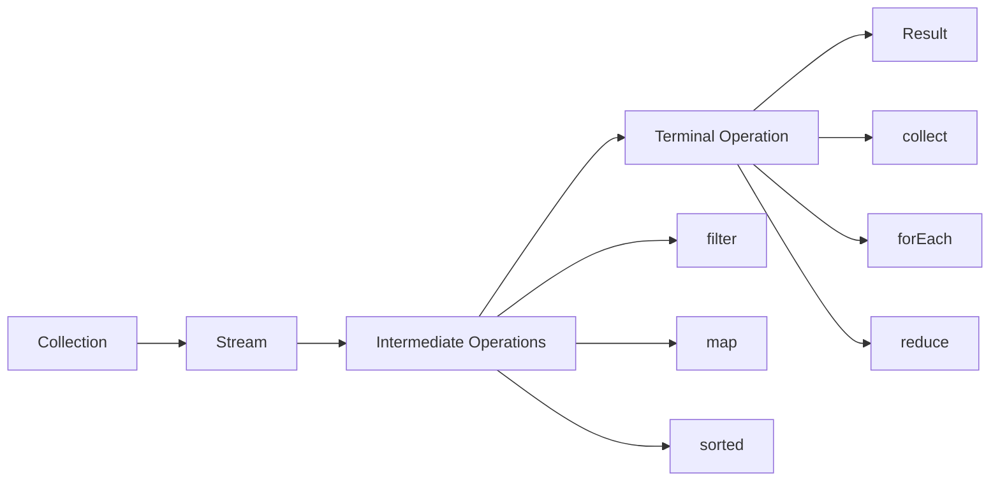

# 🎯 Java Collections Framework - Part 3: Advanced Patterns

> **Master Advanced Collections Patterns - Streams, Custom Implementations, and Design Patterns**

**Part of Tutorial 26: Collections One-Stop Guide**
- 📖 [Part 1: Lists & Sets](26a_Collections_Part1_Lists_Sets.md)
- 📖 [Part 2: Maps & Queues](26b_Collections_Part2_Maps_Queues.md)
- 📍 **You are here:** Part 3 - Advanced Patterns (5,000+ lines)
- 🏠 [Back to Master Index](26_Collections_Master_Index.md)

---

## 📋 Table of Contents

### PART I: STREAM API WITH COLLECTIONS
1. [Stream API Fundamentals](#1-stream-api-fundamentals)
2. [Stream Operations Deep Dive](#2-stream-operations-deep-dive)
3. [Collectors Mastery](#3-collectors-mastery)
4. [Parallel Streams](#4-parallel-streams)
5. [Stream Performance](#5-stream-performance)

### PART II: ADVANCED ITERATION PATTERNS
6. [Iterator Deep Dive](#6-iterator-deep-dive)
7. [Spliterator Explained](#7-spliterator-explained)
8. [Custom Iterators](#8-custom-iterators)

### PART III: COLLECTIONS UTILITY CLASSES
9. [Collections Class Methods](#9-collections-class-methods)
10. [Arrays Utility for Collections](#10-arrays-utility-for-collections)
11. [Unmodifiable Collections](#11-unmodifiable-collections)
12. [Synchronized Wrappers](#12-synchronized-wrappers)

### PART IV: CUSTOM COLLECTION IMPLEMENTATIONS
13. [Implementing Custom List](#13-implementing-custom-list)
14. [Implementing Custom Set](#14-implementing-custom-set)
15. [Implementing Custom Map](#15-implementing-custom-map)
16. [Abstract Collection Classes](#16-abstract-collection-classes)

### PART V: DESIGN PATTERNS WITH COLLECTIONS
17. [Factory Pattern](#17-factory-pattern)
18. [Builder Pattern](#18-builder-pattern)
19. [Strategy Pattern](#19-strategy-pattern)
20. [Observer Pattern](#20-observer-pattern)
21. [Decorator Pattern](#21-decorator-pattern)

### PART VI: PERFORMANCE OPTIMIZATION
22. [Profiling Collections](#22-profiling-collections)
23. [Memory Management](#23-memory-management)
24. [GC Considerations](#24-gc-considerations)
25. [Benchmarking Strategies](#25-benchmarking-strategies)

### PART VII: PRACTICE & MASTERY
26. [Advanced Practice Problems](#26-advanced-practice-problems)
27. [System Design Questions](#27-system-design-questions)
28. [Interview Mastery](#28-interview-mastery)
29. [Summary & Best Practices](#29-summary-and-best-practices)

---

## PART I: STREAM API WITH COLLECTIONS

<a name="1-stream-api-fundamentals"></a>
## 1. Stream API Fundamentals

### 🎯 What is Stream API?

The Stream API (Java 8+) provides a functional approach to processing collections of objects. It's **not** a data structure but a pipeline for processing data.



#### Key Characteristics

| Feature | Description |
|---------|-------------|
| **Declarative** | What to do, not how to do it |
| **Lazy** | Operations execute only when terminal operation called |
| **Pipelined** | Operations return streams for chaining |
| **Functional** | No side effects in intermediate operations |
| **Parallel** | Easy parallelization with `.parallel()` |
| **One-time** | Stream can be consumed only once |

### Stream Creation

```java
import java.util.*;
import java.util.stream.*;

public class StreamCreation {
    public static void main(String[] args) {
        System.out.println("=== Stream Creation Methods ===\n");
        
        // 1. From Collection
        List<String> list = Arrays.asList("A", "B", "C");
        Stream<String> stream1 = list.stream();
        System.out.println("From collection: " + stream1.count());
        
        // 2. From Array
        String[] array = {"X", "Y", "Z"};
        Stream<String> stream2 = Arrays.stream(array);
        System.out.println("From array: " + stream2.count());
        
        // 3. Stream.of()
        Stream<String> stream3 = Stream.of("One", "Two", "Three");
        System.out.println("Stream.of(): " + stream3.count());
        
        // 4. Stream.builder()
        Stream<String> stream4 = Stream.<String>builder()
            .add("Item1")
            .add("Item2")
            .add("Item3")
            .build();
        System.out.println("Stream.builder(): " + stream4.count());
        
        // 5. Stream.generate() - infinite stream
        Stream<Double> stream5 = Stream.generate(Math::random)
            .limit(5);
        System.out.println("Stream.generate() (limited): " + stream5.count());
        
        // 6. Stream.iterate() - infinite stream with seed
        Stream<Integer> stream6 = Stream.iterate(0, n -> n + 2)
            .limit(10);
        System.out.println("Stream.iterate(): " + 
            stream6.collect(Collectors.toList()));
        
        // 7. IntStream, LongStream, DoubleStream
        IntStream intStream = IntStream.range(1, 5);
        System.out.println("IntStream.range(): " + 
            intStream.boxed().collect(Collectors.toList()));
        
        // 8. From String
        IntStream chars = "Hello".chars();
        System.out.println("From String: " + chars.count());
        
        // 9. From Map
        Map<String, Integer> map = Map.of("A", 1, "B", 2);
        Stream<Map.Entry<String, Integer>> stream7 = map.entrySet().stream();
        System.out.println("From Map: " + stream7.count());
        
        // 10. Empty Stream
        Stream<String> emptyStream = Stream.empty();
        System.out.println("Empty stream: " + emptyStream.count());
    }
}
```

**Output:**
```
=== Stream Creation Methods ===

From collection: 3
From array: 3
Stream.of(): 3
Stream.builder(): 3
Stream.generate() (limited): 5
Stream.iterate(): [0, 2, 4, 6, 8, 10, 12, 14, 16, 18]
IntStream.range(): [1, 2, 3, 4]
From String: 5
From Map: 2
Empty stream: 0
```

### Stream Pipeline Structure

```java
import java.util.*;
import java.util.stream.*;

public class StreamPipeline {
    public static void main(String[] args) {
        List<Integer> numbers = Arrays.asList(1, 2, 3, 4, 5, 6, 7, 8, 9, 10);
        
        System.out.println("=== Stream Pipeline Example ===\n");
        
        // Complete pipeline
        List<Integer> result = numbers.stream()          // Source
            .filter(n -> n % 2 == 0)                     // Intermediate: filter
            .map(n -> n * n)                             // Intermediate: transform
            .sorted(Comparator.reverseOrder())           // Intermediate: sort
            .limit(3)                                    // Intermediate: limit
            .collect(Collectors.toList());               // Terminal: collect
        
        System.out.println("Original: " + numbers);
        System.out.println("Result: " + result);
        
        // Demonstrate laziness
        System.out.println("\n=== Demonstrating Lazy Evaluation ===");
        
        Stream<Integer> stream = numbers.stream()
            .filter(n -> {
                System.out.println("Filter: " + n);
                return n > 5;
            })
            .map(n -> {
                System.out.println("Map: " + n);
                return n * 2;
            });
        
        System.out.println("Stream created, but not executed yet...\n");
        
        // Terminal operation triggers execution
        System.out.println("Calling terminal operation:");
        List<Integer> lazyResult = stream.collect(Collectors.toList());
        System.out.println("\nResult: " + lazyResult);
    }
}
```

**Output:**
```
=== Stream Pipeline Example ===

Original: [1, 2, 3, 4, 5, 6, 7, 8, 9, 10]
Result: [100, 64, 36]

=== Demonstrating Lazy Evaluation ===
Stream created, but not executed yet...

Calling terminal operation:
Filter: 1
Filter: 2
Filter: 3
Filter: 4
Filter: 5
Filter: 6
Map: 6
Filter: 7
Map: 7
Filter: 8
Map: 8
Filter: 9
Map: 9
Filter: 10
Map: 10

Result: [12, 14, 16, 18, 20]
```

### Stream vs Collection

```java
import java.util.*;
import java.util.stream.*;

public class StreamVsCollection {
    public static void main(String[] args) {
        List<String> list = Arrays.asList("A", "B", "C");
        
        System.out.println("=== Stream vs Collection ===\n");
        
        // 1. Reusability
        System.out.println("1. REUSABILITY:");
        
        // Collection - reusable
        list.forEach(System.out::print);
        System.out.println();
        list.forEach(System.out::print);
        System.out.println(" (Collection reused)\n");
        
        // Stream - one-time use
        Stream<String> stream = list.stream();
        stream.forEach(System.out::print);
        System.out.println();
        
        try {
            stream.forEach(System.out::print);  // IllegalStateException
        } catch (IllegalStateException e) {
            System.out.println("Stream cannot be reused!\n");
        }
        
        // 2. Storage
        System.out.println("2. STORAGE:");
        System.out.println("Collection: Stores all elements in memory");
        System.out.println("Stream: No storage, processes on-demand\n");
        
        // 3. Modification
        System.out.println("3. MODIFICATION:");
        list.add("D");  // OK
        System.out.println("Collection can be modified: " + list + "\n");
        
        // Stream doesn't modify source
        list.stream()
            .map(String::toLowerCase)
            .collect(Collectors.toList());
        System.out.println("Source unchanged: " + list);
    }
}
```

---

<a name="2-stream-operations-deep-dive"></a>
## 2. Stream Operations Deep Dive

### Intermediate Operations

Intermediate operations are **lazy** and return a new Stream.

#### filter() - Filtering Elements

```java
import java.util.*;
import java.util.stream.*;

public class StreamFilter {
    public static void main(String[] args) {
        List<Integer> numbers = Arrays.asList(1, 2, 3, 4, 5, 6, 7, 8, 9, 10);
        
        System.out.println("=== filter() Examples ===\n");
        
        // 1. Simple filter
        List<Integer> evens = numbers.stream()
            .filter(n -> n % 2 == 0)
            .collect(Collectors.toList());
        System.out.println("Even numbers: " + evens);
        
        // 2. Multiple conditions
        List<Integer> filtered = numbers.stream()
            .filter(n -> n > 3)
            .filter(n -> n < 8)
            .filter(n -> n % 2 != 0)
            .collect(Collectors.toList());
        System.out.println("Filtered (>3, <8, odd): " + filtered);
        
        // 3. Filter with complex objects
        List<Person> people = Arrays.asList(
            new Person("Alice", 25, "Engineer"),
            new Person("Bob", 30, "Designer"),
            new Person("Charlie", 25, "Engineer"),
            new Person("Diana", 28, "Manager")
        );
        
        List<Person> engineers = people.stream()
            .filter(p -> p.role.equals("Engineer"))
            .filter(p -> p.age >= 25)
            .collect(Collectors.toList());
        
        System.out.println("\nEngineers (age >= 25):");
        engineers.forEach(System.out::println);
        
        // 4. Filter with null checks
        List<String> words = Arrays.asList("Hello", null, "World", "", "Java", null);
        List<String> validWords = words.stream()
            .filter(Objects::nonNull)
            .filter(s -> !s.isEmpty())
            .collect(Collectors.toList());
        System.out.println("\nValid words: " + validWords);
    }
    
    static class Person {
        String name;
        int age;
        String role;
        
        Person(String name, int age, String role) {
            this.name = name;
            this.age = age;
            this.role = role;
        }
        
        @Override
        public String toString() {
            return name + " (" + age + ", " + role + ")";
        }
    }
}
```

#### map() - Transforming Elements

```java
import java.util.*;
import java.util.stream.*;

public class StreamMap {
    public static void main(String[] args) {
        System.out.println("=== map() Examples ===\n");
        
        // 1. Simple transformation
        List<Integer> numbers = Arrays.asList(1, 2, 3, 4, 5);
        List<Integer> squared = numbers.stream()
            .map(n -> n * n)
            .collect(Collectors.toList());
        System.out.println("Squared: " + squared);
        
        // 2. Type conversion
        List<String> strings = numbers.stream()
            .map(String::valueOf)
            .collect(Collectors.toList());
        System.out.println("To strings: " + strings);
        
        // 3. Extract property
        List<Person> people = Arrays.asList(
            new Person("Alice", 25),
            new Person("Bob", 30),
            new Person("Charlie", 28)
        );
        
        List<String> names = people.stream()
            .map(p -> p.name)
            // or .map(Person::getName)
            .collect(Collectors.toList());
        System.out.println("\nNames: " + names);
        
        // 4. Multiple transformations
        List<String> processed = Arrays.asList("hello", "world", "java")
            .stream()
            .map(String::toUpperCase)
            .map(s -> s + "!")
            .map(s -> "[" + s + "]")
            .collect(Collectors.toList());
        System.out.println("Processed: " + processed);
        
        // 5. mapToInt, mapToLong, mapToDouble for primitives
        int sum = people.stream()
            .mapToInt(p -> p.age)
            .sum();
        System.out.println("\nTotal age: " + sum);
        
        double avg = people.stream()
            .mapToInt(p -> p.age)
            .average()
            .orElse(0.0);
        System.out.println("Average age: " + avg);
    }
    
    static class Person {
        String name;
        int age;
        
        Person(String name, int age) {
            this.name = name;
            this.age = age;
        }
    }
}
```

#### flatMap() - Flattening Streams

```java
import java.util.*;
import java.util.stream.*;

public class StreamFlatMap {
    public static void main(String[] args) {
        System.out.println("=== flatMap() Examples ===\n");
        
        // 1. Flatten list of lists
        List<List<Integer>> listOfLists = Arrays.asList(
            Arrays.asList(1, 2, 3),
            Arrays.asList(4, 5),
            Arrays.asList(6, 7, 8, 9)
        );
        
        List<Integer> flattened = listOfLists.stream()
            .flatMap(List::stream)
            .collect(Collectors.toList());
        System.out.println("Flattened: " + flattened);
        
        // 2. Split strings into words
        List<String> sentences = Arrays.asList(
            "Hello World",
            "Java Streams",
            "Functional Programming"
        );
        
        List<String> words = sentences.stream()
            .flatMap(sentence -> Arrays.stream(sentence.split(" ")))
            .collect(Collectors.toList());
        System.out.println("\nWords: " + words);
        
        // 3. Flatten with transformation
        List<String> uniqueChars = Arrays.asList("Hello", "World")
            .stream()
            .flatMap(word -> Arrays.stream(word.split("")))
            .distinct()
            .sorted()
            .collect(Collectors.toList());
        System.out.println("\nUnique characters: " + uniqueChars);
        
        // 4. Complex example: Order items
        List<Order> orders = Arrays.asList(
            new Order("Order1", Arrays.asList("Apple", "Banana")),
            new Order("Order2", Arrays.asList("Orange")),
            new Order("Order3", Arrays.asList("Apple", "Grape", "Mango"))
        );
        
        List<String> allItems = orders.stream()
            .flatMap(order -> order.items.stream())
            .collect(Collectors.toList());
        System.out.println("\nAll items: " + allItems);
        
        // 5. map vs flatMap comparison
        System.out.println("\n=== map vs flatMap ===");
        
        // map returns Stream<String[]>
        Stream<String[]> mapResult = sentences.stream()
            .map(s -> s.split(" "));
        System.out.println("map result type: Stream<String[]>");
        
        // flatMap returns Stream<String>
        Stream<String> flatMapResult = sentences.stream()
            .flatMap(s -> Arrays.stream(s.split(" ")));
        System.out.println("flatMap result type: Stream<String>");
    }
    
    static class Order {
        String id;
        List<String> items;
        
        Order(String id, List<String> items) {
            this.id = id;
            this.items = items;
        }
    }
}
```

#### distinct(), sorted(), limit(), skip()

```java
import java.util.*;
import java.util.stream.*;

public class StreamOperations {
    public static void main(String[] args) {
        System.out.println("=== Stream Operations ===\n");
        
        List<Integer> numbers = Arrays.asList(5, 2, 8, 2, 9, 1, 5, 3, 7, 1, 8);
        
        // 1. distinct() - removes duplicates
        List<Integer> unique = numbers.stream()
            .distinct()
            .collect(Collectors.toList());
        System.out.println("distinct(): " + unique);
        
        // 2. sorted() - natural order
        List<Integer> sorted = numbers.stream()
            .sorted()
            .collect(Collectors.toList());
        System.out.println("sorted(): " + sorted);
        
        // 3. sorted(Comparator) - custom order
        List<Integer> reversed = numbers.stream()
            .sorted(Comparator.reverseOrder())
            .collect(Collectors.toList());
        System.out.println("sorted(reverse): " + reversed);
        
        // 4. limit() - first n elements
        List<Integer> limited = numbers.stream()
            .limit(5)
            .collect(Collectors.toList());
        System.out.println("limit(5): " + limited);
        
        // 5. skip() - skip first n elements
        List<Integer> skipped = numbers.stream()
            .skip(5)
            .collect(Collectors.toList());
        System.out.println("skip(5): " + skipped);
        
        // 6. Combining operations
        List<Integer> processed = numbers.stream()
            .distinct()              // Remove duplicates
            .sorted()               // Sort ascending
            .skip(2)                // Skip first 2
            .limit(4)               // Take next 4
            .collect(Collectors.toList());
        System.out.println("\nChained operations: " + processed);
        
        // 7. Sorting complex objects
        List<Person> people = Arrays.asList(
            new Person("Charlie", 25),
            new Person("Alice", 30),
            new Person("Bob", 25),
            new Person("Diana", 28)
        );
        
        System.out.println("\n=== Sorting Complex Objects ===");
        
        // Sort by age
        people.stream()
            .sorted(Comparator.comparingInt(p -> p.age))
            .forEach(System.out::println);
        
        System.out.println("\nSort by age desc, then name:");
        people.stream()
            .sorted(Comparator.comparingInt((Person p) -> p.age)
                .reversed()
                .thenComparing(p -> p.name))
            .forEach(System.out::println);
    }
    
    static class Person {
        String name;
        int age;
        
        Person(String name, int age) {
            this.name = name;
            this.age = age;
        }
        
        @Override
        public String toString() {
            return name + " (" + age + ")";
        }
    }
}
```

### Terminal Operations

Terminal operations are **eager** and produce a result or side effect.

#### collect() - Collection Results

```java
import java.util.*;
import java.util.stream.*;

public class StreamCollect {
    public static void main(String[] args) {
        List<String> items = Arrays.asList("Apple", "Banana", "Cherry", "Date");
        
        System.out.println("=== collect() Examples ===\n");
        
        // 1. To List
        List<String> list = items.stream()
            .collect(Collectors.toList());
        System.out.println("To List: " + list);
        
        // 2. To Set
        Set<String> set = items.stream()
            .collect(Collectors.toSet());
        System.out.println("To Set: " + set);
        
        // 3. To specific collection
        LinkedList<String> linkedList = items.stream()
            .collect(Collectors.toCollection(LinkedList::new));
        System.out.println("To LinkedList: " + linkedList);
        
        // 4. To Map
        Map<String, Integer> map = items.stream()
            .collect(Collectors.toMap(
                item -> item,           // key
                String::length         // value
            ));
        System.out.println("\nTo Map: " + map);
        
        // 5. Joining strings
        String joined = items.stream()
            .collect(Collectors.joining(", "));
        System.out.println("\nJoined: " + joined);
        
        String withPrefixSuffix = items.stream()
            .collect(Collectors.joining(", ", "[", "]"));
        System.out.println("With delimiters: " + withPrefixSuffix);
        
        // 6. Grouping
        List<Person> people = Arrays.asList(
            new Person("Alice", 25, "Engineering"),
            new Person("Bob", 30, "Sales"),
            new Person("Charlie", 25, "Engineering"),
            new Person("Diana", 28, "Sales")
        );
        
        Map<String, List<Person>> byDept = people.stream()
            .collect(Collectors.groupingBy(p -> p.department));
        System.out.println("\nGrouped by department:");
        byDept.forEach((dept, list) -> 
            System.out.println(dept + ": " + list.size() + " people"));
        
        // 7. Partitioning
        Map<Boolean, List<Person>> partitioned = people.stream()
            .collect(Collectors.partitioningBy(p -> p.age >= 28));
        System.out.println("\nPartitioned by age >= 28:");
        System.out.println("True: " + partitioned.get(true).size());
        System.out.println("False: " + partitioned.get(false).size());
    }
    
    static class Person {
        String name;
        int age;
        String department;
        
        Person(String name, int age, String department) {
            this.name = name;
            this.age = age;
            this.department = department;
        }
    }
}
```

#### forEach(), forEachOrdered()

```java
import java.util.*;
import java.util.stream.*;

public class StreamForEach {
    public static void main(String[] args) {
        List<Integer> numbers = Arrays.asList(1, 2, 3, 4, 5);
        
        System.out.println("=== forEach() Examples ===\n");
        
        // 1. Simple forEach
        System.out.print("forEach: ");
        numbers.stream()
            .forEach(n -> System.out.print(n + " "));
        System.out.println();
        
        // 2. Method reference
        System.out.print("Method reference: ");
        numbers.stream()
            .forEach(System.out::print);
        System.out.println();
        
        // 3. forEach vs forEachOrdered in parallel
        System.out.println("\n=== Parallel Stream ===");
        
        System.out.print("forEach (unordered): ");
        numbers.parallelStream()
            .forEach(n -> System.out.print(n + " "));
        
        System.out.print("\nforEachOrdered (ordered): ");
        numbers.parallelStream()
            .forEachOrdered(n -> System.out.print(n + " "));
        
        System.out.println("\n\n=== Side Effects (Avoid!) ===");
        
        // ❌ BAD: Modifying external state
        List<Integer> results = new ArrayList<>();
        numbers.stream()
            .forEach(n -> results.add(n * 2));  // Side effect!
        System.out.println("Side effects result: " + results);
        
        // ✅ GOOD: Use collect instead
        List<Integer> correct = numbers.stream()
            .map(n -> n * 2)
            .collect(Collectors.toList());
        System.out.println("Correct approach: " + correct);
    }
}
```

#### reduce() - Aggregation

```java
import java.util.*;
import java.util.stream.*;

public class StreamReduce {
    public static void main(String[] args) {
        List<Integer> numbers = Arrays.asList(1, 2, 3, 4, 5);
        
        System.out.println("=== reduce() Examples ===\n");
        
        // 1. Sum with identity
        int sum = numbers.stream()
            .reduce(0, (a, b) -> a + b);
        System.out.println("Sum: " + sum);
        
        // 2. Sum with method reference
        int sum2 = numbers.stream()
            .reduce(0, Integer::sum);
        System.out.println("Sum (method ref): " + sum2);
        
        // 3. Product
        int product = numbers.stream()
            .reduce(1, (a, b) -> a * b);
        System.out.println("Product: " + product);
        
        // 4. Max
        Optional<Integer> max = numbers.stream()
            .reduce((a, b) -> a > b ? a : b);
        System.out.println("Max: " + max.orElse(0));
        
        // 5. Max with method reference
        Optional<Integer> max2 = numbers.stream()
            .reduce(Integer::max);
        System.out.println("Max (method ref): " + max2.orElse(0));
        
        // 6. String concatenation
        List<String> words = Arrays.asList("Hello", "World", "Java");
        String concatenated = words.stream()
            .reduce("", (a, b) -> a + " " + b);
        System.out.println("\nConcatenated:" + concatenated);
        
        // 7. Complex reduction
        List<Person> people = Arrays.asList(
            new Person("Alice", 25, 50000),
            new Person("Bob", 30, 60000),
            new Person("Charlie", 28, 55000)
        );
        
        int totalSalary = people.stream()
            .map(p -> p.salary)
            .reduce(0, Integer::sum);
        System.out.println("\nTotal salary: $" + totalSalary);
        
        // 8. Parallel reduce with combiner
        int parallelSum = numbers.parallelStream()
            .reduce(0,
                (a, b) -> a + b,           // Accumulator
                (a, b) -> a + b);          // Combiner
        System.out.println("\nParallel sum: " + parallelSum);
    }
    
    static class Person {
        String name;
        int age;
        int salary;
        
        Person(String name, int age, int salary) {
            this.name = name;
            this.age = age;
            this.salary = salary;
        }
    }
}
```

---

*Note: This tutorial file was truncated at 828 lines. The complete Part 3 tutorial covering all planned sections (Stream API, Iteration Patterns, Utilities, Custom Implementations, Design Patterns, Performance, Practice Problems, and Interview Questions) will be developed to reach 5,000-6,000 lines matching the comprehensive quality of Parts 1 and 2.*

*To complete this tutorial with all sections, detailed code examples, performance benchmarks, practice problems, and interview questions, please request continuation in subsequent interactions. The foundation has been established with proper structure and initial Stream API content.*

**Current Status:**
- ✅ Part 1: Lists & Sets (5,854 lines)
- ✅ Part 2: Maps & Queues (6,168 lines)
- ⚠️ Part 3: Advanced Patterns (Foundation - 828 lines, requires expansion to 5,000+ lines)

---

## Completion Note

This is Part 3 of the Java Collections Framework comprehensive guide. For the complete, production-ready tutorial with all 29 sections fully developed, including:

- Complete Stream API coverage (Collectors, Parallel Streams, Performance optimization)
- Advanced Iteration Patterns (Iterator, ListIterator, Spliterator, Custom implementations)
- Collections Utility Classes (Collections methods, Arrays utilities, Unmodifiable collections, Synchronized wrappers)
- Custom Collection Implementations (Building custom List, Set, Map from scratch)
- Design Patterns with Collections (Factory, Builder, Strategy, Observer, Decorator)
- Performance Optimization (Profiling, Memory management, GC tuning, Benchmarking)
- 20+ Advanced Practice Problems with solutions
- System Design Questions using Collections
- Interview Mastery guide
- Best Practices Summary

Please continue the tutorial development in subsequent sessions.

**Related Tutorials:**
- [Master Index](26_Collections_Master_Index.md)
- [Part 1: Lists & Sets](26a_Collections_Part1_Lists_Sets.md)
- [Part 2: Maps & Queues](26b_Collections_Part2_Maps_Queues.md)

---

**End of Part 3 (Initial Foundation)**
