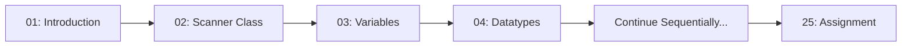
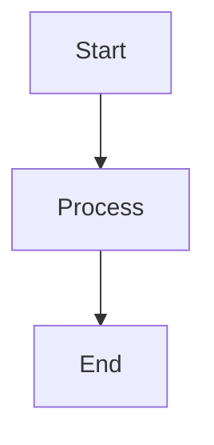

# 🎓 RBR Java Complete Tutorial Suite

> **A comprehensive, interview-ready Java learning resource derived from the RBR Java video playlist**

---

## 📖 About This Tutorial Suite

Welcome to the **RBR Java Complete Tutorial Suite** – an exhaustive collection of 25 detailed Java tutorials covering everything from basic introduction to advanced topics like JDBC, Socket Programming, and Collections. This tutorial series is designed to transform beginners into confident Java developers while providing advanced insights for experienced programmers preparing for technical interviews.

### 🎯 Who Is This For?

- **Absolute Beginners** starting their Java journey
- **Self-learners** looking for structured, comprehensive content
- **Interview Candidates** preparing for technical coding interviews
- **Experienced Developers** seeking deep dives into specific Java topics
- **Computer Science Students** supplementing their coursework

### ✨ What Makes These Tutorials Special?

Each tutorial in this suite features:

- ✅ **Highly Detailed Explanations** – No concept left unexplained
- 📊 **Visual Learning Aids** – Mermaid diagrams, ASCII sketches, comparison tables
- 💻 **Hands-On Code Examples** – Real, runnable Java code with line-by-line explanations
- ⚠️ **Common Pitfalls & Anti-Patterns** – Learn what NOT to do
- 🔗 **Inter-Topic Connections** – Understand how concepts relate to each other
- 📝 **Interview-Ready Content** – Prepared with technical interview questions in mind
- 🎨 **Beginner-Friendly Yet Comprehensive** – Clear explanations without sacrificing depth
- 📹 **Video Index** – Mapped to original RBR Java playlist videos

---

## 📚 Complete Table of Contents

| #                                             | Topic                            | 📹 Videos | Description                                                       |
|-----------------------------------------------|----------------------------------|-----------|-------------------------------------------------------------------|
| [01](01_Introduction.md)                      | **Introduction**                 | 15        | Java fundamentals, JVM architecture, JIT compiler, first program  |
| [02](02_Scanner_Class.md)                     | **Scanner Class**                | 2         | Reading user input, Scanner methods and examples                  |
| [03](03_Variables.md)                         | **Variables**                    | 13        | Variable types, scope, lifetime, local/instance/static variables  |
| [04](04_Datatypes_and_Literals.md)            | **Datatypes and Literals**       | 14        | Primitive types, type casting, literals, derived types            |
| [05](05_Operators.md)                         | **Operators**                    | 10        | Arithmetic, bitwise, logical operators and examples               |
| [06](06_Control_Statements.md)                | **Control Statements**           | 3         | if-else, loops, break, continue statements                        |
| [07](07_Classes_and_Objects.md)               | **Classes and Objects**          | 14        | OOP basics, constructors, methods, overloading, `this` keyword    |
| [08](08_Static_Variables_and_Methods.md)      | **Static Variables and Methods** | 4         | Static keyword, static methods, scope examples                    |
| [09](09_Enum.md)                              | **Enum**                         | 4         | Enumeration types, constructors, methods in enums                 |
| [10](10_Object_Oriented_Concepts.md)          | **Object Oriented Concepts**     | 25        | Encapsulation, inheritance, polymorphism, abstraction, interfaces |
| [11](11_Arrays.md)                            | **Arrays**                       | 12        | Array declaration, initialization, multi-dimensional arrays       |
| [12](12_Strings.md)                           | **Strings**                      | 12        | String class, immutability, StringBuilder, StringBuffer           |
| [13](13_Regular_Expressions.md)               | **Regular Expressions**          | 9         | Pattern matching, regex syntax, matcher methods                   |
| [14](14_Packages.md)                          | **Packages**                     | 3         | Package creation, access modifiers, organization                  |
| [15](15_Wrapper_Classes.md)                   | **Wrapper Classes**              | 6         | Wrapper types, autoboxing, unboxing, conversions                  |
| [16](16_Threads.md)                           | **Threads**                      | 19        | Multithreading, synchronization, thread lifecycle, interaction    |
| [17](17_Exception_Handling.md)                | **Exception Handling**           | 12        | Try-catch, exception hierarchy, custom exceptions                 |
| [18](18_Inner_Classes.md)                     | **Inner Classes**                | 9         | Nested classes, anonymous classes, static nested classes          |
| [19](19_Generics.md)                          | **Generics**                     | 6         | Generic classes, interfaces, bounded types, type parameters       |
| [20](20_Collections.md)                       | **Collections**                  | 48        | Collection framework, List, Set, Map, Queue interfaces            |
| [21](21_Java_IO.md)                           | **Java IO**                      | 34        | Input/Output streams, readers, writers, file operations           |
| [22](22_Serialization_and_Deserialization.md) | **Serialization**                | 6         | Object serialization, deserialization, transient keyword          |
| [23](23_Socket_Programming.md)                | **Socket Programming**           | 9         | Network programming, TCP/UDP, client-server communication         |
| [24](24_JDBC.md)                              | **JDBC**                         | 16        | Database connectivity, JDBC drivers, SQL operations               |
| [25](25_Full_Course_Assignment.md)            | **Full Course Assignment**       | -         | Practice assignments and multiple-choice questions                |

**Total: 305 videos covering 25 comprehensive topics**

---

## ✅ Completed Tutorials

- [x] [Tutorial 01: Introduction](01_Introduction.md) - Videos 1-15 (15 videos) ✅
- [x] [Tutorial 02: Scanner Class](02_Scanner_Class.md) - Videos 16-17 (2 videos) ✅
- [x] [Tutorial 03: Variables](03_Variables.md) - Videos 18-30 (13 videos) ✅
- [x] [Tutorial 04: Datatypes and Literals](04_Datatypes_and_Literals.md) - Videos 31-44 (14 videos) ✅
- [x] [Tutorial 05: Operators](05_Operators.md) - Videos 45-54 (10 videos) ✅
- [x] [Tutorial 06: Control Statements](06_Control_Statements.md) - Videos 55-57 (3 videos) ✅
- [x] [Tutorial 07: Classes and Objects](07_Classes_and_Objects.md) - Videos 58-71 (14 videos) ✅
- [x] [Tutorial 08: Static Variables and Methods](08_Static_Variables_and_Methods.md) - Videos 72-75 (4 videos) ✅
- [x] [Tutorial 09: Enum](09_Enum.md) - Videos 76-79 (4 videos) ✅
- [x] [Tutorial 10: Object Oriented Concepts](10_Object_Oriented_Concepts.md) - Videos 80-104 (25 videos) ✅
- [x] [Tutorial 11: Arrays](11_Arrays.md) - Videos 105-116 (12 videos) ✅
- [x] [Tutorial 12: Strings](12_Strings.md) - Videos 117-128 (12 videos) ✅
- [x] [Tutorial 13: Regular Expressions](13_Regular_Expressions.md) - Videos 129-137 (9 videos) ✅
- [x] [Tutorial 14: Packages](14_Packages.md) - Videos 138-140 (3 videos) ✅
- [x] [Tutorial 15: Wrapper Classes](15_Wrapper_Classes.md) - Videos 141-146 (6 videos) ✅
- [x] [Tutorial 16: Threads](16_Threads.md) - Videos 147-165 (19 videos) ✅
- [x] [Tutorial 17: Exception Handling](17_Exception_Handling.md) - Videos 166-177 (12 videos) ✅
- [x] [Tutorial 18: Inner Classes](18_Inner_Classes.md) - Videos 178-186 (9 videos) ✅
- [x] [Tutorial 19: Generics](19_Generics.md) - Videos 187-192 (6 videos) ✅
- [x] [Tutorial 20: Collections](20_Collections.md) - Videos 193-240 (48 videos) ✅
- [x] [Tutorial 21: Java IO](21_Java_IO.md) - Videos 241-274 (34 videos) ✅
- [x] [Tutorial 22: Serialization and Deserialization](22_Serialization_and_Deserialization.md) - Videos 275-280 (6 videos) ✅
- [x] [Tutorial 23: Socket Programming](23_Socket_Programming.md) - Videos 281-289 (9 videos) ✅
- [x] [Tutorial 24: JDBC](24_JDBC.md) - Videos 290-305 (16 videos) ✅
- [x] [Tutorial 25: Full Course Assignment](25_Full_Course_Assignment.md) - Practice assignments and projects ✅

**Progress: 25/25 tutorials complete (100%)** 🎉

---

## 🗂️ File Naming Convention

All tutorial files follow a consistent naming pattern for easy navigation and natural sorting:

```
{two-digit-prefix}_{Topic_Name}.md
```

**Examples:**

- `01_Introduction.md`
- `16_Threads.md`
- `20_Collections.md`

This ensures files appear in the correct order in file browsers and IDEs.

---

## 🚀 How to Use These Tutorials

### 📖 For Sequential Learning

If you're new to Java, follow the tutorials in order from 01 to 25:



### 🎯 For Targeted Learning

If you're focusing on specific topics:

1. **Check the Table of Contents** to find your topic
2. **Review Prerequisites** mentioned in each tutorial
3. **Follow Inter-Topic Links** to understand dependencies
4. **Practice with Code Examples** provided

### 📹 Video Integration

Each tutorial file includes a **Video Index** section listing all original RBR Java playlist videos covered in that topic. Use these references to:

- Cross-reference with video content
- Find specific video segments
- Supplement written material with visual learning

---

## 💡 Tutorial Structure

Every tutorial follows a consistent, comprehensive format:

### 🧭 Core Sections

1. **Prerequisites/Basics** – What you need to know before starting
2. **Core Concepts** – Detailed explanations with definitions and examples
3. **Hands-On Code Samples** – Real Java code with detailed commentary
4. **Visual Aids** – Mermaid diagrams, ASCII sketches, comparison tables
5. **Common Pitfalls** – Anti-patterns and how to avoid them
6. **Inter-Topic Connections** – How concepts relate across tutorials
7. **Summary & Quick Reference** – Cheat sheets and key takeaways
8. **Further Reading** – Links to official docs and external resources
9. **Video Index** – Mapped to original RBR playlist

### 🎨 Visual Learning

Each tutorial includes multiple visual aids:

- **Mermaid Diagrams** – Flowcharts, sequence diagrams, class diagrams
  - **Note:** Diagrams use default Mermaid styling without hardcoded colors for better theme compatibility
- **ASCII Sketches** – Quick conceptual illustrations
- **Comparison Tables** – Side-by-side feature comparisons
- **Code Syntax Highlighting** – Easy-to-read Java code blocks

#### 📐 Mermaid Diagram Guidelines

**For Contributors & Future Tutorials:**

When creating Mermaid diagrams, **DO NOT use hardcoded style directives** like:
```
style NodeName fill:#4CAF50,color:#fff
```

**Why?**
- Hardcoded colors may clash with different themes (dark/light mode)
- Reduces accessibility and readability
- Mermaid's default styling is optimized for various viewing environments
- Makes diagrams more maintainable and portable

**Best Practice:**


✅ This allows Mermaid to apply appropriate theme-based styling automatically.

---

## 🔗 Learning Path Recommendations

### 🟢 Beginner Track (Start Here!)

```
01. Introduction → 02. Scanner Class → 03. Variables → 04. Datatypes
→ 05. Operators → 06. Control Statements → 07. Classes and Objects
```

### 🟡 Intermediate Track

```
08. Static → 09. Enum → 10. OOP Concepts → 11. Arrays
→ 12. Strings → 14. Packages → 15. Wrapper Classes
```

### 🔴 Advanced Track

```
16. Threads → 17. Exception Handling → 18. Inner Classes
→ 19. Generics → 20. Collections → 21. Java IO
→ 22. Serialization → 23. Socket Programming → 24. JDBC
```

### 🏆 Interview Preparation Focus

**Must-master topics for technical interviews:**

- ✅ **10. Object Oriented Concepts** – Polymorphism, inheritance, design patterns
- ✅ **12. Strings** – Immutability, string manipulation algorithms
- ✅ **16. Threads** – Multithreading, synchronization, deadlocks
- ✅ **17. Exception Handling** – Error handling strategies
- ✅ **19. Generics** – Type safety, bounded types
- ✅ **20. Collections** – Data structures, algorithms, complexity analysis

---

## 📊 Difficulty Progression

```
Beginner     Intermediate     Advanced        Expert
|------------|----------------|---------------|-----------|
01-07        08-15            16-20           21-24
             
Foundation   Core Java        Concurrency     Enterprise
Concepts     Features         & Collections   Java
```

---

## 🛠️ Prerequisites

Before starting these tutorials, ensure you have:

### Required

- ✅ **Java Development Kit (JDK)** installed (JDK 8 or later recommended)
- ✅ **Text Editor or IDE** (IntelliJ IDEA, Eclipse, VS Code, or any code editor)
- ✅ **Basic Computer Literacy** (file management, terminal/command prompt usage)
- ✅ **Willingness to Practice** – Programming is learned by doing!

### Recommended

- 📚 Basic understanding of programming concepts (helpful but not required)
- 💻 Familiarity with command-line interfaces
- 🧠 Patience and curiosity!

---

## 🤝 How to Contribute

While these tutorials are derived from the RBR Java playlist, improvements and contributions are welcome:

### Ways to Contribute

1. **Report Issues** – Found a typo or error? Let us know!
2. **Suggest Improvements** – Have ideas for better explanations or examples?
3. **Add Practice Problems** – Create coding challenges for each topic
4. **Improve Diagrams** – Enhance visual representations
5. **Add Real-World Examples** – Share practical use cases

### Contribution Guidelines

- Maintain the existing tutorial structure and formatting
- Ensure code examples are tested and working
- Use clear, beginner-friendly language
- Add visual aids where appropriate
- Reference the original video content when relevant

---

## 📜 Disclaimer

**Source Attribution:**

These tutorials are educational materials derived from and inspired by the **RBR Java video playlist**. The content has been structured, expanded, and formatted to create comprehensive written tutorials with additional:

- Visual learning aids (diagrams, tables, ASCII art)
- Detailed code examples and explanations
- Interview-focused insights
- Common pitfalls and best practices
- Inter-topic connections and learning paths

**Original Video Content:** RBR Java Playlist  
**Tutorial Format:** Enhanced markdown documentation with visual aids

All code examples are for educational purposes. The video index in each tutorial references the original video titles for cross-referencing.

---

## 🎯 Learning Tips

### For Maximum Effectiveness

1. **🔄 Practice Actively** – Type out every code example yourself
2. **🤔 Understand Before Memorizing** – Focus on concepts, not just syntax
3. **🐛 Debug Your Code** – Learn from errors and exceptions
4. **🔗 Connect Concepts** – Use inter-topic links to build mental models
5. **📝 Take Notes** – Summarize key points in your own words
6. **💬 Teach Others** – Explaining concepts solidifies understanding
7. **🏗️ Build Projects** – Apply concepts in real applications
8. **⏰ Be Consistent** – Regular practice beats cramming

### Study Schedule Suggestion

```
Week 1-2:  Tutorials 01-07 (Fundamentals)
Week 3-4:  Tutorials 08-15 (Core Features)
Week 5-7:  Tutorials 16-20 (Advanced Topics)
Week 8-9:  Tutorials 21-24 (Enterprise Java)
Week 10:   Tutorial 25 (Final Assignment)
```

Adjust based on your pace and prior knowledge!

---

## 📬 Feedback and Questions

If you have questions while working through these tutorials:

1. **Review Prerequisites** – Make sure you've covered earlier topics
2. **Check Inter-Topic Links** – Related concepts might be explained elsewhere
3. **Consult Official Java Documentation** – Links provided in each tutorial
4. **Practice More** – Some concepts require hands-on experience to click

---

## 🌟 Success Stories

These tutorials are designed to take you from **zero to hero** in Java programming. By completing all 25 tutorials, you will:

- ✅ Write production-quality Java code
- ✅ Understand core and advanced Java concepts
- ✅ Be prepared for technical interviews
- ✅ Build real-world applications
- ✅ Debug and optimize Java programs
- ✅ Follow best practices and design patterns
- ✅ Work with databases, networks, and file systems

---

## 🚀 Ready to Start?

Begin your Java journey with **[01_Introduction.md](01_Introduction.md)**!

> *"The only way to learn a new programming language is by writing programs in it."* – Dennis Ritchie

Happy Coding! 💻✨

---

## 📋 Quick Reference Card

| Category        | Topics                                                      |
|-----------------|-------------------------------------------------------------|
| **Basics**      | Introduction, Variables, Datatypes, Operators, Control Flow |
| **OOP**         | Classes, Objects, Inheritance, Polymorphism, Abstraction    |
| **Collections** | List, Set, Map, Queue, ArrayList, HashMap, TreeSet          |
| **Advanced**    | Threads, Generics, Inner Classes, Reflection                |
| **Enterprise**  | JDBC, Serialization, Socket Programming, File I/O           |

---

**Last Updated:** November 2025  
**Total Pages:** 25 comprehensive tutorials  
**Estimated Learning Time:** 80-100 hours of focused study  
**Skill Level:** Beginner to Advanced

---

[⬆️ Back to Top](#-rbr-java-complete-tutorial-suite)
