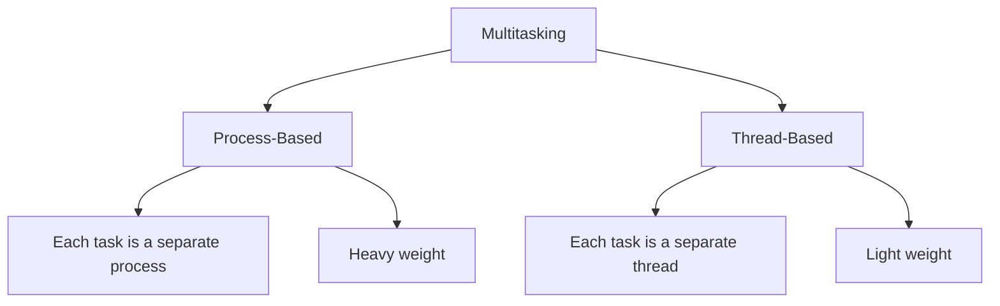
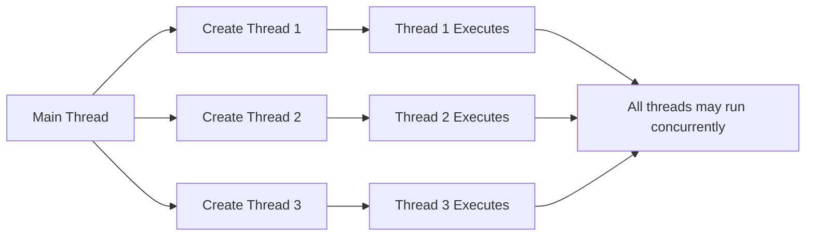
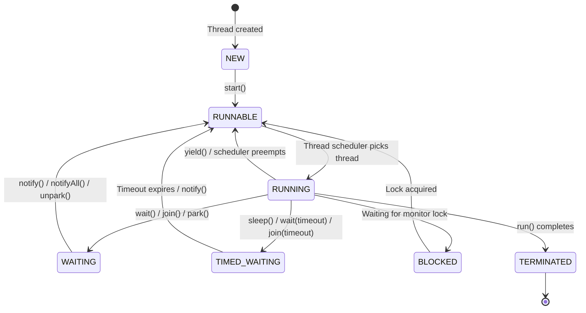
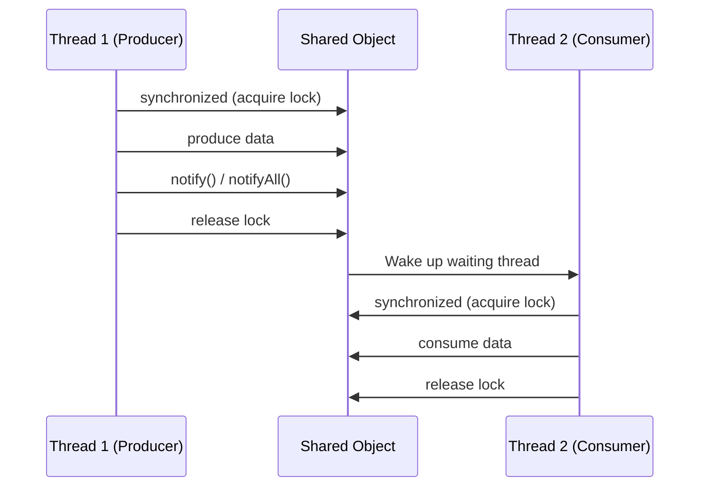

# 🧵 Java Multithreading – Prerequisites and Basics
### *Complete Interview Preparation Guide*

---

## 📋 Table of Contents

1. [Prerequisites](#prerequisites)
2. [Introduction to Threads](#introduction-to-threads)
3. [Creating Threads in Java](#creating-threads-in-java)
4. [Thread Class Constructors](#thread-class-constructors)
5. [Managing Multiple Threads](#managing-multiple-threads)
6. [Getting Current Thread Reference](#getting-current-thread-reference)
7. [Thread States and Transitions](#thread-states-and-transitions)
8. [Thread Priorities](#thread-priorities)
9. [Preventing Thread Execution](#preventing-thread-execution)
10. [Thread Control Methods](#thread-control-methods)
11. [Synchronization](#synchronization)
12. [Thread Interaction](#thread-interaction)
13. [Best Practices and Common Pitfalls](#best-practices-and-common-pitfalls)

---

## 1. Prerequisites

### 1.1 Essential Java Knowledge 📚

Before diving into multithreading, you should be comfortable with:

- **Object-Oriented Programming**: Classes, objects, inheritance, interfaces
- **Exception Handling**: Try-catch blocks, checked vs unchecked exceptions
- **Lambda Expressions**: Modern functional-style coding (Java 8+)
- **Collections Framework**: Basic understanding of Lists, Sets, Maps

### 1.2 Java Memory Model Basics 🧠

Understanding how Java manages memory is crucial for multithreading:

```
┌─────────────────────────────────────────┐
│         Java Memory Model               │
├─────────────────────────────────────────┤
│                                         │
│  ┌──────────────┐    ┌──────────────┐  │
│  │   Heap       │    │   Stack      │  │
│  │  (Shared)    │    │  (Thread-    │  │
│  │              │    │   Local)     │  │
│  │ • Objects    │    │ • Method     │  │
│  │ • Instance   │    │   calls      │  │
│  │   variables  │    │ • Local      │  │
│  │              │    │   variables  │  │
│  └──────────────┘    └──────────────┘  │
│                                         │
│  ┌──────────────────────────────────┐  │
│  │      Method Area (Shared)        │  │
│  │  • Class metadata                │  │
│  │  • Static variables              │  │
│  │  • Constant pool                 │  │
│  └──────────────────────────────────┘  │
└─────────────────────────────────────────┘
```

**Key Points:**

| Memory Area | Visibility | Contains |
|------------|-----------|----------|
| **Heap** | Shared across all threads | Objects, instance variables |
| **Stack** | Thread-local | Method calls, local variables, references |
| **Method Area** | Shared across all threads | Class metadata, static variables |

⚠️ **Important**: Multiple threads accessing shared data in the heap can lead to **race conditions** and **data inconsistency**.

### 1.3 Process vs Thread

| Aspect | Process | Thread |
|--------|---------|--------|
| **Definition** | Independent program in execution | Lightweight sub-process, smallest unit of execution |
| **Memory** | Separate memory space | Shares memory with other threads in same process |
| **Communication** | Inter-Process Communication (IPC) required | Direct communication through shared memory |
| **Creation Cost** | Heavy (more resources) | Light (fewer resources) |
| **Context Switching** | Slower | Faster |
| **Independence** | Fully independent | Dependent on parent process |

---

## 2. Introduction to Threads

### 2.1 What is a Thread? 🎯

A **thread** is an independent path of execution within a process. It's the smallest unit of processing that can be scheduled by an operating system.

**Real-World Analogy**: Think of a restaurant:
- **Process**: The entire restaurant
- **Threads**: Individual waiters serving different tables simultaneously

### 2.2 Why Use Multithreading?

✅ **Benefits:**

1. **Improved Performance**: Better CPU utilization through parallel execution
2. **Responsiveness**: UI remains responsive while background tasks execute
3. **Resource Sharing**: Threads share process resources efficiently
4. **Simplified Design**: Complex problems can be divided into concurrent tasks

**Example Use Cases:**
- Web servers handling multiple client requests
- Video games rendering graphics while processing user input
- IDEs performing background compilation while allowing code editing
- Download managers downloading multiple files simultaneously

### 2.3 Multitasking Types



---

## 3. Creating Threads in Java

Java provides two primary ways to create threads:

### 3.1 Method 1: Extending Thread Class

**Approach**: Create a class that extends `java.lang.Thread` and override the `run()` method.

```java
class MyThread extends Thread {
    @Override
    public void run() {
        for (int i = 1; i <= 5; i++) {
            System.out.println(Thread.currentThread().getName() + " - Count: " + i);
            try {
                Thread.sleep(1000); // Sleep for 1 second
            } catch (InterruptedException e) {
                e.printStackTrace();
            }
        }
    }
}

public class ThreadExample1 {
    public static void main(String[] args) {
        MyThread t1 = new MyThread();
        MyThread t2 = new MyThread();
        
        t1.start(); // Start first thread
        t2.start(); // Start second thread
    }
}
```

**Output** (order may vary):
```
Thread-0 - Count: 1
Thread-1 - Count: 1
Thread-0 - Count: 2
Thread-1 - Count: 2
...
```

### 3.2 Method 2: Implementing Runnable Interface ⭐

**Approach**: Create a class that implements `java.lang.Runnable` and define the `run()` method.

```java
class MyRunnable implements Runnable {
    @Override
    public void run() {
        for (int i = 1; i <= 5; i++) {
            System.out.println(Thread.currentThread().getName() + " - Count: " + i);
            try {
                Thread.sleep(1000);
            } catch (InterruptedException e) {
                e.printStackTrace();
            }
        }
    }
}

public class RunnableExample {
    public static void main(String[] args) {
        MyRunnable runnable = new MyRunnable();
        
        Thread t1 = new Thread(runnable);
        Thread t2 = new Thread(runnable);
        
        t1.start();
        t2.start();
    }
}
```

### 3.3 Method 3: Using Lambda Expressions (Java 8+) 🚀

```java
public class LambdaThreadExample {
    public static void main(String[] args) {
        // Approach 1: Lambda expression
        Thread t1 = new Thread(() -> {
            for (int i = 1; i <= 5; i++) {
                System.out.println("Lambda Thread - Count: " + i);
                try {
                    Thread.sleep(1000);
                } catch (InterruptedException e) {
                    e.printStackTrace();
                }
            }
        });
        
        // Approach 2: Method reference (if applicable)
        Thread t2 = new Thread(LambdaThreadExample::printMessage);
        
        t1.start();
        t2.start();
    }
    
    private static void printMessage() {
        System.out.println("Method reference thread executed");
    }
}
```

### 3.4 Comparison: Thread vs Runnable

| Aspect | Extending Thread | Implementing Runnable |
|--------|-----------------|----------------------|
| **Inheritance** | Cannot extend other classes (single inheritance limit) | Can extend other classes |
| **Reusability** | Less reusable | More reusable (same Runnable for multiple threads) |
| **Separation of Concerns** | Tight coupling | Better separation (task vs execution mechanism) |
| **Memory** | Each thread is a separate object | Multiple threads can share same Runnable instance |
| **Best Practice** | ❌ Generally not recommended | ✅ **Preferred approach** |

💡 **Best Practice**: Always prefer implementing `Runnable` over extending `Thread` for better design and flexibility.

### 3.5 Important Methods

```java
// Starting a thread
thread.start();  // ✅ Correct - Creates new thread and calls run()
thread.run();    // ❌ Wrong - Executes run() in current thread (no new thread)
```

**Critical Difference:**
- `start()`: Creates a new thread and invokes `run()` in that new thread
- `run()`: Directly executes the method in the current thread (no multithreading)

---

## 4. Thread Class Constructors

The `Thread` class provides several constructors for different use cases:

### 4.1 Constructor Overview

```java
// 1. Default constructor
Thread t1 = new Thread();

// 2. Constructor with Runnable target
Thread t2 = new Thread(Runnable target);

// 3. Constructor with Runnable and thread name
Thread t3 = new Thread(Runnable target, String name);

// 4. Constructor with name only
Thread t4 = new Thread(String name);

// 5. Constructor with ThreadGroup and Runnable
Thread t5 = new Thread(ThreadGroup group, Runnable target);

// 6. Constructor with ThreadGroup, Runnable, and name
Thread t6 = new Thread(ThreadGroup group, Runnable target, String name);

// 7. Constructor with ThreadGroup, Runnable, name, and stack size
Thread t7 = new Thread(ThreadGroup group, Runnable target, String name, long stackSize);
```

### 4.2 Practical Examples

```java
public class ThreadConstructorExample {
    public static void main(String[] args) {
        // Example 1: Default constructor (extending Thread)
        Thread t1 = new Thread() {
            @Override
            public void run() {
                System.out.println("Thread 1: " + getName());
            }
        };
        
        // Example 2: Runnable with custom name
        Runnable task = () -> {
            System.out.println("Thread 2: " + Thread.currentThread().getName());
        };
        Thread t2 = new Thread(task, "CustomWorker");
        
        // Example 3: ThreadGroup organization
        ThreadGroup group = new ThreadGroup("WorkerGroup");
        Thread t3 = new Thread(group, task, "Worker-1");
        Thread t4 = new Thread(group, task, "Worker-2");
        
        // Start all threads
        t1.start();
        t2.start();
        t3.start();
        t4.start();
        
        // Display group information
        System.out.println("Active threads in group: " + group.activeCount());
    }
}
```

### 4.3 Thread Naming

```java
public class ThreadNamingExample {
    public static void main(String[] args) {
        // Method 1: Set name in constructor
        Thread t1 = new Thread(() -> {
            System.out.println("Running: " + Thread.currentThread().getName());
        }, "DataProcessor");
        
        // Method 2: Set name using setter
        Thread t2 = new Thread(() -> {
            System.out.println("Running: " + Thread.currentThread().getName());
        });
        t2.setName("FileHandler");
        
        // Get name
        System.out.println("T1 name: " + t1.getName());
        System.out.println("T2 name: " + t2.getName());
        
        t1.start();
        t2.start();
    }
}
```

**Default Naming Convention**: Threads are named `Thread-0`, `Thread-1`, `Thread-2`, etc.

---

## 5. Managing Multiple Threads

### 5.1 Multiple Threads Execution

When multiple threads are created, the JVM's thread scheduler determines the execution order.

```java
public class MultipleThreadsExample {
    public static void main(String[] args) {
        // Create multiple threads performing different tasks
        Thread downloadThread = new Thread(() -> {
            System.out.println("Starting download...");
            for (int i = 0; i <= 100; i += 10) {
                System.out.println("Download progress: " + i + "%");
                try {
                    Thread.sleep(500);
                } catch (InterruptedException e) {
                    e.printStackTrace();
                }
            }
            System.out.println("Download complete!");
        }, "DownloadThread");
        
        Thread processingThread = new Thread(() -> {
            System.out.println("Starting data processing...");
            for (int i = 1; i <= 5; i++) {
                System.out.println("Processing batch " + i);
                try {
                    Thread.sleep(800);
                } catch (InterruptedException e) {
                    e.printStackTrace();
                }
            }
            System.out.println("Processing complete!");
        }, "ProcessingThread");
        
        Thread uiThread = new Thread(() -> {
            System.out.println("UI ready for interaction");
            for (int i = 0; i < 10; i++) {
                System.out.println("UI update " + i);
                try {
                    Thread.sleep(300);
                } catch (InterruptedException e) {
                    e.printStackTrace();
                }
            }
        }, "UIThread");
        
        // Start all threads
        downloadThread.start();
        processingThread.start();
        uiThread.start();
        
        System.out.println("Main thread continues...");
    }
}
```

### 5.2 Thread Execution Flow



### 5.3 Thread Interference Example

```java
public class ThreadInterferenceExample {
    private static int counter = 0;
    
    public static void main(String[] args) throws InterruptedException {
        Thread t1 = new Thread(() -> {
            for (int i = 0; i < 10000; i++) {
                counter++; // Not thread-safe!
            }
        });
        
        Thread t2 = new Thread(() -> {
            for (int i = 0; i < 10000; i++) {
                counter++; // Not thread-safe!
            }
        });
        
        t1.start();
        t2.start();
        
        t1.join(); // Wait for t1 to complete
        t2.join(); // Wait for t2 to complete
        
        System.out.println("Final counter value: " + counter);
        System.out.println("Expected: 20000");
        // Actual result will likely be less than 20000 due to race condition!
    }
}
```

⚠️ **Problem**: Multiple threads modifying shared data without synchronization leads to **race conditions**.

---

## 6. Getting Current Thread Reference

### 6.1 Thread.currentThread() Method

The static method `Thread.currentThread()` returns a reference to the currently executing thread.

```java
public class CurrentThreadExample {
    public static void main(String[] args) {
        // Get reference to main thread
        Thread mainThread = Thread.currentThread();
        System.out.println("Current thread: " + mainThread.getName());
        System.out.println("Thread ID: " + mainThread.getId());
        System.out.println("Thread priority: " + mainThread.getPriority());
        System.out.println("Thread state: " + mainThread.getState());
        
        // Rename main thread
        mainThread.setName("MainApplicationThread");
        System.out.println("Updated name: " + mainThread.getName());
        
        // Create worker thread
        Thread worker = new Thread(() -> {
            Thread current = Thread.currentThread();
            System.out.println("\nWorker thread name: " + current.getName());
            System.out.println("Worker thread ID: " + current.getId());
        }, "WorkerThread");
        
        worker.start();
    }
}
```

### 6.2 Practical Usage

```java
public class ThreadIdentificationExample {
    public static void sharedMethod() {
        Thread current = Thread.currentThread();
        System.out.println("[" + current.getName() + "] executing sharedMethod()");
        
        // Different behavior based on thread
        if (current.getName().equals("HighPriority")) {
            System.out.println("Executing high-priority logic");
        } else {
            System.out.println("Executing normal logic");
        }
    }
    
    public static void main(String[] args) {
        Thread t1 = new Thread(() -> sharedMethod(), "HighPriority");
        Thread t2 = new Thread(() -> sharedMethod(), "NormalPriority");
        
        t1.start();
        t2.start();
    }
}
```

### 6.3 Common Use Cases

| Use Case | Description | Example |
|----------|-------------|---------|
| **Debugging** | Identify which thread is executing code | `System.out.println(Thread.currentThread().getName())` |
| **Logging** | Add thread information to logs | `logger.info("[" + Thread.currentThread().getName() + "] Processing request")` |
| **Thread-Local Storage** | Store thread-specific data | `ThreadLocal<User> currentUser = new ThreadLocal<>()` |
| **Conditional Logic** | Different behavior per thread type | Check thread name or properties |

---

## 7. Thread States and Transitions

### 7.1 Thread Lifecycle

A thread in Java can be in one of six states defined in the `Thread.State` enum:



### 7.2 State Definitions

| State | Description | How to Enter | How to Exit |
|-------|-------------|--------------|-------------|
| **NEW** | Thread created but not started | `new Thread()` | `start()` |
| **RUNNABLE** | Ready to run or running | `start()` called | Various transitions |
| **BLOCKED** | Waiting for monitor lock | Attempting to enter synchronized block | Lock acquired |
| **WAITING** | Waiting indefinitely for another thread | `wait()`, `join()`, `LockSupport.park()` | `notify()`, `notifyAll()`, `unpark()` |
| **TIMED_WAITING** | Waiting for specified time | `sleep()`, `wait(timeout)`, `join(timeout)` | Timeout or notify |
| **TERMINATED** | Execution completed | `run()` method exits | Terminal state |

### 7.3 Code Example: Observing States

```java
public class ThreadStatesExample {
    public static void main(String[] args) throws InterruptedException {
        Thread thread = new Thread(() -> {
            System.out.println("Thread started execution");
            
            // TIMED_WAITING state
            try {
                Thread.sleep(2000);
            } catch (InterruptedException e) {
                e.printStackTrace();
            }
            
            synchronized (ThreadStatesExample.class) {
                try {
                    // WAITING state
                    ThreadStatesExample.class.wait(1000);
                } catch (InterruptedException e) {
                    e.printStackTrace();
                }
            }
            
            System.out.println("Thread finishing execution");
        });
        
        // NEW state
        System.out.println("State after creation: " + thread.getState());
        
        thread.start();
        
        // RUNNABLE state
        Thread.sleep(100);
        System.out.println("State after start: " + thread.getState());
        
        // TIMED_WAITING state
        Thread.sleep(500);
        System.out.println("State during sleep: " + thread.getState());
        
        // Wait for thread to complete
        thread.join();
        
        // TERMINATED state
        System.out.println("State after completion: " + thread.getState());
    }
}
```

### 7.4 State Transition Details

#### 7.4.1 NEW → RUNNABLE
```java
Thread thread = new Thread(() -> System.out.println("Hello"));
// State: NEW
thread.start();
// State: RUNNABLE
```

⚠️ **Important**: Calling `start()` twice throws `IllegalThreadStateException`.

#### 7.4.2 RUNNABLE → BLOCKED

```java
class BlockedStateDemo {
    private static final Object lock = new Object();
    
    public static void main(String[] args) throws InterruptedException {
        Thread t1 = new Thread(() -> {
            synchronized (lock) {
                try {
                    Thread.sleep(5000); // Hold lock for 5 seconds
                } catch (InterruptedException e) {
                    e.printStackTrace();
                }
            }
        });
        
        Thread t2 = new Thread(() -> {
            synchronized (lock) { // Will be BLOCKED waiting for lock
                System.out.println("T2 acquired lock");
            }
        });
        
        t1.start();
        Thread.sleep(100); // Ensure t1 acquires lock first
        t2.start();
        Thread.sleep(200);
        
        System.out.println("T2 state: " + t2.getState()); // BLOCKED
    }
}
```

#### 7.4.3 RUNNABLE → WAITING

```java
class WaitingStateDemo {
    public static void main(String[] args) throws InterruptedException {
        Thread t1 = new Thread(() -> {
            synchronized (WaitingStateDemo.class) {
                try {
                    WaitingStateDemo.class.wait(); // WAITING state
                } catch (InterruptedException e) {
                    e.printStackTrace();
                }
            }
        });
        
        t1.start();
        Thread.sleep(100);
        
        System.out.println("T1 state: " + t1.getState()); // WAITING
        
        synchronized (WaitingStateDemo.class) {
            WaitingStateDemo.class.notify(); // Wake up t1
        }
    }
}
```

---

## 8. Thread Priorities

### 8.1 Priority Basics

Thread priority is a hint to the thread scheduler about the importance of a thread. It's an **integer value from 1 to 10**.

```java
// Constants defined in Thread class
Thread.MIN_PRIORITY  = 1
Thread.NORM_PRIORITY = 5  // Default
Thread.MAX_PRIORITY  = 10
```

### 8.2 Setting and Getting Priority

```java
public class ThreadPriorityExample {
    public static void main(String[] args) {
        Thread lowPriority = new Thread(() -> {
            for (int i = 0; i < 5; i++) {
                System.out.println("Low priority: " + i);
            }
        }, "LowPriorityThread");
        
        Thread mediumPriority = new Thread(() -> {
            for (int i = 0; i < 5; i++) {
                System.out.println("Medium priority: " + i);
            }
        }, "MediumPriorityThread");
        
        Thread highPriority = new Thread(() -> {
            for (int i = 0; i < 5; i++) {
                System.out.println("High priority: " + i);
            }
        }, "HighPriorityThread");
        
        // Set priorities
        lowPriority.setPriority(Thread.MIN_PRIORITY);      // 1
        mediumPriority.setPriority(Thread.NORM_PRIORITY);  // 5
        highPriority.setPriority(Thread.MAX_PRIORITY);     // 10
        
        // Get priorities
        System.out.println("Low priority: " + lowPriority.getPriority());
        System.out.println("Medium priority: " + mediumPriority.getPriority());
        System.out.println("High priority: " + highPriority.getPriority());
        
        // Start threads
        lowPriority.start();
        mediumPriority.start();
        highPriority.start();
    }
}
```

### 8.3 Priority Behavior

```
Priority Influence on Scheduling:
┌─────────────────────────────────────┐
│  HIGH PRIORITY (10)                 │  ← More likely to get CPU time
├─────────────────────────────────────┤
│  NORMAL PRIORITY (5)                │
├─────────────────────────────────────┤
│  LOW PRIORITY (1)                   │  ← Less likely to get CPU time
└─────────────────────────────────────┘
```

### 8.4 Important Points About Priority

| Point | Description |
|-------|-------------|
| **Platform Dependent** | Priority behavior varies across operating systems |
| **Not Guaranteed** | Higher priority doesn't guarantee execution first |
| **Hint to Scheduler** | It's a suggestion, not a requirement |
| **Default Inheritance** | Child thread inherits parent thread's priority |
| **Range Validation** | Setting priority outside 1-10 throws `IllegalArgumentException` |

### 8.5 Real-World Example

```java
public class PriorityTaskExample {
    public static void main(String[] args) {
        // Critical system monitoring task
        Thread systemMonitor = new Thread(() -> {
            while (true) {
                System.out.println("[MONITOR] System check...");
                try {
                    Thread.sleep(1000);
                } catch (InterruptedException e) {
                    break;
                }
            }
        }, "SystemMonitor");
        systemMonitor.setPriority(Thread.MAX_PRIORITY);
        
        // Normal application task
        Thread dataProcessor = new Thread(() -> {
            for (int i = 0; i < 5; i++) {
                System.out.println("[PROCESSOR] Processing data batch " + i);
                try {
                    Thread.sleep(500);
                } catch (InterruptedException e) {
                    break;
                }
            }
        }, "DataProcessor");
        dataProcessor.setPriority(Thread.NORM_PRIORITY);
        
        // Low priority background task
        Thread logCleanup = new Thread(() -> {
            for (int i = 0; i < 3; i++) {
                System.out.println("[CLEANUP] Cleaning old logs " + i);
                try {
                    Thread.sleep(2000);
                } catch (InterruptedException e) {
                    break;
                }
            }
        }, "LogCleanup");
        logCleanup.setPriority(Thread.MIN_PRIORITY);
        
        // Start all threads
        systemMonitor.start();
        dataProcessor.start();
        logCleanup.start();
        
        // Let them run for some time
        try {
            Thread.sleep(5000);
        } catch (InterruptedException e) {
            e.printStackTrace();
        }
        
        // Interrupt system monitor to stop
        systemMonitor.interrupt();
    }
}
```

⚠️ **Warning**: Don't rely solely on priorities for critical thread coordination. Use proper synchronization mechanisms instead.

---

## 9. Preventing Thread Execution

Java provides several methods to control thread execution and prevent a thread from running:

### 9.1 sleep() Method

**Signature**: `public static void sleep(long millis) throws InterruptedException`

Causes the currently executing thread to pause for a specified time.

```java
public class SleepExample {
    public static void main(String[] args) {
        Thread task = new Thread(() -> {
            for (int i = 1; i <= 5; i++) {
                System.out.println("Task iteration: " + i);
                try {
                    Thread.sleep(1000); // Sleep for 1 second
                } catch (InterruptedException e) {
                    System.out.println("Thread interrupted during sleep");
                    return; // Exit if interrupted
                }
            }
        });
        
        task.start();
    }
}
```

**Key Points:**
- ✅ Static method - affects the current thread only
- ✅ Thread enters TIMED_WAITING state
- ✅ Releases CPU but does NOT release locks
- ✅ Can be interrupted (throws InterruptedException)

### 9.2 yield() Method

**Signature**: `public static void yield()`

Hints to the scheduler that the current thread is willing to yield its current use of CPU.

```java
public class YieldExample {
    public static void main(String[] args) {
        Thread producer = new Thread(() -> {
            for (int i = 0; i < 5; i++) {
                System.out.println("Producer: " + i);
                Thread.yield(); // Hint to scheduler
            }
        }, "Producer");
        
        Thread consumer = new Thread(() -> {
            for (int i = 0; i < 5; i++) {
                System.out.println("Consumer: " + i);
                Thread.yield(); // Hint to scheduler
            }
        }, "Consumer");
        
        producer.start();
        consumer.start();
    }
}
```

**Key Points:**
- ✅ Static method - affects current thread
- ✅ Thread remains in RUNNABLE state
- ✅ Only a hint; scheduler may ignore it
- ✅ Does not throw InterruptedException
- ✅ Useful for preventing thread starvation

### 9.3 join() Method

**Signature**: 
```java
public void join() throws InterruptedException
public void join(long millis) throws InterruptedException
public void join(long millis, int nanos) throws InterruptedException
```

Waits for the thread to die (complete execution).

```java
public class JoinExample {
    public static void main(String[] args) {
        Thread dataFetcher = new Thread(() -> {
            System.out.println("Fetching data...");
            try {
                Thread.sleep(2000); // Simulate data fetching
            } catch (InterruptedException e) {
                e.printStackTrace();
            }
            System.out.println("Data fetched!");
        }, "DataFetcher");
        
        Thread dataProcessor = new Thread(() -> {
            System.out.println("Ready to process data...");
            // Processing logic would go here
            System.out.println("Data processed!");
        }, "DataProcessor");
        
        dataFetcher.start();
        
        try {
            dataFetcher.join(); // Wait for data fetcher to complete
            System.out.println("Data fetching complete, starting processor...");
        } catch (InterruptedException e) {
            e.printStackTrace();
        }
        
        dataProcessor.start();
    }
}
```

**Output:**
```
Fetching data...
Data fetched!
Data fetching complete, starting processor...
Ready to process data...
Data processed!
```

### 9.4 Comparison Table

| Method | Static | Thread State | Releases Lock | Can be Interrupted | Use Case |
|--------|--------|--------------|---------------|-------------------|----------|
| **sleep(ms)** | ✅ Yes | TIMED_WAITING | ❌ No | ✅ Yes | Pause execution for specific time |
| **yield()** | ✅ Yes | RUNNABLE | N/A | ❌ No | Give other threads a chance to run |
| **join()** | ❌ No | WAITING | N/A | ✅ Yes | Wait for another thread to complete |

### 9.5 Advanced join() Example

```java
public class JoinWithTimeoutExample {
    public static void main(String[] args) {
        Thread longTask = new Thread(() -> {
            try {
                System.out.println("Long task started...");
                Thread.sleep(5000); // 5 seconds
                System.out.println("Long task completed!");
            } catch (InterruptedException e) {
                System.out.println("Long task interrupted!");
            }
        }, "LongTask");
        
        longTask.start();
        
        try {
            System.out.println("Main thread waiting for 2 seconds...");
            longTask.join(2000); // Wait maximum 2 seconds
            
            if (longTask.isAlive()) {
                System.out.println("Task still running after timeout!");
                longTask.interrupt(); // Interrupt if needed
            } else {
                System.out.println("Task completed within timeout!");
            }
        } catch (InterruptedException e) {
            e.printStackTrace();
        }
        
        System.out.println("Main thread continues...");
    }
}
```

---

## 10. Thread Control Methods

### 10.1 yield() in Detail

The `yield()` method is a hint to the scheduler that the current thread is willing to yield its current use of the processor.

#### 10.1.1 How yield() Works

```
Without yield():
Thread A: ████████████████████████
Thread B: ░░░░░░░░████████████████

With yield():
Thread A: ████░░██░░████░░██░░████
Thread B: ░░██░░██░░██░░██░░██░░██
          ↑ yield gives B a chance
```

#### 10.1.2 Practical Example

```java
public class YieldPracticalExample {
    private static volatile int sharedCounter = 0;
    
    public static void main(String[] args) throws InterruptedException {
        Thread incrementer = new Thread(() -> {
            while (sharedCounter < 10) {
                sharedCounter++;
                System.out.println("Incrementer: " + sharedCounter);
                Thread.yield(); // Give printer a chance
            }
        }, "Incrementer");
        
        Thread printer = new Thread(() -> {
            int lastPrinted = 0;
            while (lastPrinted < 10) {
                if (sharedCounter > lastPrinted) {
                    lastPrinted = sharedCounter;
                    System.out.println("  Printer: " + lastPrinted);
                    Thread.yield(); // Give incrementer a chance
                }
            }
        }, "Printer");
        
        incrementer.start();
        printer.start();
        
        incrementer.join();
        printer.join();
    }
}
```

#### 10.1.3 When to Use yield()

✅ **Good Use Cases:**
- Preventing thread starvation in CPU-intensive tasks
- Implementing cooperative multitasking
- Testing concurrent code (making race conditions more likely to appear)

❌ **Avoid Using When:**
- You need guaranteed thread coordination (use wait/notify or locks instead)
- Performance is critical (yield adds overhead)
- Running on a single-core system (no benefit)

### 10.2 join() in Detail

The `join()` method allows one thread to wait for another thread to complete.

#### 10.2.1 Sequential Execution with join()

```java
public class SequentialProcessingExample {
    public static void main(String[] args) {
        Thread step1 = new Thread(() -> {
            System.out.println("Step 1: Initialize database connection");
            sleep(1000);
            System.out.println("Step 1: Complete");
        }, "Step1");
        
        Thread step2 = new Thread(() -> {
            System.out.println("Step 2: Load configuration");
            sleep(1500);
            System.out.println("Step 2: Complete");
        }, "Step2");
        
        Thread step3 = new Thread(() -> {
            System.out.println("Step 3: Start application server");
            sleep(1000);
            System.out.println("Step 3: Complete");
        }, "Step3");
        
        try {
            step1.start();
            step1.join(); // Wait for step 1
            
            step2.start();
            step2.join(); // Wait for step 2
            
            step3.start();
            step3.join(); // Wait for step 3
            
            System.out.println("All initialization steps complete!");
        } catch (InterruptedException e) {
            e.printStackTrace();
        }
    }
    
    private static void sleep(long ms) {
        try {
            Thread.sleep(ms);
        } catch (InterruptedException e) {
            e.printStackTrace();
        }
    }
}
```

#### 10.2.2 Parallel Execution with join()

```java
public class ParallelProcessingExample {
    public static void main(String[] args) {
        Thread worker1 = new Thread(() -> {
            System.out.println("Worker 1: Processing batch A");
            sleep(2000);
            System.out.println("Worker 1: Complete");
        }, "Worker1");
        
        Thread worker2 = new Thread(() -> {
            System.out.println("Worker 2: Processing batch B");
            sleep(2000);
            System.out.println("Worker 2: Complete");
        }, "Worker2");
        
        Thread worker3 = new Thread(() -> {
            System.out.println("Worker 3: Processing batch C");
            sleep(2000);
            System.out.println("Worker 3: Complete");
        }, "Worker3");
        
        long startTime = System.currentTimeMillis();
        
        // Start all workers simultaneously
        worker1.start();
        worker2.start();
        worker3.start();
        
        try {
            // Wait for all to complete
            worker1.join();
            worker2.join();
            worker3.join();
        } catch (InterruptedException e) {
            e.printStackTrace();
        }
        
        long endTime = System.currentTimeMillis();
        System.out.println("All workers complete!");
        System.out.println("Total time: " + (endTime - startTime) + "ms");
        // Should be ~2000ms (parallel) instead of ~6000ms (sequential)
    }
    
    private static void sleep(long ms) {
        try {
            Thread.sleep(ms);
        } catch (InterruptedException e) {
            e.printStackTrace();
        }
    }
}
```

#### 10.2.3 join() vs sleep()

```java
public class JoinVsSleepExample {
    public static void main(String[] args) throws InterruptedException {
        Thread worker = new Thread(() -> {
            System.out.println("Worker starting...");
            try {
                Thread.sleep(1000); // Worker takes 1 second
            } catch (InterruptedException e) {
                e.printStackTrace();
            }
            System.out.println("Worker finished!");
        });
        
        // Approach 1: Using sleep (BAD - guessing completion time)
        worker.start();
        Thread.sleep(2000); // Waiting 2 seconds (wasteful if worker finishes in 1)
        System.out.println("Approach 1: Assuming worker is done\n");
        
        // Approach 2: Using join (GOOD - waits exactly as long as needed)
        Thread worker2 = new Thread(() -> {
            System.out.println("Worker 2 starting...");
            try {
                Thread.sleep(1000);
            } catch (InterruptedException e) {
                e.printStackTrace();
            }
            System.out.println("Worker 2 finished!");
        });
        
        worker2.start();
        worker2.join(); // Waits exactly until worker2 completes
        System.out.println("Approach 2: Worker is definitely done");
    }
}
```

### 10.3 interrupt() Method

The `interrupt()` method sets the interrupt flag for a thread and wakes it up if it's in a blocked/waiting state.

```java
public class InterruptExample {
    public static void main(String[] args) throws InterruptedException {
        Thread worker = new Thread(() -> {
            try {
                while (!Thread.currentThread().isInterrupted()) {
                    System.out.println("Working...");
                    Thread.sleep(1000);
                }
            } catch (InterruptedException e) {
                System.out.println("Worker interrupted during sleep!");
                // Clean up resources here
            }
            System.out.println("Worker stopped gracefully");
        }, "Worker");
        
        worker.start();
        
        Thread.sleep(3500); // Let it work for 3.5 seconds
        
        System.out.println("Main: Interrupting worker...");
        worker.interrupt(); // Set interrupt flag and wake up if sleeping
        
        worker.join(); // Wait for graceful shutdown
        System.out.println("Main: Worker has been stopped");
    }
}
```

**Key Points:**
- ✅ Safe way to request thread termination
- ✅ Thread can choose how to respond to interruption
- ✅ Clears interrupt status when InterruptedException is thrown
- ✅ Check with `Thread.interrupted()` or `isInterrupted()`

---

## 11. Synchronization

### 11.1 Why Synchronization? 🔒

When multiple threads access shared resources simultaneously, **race conditions** can occur, leading to data inconsistency.

**Problem Example:**
```java
class BankAccount {
    private int balance = 1000;
    
    public void withdraw(int amount) {
        if (balance >= amount) {
            // Thread can be preempted here!
            System.out.println(Thread.currentThread().getName() + " withdrawing " + amount);
            balance -= amount;
            System.out.println("Balance after withdrawal: " + balance);
        }
    }
}

public class RaceConditionDemo {
    public static void main(String[] args) {
        BankAccount account = new BankAccount();
        
        Thread user1 = new Thread(() -> account.withdraw(700), "User1");
        Thread user2 = new Thread(() -> account.withdraw(700), "User2");
        
        user1.start();
        user2.start();
        
        // Problem: Both threads might pass the if check before either withdraws
        // Result: Negative balance (overdraft)!
    }
}
```

### 11.2 Synchronized Keyword

The `synchronized` keyword ensures that only one thread can execute a block of code at a time.

#### 11.2.1 Synchronized Method

```java
class BankAccount {
    private int balance = 1000;
    
    // Method-level synchronization
    public synchronized void withdraw(int amount) {
        if (balance >= amount) {
            System.out.println(Thread.currentThread().getName() + " withdrawing " + amount);
            balance -= amount;
            System.out.println("Balance after withdrawal: " + balance);
        } else {
            System.out.println(Thread.currentThread().getName() + " insufficient funds");
        }
    }
    
    public synchronized int getBalance() {
        return balance;
    }
}
```

#### 11.2.2 Synchronized Block

```java
class BankAccount {
    private int balance = 1000;
    private final Object lock = new Object(); // Explicit lock object
    
    public void withdraw(int amount) {
        // Only synchronize the critical section
        synchronized (lock) {
            if (balance >= amount) {
                System.out.println(Thread.currentThread().getName() + " withdrawing " + amount);
                balance -= amount;
                System.out.println("Balance after withdrawal: " + balance);
            } else {
                System.out.println(Thread.currentThread().getName() + " insufficient funds");
            }
        }
    }
}
```

#### 11.2.3 Synchronized on `this`

```java
class Counter {
    private int count = 0;
    
    public void increment() {
        synchronized (this) {
            count++;
        }
    }
    
    // Equivalent to:
    public synchronized void incrementAlt() {
        count++;
    }
}
```

### 11.3 How Synchronization Works 🔍

```
Monitor/Lock Mechanism:
┌────────────────────────────────────────┐
│         Synchronized Block             │
│  ┌──────────────────────────────────┐  │
│  │  Thread 1 (HOLDS LOCK)           │  │
│  │  Executing critical section      │  │
│  └──────────────────────────────────┘  │
│                                        │
│  Waiting Threads (BLOCKED):            │
│  ┌──────────┐ ┌──────────┐            │
│  │ Thread 2 │ │ Thread 3 │  ...       │
│  └──────────┘ └──────────┘            │
└────────────────────────────────────────┘
```

**Process:**
1. Thread acquires the **monitor lock** (intrinsic lock) on the object
2. Other threads trying to access synchronized blocks on the same object are **BLOCKED**
3. Thread releases the lock when it exits the synchronized block
4. One waiting thread acquires the lock and proceeds

### 11.4 Static Synchronization

Synchronized static methods lock on the **Class object** rather than instance.

```java
class Counter {
    private static int staticCount = 0;
    private int instanceCount = 0;
    
    // Locks on Counter.class object
    public static synchronized void incrementStatic() {
        staticCount++;
    }
    
    // Equivalent to:
    public static void incrementStaticAlt() {
        synchronized (Counter.class) {
            staticCount++;
        }
    }
    
    // Locks on 'this' instance
    public synchronized void incrementInstance() {
        instanceCount++;
    }
}
```

#### 11.4.1 Static vs Instance Synchronization

```java
public class StaticSyncExample {
    private static int staticCounter = 0;
    private int instanceCounter = 0;
    
    // Static synchronized method
    public static synchronized void incrementStatic() {
        staticCounter++;
        System.out.println("Static counter: " + staticCounter);
    }
    
    // Instance synchronized method
    public synchronized void incrementInstance() {
        instanceCounter++;
        System.out.println("Instance counter: " + instanceCounter);
    }
    
    public static void main(String[] args) {
        StaticSyncExample obj1 = new StaticSyncExample();
        StaticSyncExample obj2 = new StaticSyncExample();
        
        // Static method - both threads compete for the same class lock
        Thread t1 = new Thread(() -> {
            for (int i = 0; i < 5; i++) {
                StaticSyncExample.incrementStatic();
            }
        });
        
        Thread t2 = new Thread(() -> {
            for (int i = 0; i < 5; i++) {
                StaticSyncExample.incrementStatic();
            }
        });
        
        // Instance methods - threads don't compete (different object locks)
        Thread t3 = new Thread(() -> {
            for (int i = 0; i < 5; i++) {
                obj1.incrementInstance();
            }
        });
        
        Thread t4 = new Thread(() -> {
            for (int i = 0; i < 5; i++) {
                obj2.incrementInstance();
            }
        });
        
        t1.start(); t2.start(); // These will synchronize
        t3.start(); t4.start(); // These won't synchronize (different objects)
    }
}
```

### 11.5 Comparison Table

| Aspect | Instance Synchronized | Static Synchronized |
|--------|----------------------|---------------------|
| **Lock Object** | `this` (instance) | `ClassName.class` (Class object) |
| **Scope** | Per instance | Per class (all instances) |
| **Keyword Usage** | `synchronized void method()` | `static synchronized void method()` |
| **Block Form** | `synchronized(this) { }` | `synchronized(ClassName.class) { }` |
| **When to Use** | Protecting instance variables | Protecting static variables |

### 11.6 Important Points About Synchronization

| Point | Description | Example |
|-------|-------------|---------|
| **Reentrancy** | A thread can reacquire a lock it already holds | Synchronized method calling another synchronized method |
| **Inheritance** | Synchronized is not inherited; must explicitly synchronize overridden methods | `@Override` doesn't preserve `synchronized` |
| **Constructors** | Cannot be synchronized | Constructors don't need synchronization (object not shared yet) |
| **Performance** | Overhead cost; synchronize only when necessary | Use synchronized blocks for smaller critical sections |

### 11.7 What Resources Need Synchronization?

✅ **Synchronize These:**
- **Mutable shared state**: Variables modified by multiple threads
- **Collections**: Non-thread-safe collections (ArrayList, HashMap)
- **File I/O**: Writing to the same file from multiple threads
- **Database connections**: Shared connection pools
- **Singletons**: getInstance() method in lazy initialization

❌ **Don't Need Synchronization:**
- **Immutable objects**: String, Integer (wrapper classes)
- **Thread-local variables**: Each thread has its own copy
- **Local variables**: Stored on thread's stack
- **Read-only access**: If no thread modifies the data

### 11.8 Synchronization Best Practices

```java
public class SynchronizationBestPractices {
    private final Object lock = new Object(); // Dedicated lock object
    private List<String> data = new ArrayList<>();
    
    // ✅ GOOD: Minimal critical section
    public void addData(String item) {
        // Do non-critical work outside
        String processed = item.toUpperCase();
        
        synchronized (lock) {
            // Only critical section is synchronized
            data.add(processed);
        }
    }
    
    // ❌ BAD: Entire method synchronized
    public synchronized void addDataBad(String item) {
        String processed = item.toUpperCase(); // Non-critical work
        data.add(processed);
    }
    
    // ✅ GOOD: Use specific lock objects
    private final Object readLock = new Object();
    private final Object writeLock = new Object();
    
    public void read() {
        synchronized (readLock) {
            // Read operations
        }
    }
    
    public void write() {
        synchronized (writeLock) {
            // Write operations
        }
    }
    
    // ✅ GOOD: Avoid synchronizing on public objects
    private final Object privateLock = new Object();
    
    public void goodSynchronization() {
        synchronized (privateLock) {
            // Safe from external interference
        }
    }
    
    // ❌ BAD: Synchronizing on String or primitive wrappers
    private String badLock = "lock";
    
    public void badSynchronization() {
        synchronized (badLock) { // String literals are interned!
            // Other code might use the same lock
        }
    }
}
```

### 11.9 Common Synchronization Pitfalls ⚠️

#### 11.9.1 Deadlock

```java
public class DeadlockExample {
    private final Object lock1 = new Object();
    private final Object lock2 = new Object();
    
    public void method1() {
        synchronized (lock1) {
            System.out.println(Thread.currentThread().getName() + ": Holding lock1...");
            try { Thread.sleep(100); } catch (InterruptedException e) {}
            
            System.out.println(Thread.currentThread().getName() + ": Waiting for lock2...");
            synchronized (lock2) {
                System.out.println(Thread.currentThread().getName() + ": Holding lock1 and lock2");
            }
        }
    }
    
    public void method2() {
        synchronized (lock2) {
            System.out.println(Thread.currentThread().getName() + ": Holding lock2...");
            try { Thread.sleep(100); } catch (InterruptedException e) {}
            
            System.out.println(Thread.currentThread().getName() + ": Waiting for lock1...");
            synchronized (lock1) {
                System.out.println(Thread.currentThread().getName() + ": Holding lock2 and lock1");
            }
        }
    }
    
    public static void main(String[] args) {
        DeadlockExample example = new DeadlockExample();
        
        Thread t1 = new Thread(() -> example.method1(), "Thread-1");
        Thread t2 = new Thread(() -> example.method2(), "Thread-2");
        
        t1.start();
        t2.start();
        
        // DEADLOCK: T1 waits for lock2, T2 waits for lock1
    }
}
```

**Solution: Always acquire locks in the same order**

```java
public void method1Fixed() {
    synchronized (lock1) {
        synchronized (lock2) {
            // Both methods now acquire locks in same order: lock1 then lock2
        }
    }
}

public void method2Fixed() {
    synchronized (lock1) {
        synchronized (lock2) {
            // Same order prevents deadlock
        }
    }
}
```

#### 11.9.2 Visibility Problem (Solved by volatile)

```java
public class VisibilityExample {
    private boolean flag = false; // Without volatile, changes might not be visible
    
    public void writer() {
        flag = true; // Thread 1 writes
    }
    
    public void reader() {
        while (!flag) { // Thread 2 might never see the change!
            // Busy wait
        }
        System.out.println("Flag is now true!");
    }
    
    // Solution: Use volatile
    private volatile boolean flagFixed = false;
}
```

---

## 12. Thread Interaction

### 12.1 Inter-Thread Communication

Threads need to coordinate and communicate. Java provides three key methods for this:

- `wait()` - Releases lock and waits
- `notify()` - Wakes up one waiting thread
- `notifyAll()` - Wakes up all waiting threads

⚠️ **Important**: These methods must be called from within a synchronized block/method.

### 12.2 wait(), notify(), and notifyAll()

```java
class Message {
    private String content;
    private boolean available = false;
    
    public synchronized void produce(String content) {
        while (available) {
            try {
                wait(); // Wait if message already available
            } catch (InterruptedException e) {
                Thread.currentThread().interrupt();
            }
        }
        
        this.content = content;
        this.available = true;
        System.out.println("Produced: " + content);
        notify(); // Notify consumer
    }
    
    public synchronized String consume() {
        while (!available) {
            try {
                wait(); // Wait if no message available
            } catch (InterruptedException e) {
                Thread.currentThread().interrupt();
            }
        }
        
        available = false;
        System.out.println("Consumed: " + content);
        notify(); // Notify producer
        return content;
    }
}

public class ProducerConsumerExample {
    public static void main(String[] args) {
        Message message = new Message();
        
        Thread producer = new Thread(() -> {
            String[] messages = {"Hello", "How are you?", "Goodbye"};
            for (String msg : messages) {
                message.produce(msg);
                try {
                    Thread.sleep(1000);
                } catch (InterruptedException e) {
                    Thread.currentThread().interrupt();
                }
            }
        }, "Producer");
        
        Thread consumer = new Thread(() -> {
            for (int i = 0; i < 3; i++) {
                message.consume();
                try {
                    Thread.sleep(500);
                } catch (InterruptedException e) {
                    Thread.currentThread().interrupt();
                }
            }
        }, "Consumer");
        
        producer.start();
        consumer.start();
    }
}
```

### 12.3 How wait() and notify() Work



### 12.4 wait() vs sleep()

| Feature | wait() | sleep() |
|---------|--------|---------|
| **Class** | Object class | Thread class |
| **Synchronized Required** | ✅ Yes | ❌ No |
| **Releases Lock** | ✅ Yes | ❌ No |
| **Wake Up** | notify() / notifyAll() / timeout | Timeout only |
| **Usage** | Inter-thread communication | Pausing execution |

### 12.5 Producer-Consumer Pattern (Complete Example)

```java
import java.util.LinkedList;
import java.util.Queue;

class SharedBuffer {
    private Queue<Integer> buffer = new LinkedList<>();
    private int capacity;
    
    public SharedBuffer(int capacity) {
        this.capacity = capacity;
    }
    
    public synchronized void produce(int item) throws InterruptedException {
        while (buffer.size() == capacity) {
            System.out.println("Buffer full, producer waiting...");
            wait(); // Wait if buffer is full
        }
        
        buffer.add(item);
        System.out.println("Produced: " + item + " | Buffer size: " + buffer.size());
        notifyAll(); // Notify consumers
    }
    
    public synchronized int consume() throws InterruptedException {
        while (buffer.isEmpty()) {
            System.out.println("Buffer empty, consumer waiting...");
            wait(); // Wait if buffer is empty
        }
        
        int item = buffer.poll();
        System.out.println("Consumed: " + item + " | Buffer size: " + buffer.size());
        notifyAll(); // Notify producers
        return item;
    }
}

public class ProducerConsumerComplete {
    public static void main(String[] args) {
        SharedBuffer buffer = new SharedBuffer(5);
        
        // Create multiple producers
        Thread producer1 = new Thread(() -> {
            try {
                for (int i = 1; i <= 10; i++) {
                    buffer.produce(i);
                    Thread.sleep(500);
                }
            } catch (InterruptedException e) {
                Thread.currentThread().interrupt();
            }
        }, "Producer-1");
        
        Thread producer2 = new Thread(() -> {
            try {
                for (int i = 11; i <= 20; i++) {
                    buffer.produce(i);
                    Thread.sleep(700);
                }
            } catch (InterruptedException e) {
                Thread.currentThread().interrupt();
            }
        }, "Producer-2");
        
        // Create multiple consumers
        Thread consumer1 = new Thread(() -> {
            try {
                for (int i = 0; i < 10; i++) {
                    buffer.consume();
                    Thread.sleep(1000);
                }
            } catch (InterruptedException e) {
                Thread.currentThread().interrupt();
            }
        }, "Consumer-1");
        
        Thread consumer2 = new Thread(() -> {
            try {
                for (int i = 0; i < 10; i++) {
                    buffer.consume();
                    Thread.sleep(1200);
                }
            } catch (InterruptedException e) {
                Thread.currentThread().interrupt();
            }
        }, "Consumer-2");
        
        producer1.start();
        producer2.start();
        consumer1.start();
        consumer2.start();
    }
}
```

### 12.6 notify() vs notifyAll()

```java
public class NotifyVsNotifyAllExample {
    private final Object lock = new Object();
    private int data = 0;
    
    public void waitingMethod(String threadName) throws InterruptedException {
        synchronized (lock) {
            System.out.println(threadName + " is waiting...");
            lock.wait();
            System.out.println(threadName + " is awake! Data: " + data);
        }
    }
    
    public void notifyOneThread() {
        synchronized (lock) {
            data++;
            System.out.println("Notifying ONE thread...");
            lock.notify(); // Wakes up only one arbitrary waiting thread
        }
    }
    
    public void notifyAllThreads() {
        synchronized (lock) {
            data++;
            System.out.println("Notifying ALL threads...");
            lock.notifyAll(); // Wakes up all waiting threads
        }
    }
    
    public static void main(String[] args) throws InterruptedException {
        NotifyVsNotifyAllExample example = new NotifyVsNotifyAllExample();
        
        // Create 3 waiting threads
        for (int i = 1; i <= 3; i++) {
            final int threadNum = i;
            new Thread(() -> {
                try {
                    example.waitingMethod("Thread-" + threadNum);
                } catch (InterruptedException e) {
                    e.printStackTrace();
                }
            }).start();
        }
        
        Thread.sleep(1000); // Let threads start waiting
        
        // Using notify() - only one thread wakes up
        example.notifyOneThread();
        
        Thread.sleep(1000);
        
        // Using notifyAll() - all remaining threads wake up
        example.notifyAllThreads();
    }
}
```

**Rule of Thumb:**
- Use `notify()` when you know only one thread needs to be woken
- Use `notifyAll()` when multiple threads might be waiting for different conditions

### 12.7 Spurious Wakeups

Always use `wait()` in a `while` loop, not an `if` statement:

```java
// ❌ BAD: Using if
synchronized (lock) {
    if (!condition) {
        lock.wait();
    }
    // Proceed assuming condition is true
}

// ✅ GOOD: Using while
synchronized (lock) {
    while (!condition) {
        lock.wait();
    }
    // Condition is definitely true now
}
```

**Why?** Threads can wake up without notify() being called (spurious wakeup), so always recheck the condition.

---

## 13. Best Practices and Common Pitfalls

### 13.1 Best Practices ✅

#### 13.1.1 Use Runnable over Thread

```java
// ✅ GOOD: Implement Runnable
class Task implements Runnable {
    @Override
    public void run() {
        // Task logic
    }
}

// ❌ AVOID: Extend Thread (unless you need to override Thread behavior)
class Task extends Thread {
    @Override
    public void run() {
        // Task logic
    }
}
```

#### 13.1.2 Use Thread Pools (ExecutorService)

```java
import java.util.concurrent.*;

public class ThreadPoolExample {
    public static void main(String[] args) {
        // ✅ GOOD: Use thread pool
        ExecutorService executor = Executors.newFixedThreadPool(4);
        
        for (int i = 0; i < 10; i++) {
            final int taskId = i;
            executor.submit(() -> {
                System.out.println("Task " + taskId + " executed by " + 
                                   Thread.currentThread().getName());
            });
        }
        
        executor.shutdown(); // Always shutdown
        
        // ❌ BAD: Creating new threads manually for each task
        for (int i = 0; i < 10; i++) {
            new Thread(() -> {
                // Task logic
            }).start(); // Resource expensive!
        }
    }
}
```

#### 13.1.3 Minimize Synchronized Scope

```java
public class MinimizeSynchronization {
    private final Object lock = new Object();
    private List<String> data = new ArrayList<>();
    
    // ✅ GOOD: Only synchronize critical section
    public void processData(String item) {
        // Non-critical preprocessing
        String processed = expensiveOperation(item);
        
        synchronized (lock) {
            data.add(processed); // Only this needs synchronization
        }
        
        // Non-critical postprocessing
        logOperation(item);
    }
    
    // ❌ BAD: Synchronize entire method
    public synchronized void processDataBad(String item) {
        String processed = expensiveOperation(item);
        data.add(processed);
        logOperation(item);
    }
    
    private String expensiveOperation(String item) {
        // Simulate expensive operation
        return item.toUpperCase();
    }
    
    private void logOperation(String item) {
        System.out.println("Processed: " + item);
    }
}
```

#### 13.1.4 Use Concurrent Collections

```java
import java.util.concurrent.*;
import java.util.*;

public class ConcurrentCollectionsExample {
    // ❌ BAD: Regular collection with manual synchronization
    private List<String> badList = Collections.synchronizedList(new ArrayList<>());
    
    // ✅ GOOD: Use concurrent collection
    private CopyOnWriteArrayList<String> goodList = new CopyOnWriteArrayList<>();
    private ConcurrentHashMap<String, Integer> map = new ConcurrentHashMap<>();
    private BlockingQueue<String> queue = new LinkedBlockingQueue<>();
    
    public void demonstrateConcurrentCollections() {
        // CopyOnWriteArrayList: Good for many reads, few writes
        goodList.add("Item1");
        goodList.forEach(System.out::println); // Thread-safe iteration
        
        // ConcurrentHashMap: Good for concurrent reads and writes
        map.put("key1", 100);
        map.computeIfAbsent("key2", k -> 200);
        
        // BlockingQueue: Built-in producer-consumer support
        try {
            queue.put("Message1"); // Blocks if full
            String msg = queue.take(); // Blocks if empty
        } catch (InterruptedException e) {
            Thread.currentThread().interrupt();
        }
    }
}
```

#### 13.1.5 Name Your Threads

```java
public class ThreadNamingBestPractice {
    public static void main(String[] args) {
        // ✅ GOOD: Descriptive names aid debugging
        Thread worker = new Thread(() -> {
            System.out.println("Processing data...");
        }, "DataProcessorThread");
        
        Thread monitor = new Thread(() -> {
            System.out.println("Monitoring system...");
        }, "SystemMonitorThread");
        
        worker.start();
        monitor.start();
        
        // In logs: [DataProcessorThread] Processing data...
    }
}
```

#### 13.1.6 Handle InterruptedException Properly

```java
public class InterruptHandling {
    // ✅ GOOD: Restore interrupt status
    public void goodHandling() {
        try {
            Thread.sleep(1000);
        } catch (InterruptedException e) {
            Thread.currentThread().interrupt(); // Restore interrupt status
            // Clean up resources
            System.out.println("Thread interrupted, cleaning up...");
        }
    }
    
    // ❌ BAD: Swallow exception
    public void badHandling() {
        try {
            Thread.sleep(1000);
        } catch (InterruptedException e) {
            // Do nothing - interrupt status lost!
        }
    }
    
    // ✅ GOOD: Propagate exception
    public void propagateException() throws InterruptedException {
        Thread.sleep(1000); // Let caller handle it
    }
}
```

### 13.2 Common Pitfalls ⚠️

#### 13.2.1 Race Conditions

```java
public class RaceConditionPitfall {
    private int counter = 0;
    
    // ❌ BAD: Not synchronized
    public void increment() {
        counter++; // Not atomic! Three operations: read, increment, write
    }
    
    // ✅ GOOD: Synchronized
    public synchronized void incrementSync() {
        counter++;
    }
    
    // ✅ BETTER: Use AtomicInteger
    private AtomicInteger atomicCounter = new AtomicInteger(0);
    
    public void incrementAtomic() {
        atomicCounter.incrementAndGet(); // Atomic operation
    }
}
```

#### 13.2.2 Deadlock

```java
public class DeadlockPitfall {
    private final Object lock1 = new Object();
    private final Object lock2 = new Object();
    
    // ❌ BAD: Different lock ordering
    public void method1() {
        synchronized (lock1) {
            synchronized (lock2) {
                // Work
            }
        }
    }
    
    public void method2() {
        synchronized (lock2) { // Different order!
            synchronized (lock1) {
                // Work
            }
        }
    }
    
    // ✅ GOOD: Same lock ordering everywhere
    public void method1Fixed() {
        synchronized (lock1) {
            synchronized (lock2) {
                // Work
            }
        }
    }
    
    public void method2Fixed() {
        synchronized (lock1) { // Same order
            synchronized (lock2) {
                // Work
            }
        }
    }
}
```

**Deadlock Prevention Strategies:**
1. **Lock Ordering**: Always acquire locks in the same order
2. **Lock Timeout**: Use `tryLock()` with timeout
3. **Deadlock Detection**: Monitor thread dumps
4. **Minimize Lock Scope**: Hold locks for minimal time

#### 13.2.3 Forgetting to Start Threads

```java
public class ForgottenStartPitfall {
    public static void main(String[] args) {
        Thread thread = new Thread(() -> {
            System.out.println("This will never print!");
        });
        
        // ❌ BAD: Forgot to call start()
        // thread.run(); // Wrong - runs in main thread!
        
        // ✅ GOOD: Always call start()
        thread.start();
    }
}
```

#### 13.2.4 Calling run() Instead of start()

```java
public class RunVsStartPitfall {
    public static void main(String[] args) {
        Thread thread = new Thread(() -> {
            System.out.println("Running in: " + Thread.currentThread().getName());
        }, "MyThread");
        
        // ❌ BAD: Calling run() directly
        thread.run(); // Executes in main thread, not MyThread!
        // Output: Running in: main
        
        // ✅ GOOD: Calling start()
        thread.start(); // Creates new thread
        // Output: Running in: MyThread
    }
}
```

#### 13.2.5 Not Handling ThreadLocal Cleanup

```java
public class ThreadLocalPitfall {
    private static ThreadLocal<Connection> connectionHolder = new ThreadLocal<>();
    
    public void useConnection() {
        Connection conn = new Connection();
        connectionHolder.set(conn);
        
        try {
            // Use connection
        } finally {
            // ✅ GOOD: Always clean up ThreadLocal
            connectionHolder.remove(); // Prevent memory leaks!
        }
    }
    
    // ❌ BAD: Forgetting to clean up can cause memory leaks in thread pools
}

class Connection {
    // Connection implementation
}
```

#### 13.2.6 Synchronizing on Mutable Objects

```java
public class MutableLockPitfall {
    private String lock = "lock"; // ❌ BAD: Mutable
    
    public void badSynchronization() {
        synchronized (lock) { // Dangerous!
            // If lock is changed elsewhere, synchronization breaks
        }
    }
    
    // ✅ GOOD: Use final, immutable lock
    private final Object goodLock = new Object();
    
    public void goodSynchronization() {
        synchronized (goodLock) {
            // Safe
        }
    }
}
```

#### 13.2.7 Thread Leaks

```java
public class ThreadLeakPitfall {
    // ❌ BAD: Threads never terminate
    public void startInfiniteThread() {
        Thread thread = new Thread(() -> {
            while (true) { // No exit condition!
                // Work
            }
        });
        thread.start();
        // Thread runs forever, consuming resources
    }
    
    // ✅ GOOD: Use flag for graceful shutdown
    private volatile boolean running = true;
    
    public void startControlledThread() {
        Thread thread = new Thread(() -> {
            while (running) {
                // Work
            }
            // Cleanup
        });
        thread.start();
    }
    
    public void shutdown() {
        running = false; // Signal thread to stop
    }
}
```

### 13.3 Thread Safety Checklist

```
✅ Thread Safety Checklist:
┌─────────────────────────────────────────────────┐
│ ☐ Identify shared mutable state                │
│ ☐ Minimize shared state                        │
│ ☐ Use immutable objects where possible         │
│ ☐ Synchronize access to shared state           │
│ ☐ Use concurrent collections                   │
│ ☐ Avoid nested locks (deadlock risk)           │
│ ☐ Keep synchronized blocks small               │
│ ☐ Use thread pools instead of manual threads   │
│ ☐ Handle InterruptedException properly         │
│ ☐ Name threads for debugging                   │
│ ☐ Clean up ThreadLocal variables               │
│ ☐ Test with multiple threads                   │
│ ☐ Use proper wait/notify patterns              │
│ ☐ Document thread safety guarantees            │
└─────────────────────────────────────────────────┘
```

### 13.4 Debugging Tips

```java
public class ThreadDebuggingTips {
    public static void main(String[] args) {
        // 1. Enable thread dumps
        Thread.setDefaultUncaughtExceptionHandler((thread, throwable) -> {
            System.err.println("Uncaught exception in " + thread.getName());
            throwable.printStackTrace();
        });
        
        // 2. Log thread information
        Thread worker = new Thread(() -> {
            System.out.println("Thread: " + Thread.currentThread().getName());
            System.out.println("ID: " + Thread.currentThread().getId());
            System.out.println("Priority: " + Thread.currentThread().getPriority());
            System.out.println("State: " + Thread.currentThread().getState());
        }, "WorkerThread");
        
        worker.start();
        
        // 3. Monitor thread states
        try {
            Thread.sleep(100);
            System.out.println("Worker state: " + worker.getState());
        } catch (InterruptedException e) {
            Thread.currentThread().interrupt();
        }
        
        // 4. Use jstack for deadlock detection
        // Run: jstack <pid> | grep -A 10 "deadlock"
    }
}
```

---

## 📚 Quick Reference Summary

### Key Concepts at a Glance

| Concept | Key Points |
|---------|-----------|
| **Thread Creation** | Extend `Thread` or implement `Runnable` (preferred) |
| **Starting Threads** | Call `start()`, not `run()` |
| **Thread States** | NEW → RUNNABLE → RUNNING → TERMINATED (with BLOCKED/WAITING/TIMED_WAITING) |
| **Priority** | 1 (MIN) to 10 (MAX), default 5 (NORM) |
| **sleep()** | Static, doesn't release lock, throws InterruptedException |
| **yield()** | Hint to scheduler, thread stays RUNNABLE |
| **join()** | Wait for thread completion |
| **Synchronization** | Use `synchronized` keyword, locks on object monitor |
| **wait/notify** | Must be in synchronized block, for inter-thread communication |
| **Best Practice** | Use thread pools, minimize synchronization scope, use concurrent collections |

### Common Methods Reference

```java
// Thread Creation
Thread t = new Thread(Runnable task);
Thread t = new Thread(() -> { /* lambda */ });

// Thread Control
t.start();                  // Start thread
t.join();                   // Wait for completion
Thread.sleep(1000);         // Sleep 1 second
Thread.yield();             // Hint to scheduler
t.interrupt();              // Request interruption
t.isInterrupted();          // Check interrupt status

// Thread Information
t.getName();                // Get thread name
t.setName("Name");          // Set thread name
t.getPriority();            // Get priority
t.setPriority(5);           // Set priority
t.getState();               // Get thread state
Thread.currentThread();     // Get current thread

// Synchronization
synchronized(object) { }    // Synchronized block
synchronized method() { }   // Synchronized method

// Thread Interaction
object.wait();              // Wait for notification
object.notify();            // Wake one thread
object.notifyAll();         // Wake all threads
```

---

## 🎓 Interview Preparation Tips

### Frequently Asked Questions

1. **What's the difference between Thread and Runnable?**
   - Thread is a class; Runnable is an interface
   - Implementing Runnable is preferred (allows extending other classes, better separation of concerns)

2. **What happens when you call run() instead of start()?**
   - run() executes in the current thread (no new thread created)
   - start() creates a new thread and calls run() in that thread

3. **Explain thread lifecycle.**
   - NEW → RUNNABLE → BLOCKED/WAITING/TIMED_WAITING → TERMINATED

4. **What's a deadlock? How to prevent it?**
   - Two+ threads waiting for each other's locks
   - Prevention: Lock ordering, timeouts, avoid nested locks

5. **Difference between wait() and sleep()?**
   - wait() releases lock, called on object, needs synchronized block
   - sleep() doesn't release lock, static method, doesn't need synchronization

6. **What's a race condition?**
   - Multiple threads accessing shared data simultaneously without synchronization
   - Results in inconsistent data

7. **Why use thread pools?**
   - Reuse threads, reduce overhead, control concurrency, better resource management

8. **Can constructors be synchronized?**
   - No, object isn't fully constructed yet, no other thread can access it

9. **What's the purpose of volatile keyword?**
   - Ensures visibility of changes across threads
   - Prevents compiler optimizations that might cache values

10. **Explain producer-consumer pattern.**
    - Producers generate data, consumers process it
    - Use wait/notify or BlockingQueue for coordination

### Key Interview Topics to Master

- ✅ Thread creation methods and their differences
- ✅ Thread lifecycle and state transitions
- ✅ Synchronization mechanisms (synchronized, locks)
- ✅ wait/notify/notifyAll usage
- ✅ Common concurrency issues (race conditions, deadlocks)
- ✅ Thread pools and ExecutorService
- ✅ Concurrent collections
- ✅ Best practices and anti-patterns

---

## 🚀 Advanced Topics to Explore Next

Once you've mastered the basics, dive into these advanced topics:

1. **java.util.concurrent Package**
   - ExecutorService, ThreadPoolExecutor
   - Future, Callable, CompletableFuture
   - CountDownLatch, CyclicBarrier, Semaphore
   - ReentrantLock, ReadWriteLock

2. **Atomic Variables**
   - AtomicInteger, AtomicLong, AtomicBoolean
   - AtomicReference, AtomicReferenceArray
   - Compare-and-swap operations

3. **Fork/Join Framework**
   - ForkJoinPool
   - RecursiveTask, RecursiveAction
   - Work-stealing algorithm

4. **Memory Model**
   - Happens-before relationship
   - Memory barriers
   - volatile semantics

5. **Lock-Free Programming**
   - CAS operations
   - Lock-free data structures

---

## 📖 Additional Resources

- **Official Documentation**: [Oracle Java Concurrency Tutorial](https://docs.oracle.com/javase/tutorial/essential/concurrency/)
- **Books**: 
  - "Java Concurrency in Practice" by Brian Goetz
  - "Effective Java" by Joshua Bloch
- **Practice**: Implement common patterns (producer-consumer, reader-writer, dining philosophers)

---

**Good luck with your interview preparation! 🎯**

*Remember: Understanding the fundamentals deeply is more important than memorizing complex scenarios. Practice with code examples and always think about thread safety!*
