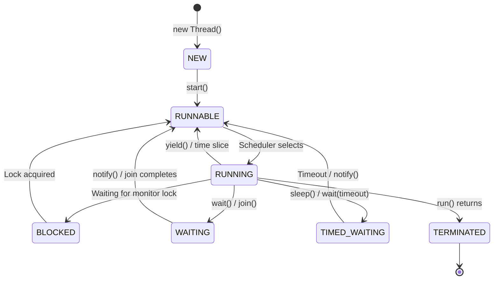
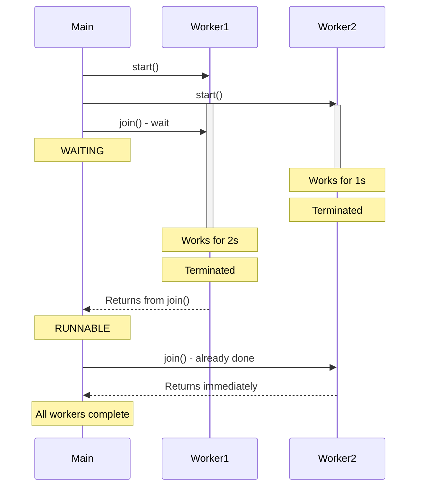

# 🧵 Multithreading Fundamentals in Java - Complete Guide

> Master concurrent programming from first principles to advanced patterns

## 📋 Table of Contents

1. [Introduction: Understanding Concurrency](#-introduction-understanding-concurrency)
2. [Computer Architecture Fundamentals](#-computer-architecture-fundamentals)
3. [Processes vs Threads](#-processes-vs-threads)
4. [Java Thread Basics](#-java-thread-basics)
5. [Thread Lifecycle Deep Dive](#-thread-lifecycle-deep-dive)
6. [Memory Model & Visibility](#-memory-model--visibility)
7. [Race Conditions Explained](#-race-conditions-explained)
8. [Synchronization Mechanisms](#-synchronization-mechanisms)
9. [Thread Coordination](#-thread-coordination)
10. [Advanced Synchronization](#-advanced-synchronization)
11. [Performance Considerations](#-performance-considerations)
12. [Common Pitfalls & Solutions](#-common-pitfalls--solutions)
13. [Production Best Practices](#-production-best-practices)
14. [Complete Real-World Examples](#-complete-real-world-examples)

---

## 🎯 Introduction: Understanding Concurrency

### What is Concurrency?

Before diving into threads, let's understand what we're trying to achieve.

**Concurrency** is the ability of a program to handle multiple tasks that make progress during overlapping time periods. It's NOT the same as parallelism.

```
Concurrency (Single Core):
━━━━━━━━━━━━━━━━━━━━━━━━━━━━━━━━━━━━━━━━━━━━━━━━━
Time →
Task A: ████░░░░████░░░░████░░░░████░░░░
Task B: ░░░░████░░░░████░░░░████░░░░████
        ↑ Context switching between tasks
        
Parallelism (Multi-Core):
━━━━━━━━━━━━━━━━━━━━━━━━━━━━━━━━━━━━━━━━━━━━━━━━━
Time →
Core 1: ████████████████████████████████
Core 2: ████████████████████████████████
        ↑ Both tasks run simultaneously
```

**Common Question:** Why do we need concurrency if we can't run things truly in parallel on a single core?

**Answer:** Concurrency improves:
- **Responsiveness**: UI remains responsive while background tasks execute
- **Resource Utilization**: CPU can work on Task B while Task A waits for I/O
- **Fairness**: Multiple users/requests get serviced without one monopolizing resources
- **Simplicity**: Some problems are naturally concurrent (web servers, games, simulations)

### Historical Context

**Why does multithreading exist?**

1. **1960s-1970s**: Single-threaded programs. CPUs got faster (Moore's Law).
2. **1980s-1990s**: Multi-tasking operating systems. Need to run multiple programs.
3. **2000s**: CPU speed plateau. Multi-core processors became standard.
4. **2010s-Present**: 4-16 cores common. Must write concurrent programs to utilize hardware.

```
Performance Trends:
━━━━━━━━━━━━━━━━━━━━━━━━━━━━━━━━━━━━━━━━━━━━━━━━━
1980    2000     2005     2010     2020
  │       │        │        │        │
  ├─ Single core gets faster ────►│
  │                                │
  └─────────────────────────── Multi-core era ────►
                                   │
                            Must use threads!
```

### Real-World Use Cases

**Where do you encounter multithreading daily?**

1. **Web Browsers**
   - Main thread: UI responsiveness
   - Worker threads: Download files, render pages
   - JavaScript engine: Parse and execute scripts
   - Network threads: Handle HTTP requests

2. **Video Games**
   - Rendering thread: Draw graphics at 60 FPS
   - Physics thread: Calculate collisions and movement
   - AI thread: Enemy behavior and pathfinding
   - Audio thread: Play sound effects and music

3. **Database Servers**
   - Connection threads: One per client connection
   - Query threads: Execute multiple queries concurrently
   - Checkpoint threads: Background data persistence
   - Vacuum threads: Cleanup and optimization

4. **Mobile Apps**
   - UI thread: Touch events and screen updates
   - Network threads: API calls and data sync
   - Background threads: Image processing, notifications

**Think of it like a restaurant:**
- One chef (single-threaded): Takes order → Cooks → Serves → Repeat
- Multiple chefs (multi-threaded): All work simultaneously, much faster service!

---

## 💻 Computer Architecture Fundamentals

### What is a Process?

A **process** is an instance of a running program with its own isolated memory space.

```
Process Memory Layout:
━━━━━━━━━━━━━━━━━━━━━━━━━━━━━━━━━━━━━━━━━━━━━━━━━
┌────────────────────────────────┐
│  Stack (Local variables)       │ ← High Memory Address
│  ↓ Grows downward              │
│  · · · · · · · · · · · · · ·  │
│  ↑ Grows upward                │
│  Heap (Dynamic allocation)     │
│  ────────────────────────────  │
│  Data Segment (Global vars)    │
│  ────────────────────────────  │
│  Text Segment (Program code)   │ ← Low Memory Address
└────────────────────────────────┘

Each process has:
✓ Own memory space (isolated)
✓ Own file descriptors
✓ Own security context
✓ At least one thread (main thread)
```

**Example: Running Two Java Programs**

```bash
# Terminal 1
java Program1

# Terminal 2
java Program2
```

These create TWO separate processes. They cannot directly access each other's memory. To communicate, they need IPC (Inter-Process Communication) like sockets, pipes, or shared memory.

### What is a Thread?

A **thread** is a lightweight execution unit within a process. Think of it as a "mini-process" that shares memory with other threads in the same process.

```
Process with Multiple Threads:
━━━━━━━━━━━━━━━━━━━━━━━━━━━━━━━━━━━━━━━━━━━━━━━━━
┌────────────────────────────────┐
│  Thread 1 Stack                │
├────────────────────────────────┤
│  Thread 2 Stack                │
├────────────────────────────────┤
│  Thread 3 Stack                │
├────────────────────────────────┤
│                                │
│  Shared Heap (All threads)     │ ← SHARED!
│                                │
├────────────────────────────────┤
│  Shared Data (All threads)     │ ← SHARED!
├────────────────────────────────┤
│  Shared Code (All threads)     │ ← SHARED!
└────────────────────────────────┘

Each thread has:
✓ Own stack (local variables)
✓ Own program counter (current instruction)
✓ Own register set
✗ Shares heap, data, and code with other threads
```

**Why Threads Are Lighter Than Processes**

| Aspect | Process | Thread |
|--------|---------|--------|
| **Creation Time** | 1000+ microseconds | 10-100 microseconds |
| **Memory** | Separate address space | Shares address space |
| **Context Switch** | Expensive (3-5 microseconds) | Cheap (0.1-1 microseconds) |
| **Communication** | IPC required | Shared memory (direct) |
| **Isolation** | Complete | None |

**Deep Dive: Why is context switching expensive?**

When the OS switches between processes:
1. Save current process state (registers, program counter, etc.)
2. Update memory management unit (MMU) with new page tables
3. **Flush TLB (Translation Lookaside Buffer)** ← Expensive!
4. Load new process state
5. Resume execution

With threads in same process:
1. Save current thread state
2. Load new thread state (No TLB flush needed!)
3. Resume execution

### CPU Cores and Scheduling

**How does the CPU actually execute threads?**

```
Single Core CPU (4 threads):
━━━━━━━━━━━━━━━━━━━━━━━━━━━━━━━━━━━━━━━━━━━━━━━━━
Time →
Core: T1 T2 T3 T4 T1 T2 T3 T4 T1 T2 T3 T4
      ↑  ↑  ↑  ↑
      Context switches (time-slicing)

Quad-Core CPU (4 threads):
━━━━━━━━━━━━━━━━━━━━━━━━━━━━━━━━━━━━━━━━━━━━━━━━━
Time →
Core 1: T1 T1 T1 T1 T1 T1 T1 T1 T1 T1 T1
Core 2: T2 T2 T2 T2 T2 T2 T2 T2 T2 T2 T2
Core 3: T3 T3 T3 T3 T3 T3 T3 T3 T3 T3 T3
Core 4: T4 T4 T4 T4 T4 T4 T4 T4 T4 T4 T4
        ↑
        True parallelism!
```

**The Scheduler** is the OS component that decides which thread runs on which core at what time.

**Common Scheduling Algorithms:**

1. **Round-Robin**: Each thread gets equal time slice (10-100ms typical)
2. **Priority-Based**: Higher priority threads run first
3. **Fair Scheduling**: Ensures all threads get CPU time proportional to priority
4. **Real-Time**: Guarantees response time for critical threads

```java
// Java lets you set thread priority
Thread t = new Thread(() -> {
    // work
});
t.setPriority(Thread.MAX_PRIORITY);  // 10 (highest)
// Default is Thread.NORM_PRIORITY (5)
// Lowest is Thread.MIN_PRIORITY (1)
```

**Important:** Java thread priorities are *hints* to the scheduler, not guarantees!

---

## 🔀 Processes vs Threads

### Detailed Comparison

Let's understand the differences with concrete examples.

**Example 1: Running Chrome Browser**

```
Chrome Process Architecture:
━━━━━━━━━━━━━━━━━━━━━━━━━━━━━━━━━━━━━━━━━━━━━━━━━
┌─────────────────────────────────────────────┐
│  Browser Process (Main)                     │
│  ┌───────┐  ┌───────┐  ┌───────┐          │
│  │Thread1│  │Thread2│  │Thread3│          │
│  │  UI   │  │Network│  │ Disk  │          │
│  └───────┘  └───────┘  └───────┘          │
└─────────────────────────────────────────────┘
         │              │              │
         ├──────────────┼──────────────┤
         ↓              ↓              ↓
┌─────────────┐  ┌─────────────┐  ┌─────────────┐
│  Renderer   │  │  Renderer   │  │  Renderer   │
│  Process    │  │  Process    │  │  Process    │
│  (Tab 1)    │  │  (Tab 2)    │  │  (Tab 3)    │
└─────────────┘  └─────────────┘  └─────────────┘

Why separate processes for tabs?
✓ Isolation: One tab crash doesn't kill browser
✓ Security: Sandboxing prevents malicious scripts
✗ Cost: More memory overhead
```

**Example 2: Java Application**

```java
public class ProcessVsThreadDemo {
    public static void main(String[] args) {
        // Single Process, Multiple Threads
        System.out.println("Process ID: " + 
            ProcessHandle.current().pid());
        
        // Create threads in SAME process
        Thread t1 = new Thread(() -> {
            System.out.println("Thread 1 - Process ID: " + 
                ProcessHandle.current().pid());
        });
        
        Thread t2 = new Thread(() -> {
            System.out.println("Thread 2 - Process ID: " + 
                ProcessHandle.current().pid());
        });
        
        t1.start();
        t2.start();
        
        // All threads have SAME process ID!
    }
}
```

**Output:**
```
Process ID: 12345
Thread 1 - Process ID: 12345
Thread 2 - Process ID: 12345
```

### When to Use Processes vs Threads

**Use Separate Processes When:**
- ✅ Need isolation (security, stability)
- ✅ Using different languages/runtimes
- ✅ Need to survive crashes independently
- ✅ Legacy system integration

**Use Threads When:**
- ✅ Need to share data frequently
- ✅ Low communication overhead required
- ✅ Within same application boundary
- ✅ Performance critical (less overhead)

**Real-World Example: Web Server**

```
Apache (Process-Based):
━━━━━━━━━━━━━━━━━━━━━━━━━━━━━━━━━━━━━━━━━━━━━━━━━
Each request → Separate process
Request 1 → Process 1
Request 2 → Process 2
Request 3 → Process 3

Pros: Isolation, one bad request doesn't kill server
Cons: High memory usage, slower startup

Nginx (Thread/Event-Based):
━━━━━━━━━━━━━━━━━━━━━━━━━━━━━━━━━━━━━━━━━━━━━━━━━
Multiple requests → Same process, different threads
Requests 1-1000 → Worker threads in process pool

Pros: Low memory, fast response
Cons: One thread crash can affect others
```

---

## ☕ Java Thread Basics

### What is a Thread in Java?

In Java, every application starts with at least one thread: the **main thread**.

```java
public class ThreadBasics {
    public static void main(String[] args) {
        // This code runs in the "main" thread
        System.out.println("Current thread: " + 
            Thread.currentThread().getName());
        
        // Output: Current thread: main
    }
}
```

**Every Java thread is associated with:**
1. A `Thread` object (Java object)
2. A native OS thread (actual execution unit)
3. A thread stack (memory for local variables)

```
Java Thread Object ←→ JVM Native Thread ←→ OS Thread
     (Java)              (JVM Level)       (Operating System)
```

### Creating Threads: Three Methods

#### Method 1: Extending Thread Class

```java
/**
 * Method 1: Extend Thread class
 * 
 * Pros:
 * - Simple and direct
 * - Can override other Thread methods if needed
 * 
 * Cons:
 * - Can't extend another class (single inheritance)
 * - Tight coupling to Thread class
 */
class MyThread extends Thread {
    private String threadName;
    private int iterations;
    
    public MyThread(String name, int iterations) {
        super(name);  // Set thread name
        this.threadName = name;
        this.iterations = iterations;
    }
    
    @Override
    public void run() {
        // This is the thread's entry point
        System.out.println(threadName + " started");
        
        for (int i = 1; i <= iterations; i++) {
            System.out.println(threadName + ": iteration " + i);
            
            try {
                // Sleep to simulate work
                Thread.sleep(500);
            } catch (InterruptedException e) {
                System.out.println(threadName + " interrupted");
                // Restore interrupt status
                Thread.currentThread().interrupt();
                return;
            }
        }
        
        System.out.println(threadName + " completed");
    }
}

// Usage
public class Method1Demo {
    public static void main(String[] args) {
        MyThread t1 = new MyThread("Worker-1", 3);
        MyThread t2 = new MyThread("Worker-2", 3);
        
        t1.start();  // ⚠️ Calls run() in NEW thread
        t2.start();
        
        System.out.println("Main thread continues...");
    }
}
```

**Output (order may vary):**
```
Main thread continues...
Worker-1 started
Worker-2 started
Worker-1: iteration 1
Worker-2: iteration 1
Worker-1: iteration 2
Worker-2: iteration 2
Worker-1: iteration 3
Worker-2: iteration 3
Worker-1 completed
Worker-2 completed
```

**Deep Dive: What happens when you call `start()`?**

```java
t1.start();  // What really happens?
```

1. JVM creates a new OS thread
2. JVM allocates a thread stack (default ~1MB)
3. Thread is placed in RUNNABLE state
4. Scheduler eventually runs the thread
5. The `run()` method executes in the NEW thread
6. When `run()` returns, thread terminates

```
┌─────────────────────────────────────────────┐
│  Main Thread                                │
│  ├─ Create MyThread object                 │
│  ├─ Call t1.start()                        │
│  │   ├─ JVM: Create native thread          │
│  │   └─ Schedule thread for execution      │
│  └─ Continue to next line                  │
└─────────────────────────────────────────────┘
                  │
                  ↓ (New thread created)
┌─────────────────────────────────────────────┐
│  Worker-1 Thread                            │
│  └─ Execute run() method                    │
│      ├─ System.out.println(...)            │
│      ├─ Loop                                │
│      └─ return (thread terminates)          │
└─────────────────────────────────────────────┘
```

**Common Mistake:**

```java
t1.run();  // ❌ WRONG! Runs in CURRENT thread, no concurrency!
t1.start(); // ✅ CORRECT! Creates NEW thread
```

#### Method 2: Implementing Runnable Interface

```java
/**
 * Method 2: Implement Runnable interface
 * 
 * Pros:
 * - Better OOP design (composition over inheritance)
 * - Can extend another class
 * - Runnable can be reused with different threads
 * - Preferred in modern Java
 * 
 * Cons:
 * - Slightly more verbose
 * - No direct access to Thread methods
 */
class MyRunnable implements Runnable {
    private String taskName;
    private int iterations;
    
    public MyRunnable(String name, int iterations) {
        this.taskName = name;
        this.iterations = iterations;
    }
    
    @Override
    public void run() {
        String threadName = Thread.currentThread().getName();
        System.out.println(taskName + " started on " + threadName);
        
        for (int i = 1; i <= iterations; i++) {
            System.out.println(taskName + ": iteration " + i);
            
            try {
                Thread.sleep(500);
            } catch (InterruptedException e) {
                System.out.println(taskName + " interrupted");
                Thread.currentThread().interrupt();
                return;
            }
        }
        
        System.out.println(taskName + " completed");
    }
}

// Usage
public class Method2Demo {
    public static void main(String[] args) {
        // Create Runnable tasks
        Runnable task1 = new MyRunnable("Task-1", 3);
        Runnable task2 = new MyRunnable("Task-2", 3);
        
        // Wrap in Thread objects
        Thread t1 = new Thread(task1, "Worker-Thread-1");
        Thread t2 = new Thread(task2, "Worker-Thread-2");
        
        t1.start();
        t2.start();
        
        // Can reuse the same Runnable!
        Thread t3 = new Thread(task1, "Worker-Thread-3");
        t3.start();
    }
}
```

**Why Runnable is Better:**

```java
// Scenario: Want to extend a class AND run in thread
class DatabaseConnection {
    protected Connection conn;
    // ... connection logic
}

// ✅ Can do this with Runnable
class DatabaseWorker extends DatabaseConnection implements Runnable {
    public void run() {
        // Use inherited connection
        // Perform database operations
    }
}

// ❌ Can't do this (single inheritance)
class DatabaseWorker extends DatabaseConnection extends Thread {
    // Compilation error!
}
```

#### Method 3: Lambda Expressions (Java 8+)

```java
/**
 * Method 3: Lambda expressions
 * 
 * Pros:
 * - Extremely concise
 * - Modern Java style
 * - Perfect for simple tasks
 * - No need for separate class
 * 
 * Cons:
 * - Not suitable for complex logic
 * - Harder to debug (no class name)
 * - Can't add instance variables easily
 */
public class Method3Demo {
    public static void main(String[] args) {
        
        // Simple lambda
        Thread t1 = new Thread(() -> {
            System.out.println("Lambda thread running");
        });
        t1.start();
        
        // Lambda with multiple statements
        Thread t2 = new Thread(() -> {
            for (int i = 1; i <= 3; i++) {
                System.out.println("Iteration " + i);
                try {
                    Thread.sleep(500);
                } catch (InterruptedException e) {
                    Thread.currentThread().interrupt();
                }
            }
        });
        t2.start();
        
        // Lambda with name
        Thread t3 = new Thread(() -> {
            System.out.println("Named lambda thread");
        }, "MyLambdaThread");
        t3.start();
        
        // Can even use method references
        Thread t4 = new Thread(Method3Demo::performWork, "MethodRefThread");
        t4.start();
    }
    
    private static void performWork() {
        System.out.println("Method reference thread running");
    }
}
```

**Comparison Summary:**

```java
// Extending Thread
class MyThread extends Thread {
    public void run() { /* work */ }
}
new MyThread().start();

// Implementing Runnable
class MyRunnable implements Runnable {
    public void run() { /* work */ }
}
new Thread(new MyRunnable()).start();

// Lambda (Runnable is functional interface)
new Thread(() -> { /* work */ }).start();
```

### Thread Properties

Every thread has properties you can query and set:

```java
public class ThreadProperties {
    public static void main(String[] args) {
        Thread currentThread = Thread.currentThread();
        
        // Thread ID (unique, assigned by JVM)
        long id = currentThread.getId();
        System.out.println("Thread ID: " + id);
        
        // Thread Name (helpful for debugging)
        String name = currentThread.getName();
        System.out.println("Thread Name: " + name);
        
        // Thread Priority (1-10, default 5)
        int priority = currentThread.getPriority();
        System.out.println("Priority: " + priority);
        
        // Thread State
        Thread.State state = currentThread.getState();
        System.out.println("State: " + state);
        
        // Is Alive?
        boolean alive = currentThread.isAlive();
        System.out.println("Alive: " + alive);
        
        // Is Daemon?
        boolean daemon = currentThread.isDaemon();
        System.out.println("Daemon: " + daemon);
        
        // Thread Group
        ThreadGroup group = currentThread.getThreadGroup();
        System.out.println("Thread Group: " + group.getName());
    }
}
```

**Output:**
```
Thread ID: 1
Thread Name: main
Priority: 5
State: RUNNABLE
Alive: true
Daemon: false
Thread Group: main
```

**Deep Dive: Daemon Threads**

```java
/**
 * Daemon threads are background threads that don't prevent
 * JVM from exiting when all user threads finish.
 */
public class DaemonThreadDemo {
    public static void main(String[] args) throws InterruptedException {
        
        // Regular (user) thread
        Thread userThread = new Thread(() -> {
            for (int i = 0; i < 3; i++) {
                System.out.println("User thread working: " + i);
                try { Thread.sleep(1000); } 
                catch (InterruptedException e) { }
            }
            System.out.println("User thread finished");
        });
        
        // Daemon thread
        Thread daemonThread = new Thread(() -> {
            while (true) {  // Infinite loop!
                System.out.println("Daemon thread monitoring...");
                try { Thread.sleep(500); } 
                catch (InterruptedException e) { }
            }
        });
        daemonThread.setDaemon(true);  // ⚠️ Must set before start()
        
        userThread.start();
        daemonThread.start();
        
        // Main thread waits for user thread
        userThread.join();
        
        System.out.println("Main thread exiting");
        // Daemon thread will be KILLED when main and userThread finish
        // JVM doesn't wait for daemon threads
    }
}
```

**Output:**
```
Daemon thread monitoring...
User thread working: 0
Daemon thread monitoring...
User thread working: 1
Daemon thread monitoring...
Daemon thread monitoring...
User thread working: 2
Daemon thread monitoring...
User thread finished
Main thread exiting
```

**Use Cases for Daemon Threads:**
- Garbage collection
- Monitoring threads
- Background cleanup
- Logging threads
- JVM housekeeping

---

## 🔄 Thread Lifecycle Deep Dive

### The Six Thread States

Java threads can be in one of six states defined in [`Thread.State`](https://docs.oracle.com/javase/8/docs/api/java/lang/Thread.State.html):



### 1. NEW State

```java
Thread t = new Thread(() -> {
    System.out.println("Running");
});

System.out.println(t.getState());  // NEW
// Thread object created but not started
// No OS resources allocated yet
```

**What's Happening:**
```
┌─────────────────────────────────┐
│  Java Heap                      │
│  ┌──────────────────────────┐  │
│  │  Thread Object           │  │
│  │  - name: "Thread-0"      │  │
│  │  - priority: 5           │  │
│  │  - runnable: Lambda      │  │
│  └──────────────────────────┘  │
└─────────────────────────────────┘

✗ No OS thread created yet
✗ No stack allocated
✗ Cannot execute
```

### 2. RUNNABLE State

```java
t.start();  // Transitions to RUNNABLE

System.out.println(t.getState());  // RUNNABLE
```

**What's Happening:**
```
┌─────────────────────────────────┐
│  JVM                            │
│  ┌──────────────────────────┐  │
│  │  Thread Object           │  │
│  └──────────────────────────┘  │
│            ↓                    │
│  ┌──────────────────────────┐  │
│  │  Native Thread           │  │
│  └──────────────────────────┘  │
└─────────────────────────────────┘
            ↓
┌─────────────────────────────────┐
│  Operating System               │
│  ┌──────────────────────────┐  │
│  │  OS Thread               │  │
│  │  - Stack: 1MB            │  │
│  │  - Thread ID: 54321      │  │
│  └──────────────────────────┘  │
│            ↓                    │
│  ┌──────────────────────────┐  │
│  │  Scheduler Queue         │  │
│  │  [T1, T2, T3, T4, ...]   │  │
│  └──────────────────────────┘  │
└─────────────────────────────────┘

✓ OS thread created
✓ Stack allocated
✓ Ready to execute
⏳ Waiting for CPU time
```

**Important:** RUNNABLE doesn't mean currently running! It means ready to run OR currently running.

```java
public class RunnableStateDemo {
    public static void main(String[] args) throws InterruptedException {
        Thread worker = new Thread(() -> {
            long sum = 0;
            // CPU-intensive work
            for (long i = 0; i < 1_000_000_000L; i++) {
                sum += i;
            }
            System.out.println("Sum: " + sum);
        });
        
        worker.start();
        
        // Check state while working
        Thread.sleep(10);  // Give it time to start
        System.out.println("State: " + worker.getState());  // RUNNABLE
        
        // Thread is RUNNABLE whether:
        // - Currently executing on CPU
        // - Waiting for its turn in scheduler queue
    }
}
```

### 3. BLOCKED State

A thread enters BLOCKED when trying to acquire

 a synchronized lock held by another thread.

```java
public class BlockedStateDemo {
    private static final Object lock = new Object();
    
    public static void main(String[] args) throws InterruptedException {
        Thread t1 = new Thread(() -> {
            synchronized (lock) {
                System.out.println("T1: Acquired lock, sleeping...");
                try {
                    Thread.sleep(5000);  // Hold lock for 5 seconds
                } catch (InterruptedException e) {
                    Thread.currentThread().interrupt();
                }
                System.out.println("T1: Releasing lock");
            }
        });
        
        Thread t2 = new Thread(() -> {
            System.out.println("T2: Attempting to acquire lock...");
            synchronized (lock) {  // Will BLOCK here!
                System.out.println("T2: Acquired lock");
            }
        });
        
        t1.start();
        Thread.sleep(100);  // Let t1 acquire lock first
        t2.start();
        
        Thread.sleep(500);  // Give t2 time to block
        System.out.println("T2 State: " + t2.getState());  // BLOCKED
        
        t1.join();
        t2.join();
    }
}
```

**Output:**
```
T1: Acquired lock, sleeping...
T2: Attempting to acquire lock...
T2 State: BLOCKED
T1: Releasing lock
T2: Acquired lock
```

**What's Happening:**
```
Time  Thread-1              Monitor Lock     Thread-2
────────────────────────────────────────────────────────
t0    synchronized(lock)    🔒 T1           
      └─ Acquired              │              
                               │              
t1                            🔒 T1           synchronized(lock)
                               │              └─ Try acquire
                               │                 ⏳ BLOCKED
t2                            🔒 T1              ⏳ BLOCKED
                               │              
t3                            🔒 T1              ⏳ BLOCKED
                               │              
t4    Release lock            🔓                ⏳ BLOCKED
                               │              
t5                            🔒 T2           Acquired!
                               │              └─ RUNNABLE
```

**Deep Dive: Monitor Locks**

Every Java object has an intrinsic lock (monitor lock):

```
Object Memory Layout:
━━━━━━━━━━━━━━━━━━━━━━━━━━━━━━━━━━━━━━━━━━━━━━━━━
┌────────────────────────────────────────────┐
│  Object Header                             │
│  ├─ Mark Word (contains lock info)         │
│  │  ├─ Lock state (unlocked/locked/etc)    │
│  │  ├─ Thread ID (if locked)               │
│  │  └─ Hash code                           │
│  └─ Class pointer                          │
├────────────────────────────────────────────┤
│  Object Fields                             │
└────────────────────────────────────────────┘

When synchronized(obj):
1. Check if monitor is available
2. If YES: Acquire it, proceed
3. If NO: Enter BLOCKED state, join wait queue
```

### 4. WAITING State

Thread waits indefinitely until another thread performs a specific action.

```java
public class WaitingStateDemo {
    private static final Object lock = new Object();
    
    public static void main(String[] args) throws InterruptedException {
        Thread waiter = new Thread(() -> {
            synchronized (lock) {
                try {
                    System.out.println("Waiter: Waiting...");
                    lock.wait();  // Releases lock and WAITS
                    System.out.println("Waiter: Resumed!");
                } catch (InterruptedException e) {
                    Thread.currentThread().interrupt();
                }
            }
        });
        
        Thread notifier = new Thread(() -> {
            try {
                Thread.sleep(2000);  // Wait before notifying
            } catch (InterruptedException e) {
                Thread.currentThread().interrupt();
            }
            
            synchronized (lock) {
                System.out.println("Notifier: Notifying...");
                lock.notify();  // Wake up waiter
            }
        });
        
        waiter.start();
        Thread.sleep(500);  // Let waiter enter wait
        System.out.println("Waiter State: " + waiter.getState());  // WAITING
        
        notifier.start();
        
        waiter.join();
        notifier.join();
    }
}
```

**Methods That Cause WAITING:**
- [`Object.wait()`](https://docs.oracle.com/javase/8/docs/api/java/lang/Object.html#wait--) - Wait for notification
- [`Thread.join()`](https://docs.oracle.com/javase/8/docs/api/java/lang/Thread.html#join--) - Wait for thread to die
- [`LockSupport.park()`](https://docs.oracle.com/javase/8/docs/api/java/util/concurrent/locks/LockSupport.html#park--) - Wait for unpark

### 5. TIMED_WAITING State

Like WAITING, but with a timeout.

```java
public class TimedWaitingDemo {
    public static void main(String[] args) throws InterruptedException {
        Thread sleeper = new Thread(() -> {
            try {
                Thread.sleep(5000);  // Sleep for 5 seconds
            } catch (InterruptedException e) {
                Thread.currentThread().interrupt();
            }
        });
        
        sleeper.start();
        Thread.sleep(100);  // Let it start sleeping
        
        System.out.println("State: " + sleeper.getState());  // TIMED_WAITING
        
        sleeper.join();
    }
}
```

**Methods That Cause TIMED_WAITING:**
- [`Thread.sleep(millis)`](https://docs.oracle.com/javase/8/docs/api/java/lang/Thread.html#sleep-long-)
- [`Object.wait(timeout)`](https://docs.oracle.com/javase/8/docs/api/java/lang/Object.html#wait-long-)
- [`Thread.join(timeout)`](https://docs.oracle.com/javase/8/docs/api/java/lang/Thread.html#join-long-)
- [`LockSupport.parkNanos()`](https://docs.oracle.com/javase/8/docs/api/java/util/concurrent/locks/LockSupport.html#parkNanos-long-)
- [`LockSupport.parkUntil()`](https://docs.oracle.com/javase/8/docs/api/java/util/concurrent/locks/LockSupport.html#parkUntil-long-)

### 6. TERMINATED State

Thread has completed execution.

```java
Thread t = new Thread(() -> {
    System.out.println("Working...");
});

t.start();
t.join();  // Wait for completion

System.out.println(t.getState());  // TERMINATED
t.start();  // ❌ IllegalThreadStateException! Can't restart
```

**What's Happening:**
```
┌─────────────────────────────────┐
│  Thread Stack                   │
│  (Deallocated)                  │
└─────────────────────────────────┘
            ↓
┌─────────────────────────────────┐
│  Thread Object                  │
│  - state: TERMINATED            │
│  - Stack: null                  │
│  - Result: Available            │
└─────────────────────────────────┘

✓ run() method completed
✓ Stack deallocated
✓ OS thread terminated
✗ Cannot restart (one-time use)
```

### Complete Lifecycle Example

```java
public class CompleteLifecycleDemo {
    private static final Object lock = new Object();
    
    public static void main(String[] args) throws InterruptedException {
        Thread worker = new Thread(() -> {
            System.out.println("1. Inside run() - RUNNABLE");
            
            // Demonstrate TIMED_WAITING
            try {
                System.out.println("2. About to sleep - TIMED_WAITING");
                Thread.sleep(1000);
                System.out.println("3. Woke up from sleep - RUNNABLE");
            } catch (InterruptedException e) {
                Thread.currentThread().interrupt();
            }
            
            // Demonstrate BLOCKED
            System.out.println("4. Trying to acquire lock - might BLOCK");
            synchronized (lock) {
                System.out.println("5. Acquired lock - RUNNABLE");
            }
            
            System.out.println("6. About to finish - will be TERMINATED");
        }, "WorkerThread");
        
        // NEW
        System.out.println("State: " + worker.getState());
        
        // Acquire lock in main thread to make worker block
        synchronized (lock) {
            worker.start();  // RUNNABLE
            
            Thread.sleep(1500);  // Worker will try to acquire lock
            System.out.println("State while sleeping: " + worker.getState());  // BLOCKED
        }  // Release lock
        
        Thread.sleep(500);
        worker.join();
        
        // TERMINATED
        System.out.println("Final state: " + worker.getState());
    }
}
```

**Thread State Transitions Chart:**

```
┌──────────────────────────────────────────────────────────────┐
│  Thread Lifecycle Complete                                   │
├──────────────────────────────────────────────────────────────┤
│                                                              │
│  NEW ──start()──> RUNNABLE ◄──┐                            │
│                     │  ↑       │                            │
│                     │  │       │ notify()/                  │
│          sleep()/   │  │       │ timeout/                   │
│          wait()     │  │       │ interrupt                  │
│                     ↓  │       │                            │
│              TIMED_WAITING ────┘                            │
│                     │  ↑                                     │
│          wait()     │  │ notify()/                          │
│          join()     │  │ join complete                      │
│                     ↓  │                                     │
│              WAITING ───┘                                    │
│                     │  ↑                                     │
│  synchronized       │  │ lock acquired                      │
│  block attempt      │  │                                     │
│                     ↓  │                                     │
│              BLOCKED ───┘                                    │
│                                                              │
│              RUNNABLE ──run() returns──> TERMINATED          │
│                                                              │
└──────────────────────────────────────────────────────────────┘
```

---

## 🧠 Memory Model & Visibility

### The Java Memory Model (JMM)

**Why do we need a memory model?**

Modern CPUs have complex memory hierarchies:

```
CPU Memory Hierarchy:
━━━━━━━━━━━━━━━━━━━━━━━━━━━━━━━━━━━━━━━━━━━━━━━━━
              Speed    Size        Shared?
              ─────────────────────────────
CPU Register   0.3ns    ~100 bytes   No (per core)
     ↕
L1 Cache      ~1ns      32-64 KB     No (per core)
     ↕
L2 Cache      ~4ns      256-512 KB   No (per core)
     ↕
L3 Cache      ~15ns     2-32 MB      Yes (shared)
     ↕
Main RAM      ~100ns    4-64 GB      Yes (shared)
     ↕
Disk          ~10ms     100GB-10TB   Yes (shared)
```

**The Problem:**

```java
class VisibilityProblem {
    private int value = 0;  // Shared variable
    
    // Thread 1
    public void writer() {
        value = 42;  // Write
    }
    
    // Thread 2
    public void reader() {
        int result = value;  // Read - might see 0!
    }
}
```

**What Can Go Wrong:**

```
Time  Thread 1 (Core 1)      Main RAM    Thread 2 (Core 2)
────────────────────────────────────────────────────────────
t0    value = 0 (L1 cache)    value=0    value = 0 (L1 cache)
                                
t1    Write: value = 42        value=0    
      (only in L1 cache!)       ↑         
                                │         
t2    value = 42 (L1)          value=0    Read: value = 0
                                           (reads from L1!)
                                           
t3    Flush to RAM →           value=42   Still sees 0!
                                           (stale cache)
                                           
❌ Thread 2 doesn't see the update!
```

### Happens-Before Relationship

The JMM defines "happens-before" rules that guarantee visibility:

**Rule 1: Program Order**
```java
int x = 0;
int y = 0;

// Thread behavior
x = 1;  // (1)
y = 2;  // (2)

// Guarantee: (1) happens-before (2) in this thread
```

**Rule 2: Monitor Lock**
```java
synchronized (lock) {
    // (1) Actions inside synchronized block
}
// (2) Actions after unlock

// Guarantee: (1) happens-before (2)
```

**Rule 3: Volatile Variable**
```java
volatile boolean flag = false;

// Thread 1
data = 42;     // (1)
flag = true;   // (2) - volatile write

// Thread 2
if (flag) {    // (3) - volatile read
    useData();  // (4) - will see data=42
}

// Guarantee: (2) happens-before (3), therefore (1) happens-before (4)
```

**Rule 4: Thread Start**
```java
int x = 0;

x = 42;        // (1)
thread.start(); // (2)

// Inside thread
useX();         // (3) - will see x=42

// Guarantee: (1) happens-before (3)
```

**Rule 5: Thread Join**
```java
Thread t = new Thread(() -> {
    x = 42;  // (1)
});

t.start();
t.join();   // (2)
useX();     // (3) - will see x=42

// Guarantee: (1) happens-before (3)
```

### The volatile Keyword

[`volatile`](https://docs.oracle.com/javase/specs/jls/se8/html/jls-8.html#jls-8.3.1.4) provides visibility guarantees without full synchronization.

```java
/**
 * Volatile Demo
 * 
 * What volatile does:
 * 1. Reads/writes go directly to main memory (no caching)
 * 2. Prevents instruction reordering around volatile access
 * 3. Establishes happens-before relationships
 * 
 * What volatile does NOT do:
 * 1. Does NOT provide atomicity for compound operations
 * 2. Does NOT lock
 */
public class VolatileDemo {
    // ❌ Without volatile - may not terminate!
    private boolean stopRequested = false;
    
    public void withoutVolatile() {
        Thread worker = new Thread(() -> {
            int count = 0;
            while (!stopRequested) {  // May cache this value!
                count++;
            }
            System.out.println("Stopped after " + count + " iterations");
        });
        
        worker.start();
        
        try { Thread.sleep(1000); } 
        catch (InterruptedException e) { }
        
        stopRequested = true;  // Worker may never see this!
        System.out.println("Stop requested");
    }
    
    // ✅ With volatile - guaranteed to terminate
    private volatile boolean stopRequestedVolatile = false;
    
    public void withVolatile() {
        Thread worker = new Thread(() -> {
            int count = 0;
            while (!stopRequestedVolatile) {  // Always reads from main memory
                count++;
            }
            System.out.println("Stopped after " + count + " iterations");
        });
        
        worker.start();
        
        try { Thread.sleep(1000); } 
        catch (InterruptedException e) { }
        
        stopRequestedVolatile = true;  // Worker will see this!
        System.out.println("Stop requested");
    }
}
```

**Why volatile Alone Isn't Enough:**

```java
public class VolatileNotAtomic {
    private volatile int counter = 0;
    
    public void increment() {
        counter++;  // ❌ NOT ATOMIC!
        
        // Actually three operations:
        // 1. Read counter
        // 2. Add 1
        // 3. Write counter
        //
        // Another thread can interleave!
    }
    
    // ✅ Need synchronization for atomicity
    public synchronized void safeIncrement() {
        counter++;
    }
}
```

**volatile vs synchronized:**

| Feature | volatile | synchronized |
|---------|----------|--------------|
| **Visibility** | ✅ Guaranteed | ✅ Guaranteed |
| **Atomicity** | ❌ No | ✅ Yes |
| **Locking** | ❌ No | ✅ Yes |
| **Performance** | ✅ Faster | ❌ Slower |
| **Use Case** | Flags, status | Compound operations |

---

## ⚡ Race Conditions Explained

### What is a Race Condition?

A **race condition** occurs when:
1. Multiple threads access shared data
2. At least one thread modifies the data
3. The threads don't synchronize their access
4. The outcome depends on thread timing (non-deterministic)

### Classic Example: Counter

```java
public class RaceConditionDemo {
    private int counter = 0;
    
    public void increment() {
        counter++;  // ⚠️ NOT ATOMIC!
    }
    
    public int getCounter() {
        return counter;
    }
    
    public static void main(String[] args) throws InterruptedException {
        RaceConditionDemo demo = new RaceConditionDemo();
        int numThreads = 10;
        int incrementsPerThread = 1000;
        
        Thread[] threads = new Thread[numThreads];
        
        for (int i = 0; i < numThreads; i++) {
            threads[i] = new Thread(() -> {
                for (int j = 0; j < incrementsPerThread; j++) {
                    demo.increment();
                }
            });
            threads[i].start();
        }
        
        // Wait for all threads
        for (Thread t : threads) {
            t.join();
        }
        
        System.out.println("Final counter: " + demo.getCounter());
        System.out.println("Expected: " + (numThreads * incrementsPerThread));
    }
}
```

**Typical Output:**
```
Final counter: 9247
Expected: 10000

❌ Lost updates due to race condition!
```

### Why `counter++` Fails

Let's break down what happens at the bytecode level:

```java
counter++;  // One line of Java

// Compiles to multiple bytecode instructions:
getfield counter    // 1. Load value from memory
iconst_1           // 2. Load constant 1
iadd               // 3. Add
putfield counter   // 4. Store back to memory
```

**Race Condition Timeline:**

```
Time  Thread 1              Memory       Thread 2
        counter++             counter      counter++
────────────────────────────────────────────────────────
t0    getfield (read 0)       0          
t1    iconst_1                0          
t2    iadd (result=1)         0          getfield (read 0)
t3                            0          iconst_1
t4                            0          iadd (result=1)
t5    putfield (write 1)      1          
t6                            1          putfield (write 1)
t7                            1 ← Should be 2!

❌ Lost Update! Both read 0, both write 1, final value is 1 (not 2)
```

### More Examples of Race Conditions

#### Example 1: Check-Then-Act

```java
public class CheckThenAct {
    private Map<String, Integer> map = new HashMap<>();
    
    // ❌ WRONG: Race condition
    public void putIfAbsent(String key, Integer value) {
        if (!map.containsKey(key)) {  // Check
            // Another thread might insert here!
            map.put(key, value);       // Act
        }
    }
    
    // ✅ CORRECT: Atomic operation
    public synchronized void putIfAbsentSafe(String key, Integer value) {
        if (!map.containsKey(key)) {
            map.put(key, value);
        }
    }
    
    // ✅ BETTER: Use atomic method
    public void putIfAbsentBest(String key, Integer value) {
        map.putIfAbsent(key, value);  // Atomic in ConcurrentHashMap
    }
}
```

**Timeline of Failure:**

```
Time  Thread 1                          Thread 2
────────────────────────────────────────────────────────
t0    containsKey("key1") → false      
t1                                      containsKey("key1") → false
t2    put("key1", 100)                 
t3                                      put("key1", 200)
t4    Map: {"key1": 200}  ← Thread 2 overwrote Thread 1!

❌ Lost update!
```

#### Example 2: Read-Modify-Write

```java
public class ReadModifyWrite {
    private int balance = 1000;
    
    // ❌ WRONG: Race condition
    public void withdraw(int amount) {
        if (balance >= amount) {  // Read
            // Another thread might withdraw here!
            balance -= amount;     // Modify-Write
        }
    }
    
    // ✅ CORRECT: Synchronized
    public synchronized void withdrawSafe(int amount) {
        if (balance >= amount) {
            balance -= amount;
        }
    }
}
```

**Timeline of Failure (Overdraft):**

```
Time  Thread 1              Balance      Thread 2
      withdraw(800)                      withdraw(800)
────────────────────────────────────────────────────────
t0    if (1000 >= 800)       1000       
      → true                  ↓         
t1                           1000       if (1000 >= 800)
                              ↓         → true
t2    balance -= 800          200       
t3                           200        balance -= 800
t4                           -600 ← Overdraft!

❌ Both threads saw balance=1000 and approved withdrawal!
```

#### Example 3: Compound Actions on Shared State

```java
public class CompoundActions {
    private List<Integer> list = new ArrayList<>();
    
    // ❌ WRONG: Race condition
    public void addIfSize(int value, int size) {
        if (list.size() == size) {  // Check
            // Size might change here!
            list.add(value);         // Act
        }
    }
    
    // ✅ CORRECT: Atomic
    public synchronized void addIfSizeSafe(int value, int size) {
        if (list.size() == size) {
            list.add(value);
        }
    }
}
```

### Detecting Race Conditions

**Signs of Race Conditions:**

1. **Heisenbug**: Bug disappears when you add logging/debugging
   ```java
   // Bug exists
   counter++;
   
   // Bug "disappears" with logging (timing changed!)
   System.out.println("About to increment");
   counter++;
   ```

2. **Non-deterministic Results**: Different results on each run
   ```bash
   Run 1: Final count: 9847
   Run 2: Final count: 9923
   Run 3: Final count: 9801
   ```

3. **Fails Under Load**: Works fine with few threads, fails with many

**Testing for Race Conditions:**

```java
public class RaceConditionTest {
    @Test
    public void testThreadSafety() throws InterruptedException {
        final int THREADS = 100;
        final int ITERATIONS = 1000;
        final Counter counter = new Counter();
        
        ExecutorService executor = Executors.newFixedThreadPool(THREADS);
        CountDownLatch latch = new CountDownLatch(THREADS);
        
        // All threads start at once
        for (int i = 0; i < THREADS; i++) {
            executor.submit(() -> {
                for (int j = 0; j < ITERATIONS; j++) {
                    counter.increment();
                }
                latch.countDown();
            });
        }
        
        latch.await();
        executor.shutdown();
        
        int expected = THREADS * ITERATIONS;
        int actual = counter.get();
        
        assertEquals(expected, actual);  // Will fail if race condition!
    }
}
```

---

## 🔒 Synchronization Mechanisms

### The synchronized Keyword

[`synchronized`](https://docs.oracle.com/javase/specs/jls/se8/html/jls-17.html#jls-17.1) provides mutual exclusion using intrinsic locks (monitors).

#### Synchronized Methods

```java
public class SynchronizedMethods {
    private int count = 0;
    
    // ✅ Instance method - locks on 'this'
    public synchronized void increment() {
        count++;
    }
    
    // ✅ Static method - locks on Class object
    public static synchronized void staticMethod() {
        // Work
    }
    
    // Equivalent to:
    public void incrementExplicit() {
        synchronized (this) {
            count++;
        }
    }
    
    public static void staticMethodExplicit() {
        synchronized (SynchronizedMethods.class) {
            // Work
        }
    }
}
```

**How It Works:**

```
Thread Execution Timeline:
━━━━━━━━━━━━━━━━━━━━━━━━━━━━━━━━━━━━━━━━━━━━━━━━━

Thread 1: Call increment()
          ↓
          Acquire lock on 'this' object
          ↓
          🔒 LOCKED - Execute method body
          ↓
          Release lock
          ↓
          Return

Thread 2: Call increment() while T1 is executing
          ↓
          Try to acquire lock on 'this'
          ↓
          ⏳ BLOCKED - Wait for T1 to release lock
          ↓
          Lock released by T1
          ↓
          🔒 LOCKED - Execute method body
          ↓
          Release lock
```

#### Synchronized Blocks

```java
public class SynchronizedBlocks {
    private final Object lock1 = new Object();
    private final Object lock2 = new Object();
    private int resource1 = 0;
    private int resource2 = 0;
    
    public void updateResource1() {
        // Code here runs concurrently
        doSomeWork();
        
        // Only this section is synchronized
        synchronized (lock1) {
            resource1++;
        }
        
        // Code here runs concurrently
        doMoreWork();
    }
    
    public void updateResource2() {
        synchronized (lock2) {  // Different lock!
            resource2++;
        }
        // Can run concurrently with updateResource1()
    }
    
    private void doSomeWork() { /* ... */ }
    private void doMoreWork() { /* ... */ }
}
```

**Benefits of Synchronized Blocks:**

1. **Smaller Critical Section**: Only lock what needs protection
   ```java
   // ❌ BAD: Large critical section
   public synchronized void processData() {
       readFromDatabase();      // Slow I/O
       updateMemory();           // Fast, needs protection
       writeToDatabase();        // Slow I/O
   }
   
   // ✅ GOOD: Minimal critical section
   public void processData() {
       Data data = readFromDatabase();  // Not synchronized
       
       synchronized (this) {
           updateMemory();                // Only this protected
       }
       
       writeToDatabase(data);            // Not synchronized
   }
   ```

2. **Multiple Locks**: Fine-grained locking for better concurrency
   ```java
   public class BankAccount {
       private final Object balanceLock = new Object();
       private final Object transactionLock = new Object();
       private int balance = 0;
       private List<Transaction> transactions = new ArrayList<>();
       
       public void deposit(int amount) {
           synchronized (balanceLock) {
               balance += amount;
           }
       }
       
       public void logTransaction(Transaction tx) {
           synchronized (transactionLock) {
               transactions.add(tx);
           }
           // Can run concurrently with deposit()!
       }
   }
   ```

### Monitor Pattern

The **monitor pattern** encapsulates synchronization within the object itself.

```java
/**
 * Monitor Pattern: All public methods are synchronized
 * Ensures complete thread safety of the object
 */
public class ThreadSafeCounter {
    private int count = 0;
    
    // All methods synchronized - object is a monitor
    public synchronized void increment() {
        count++;
    }
    
    public synchronized void decrement() {
        count--;
    }
    
    public synchronized int getCount() {
        return count;
    }
    
    public synchronized void reset() {
        count = 0;
    }
}

// Usage - completely thread-safe
ThreadSafeCounter counter = new ThreadSafeCounter();
// Multiple threads can call methods safely
```

**Deep Dive: What is a Monitor?**

A monitor is a synchronization construct that ensures:
1. **Mutual Exclusion**: Only one thread executes at a time
2. **Cooperation**: Threads can wait/signal each other

```
Monitor = Object + Lock + Condition Variables
━━━━━━━━━━━━━━━━━━━━━━━━━━━━━━━━━━━━━━━━━━━━━━━━━

┌────────────────────────────────────────────┐
│  Monitor Object                            │
│                                            │
│  ┌──────────────────────────────────────┐ │
│  │  Intrinsic Lock (Mutex)              │ │
│  │  - Owner thread (if locked)          │ │
│  │  - Entry set (waiting threads)       │ │
│  └──────────────────────────────────────┘ │
│                                            │
│  ┌──────────────────────────────────────┐ │
│  │  Wait Set                            │ │
│  │  - Threads waiting on condition      │ │
│  └──────────────────────────────────────┘ │
│                                            │
│  ┌──────────────────────────────────────┐ │
│  │  Protected Data                      │ │
│  │  - Fields, state                     │ │


│  └──────────────────────────────────────┘ │
└────────────────────────────────────────────┘
```

### Reentrancy

Java's intrinsic locks are **reentrant**: a thread can acquire the same lock multiple times.

```java
public class ReentrancyDemo {
    public synchronized void outer() {
        System.out.println("Outer method");
        inner();  // ✅ Can call synchronized method from within synchronized method
    }
    
    public synchronized void inner() {
        System.out.println("Inner method");
        // Same thread, same lock - no deadlock!
    }
    
    public static void main(String[] args) {
        ReentrancyDemo demo = new ReentrancyDemo();
        demo.outer();  // Works fine!
    }
}
```

**How Reentrancy Works:**

```
Monitor Lock State:
━━━━━━━━━━━━━━━━━━━━━━━━━━━━━━━━━━━━━━━━━━━━━━━━━
Lock: {
  ownerThread: Thread-1
  count: 0  // Acquisition count
}

Thread-1 calls outer():
  synchronized (this) {
    Lock count: 0 → 1  ✅ Acquired
    
    Thread-1 calls inner():
      synchronized (this) {
        Lock count: 1 → 2  ✅ Re-acquired (same thread!)
        
        Exit inner()
        Lock count: 2 → 1  // Decremented
      }
    
    Exit outer()
    Lock count: 1 → 0  // Released
  }
}
```

**Without Reentrancy (hypothetical):**

```java
// If locks weren't reentrant:
synchronized (this) {      // Thread acquires lock
    synchronized (this) {  // ❌ DEADLOCK! Same thread blocks on itself
        // Never reached
    }
}
```

### Lock Granularity

Choosing the right lock granularity affects performance and correctness.

```java
public class LockGranularity {
    
    // ❌ Coarse-grained: One lock for everything
    public class CoarseGrained {
        private final Object lock = new Object();
        private int balance = 0;
        private List<String> log = new ArrayList<>();
        
        public void deposit(int amount) {
            synchronized (lock) {  // Locks everything
                balance += amount;
                log.add("Deposit: " + amount);
            }
        }
        
        public void withdraw(int amount) {
            synchronized (lock) {  // Locks everything
                balance -= amount;
                log.add("Withdraw: " + amount);
            }
        }
        
        // Deposit and withdraw can't run concurrently!
    }
    
    // ✅ Fine-grained: Separate locks
    public class FineGrained {
        private final Object balanceLock = new Object();
        private final Object logLock = new Object();
        private int balance = 0;
        private List<String> log = new ArrayList<>();
        
        public void deposit(int amount) {
            synchronized (balanceLock) {
                balance += amount;
            }
            synchronized (logLock) {
                log.add("Deposit: " + amount);
            }
        }
        
        public void withdraw(int amount) {
            synchronized (balanceLock) {
                balance -= amount;
            }
            synchronized (logLock) {
                log.add("Withdraw: " + amount);
            }
        }
        
        // Better concurrency!
        // One thread can modify balance while another writes to log
    }
}
```

**Trade-offs:**

| Approach | Pros | Cons |
|----------|------|------|
| **Coarse-grained** | Simple, less error-prone | Poor concurrency |
| **Fine-grained** | Better concurrency | Complex, deadlock risk |

---

## 🤝 Thread Coordination

Threads often need to coordinate their work. Java provides several mechanisms.

### The join() Method

[`join()`](https://docs.oracle.com/javase/8/docs/api/java/lang/Thread.html#join--) makes one thread wait for another to complete.

```java
public class JoinExample {
    public static void main(String[] args) throws InterruptedException {
        System.out.println("Main: Starting worker threads");
        
        Thread worker1 = new Thread(() -> {
            System.out.println("Worker1: Started");
            try {
                Thread.sleep(2000);
            } catch (InterruptedException e) {
                Thread.currentThread().interrupt();
            }
            System.out.println("Worker1: Finished");
        });
        
        Thread worker2 = new Thread(() -> {
            System.out.println("Worker2: Started");
            try {
                Thread.sleep(1000);
            } catch (InterruptedException e) {
                Thread.currentThread().interrupt();
            }
            System.out.println("Worker2: Finished");
        });
        
        worker1.start();
        worker2.start();
        
        System.out.println("Main: Waiting for workers...");
        
        // Wait for both workers to complete
        worker1.join();  // Blocks until worker1 finishes
        System.out.println("Main: Worker1 done");
        
        worker2.join();  // Blocks until worker2 finishes
        System.out.println("Main: Worker2 done");
        
        System.out.println("Main: All workers complete!");
    }
}
```

**Output:**
```
Main: Starting worker threads
Main: Waiting for workers...
Worker1: Started
Worker2: Started
Worker2: Finished
Worker1: Finished
Main: Worker1 done
Main: Worker2 done
Main: All workers complete!
```

**Visual Timeline:**



**join() with Timeout:**

```java
public class JoinWithTimeout {
    public static void main(String[] args) throws InterruptedException {
        Thread longTask = new Thread(() -> {
            try {
                Thread.sleep(10000);  // 10 seconds
            } catch (InterruptedException e) {
                System.out.println("Task interrupted!");
                Thread.currentThread().interrupt();
            }
        });
        
        longTask.start();
        
        // Wait maximum 2 seconds
        longTask.join(2000);
        
        if (longTask.isAlive()) {
            System.out.println("Task still running after timeout!");
            longTask.interrupt();  // Request cancellation
        } else {
            System.out.println("Task completed on time");
        }
    }
}
```

### wait() and notify()

[`wait()`](https://docs.oracle.com/javase/8/docs/api/java/lang/Object.html#wait--) and [`notify()`](https://docs.oracle.com/javase/8/docs/api/java/lang/Object.html#notify--) enable threads to communicate about shared state.

**Important Rules:**
1. Must be called from synchronized context
2. wait() releases the lock and waits
3. notify() wakes one waiting thread
4. notifyAll() wakes all waiting threads

```java
/**
 * Producer-Consumer Pattern using wait/notify
 */
public class ProducerConsumerExample {
    private final Queue<Integer> queue = new LinkedList<>();
    private final int MAX_SIZE = 5;
    
    // Producer adds items
    public synchronized void produce(int item) throws InterruptedException {
        // Wait while queue is full
        while (queue.size() == MAX_SIZE) {
            System.out.println("Producer waiting - queue full");
            wait();  // Releases lock and waits
        }
        
        queue.add(item);
        System.out.println("Produced: " + item + " (size=" + queue.size() + ")");
        
        notifyAll();  // Wake up consumers
    }
    
    // Consumer removes items
    public synchronized int consume() throws InterruptedException {
        // Wait while queue is empty
        while (queue.isEmpty()) {
            System.out.println("Consumer waiting - queue empty");
            wait();  // Releases lock and waits
        }
        
        int item = queue.remove();
        System.out.println("Consumed: " + item + " (size=" + queue.size() + ")");
        
        notifyAll();  // Wake up producers
        return item;
    }
    
    public static void main(String[] args) {
        ProducerConsumerExample example = new ProducerConsumerExample();
        
        // Producer thread
        Thread producer = new Thread(() -> {
            try {
                for (int i = 1; i <= 10; i++) {
                    example.produce(i);
                    Thread.sleep(100);
                }
            } catch (InterruptedException e) {
                Thread.currentThread().interrupt();
            }
        });
        
        // Consumer thread
        Thread consumer = new Thread(() -> {
            try {
                for (int i = 1; i <= 10; i++) {
                    example.consume();
                    Thread.sleep(200);  // Slower than producer
                }
            } catch (InterruptedException e) {
                Thread.currentThread().interrupt();
            }
        });
        
        producer.start();
        consumer.start();
    }
}
```

**How wait() Works:**

```
Thread calls wait():
━━━━━━━━━━━━━━━━━━━━━━━━━━━━━━━━━━━━━━━━━━━━━━━━━
1. Check: Thread must hold the lock (IllegalMonitorStateException if not)
2. Release: Lock is released
3. Wait: Thread moves to wait set
4. Sleep: Thread sleeps until notified or interrupted

Thread is notified:
━━━━━━━━━━━━━━━━━━━━━━━━━━━━━━━━━━━━━━━━━━━━━━━━━
1. Wake: Thread wakes up
2. Compete: Thread competes to re-acquire lock
3. Re-check: Condition should be checked again (spurious wakeups!)
4. Continue: Execution continues after wait()
```

**Why Use while, Not if?**

```java
// ❌ WRONG: Using if
public synchronized void consume() throws InterruptedException {
    if (queue.isEmpty()) {
        wait();
    }
    // Spurious wakeup might cause exception here!
    return queue.remove();
}

// ✅ CORRECT: Using while
public synchronized void consume() throws InterruptedException {
    while (queue.isEmpty()) {
        wait();
    }
    // Re-checks condition after wakeup
    return queue.remove();
}
```

**Spurious wakeups** can occur due to:
- OS-level interrupts
- Signal handling
- Implementation details

Always use `while` to re-check the condition!

### notify() vs notifyAll()

```java
public class NotifyVsNotifyAll {
    private boolean condition = false;
    
    // Using notify() - wakes ONE thread
    public synchronized void waitForConditionNotify() throws InterruptedException {
        while (!condition) {
            wait();
        }
        // Work
    }
    
    public synchronized void signalConditionNotify() {
        condition = true;
        notify();  // ⚠️ Only wakes ONE thread
    }
    
    // Using notifyAll() - wakes ALL threads
    public synchronized void waitForConditionNotifyAll() throws InterruptedException {
        while (!condition) {
            wait();
        }
        // Work
    }
    
    public synchronized void signalConditionNotifyAll() {
        condition = true;
        notifyAll();  // ✅ Wakes ALL waiting threads
    }
}
```

**When to use which:**

| Method | Use When |
|--------|----------|
| **notify()** | Only one thread can proceed, optimization possible |
| **notifyAll()** | Multiple threads might proceed, safer default |

**Example showing the difference:**

```java
public class NotifyDemo {
    public static void main(String[] args) throws InterruptedException {
        Object lock = new Object();
        boolean[] ready = {false};
        
        // Start 3 waiting threads
        for (int i = 1; i <= 3; i++) {
            final int id = i;
            new Thread(() -> {
                synchronized (lock) {
                    try {
                        System.out.println("Thread " + id + " waiting");
                        lock.wait();
                        System.out.println("Thread " + id + " woke up!");
                    } catch (InterruptedException e) {
                        Thread.currentThread().interrupt();
                    }
                }
            }).start();
        }
        
        Thread.sleep(1000);
        
        // Using notify() - only ONE thread wakes
        System.out.println("\nCalling notify()...");
        synchronized (lock) {
            ready[0] = true;
            lock.notify();  // Only 1 thread wakes
        }
        
        Thread.sleep(1000);
        
        // Using notifyAll() - ALL remaining threads wake
        System.out.println("\nCalling notifyAll()...");
        synchronized (lock) {
            lock.notifyAll();  // All remaining threads wake
        }
    }
}
```

**Output:**
```
Thread 1 waiting
Thread 2 waiting
Thread 3 waiting

Calling notify()...
Thread 1 woke up!

Calling notifyAll()...
Thread 2 woke up!
Thread 3 woke up!
```

---

## 🎓 Advanced Synchronization

### CountDownLatch

[`CountDownLatch`](https://docs.oracle.com/javase/8/docs/api/java/util/concurrent/CountDownLatch.html) allows threads to wait until a set of operations completes.

```java
import java.util.concurrent.CountDownLatch;

public class CountDownLatchDemo {
    public static void main(String[] args) throws InterruptedException {
        int numWorkers = 3;
        CountDownLatch startSignal = new CountDownLatch(1);  // Start gate
        CountDownLatch doneSignal = new CountDownLatch(numWorkers);  // Completion gate
        
        // Create worker threads
        for (int i = 1; i <= numWorkers; i++) {
            final int workerId = i;
            new Thread(() -> {
                try {
                    System.out.println("Worker " + workerId + " ready");
                    
                    // Wait for start signal
                    startSignal.await();
                    
                    // Do work
                    System.out.println("Worker " + workerId + " working...");
                    Thread.sleep(1000 + workerId * 500);
                    System.out.println("Worker " + workerId + " done");
                    
                    // Signal completion
                    doneSignal.countDown();
                    
                } catch (InterruptedException e) {
                    Thread.currentThread().interrupt();
                }
            }).start();
        }
        
        Thread.sleep(1000);
        System.out.println("\nMain: Starting all workers...");
        startSignal.countDown();  // Release all workers
        
        System.out.println("Main: Waiting for workers to complete...");
        doneSignal.await();  // Wait for all workers
        
        System.out.println("Main: All workers completed!");
    }
}
```

**Visualization:**

```
Initial State:
━━━━━━━━━━━━━━━━━━━━━━━━━━━━━━━━━━━━━━━━━━━━━━━━━
startSignal: count = 1
doneSignal: count = 3

Workers created:
━━━━━━━━━━━━━━━━━━━━━━━━━━━━━━━━━━━━━━━━━━━━━━━━━
Worker 1: await(startSignal)  ⏳
Worker 2: await(startSignal)  ⏳
Worker 3: await(startSignal)  ⏳

Main calls startSignal.countDown():
━━━━━━━━━━━━━━━━━━━━━━━━━━━━━━━━━━━━━━━━━━━━━━━━━
startSignal: count = 0  ✅ Released!
Worker 1: RUNNING
Worker 2: RUNNING
Worker 3: RUNNING

Workers complete and call doneSignal.countDown():
━━━━━━━━━━━━━━━━━━━━━━━━━━━━━━━━━━━━━━━━━━━━━━━━━
Worker 1 done: count = 2
Worker 2 done: count = 1
Worker 3 done: count = 0  ✅ Released!

Main: Continues execution
```

### CyclicBarrier

[`CyclicBarrier`](https://docs.oracle.com/javase/8/docs/api/java/util/concurrent/CyclicBarrier.html) allows threads to wait for each other at a synchronization point.

```java
import java.util.concurrent.CyclicBarrier;
import java.util.concurrent.BrokenBarrierException;

public class CyclicBarrierDemo {
    public static void main(String[] args) {
        int numThreads = 3;
        
        // Barrier with action to run when all threads reach it
        CyclicBarrier barrier = new CyclicBarrier(numThreads, () -> {
            System.out.println("=== All threads reached barrier! ===\n");
        });
        
        for (int i = 1; i <= numThreads; i++) {
            final int threadId = i;
            new Thread(() -> {
                try {
                    // Phase 1
                    System.out.println("Thread " + threadId + ": Phase 1");
                    Thread.sleep(threadId * 1000);
                    System.out.println("Thread " + threadId + ": Waiting at barrier");
                    barrier.await();  // Wait for others
                    
                    // Phase 2
                    System.out.println("Thread " + threadId + ": Phase 2");
                    Thread.sleep(threadId * 1000);
                    System.out.println("Thread " + threadId + ": Waiting at barrier");
                    barrier.await();  // Wait for others (reusable!)
                    
                    // Phase 3
                    System.out.println("Thread " + threadId + ": Phase 3 - Complete!");
                    
                } catch (InterruptedException | BrokenBarrierException e) {
                    Thread.currentThread().interrupt();
                }
            }).start();
        }
    }
}
```

**CountDownLatch vs CyclicBarrier:**

| Feature | CountDownLatch | CyclicBarrier |
|---------|----------------|---------------|
| **Reusable** | ❌ No | ✅ Yes |
| **Participants** | Can vary | Fixed |
| **Action** | None | Optional barrier action |
| **Use Case** | One-time event | Iterative synchronization |

### Semaphore

[`Semaphore`](https://docs.oracle.com/javase/8/docs/api/java/util/concurrent/Semaphore.html) limits the number of threads accessing a resource.

```java
import java.util.concurrent.Semaphore;

public class SemaphoreDemo {
    // Connection pool with 3 connections
    private static final Semaphore semaphore = new Semaphore(3);
    
    public static void main(String[] args) {
        // 10 threads competing for 3 permits
        for (int i = 1; i <= 10; i++) {
            final int taskId = i;
            new Thread(() -> {
                try {
                    System.out.println("Task " + taskId + ": Requesting connection...");
                    
                    semaphore.acquire();  // Acquire permit (blocks if none available)
                    System.out.println("Task " + taskId + ": Got connection!");
                    
                    // Use connection
                    Thread.sleep(2000);
                    
                    System.out.println("Task " + taskId + ": Releasing connection");
                    semaphore.release();  // Release permit
                    
                } catch (InterruptedException e) {
                    Thread.currentThread().interrupt();
                }
            }).start();
        }
    }
}
```

**How Semaphore Works:**

```
Semaphore with 3 permits:
━━━━━━━━━━━━━━━━━━━━━━━━━━━━━━━━━━━━━━━━━━━━━━━━━
Available permits: [P1, P2, P3]

Task 1: acquire() → Takes P1  ✅ Available: [P2, P3]
Task 2: acquire() → Takes P2  ✅ Available: [P3]
Task 3: acquire() → Takes P3  ✅ Available: []
Task 4: acquire() → ⏳ BLOCKED (no permits)
Task 5: acquire() → ⏳ BLOCKED (no permits)

Task 1: release() → Returns P1  Available: [P1]
Task 4: acquire() → Takes P1  ✅ Available: []
Task 5: acquire() → ⏳ BLOCKED (no permits)

...and so on
```

**Real-World Use Cases:**
- Database connection pools
- Thread pools
- Rate limiting
- Resource quotas

---

## ⚡ Performance Considerations

### Amdahl's Law

**Amdahl's Law** predicts the theoretical speedup from parallelization:

```
Speedup = 1 / ((1 - P) + P/N)

Where:
P = Fraction of program that can be parallelized
N = Number of processors
```

**Example:**

```java
/**
 * Program with 75% parallelizable code
 */
public class AmdahlsLawDemo {
    public static void main(String[] args) {
        double P = 0.75;  // 75% parallelizable
        
        System.out.println("Processors\tSpeedup\t\tEfficiency");
        System.out.println("─────────────────────────────────────────");
        
        for (int N = 1; N <= 16; N *= 2) {
            double speedup = 1.0 / ((1 - P) + P / N);
            double efficiency = speedup / N * 100;
            System.out.printf("%d\t\t%.2fx\t\t%.1f%%\n", N, speedup, efficiency);
        }
    }
}
```

**Output:**
```
Processors	Speedup		Efficiency
─────────────────────────────────────────
1		1.00x		100.0%
2		1.60x		80.0%
4		2.29x		57.1%
8		3.05x		38.1%
16		3.56x		22.2%

❗ Diminishing returns! Serial portion limits speedup.
```

**Visualization:**

```
Maximum Speedup by Parallel Fraction:
━━━━━━━━━━━━━━━━━━━━━━━━━━━━━━━━━━━━━━━━━━━━━━━━━
P=50%: Max speedup = 2x   (even with ∞ cores)
P=75%: Max speedup = 4x   (even with ∞ cores)
P=90%: Max speedup = 10x  (even with ∞ cores)
P=95%: Max speedup = 20x  (even with ∞ cores)

The serial portion always limits maximum speedup!
```

### Context Switching Overhead

```java
/**
 * Demonstrates context switching overhead
 */
public class ContextSwitchingDemo {
    private static final int ITERATIONS = 100_000_000;
    
    public static void main(String[] args) throws InterruptedException {
        // Single threaded
        long start = System.nanoTime();
        long sum = 0;
        for (int i = 0; i < ITERATIONS; i++) {
            sum += i;
        }
        long end = System.nanoTime();
        System.out.println("Single thread: " + (end - start) / 1_000_000 + "ms");
        System.out.println("Result: " + sum);
        
        // Two threads (each doing half the work)
        start = System.nanoTime();
        Thread t1 = new Thread(() -> {
            long sum1 = 0;
            for (int i = 0; i < ITERATIONS / 2; i++) {
                sum1 += i;
            }
        });
        
        Thread t2 = new Thread(() -> {
            long sum2 = 0;
            for (int i = ITERATIONS / 2; i < ITERATIONS; i++) {
                sum2 += i;
            }
        });
        
        t1.start();
        t2.start();
        t1.join();
        t2.join();
        end = System.nanoTime();
        System.out.println("Two threads: " + (end - start) / 1_000_000 + "ms");
        
        // Many threads (excessive context switching)
        int numThreads = 100;
        start = System.nanoTime();
        Thread[] threads = new Thread[numThreads];
        for (int i = 0; i < numThreads; i++) {
            final int threadId = i;
            threads[i] = new Thread(() -> {
                long sumN = 0;
                int start_i = threadId * (ITERATIONS / numThreads);
                int end_i = (threadId + 1) * (ITERATIONS / numThreads);
                for (int j = start_i; j < end_i; j++) {
                    sumN += j;
                }
            });
            threads[i].start();
        }
        for (Thread t : threads) {
            t.join();
        }
        end = System.nanoTime();
        System.out.println("100 threads: " + (end - start) / 1_000_000 + "ms");
    }
}
```

**Typical Output (on dual-core CPU):**
```
Single thread: 245ms
Two threads: 150ms      ✅ Improvement
100 threads: 320ms      ❌ Overhead from context switching!
```

### Lock Contention

```java
/**
 * Demonstrates lock contention impact
 */
public class LockContentionDemo {
    
    // High contention - single lock
    static class HighContention {
        private long counter = 0;
        
        public synchronized void increment() {
            counter++;
        }
    }
    
    // Low contention - striped locking
    static class LowContention {
        private static final int NUM_LOCKS = 16;
        private final Object[] locks = new Object[NUM_LOCKS];
        private final long[] counters = new long[NUM_LOCKS];
        
        public LowContention() {
            for (int i = 0; i < NUM_LOCKS; i++) {
                locks[i] = new Object();
            }
        }
        
        public void increment() {
            int index = (int) (Thread.currentThread().getId() % NUM_LOCKS);
            synchronized (locks[index]) {
                counters[index]++;
            }
        }
        
        public long getTotal() {
            long total = 0;
            for (long count : counters) {
                total += count;
            }
            return total;
        }
    }
    
    public static void main(String[] args) throws InterruptedException {
        int numThreads = 10;
        int iterations = 1_000_000;
        
        // Test high contention
        HighContention high = new HighContention();
        long start = System.nanoTime();
        Thread[] threads1 = new Thread[numThreads];
        for (int i = 0; i < numThreads; i++) {
            threads1[i] = new Thread(() -> {
                for (int j = 0; j < iterations; j++) {
                    high.increment();
                }
            });
            threads1[i].start();
        }
        for (Thread t : threads1) {
            t.join();
        }
        long end = System.nanoTime();
        System.out.println("High contention: " + (end - start) / 1_000_000 + "ms");
        
        // Test low contention
        LowContention low = new LowContention();
        start = System.nanoTime();
        Thread[] threads2 = new Thread[numThreads];
        for (int i = 0; i < numThreads; i++) {
            threads2[i] = new Thread(() -> {
                for (int j = 0; j < iterations; j++) {
                    low.increment();
                }
            });
            threads2[i].start();
        }
        for (Thread t : threads2) {
            t.join();
        }
        end = System.nanoTime();
        System.out.println("Low contention:  " + (end - start) / 1_000_000 + "ms");
    }
}
```

**Typical Output:**
```
High contention: 1250ms
Low contention:  320ms

✅ 4x faster with striped locking!
```

### Thread-Local Variables

[`ThreadLocal`](https://docs.oracle.com/javase/8/docs/api/java/lang/ThreadLocal.html) provides thread-confined variables - no synchronization needed!

```java
public class ThreadLocalDemo {
    // Each thread gets its own copy
    private static ThreadLocal<Integer> threadId = ThreadLocal.withInitial(() -> 0);
    private static ThreadLocal<SimpleDateFormat> dateFormat = 
        ThreadLocal.withInitial(() -> new SimpleDateFormat("yyyy-MM-dd"));
    
    public static void main(String[] args) {
        for (int i = 1; i <= 5; i++) {
            final int id = i;
            new Thread(() -> {
                // Set thread-local value
                threadId.set(id);
                
                // Each thread sees its own value
                System.out.println("Thread " + threadId.get() + " started");
                
                // Use thread-local DateFormat (not thread-safe normally!)
                String date = dateFormat.get().format(new Date());
                System.out.println("Thread " + threadId.get() + ": " + date);
                
                // Cleanup
                threadId.remove();
                dateFormat.remove();
                
            }, "Worker-" + i).start();
        }
    }
}
```

**How ThreadLocal Works:**

```
Memory Layout:
━━━━━━━━━━━━━━━━━━━━━━━━━━━━━


┌──────────────────────────────┐
│  Thread 1                    │
│  ThreadLocalMap:             │
│    threadId → 1              │
│    dateFormat → SDF_1        │
└──────────────────────────────┘

┌──────────────────────────────┐
│  Thread 2                    │
│  ThreadLocalMap:             │
│    threadId → 2              │
│    dateFormat → SDF_2        │
└──────────────────────────────┘

Each thread has its own map!
No sharing = No synchronization needed
```

**Common Use Cases:**
- Database connections per thread
- User context/session data
- Request-scoped data in web applications
- Per-thread caches

**Warning: Memory Leaks!**

```java
// ⚠️ ThreadLocal can cause memory leaks in thread pools
public class ThreadLocalLeak {
    private static ThreadLocal<byte[]> leak = new ThreadLocal<>();
    
    public void process() {
        // Store 1MB per thread
        leak.set(new byte[1024 * 1024]);
        
        // ❌ If you don't clean up and threads are reused (pool):
        // Memory keeps accumulating!
    }
    
    public void processCorrectly() {
        try {
            leak.set(new byte[1024 * 1024]);
            // Use it
        } finally {
            leak.remove();  // ✅ Always cleanup!
        }
    }
}
```

---

## ⚠️ Common Pitfalls & Solutions

### Pitfall 1: Calling run() Instead of start()

```java
public class Pitfall1 {
    public static void main(String[] args) {
        Thread t = new Thread(() -> {
            System.out.println("Running in: " + 
                Thread.currentThread().getName());
        });
        
        // ❌ WRONG: Calls run() in CURRENT thread
        t.run();
        // Output: Running in: main
        
        // ✅ CORRECT: Creates NEW thread
        t.start();
        // Output: Running in: Thread-0
    }
}
```

### Pitfall 2: Shared Mutable State Without Synchronization

```java
public class Pitfall2 {
    private List<String> list = new ArrayList<>();  // NOT thread-safe!
    
    // ❌ WRONG: Race condition
    public void add(String item) {
        list.add(item);  // Multiple threads → corruption
    }
    
    // ✅ CORRECT: Synchronized
    public synchronized void addSafe(String item) {
        list.add(item);
    }
    
    // ✅ BETTER: Thread-safe collection
    private List<String> list2 = new CopyOnWriteArrayList<>();
    public void addBest(String item) {
        list2.add(item);  // Thread-safe
    }
}
```

### Pitfall 3: Double-Checked Locking (Broken)

```java
public class Pitfall3 {
    private static Singleton instance;
    
    // ❌ WRONG: Broken double-checked locking
    public static Singleton getBroken() {
        if (instance == null) {
            synchronized (Singleton.class) {
                if (instance == null) {
                    instance = new Singleton();  // Can be partially constructed!
                }
            }
        }
        return instance;
    }
    
    // ✅ CORRECT: Use volatile
    private static volatile Singleton instanceVolatile;
    
    public static Singleton getCorrect() {
        if (instanceVolatile == null) {
            synchronized (Singleton.class) {
                if (instanceVolatile == null) {
                    instanceVolatile = new Singleton();
                }
            }
        }
        return instanceVolatile;
    }
    
    // ✅ BETTER: Initialization-on-demand holder idiom
    private static class Holder {
        static final Singleton INSTANCE = new Singleton();
    }
    
    public static Singleton getBest() {
        return Holder.INSTANCE;  // Thread-safe, lazy, no sync overhead
    }
}
```

**Why the broken version fails:**

```
CPU can reorder instructions:
━━━━━━━━━━━━━━━━━━━━━━━━━━━━━━━━━━━━━━━━━━━━━━━━━
Normal order:
1. Allocate memory
2. Initialize object
3. Assign to instance

Reordered (allowed without volatile):
1. Allocate memory
2. Assign to instance  ← instance is not null!
3. Initialize object   ← But not initialized yet!

Thread 2 sees instance != null and uses it → CRASH!
```

### Pitfall 4: Ignoring InterruptedException

```java
public class Pitfall4 {
    // ❌ WRONG: Swallows exception
    public void wrong() {
        while (true) {
            try {
                Thread.sleep(1000);
            } catch (InterruptedException e) {
                // Ignored! Thread won't respond to interruption
            }
        }
    }
    
    // ✅ CORRECT: Restore interrupt status
    public void correct() {
        while (true) {
            try {
                Thread.sleep(1000);
            } catch (InterruptedException e) {
                Thread.currentThread().interrupt();  // Restore flag
                break;  // Exit loop
            }
        }
    }
    
    // ✅ BETTER: Propagate exception
    public void best() throws InterruptedException {
        while (true) {
            Thread.sleep(1000);  // Let caller handle
        }
    }
}
```

### Pitfall 5: Holding Lock While Calling External Method

```java
public class Pitfall5 {
    private final List<Listener> listeners = new ArrayList<>();
    private String state = "";
    
    // ❌ WRONG: Calls external code under lock
    public synchronized void setState(String newState) {
        state = newState;
        // Holding lock while calling listener!
        for (Listener l : listeners) {
            l.onStateChange(state);  // What if this takes long?
                                      // What if it acquires another lock?
        }
    }
    
    // ✅ CORRECT: Copy data, release lock, then notify
    public void setStateSafe(String newState) {
        List<Listener> copy;
        synchronized (this) {
            state = newState;
            copy = new ArrayList<>(listeners);
        }  // Lock released
        
        // Call listeners outside lock
        for (Listener l : copy) {
            l.onStateChange(newState);
        }
    }
}
```

### Pitfall 6: Using String as Lock

```java
public class Pitfall6 {
    // ❌ WRONG: String literals are interned
    private static final String LOCK = "lock";
    
    public void method1() {
        synchronized (LOCK) {  // ⚠️ Same object as method2's lock!
            // Work
        }
    }
    
    public void method2() {
        synchronized ("lock") {  // Same interned string!
            // Work
        }
    }
    
    // ✅ CORRECT: Use dedicated lock object
    private static final Object LOCK_OBJ = new Object();
    
    public void method3() {
        synchronized (LOCK_OBJ) {
            // Work
        }
    }
}
```

---

## ✅ Production Best Practices

### 1. Name Your Threads

```java
// ❌ Default names are useless
Thread t1 = new Thread(task);
t1.start();
// Logs: "Thread-7 encountered error" - which one is that?

// ✅ Meaningful names
Thread t2 = new Thread(task, "DatabaseWorker-ConnectionPool-3");
t2.start();
// Logs: "DatabaseWorker-ConnectionPool-3 encountered error" - clear!
```

### 2. Use Thread Pools (ExecutorService)

```java
// ❌ Creating threads manually
for (int i = 0; i < 1000; i++) {
    new Thread(() -> {
        processRequest();
    }).start();
}
// Creates 1000 threads! Overhead is enormous!

// ✅ Use thread pool
ExecutorService executor = Executors.newFixedThreadPool(10);
for (int i = 0; i < 1000; i++) {
    executor.submit(() -> {
        processRequest();
    });
}
executor.shutdown();
// Reuses 10 threads for 1000 tasks!
```

### 3. Handle Uncaught Exceptions

```java
public class UncaughtExceptionHandlerDemo {
    public static void main(String[] args) {
        // Set default handler for all threads
        Thread.setDefaultUncaughtExceptionHandler((thread, throwable) -> {
            System.err.println("Uncaught exception in " + thread.getName());
            throwable.printStackTrace();
            // Log to monitoring system
            // Send alert
        });
        
        // Or set per-thread
        Thread t = new Thread(() -> {
            throw new RuntimeException("Oops!");
        });
        
        t.setUncaughtExceptionHandler((thread, throwable) -> {
            System.err.println("Thread " + thread.getName() + " failed");
            throwable.printStackTrace();
        });
        
        t.start();
    }
}
```

### 4. Use Immutable Objects

```java
// ✅ Immutable objects are inherently thread-safe
public final class ImmutablePoint {
    private final int x;
    private final int y;
    
    public ImmutablePoint(int x, int y) {
        this.x = x;
        this.y = y;
    }
    
    public int getX() { return x; }
    public int getY() { return y; }
    
    // No setters!
    // Multiple threads can share safely without synchronization
}
```

### 5. Document Thread Safety

```java
/**
 * Thread-safe counter using synchronization.
 * All methods are synchronized on the instance lock.
 * 
 * @ThreadSafe
 */
public class DocumentedCounter {
    @GuardedBy("this")
    private int count = 0;
    
    public synchronized void increment() {
        count++;
    }
    
    public synchronized int get() {
        return count;
    }
}

/**
 * NOT thread-safe. Callers must synchronize externally.
 * 
 * @NotThreadSafe
 */
public class UnsafeList {
    private List<String> list = new ArrayList<>();
    
    public void add(String item) {
        list.add(item);
    }
}
```

### 6. Minimize Lock Scope

```java
public class LockScope {
    private final Object lock = new Object();
    private final List<Data> data = new ArrayList<>();
    
    // ❌ BAD: Holds lock during I/O
    public synchronized void process() {
        Data d = fetchFromDatabase();  // Slow I/O!
        data.add(d);
        saveToDatabase(d);  // Slow I/O!
    }
    
    // ✅ GOOD: Only locks critical section
    public void processBetter() {
        Data d = fetchFromDatabase();  // No lock
        
        synchronized (lock) {
            data.add(d);  // Quick operation
        }
        
        saveToDatabase(d);  // No lock
    }
}
```

### 7. Avoid Premature Optimization

```java
// ❌ DON'T start with complex lock-free algorithms
public class PrematureOptimization {
    private AtomicReference<Node> head = new AtomicReference<>();
    
    public void add(int value) {
        // Complex lock-free algorithm
        // Hard to understand, maintain, debug
    }
}

// ✅ START with simple synchronization
public class SimpleApproach {
    private Node head;
    
    public synchronized void add(int value) {
        // Simple, correct, easy to understand
        // Optimize later if proven bottleneck
    }
}
```

**Optimization Guidelines:**
1. **Measure first**: Profile to find actual bottlenecks
2. **Simple first**: Start with synchronized
3. **Optimize hot paths**: Only optimize what matters
4. **Verify**: Test that optimization actually helps

---

## 🎯 Complete Real-World Examples

### Example 1: Thread-Safe Bank Account

```java
/**
 * Complete thread-safe bank account implementation
 * Demonstrates proper synchronization and validation
 */
public class BankAccount {
    private final long accountId;
    private final Object lock = new Object();
    
    @GuardedBy("lock")
    private int balance;
    
    @GuardedBy("lock")
    private final List<Transaction> transactions = new ArrayList<>();
    
    public BankAccount(long accountId, int initialBalance) {
        this.accountId = accountId;
        this.balance = initialBalance;
        transactions.add(new Transaction("Initial deposit", initialBalance));
    }
    
    /**
     * Deposits money into account
     * @param amount amount to deposit (must be positive)
     * @return true if successful
     */
    public boolean deposit(int amount) {
        if (amount <= 0) {
            throw new IllegalArgumentException("Amount must be positive");
        }
        
        synchronized (lock) {
            balance += amount;
            transactions.add(new Transaction("Deposit", amount));
            System.out.println("Account " + accountId + ": Deposited " + amount + 
                             ", Balance: " + balance);
            return true;
        }
    }
    
    /**
     * Withdraws money from account
     * @param amount amount to withdraw
     * @return true if successful, false if insufficient funds
     */
    public boolean withdraw(int amount) {
        if (amount <= 0) {
            throw new IllegalArgumentException("Amount must be positive");
        }
        
        synchronized (lock) {
            if (balance < amount) {
                System.out.println("Account " + accountId + ": Insufficient funds");
                return false;
            }
            
            balance -= amount;
            transactions.add(new Transaction("Withdrawal", -amount));
            System.out.println("Account " + accountId + ": Withdrew " + amount + 
                             ", Balance: " + balance);
            return true;
        }
    }
    
    /**
     * Transfers money to another account
     * Uses lock ordering to prevent deadlock
     */
    public boolean transferTo(BankAccount target, int amount) {
        if (amount <= 0) {
            throw new IllegalArgumentException("Amount must be positive");
        }
        
        // Lock ordering: always lock lower ID first to prevent deadlock
        BankAccount first = this.accountId < target.accountId ? this : target;
        BankAccount second = this.accountId < target.accountId ? target : this;
        
        synchronized (first.lock) {
            synchronized (second.lock) {
                if (this.balance < amount) {
                    System.out.println("Transfer failed: Insufficient funds");
                    return false;
                }
                
                this.balance -= amount;
                target.balance += amount;
                
                this.transactions.add(new Transaction("Transfer to " + target.accountId, -amount));
                target.transactions.add(new Transaction("Transfer from " + this.accountId, amount));
                
                System.out.println("Transfer: " + amount + " from " + this.accountId + 
                                 " to " + target.accountId);
                return true;
            }
        }
    }
    
    public int getBalance() {
        synchronized (lock) {
            return balance;
        }
    }
    
    public List<Transaction> getTransactions() {
        synchronized (lock) {
            return new ArrayList<>(transactions);  // Return copy for safety
        }
    }
    
    static class Transaction {
        final String description;
        final int amount;
        final long timestamp;
        
        Transaction(String description, int amount) {
            this.description = description;
            this.amount = amount;
            this.timestamp = System.currentTimeMillis();
        }
        
        @Override
        public String toString() {
            return description + ": " + amount + " at " + timestamp;
        }
    }
    
    // Test the implementation
    public static void main(String[] args) throws InterruptedException {
        BankAccount account1 = new BankAccount(1, 1000);
        BankAccount account2 = new BankAccount(2, 500);
        
        // Multiple threads operating on accounts
        Thread[] threads = new Thread[10];
        
        for (int i = 0; i < 5; i++) {
            threads[i] = new Thread(() -> {
                for (int j = 0; j < 10; j++) {
                    account1.deposit(10);
                    try { Thread.sleep(10); } catch (InterruptedException e) { }
                }
            });
        }
        
        for (int i = 5; i < 10; i++) {
            threads[i] = new Thread(() -> {
                for (int j = 0; j < 5; j++) {
                    account1.transferTo(account2, 20);
                    try { Thread.sleep(20); } catch (InterruptedException e) { }
                }
            });
        }
        
        // Start all threads
        for (Thread t : threads) {
            t.start();
        }
        
        // Wait for completion
        for (Thread t : threads) {
            t.join();
        }
        
        // Print final state
        System.out.println("\nFinal balances:");
        System.out.println("Account 1: " + account1.getBalance());
        System.out.println("Account 2: " + account2.getBalance());
        System.out.println("Total: " + (account1.getBalance() + account2.getBalance()));
    }
}
```

### Example 2: Producer-Consumer with Bounded Buffer

```java
import java.util.LinkedList;
import java.util.Queue;

/**
 * Thread-safe bounded buffer for producer-consumer pattern
 * Demonstrates wait/notify for thread coordination
 */
public class BoundedBuffer<T> {
    private final Queue<T> buffer = new LinkedList<>();
    private final int capacity;
    
    public BoundedBuffer(int capacity) {
        this.capacity = capacity;
    }
    
    /**
     * Adds item to buffer, blocks if full
     */
    public synchronized void put(T item) throws InterruptedException {
        // Wait while buffer is full
        while (buffer.size() == capacity) {
            System.out.println(Thread.currentThread().getName() + 
                             " waiting - buffer full (" + buffer.size() + "/" + capacity + ")");
            wait();
        }
        
        buffer.add(item);
        System.out.println(Thread.currentThread().getName() + 
                         " produced: " + item + " (size=" + buffer.size() + ")");
        
        // Notify waiting consumers
        notifyAll();
    }
    
    /**
     * Removes item from buffer, blocks if empty
     */
    public synchronized T take() throws InterruptedException {
        // Wait while buffer is empty
        while (buffer.isEmpty()) {
            System.out.println(Thread.currentThread().getName() + 
                             " waiting - buffer empty");
            wait();
        }
        
        T item = buffer.remove();
        System.out.println(Thread.currentThread().getName() + 
                         " consumed: " + item + " (size=" + buffer.size() + ")");
        
        // Notify waiting producers
        notifyAll();
        return item;
    }
    
    public synchronized int size() {
        return buffer.size();
    }
    
    // Test the implementation
    public static void main(String[] args) {
        BoundedBuffer<Integer> buffer = new BoundedBuffer<>(5);
        
        // Create 3 producer threads
        for (int i = 1; i <= 3; i++) {
            final int producerId = i;
            new Thread(() -> {
                try {
                    for (int j = 1; j <= 10; j++) {
                        int item = producerId * 100 + j;
                        buffer.put(item);
                        Thread.sleep(100);  // Simulate work
                    }
                } catch (InterruptedException e) {
                    Thread.currentThread().interrupt();
                }
            }, "Producer-" + i).start();
        }
        
        // Create 2 consumer threads (slower than producers)
        for (int i = 1; i <= 2; i++) {
            new Thread(() -> {
                try {
                    for (int j = 1; j <= 15; j++) {
                        Integer item = buffer.take();
                        Thread.sleep(200);  // Simulate work (slower)
                    }
                } catch (InterruptedException e) {
                    Thread.currentThread().interrupt();
                }
            }, "Consumer-" + i).start();
        }
    }
}
```

### Example 3: Parallel File Processor

```java
import java.io.*;
import java.nio.file.*;
import java.util.*;
import java.util.concurrent.*;

/**
 * Processes multiple files in parallel using thread pool
 * Demonstrates ExecutorService and result aggregation
 */
public class ParallelFileProcessor {
    
    /**
     * Processes a single file (counts lines, words, chars)
     */
    static class FileStats {
        final String filename;
        final int lines;
        final int words;
        final int chars;
        
        FileStats(String filename, int lines, int words, int chars) {
            this.filename = filename;
            this.lines = lines;
            this.words = words;
            this.chars = chars;
        }
        
        @Override
        public String toString() {
            return String.format("%s: %d lines, %d words, %d chars", 
                               filename, lines, words, chars);
        }
    }
    
    /**
     * Task to process a single file
     */
    static class FileProcessorTask implements Callable<FileStats> {
        private final Path file;
        
        FileProcessorTask(Path file) {
            this.file = file;
        }
        
        @Override
        public FileStats call() throws Exception {
            System.out.println(Thread.currentThread().getName() + 
                             " processing: " + file.getFileName());
            
            int lines = 0, words = 0, chars = 0;
            
            try (BufferedReader reader = Files.newBufferedReader(file)) {
                String line;
                while ((line = reader.readLine()) != null) {
                    lines++;
                    chars += line.length();
                    words += line.split("\\s+").length;
                }
            }
            
            return new FileStats(file.getFileName().toString(), lines, words, chars);
        }
    }
    
    /**
     * Processes all files in a directory in parallel
     */
    public static List<FileStats> processDirectory(Path directory, int numThreads) 
            throws IOException, InterruptedException {
        
        // Create thread pool
        ExecutorService executor = Executors.newFixedThreadPool(numThreads);
        List<Future<FileStats>> futures = new ArrayList<>();
        
        try {
            // Submit tasks for all files
            try (DirectoryStream<Path> stream = Files.newDirectoryStream(directory, "*.txt")) {
                for (Path file : stream) {
                    if (Files.isRegularFile(file)) {
                        Future<FileStats> future = executor.submit(new FileProcessorTask(file));
                        futures.add(future);
                    }
                }
            }
            
            // Collect results
            List<FileStats> results = new ArrayList<>();
            for (Future<FileStats> future : futures) {
                try {
                    FileStats stats = future.get();  // Blocks until result available
                    results.add(stats);
                } catch (ExecutionException e) {
                    System.err.println("Error processing file: " + e.getCause());
                }
            }
            
            return results;
            
        } finally {
            executor.shutdown();
            executor.awaitTermination(1, TimeUnit.MINUTES);
        }
    }
    
    public static void main(String[] args) throws Exception {
        // Create test directory with files
        Path testDir = Paths.get("test_files");
        Files.createDirectories(testDir);
        
        // Create some test files
        for (int i = 1; i <= 10; i++) {
            Path file = testDir.resolve("file" + i + ".txt");
            try (PrintWriter writer = new PrintWriter(Files.newBufferedWriter(file))) {
                for (int j = 0; j < 100; j++) {
                    writer.println("This is line " + j + " in file " + i);
                }
            }
        }
        
        System.out.println("Processing files with 4 threads...\n");
        long start = System.currentTimeMillis();
        
        List<FileStats> results = processDirectory(testDir, 4);
        
        long end = System.currentTimeMillis();
        
        // Print results
        System.out.println("\nResults:");
        System.out.println("━━━━━━━━━━━━━━━━━━━━━━━━━━━━━━━━━━━━━━━━━━");
        
        int totalLines = 0, totalWords = 0, totalChars = 0;
        for (FileStats stats : results) {
            System.out.println(stats);
            totalLines += stats.lines;
            totalWords += stats.words;
            totalChars += stats.chars;
        }
        
        System.out.println("━━━━━━━━━━━━━━━━━━━━━━━━━━━━━━━━━━━━━━━━━━");
        System.out.println("Total: " + totalLines + " lines, " + 
                         totalWords + " words, " + totalChars + " chars");
        System.out.println("Time: " + (end - start) + "ms");
    }
}
```

---

## 📊 Summary & Key Takeaways

### Core Concepts

| Concept | Key Points |
|---------|------------|
| **Thread** | Lightweight execution unit, shares memory with other threads |
| **Process** | Heavy execution unit, isolated memory space |
| **Concurrency** | Tasks making progress in overlapping time periods |
| **Parallelism** | Tasks executing simultaneously on multiple cores |
| **Race Condition** | Unpredictable behavior due to unsynchronized access |
| **Synchronization** | Coordinating thread access to shared resources |
| **Deadlock** | Threads waiting for each other indefinitely |

### Thread Lifecycle States

```
NEW → RUNNABLE ⟷ RUNNING → TERMINATED
        ↓ ↑        ↓ ↑
      BLOCKED    WAITING
                 TIMED_WAITING
```

### Synchronization Mechanisms

| Mechanism | Purpose | Example |
|-----------|---------|---------|
| **synchronized** | Mutual exclusion | `synchronized(lock) { }` |
| **volatile** | Visibility guarantee | `volatile boolean flag` |
| **wait/notify** | Thread coordination | Producer-consumer |
| **join()** | Wait for thread completion | `thread.join()` |
| **CountDownLatch** | Wait for multiple events | Barrier synchronization |
| **Semaphore** | Limit concurrent access | Connection pool |

### Best Practices Checklist

- [ ] Name your threads for debugging
- [ ] Use thread pools instead of creating threads manually
- [ ] Handle uncaught exceptions
- [ ] Document thread safety guarantees
- [ ] Prefer immutable objects
- [ ] Minimize lock scope
- [ ] Use higher-level concurrency utilities
- [ ] Test with ThreadSanitizer or similar tools
- [ ] Profile before optimizing
- [ ] Always clean up ThreadLocal variables

### Common Mistakes to Avoid

❌ **DON'T:**
- Call `run()` instead of `start()`
- Share mutable state without synchronization
- Ignore `InterruptedException`
- Hold locks while calling external code
- Use broken double-checked locking
- Forget to use `volatile` for flags
- Create thousands of threads

✅ **DO:**
- Use `synchronized` for compound operations
- Prefer `ConcurrentHashMap` over `HashMap`
- Use `ExecutorService` for thread management
- Handle interruption properly
- Test under concurrent load
- Document threading assumptions
- Measure performance before and after optimization

---

## 🎓 Next Steps

Now that you've mastered multithreading fundamentals, continue your journey:

1. **[Deadlocks, Liveness & Reentrant Locks](./02-deadlocks-liveness-reentrant-locks.md)**
   - Advanced synchronization issues
   - Deadlock prevention strategies
   - ReentrantLock and its advantages

2. **[Thread Interruption](./03-thread-interruption.md)**
   - Graceful thread cancellation
   - Interruption patterns
   - Handling `InterruptedException`

3. **Advanced Topics** (beyond this tutorial):
   - Java Concurrency Utilities (java.util.concurrent)
   - Fork/Join Framework
   - CompletableFuture
   - Reactive Programming
   - Lock-free algorithms

---

## 📚 Further Reading

**Books:**
- "Java Concurrency in Practice" by Brian Goetz
- "The Art of Multiprocessor Programming" by Maurice Herlihy
- "Concurrent Programming in Java" by Doug Lea

**Documentation:**
- [Java Language Specification - Threads and Locks](https://docs.oracle.com/javase/specs/jls/se8/html/jls-17.html)
- [Java Concurrency Tutorial](https://docs.oracle.com/javase/tutorial/essential/concurrency/)
- [Java Memory Model](https://docs.oracle.com/javase/specs/jls/se8/html/jls-17.html#jls-17.4)

**Tools:**
- VisualVM - Thread monitoring and profiling
- JConsole - JMX-based monitoring
- ThreadSanitizer - Race condition detection
- JMH (Java Microbenchmark Harness) - Performance testing

---

**Congratulations!** 🎉

You've completed a comprehensive journey through Java multithreading fundamentals. You now understand:

- ✅ How threads work at the OS and JVM level
- ✅ Thread creation and lifecycle management
- ✅ Memory models and visibility issues
- ✅ Race conditions and how to prevent them
- ✅ Synchronization mechanisms and their trade-offs
- ✅ Thread coordination patterns
- ✅ Performance considerations
- ✅ Common pitfalls and solutions
- ✅ Production-ready best practices

**Remember:** Concurrent programming is challenging but rewarding. Start simple, measure often, and always prioritize correctness over performance.

*"Concurrency is not parallelism. Concurrency is about dealing with lots of things at once. Parallelism is about doing lots of things at once."* - Rob Pike

---

**Happy Threading!** 🧵
