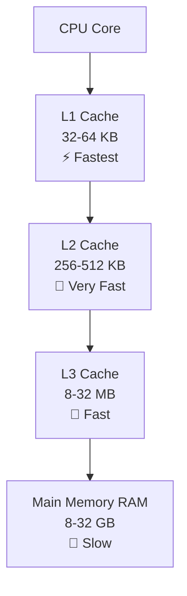
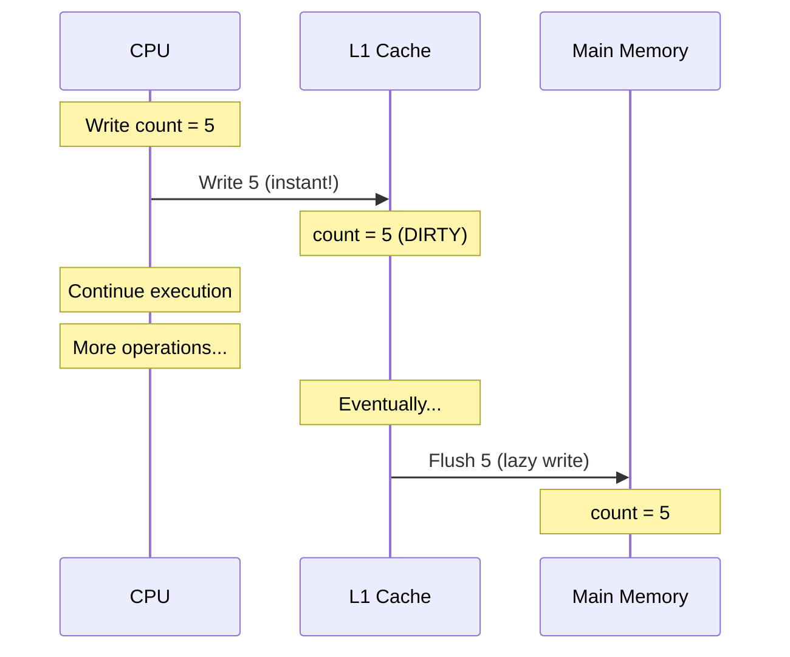
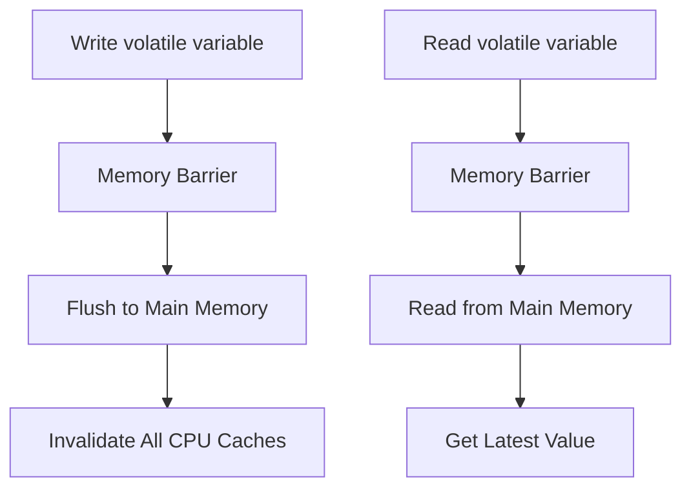
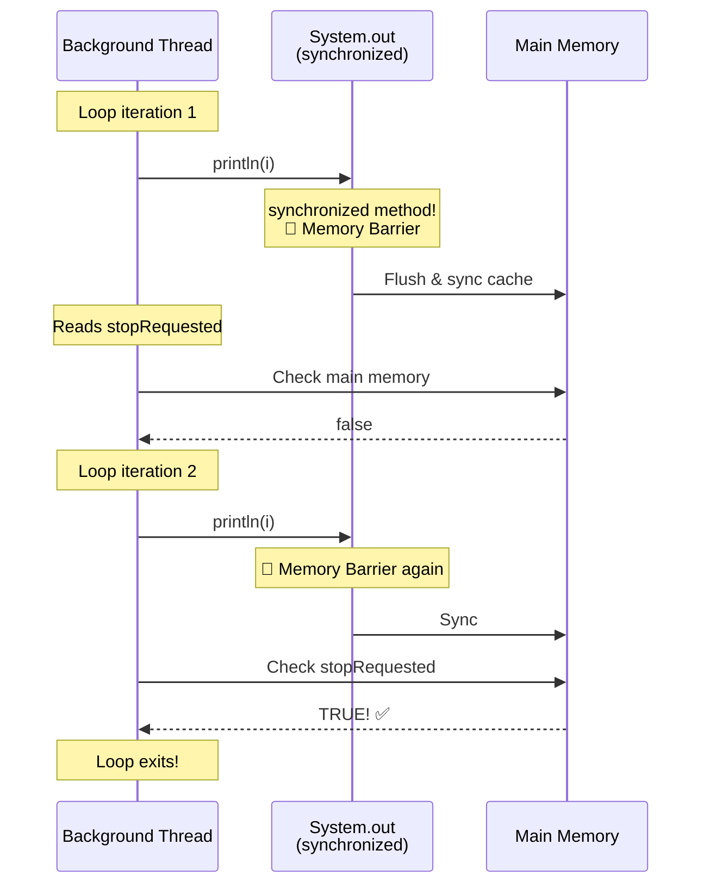
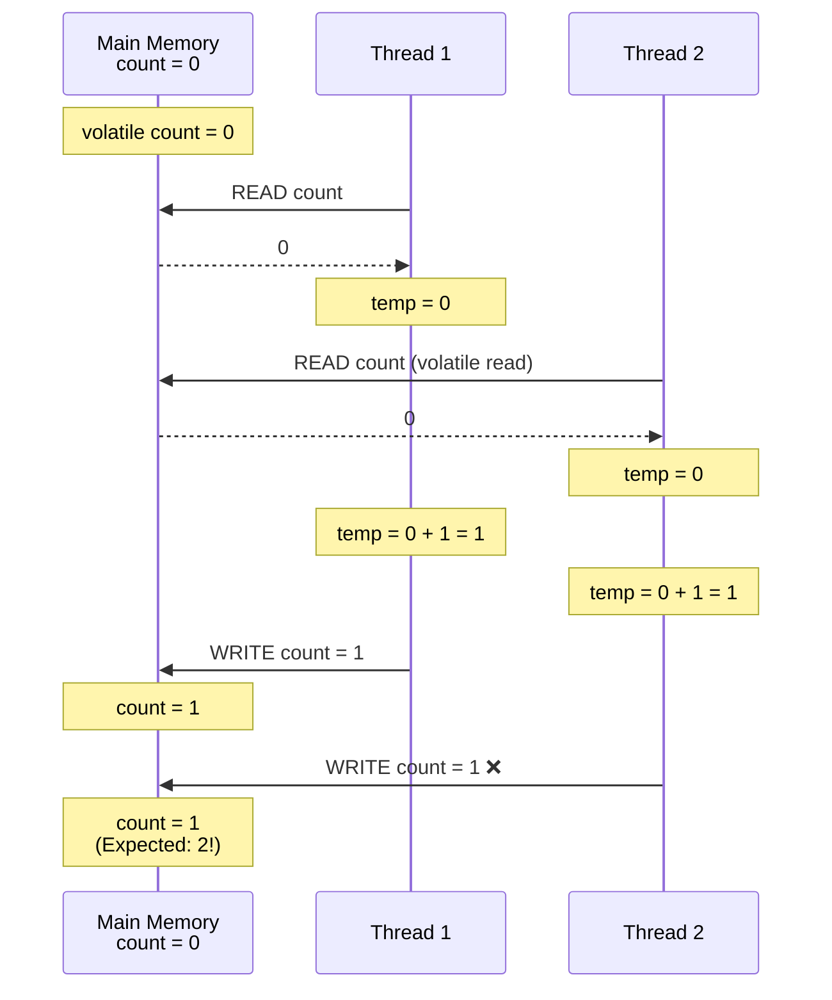
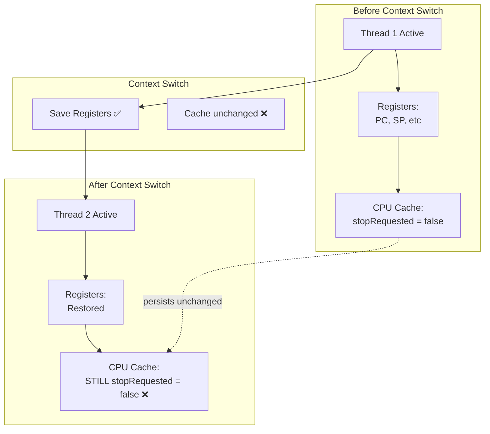
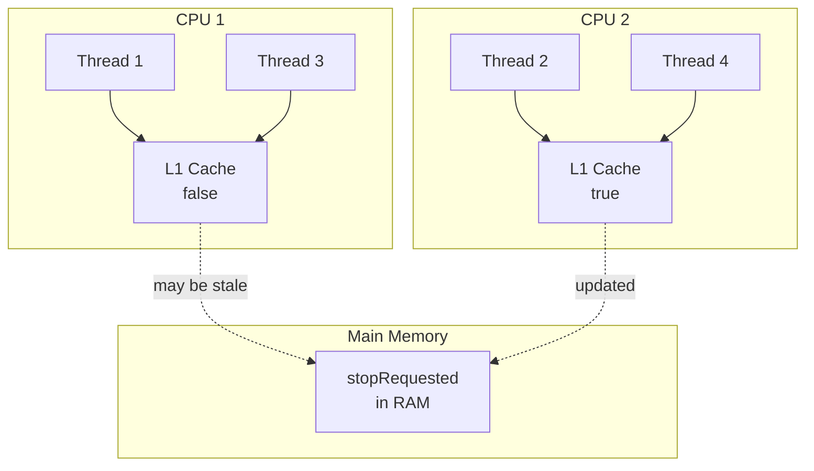
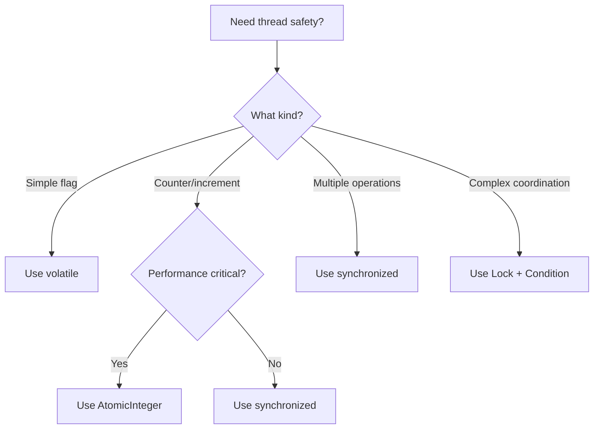

# 🤔 Complete FAQ: Caching, volatile, synchronized & Memory Barriers

> **A comprehensive Q&A guide addressing all common confusions about Java memory model, CPU caching, volatile keyword, and synchronized blocks**

---

## 📑 Table of Contents

1. [Understanding CPU Cache & Memory](#1-understanding-cpu-cache--memory)
2. [The volatile Keyword](#2-the-volatile-keyword)
3. [synchronized vs volatile](#3-synchronized-vs-volatile)
4. [Context Switches & Caching](#4-context-switches--caching)
5. [Atomicity vs Visibility](#5-atomicity-vs-visibility)
6. [Real-World Examples](#6-real-world-examples)

---

## 1. Understanding CPU Cache & Memory

### ❓ Q1: What exactly is CPU cache and why does it exist?

**Short Answer:** CPU cache is ultra-fast memory that stores frequently accessed data to avoid slow trips to RAM.

**Detailed Explanation:**

Think of memory hierarchy like accessing books:

```
Your Hand (CPU Register)    - Instant access (1 nanosecond)
Your Desk (L1 Cache)        - Very fast (2-3 ns)
Your Room (L2 Cache)        - Fast (10-20 ns)
Your House (L3 Cache)       - Moderate (30-50 ns)
Library (RAM/Main Memory)   - Slow (100-200 ns)
Warehouse (Disk)            - Very slow (milliseconds)
```

**Visual:**



**Why it exists:**
- CPU is extremely fast (GHz)
- RAM is relatively slow
- Without cache: CPU waits 100+ cycles for each memory access
- With cache: CPU gets data in 1-5 cycles

**Code Example:**

```java
// Without understanding cache
int sum = 0;
for (int i = 0; i < 1000000; i++) {
    sum += array[i];  // Each access might go to RAM (slow)
}

// What actually happens with cache
// First access: Loads array[0] from RAM to cache
// Next accesses: Reads from cache (fast!)
// Cache prefetcher: Loads array[1], array[2]... anticipating your needs
```

**Key Takeaways:**
- ✅ Cache is hardware, always present
- ✅ Dramatically speeds up memory access
- ✅ Caches entire cache lines (64 bytes typically)
- ⚠️ Creates visibility problems in multi-threading

---

### ❓ Q2: What gets cached? Only local variables or instance/static variables too?

**Short Answer:** **EVERYTHING** from RAM gets cached - local variables, instance variables, static variables, objects, arrays - all of it!

**Detailed Explanation:**

The CPU doesn't distinguish between types of variables. It only knows:
- "This data is in RAM at address 0x12345"
- "RAM is slow, let me cache it!"

**What Gets Cached:**

```java
public class CachingExample {
    private static boolean stopRequested = false;  // ✅ Cached
    private int instanceVar = 10;                  // ✅ Cached
    private String name = "John";                  // ✅ Cached (reference + object)
    
    public void method() {
        int localVar = 5;                          // ✅ Cached (if in memory)
        int[] array = new int[100];                // ✅ Cached
        
        // ALL of these get cached by CPU!
    }
}
```

**Visual Memory Model:**

```
Main Memory (RAM):
┌──────────────────────────────────┐
│ Static Area:                     │
│   stopRequested = false  ───┐    │
│                             │    │
│ Heap:                       │    │
│   Object instance       ────┤    │
│   instanceVar = 10      ────┤    │
│   name reference        ────┤    │
│   "John" String object  ────┤    │
│   int[] array           ────┤    │
│                             │    │
│ Stack (Thread):             │    │
│   localVar = 5          ────┤    │
└──────────────────────────────────┘
                                │
        ALL can be cached in CPU Cache
                                ↓
        ┌────────────────────────┐
        │     CPU L1 Cache       │
        │  (Copies of all above) │
        └────────────────────────┘
```

**Key Takeaways:**
- ✅ Instance variables: Cached
- ✅ Static variables: Cached
- ✅ Local variables: Cached (if stored in RAM)
- ✅ Objects on heap: Cached
- ✅ CPU doesn't care about variable type, only memory location

---

### ❓ Q3: Why don't updates go to main memory immediately?

**Short Answer:** Performance! Writing to cache is 100x faster than writing to RAM. CPU writes to cache first, flushes to RAM later.

**Detailed Explanation:**

**Write Strategy (Write-Back Cache):**

```
Step 1: CPU writes to cache (1 nanosecond) ⚡
Step 2: Mark cache line as "dirty"
Step 3: Continue other work (fast!)
Step 4: Eventually flush to RAM (100+ nanoseconds) 🐢
```

**Visual Timeline:**



**Why Lazy Writing?**

```java
// Example showing why lazy writing helps
for (int i = 0; i < 1000000; i++) {
    count++;  // Modified 1 million times
}

// Without lazy writing:
//   1 million writes to RAM = Very slow! 🐢

// With lazy writing:
//   1 million writes to cache = Fast! ⚡
//   1 write to RAM at end = Efficient!
```

**The Problem for Multi-Threading:**

```
CPU 1 Cache: count = 5 (dirty, not flushed)
CPU 2 Cache: count = 3 (stale, not updated)
Main Memory: count = 4 (old value)

Result: CPUs have different views of same variable! 💔
```

**Key Takeaways:**
- ✅ Lazy writing improves performance dramatically
- ⚠️ Creates coherence problems in multi-CPU systems
- ✅ volatile forces immediate RAM write
- ✅ synchronized also flushes on lock release

---

## 2. The volatile Keyword

### ❓ Q4: What exactly does volatile do?

**Short Answer:** `volatile` ensures all threads see the latest value by forcing reads from RAM and writes to RAM, bypassing stale cache.

**Detailed Explanation:**

**Without volatile:**

```java
private static boolean flag = false;

// Thread 1 (CPU 1)
while (!flag) {
    // Reads from CPU 1's cache
    // May never see change!
}

// Thread 2 (CPU 2)
flag = true;  // Writes to CPU 2's cache only
```

**With volatile:**

```java
private static volatile boolean flag = false;

// Thread 1 (CPU 1)
while (!flag) {
    // 🚧 Memory barrier
    // Forced to read from RAM
    // Sees change immediately!
}

// Thread 2 (CPU 2)
flag = true;  
// 🚧 Memory barrier
// Forced to write to RAM
// Invalidates other CPU caches
```

**What volatile Guarantees:**



**Key Takeaways:**
- ✅ Guarantees visibility across threads
- ✅ Prevents instruction reordering around volatile access
- ✅ Creates happens-before relationship
- ❌ Does NOT provide atomicity for compound operations
- ⚠️ Slower than regular variables

---

### ❓ Q5: Why did BrokenStopThread with println() eventually stop even without volatile?

**Short Answer:** `System.out.println()` is synchronized internally! Synchronized creates memory barriers that force cache synchronization.

**The Mystery Code:**

```java
public class BrokenStopThread {
    private static boolean stopRequested = false;  // NO volatile!
    
    public static void main(String[] args) throws InterruptedException {
        Thread backgroundThread = new Thread(() -> {
            int i = 0;
            while (!stopRequested) {
                i++;
                System.out.println(i);  // ← Why it works!
            }
            System.out.println("Stopped at: " + i);
        });
        
        backgroundThread.start();
        Thread.sleep(1000);
        
        stopRequested = true;
        System.out.println("Stop requested!");
    }
}
```

**Why It Stopped:**



**The Hidden Truth:**

```java
// What println actually does (simplified)
public class PrintStream {
    public void println(Object x) {
        synchronized (this) {  // ← Memory barrier here!
            print(x);
            newLine();
        }
        // ← Memory barrier on exit!
    }
}
```

**Proof - Try Without println:**

```java
public class ReallyBrokenStopThread {
    private static boolean stopRequested = false;
    
    public static void main(String[] args) throws InterruptedException {
        Thread backgroundThread = new Thread(() -> {
            int i = 0;
            while (!stopRequested) {
                i++;  // NO println - truly infinite!
            }
            System.out.println("Stopped at: " + i);
        });
        
        backgroundThread.start();
        Thread.sleep(1000);
        
        stopRequested = true;
        System.out.println("Stop requested!");
        
        // This will HANG FOREVER! 💀
    }
}
```

**Key Takeaways:**
- ⚠️ Your code worked by ACCIDENT (hidden synchronization)
- ❌ NOT reliable - remove println and it hangs
- ❌ NOT guaranteed by Java specification
- ✅ Always use explicit volatile for flags

---

### ❓ Q6: Why is `volatile int count++` NOT thread-safe?

**Short Answer:** `count++` is 3 operations (read-modify-write). volatile guarantees visibility but NOT atomicity. Race conditions happen between the 3 steps.

**Detailed Explanation:**

**What `count++` Really Does:**

```java
// What you write
count++;

// What actually happens (3 separate operations)
int temp = count;      // Step 1: READ
temp = temp + 1;       // Step 2: MODIFY
count = temp;          // Step 3: WRITE
```

**The Race Condition:**



**Timeline of the Problem:**

```
Time | count (RAM) | Thread 1          | Thread 2          | Problem
-----|-------------|-------------------|-------------------|----------
0ms  | 0           | -                 | -                 | -
1ms  | 0           | READ: 0           | -                 | Both start
2ms  | 0           | -                 | READ: 0           | with 0!
3ms  | 0           | ADD: 0+1=1        | -                 | -
4ms  | 0           | -                 | ADD: 0+1=1        | -
5ms  | 1           | WRITE: 1          | -                 | T1 writes
6ms  | 1           | -                 | WRITE: 1          | T2 overwrites! ❌
```

**Why volatile Doesn't Help:**

```
volatile guarantees:
  ✅ Each READ goes to RAM (fresh value)
  ✅ Each WRITE goes to RAM (immediately)
  
But doesn't prevent:
  ❌ Gap between READ and WRITE
  ❌ Two threads reading same value
  ❌ Lost updates from interleaving
```

**The Correct Solutions:**

```java
// ❌ BROKEN
private volatile int count = 0;
public void increment() {
    count++;  // Race condition!
}

// ✅ SOLUTION 1: synchronized
private int count = 0;
public synchronized void increment() {
    count++;  // Atomic - lock prevents interleaving
}

// ✅ SOLUTION 2: AtomicInteger  
private AtomicInteger count = new AtomicInteger(0);
public void increment() {
    count.incrementAndGet();  // Atomic CPU instruction
}

// ✅ SOLUTION 3: Explicit lock
private int count = 0;
private final Lock lock = new ReentrantLock();
public void increment() {
    lock.lock();
    try {
        count++;
    } finally {
        lock.unlock();
    }
}
```

**Key Takeaways:**
- ✅ volatile = Visibility guarantee only
- ❌ volatile ≠ Atomicity for compound operations
- ✅ count++ needs synchronized or Atomic classes
- 💡 Rule: Use volatile for simple flags, synchronized for operations

---

## 3. synchronized vs volatile

### ❓ Q7: What's the difference between synchronized and volatile?

**Short Answer:** 
- `volatile`: Visibility only, no atomicity, no locking
- `synchronized`: Visibility + Atomicity + Mutual exclusion

**Comparison Table:**

| Feature | volatile | synchronized |
|---------|----------|--------------|
| **Visibility** | ✅ Yes | ✅ Yes |
| **Atomicity** | ❌ No | ✅ Yes |
| **Mutual Exclusion** | ❌ No | ✅ Yes (lock) |
| **Blocks other threads** | ❌ No | ✅ Yes |
| **Performance** | ⚡ Fast | 🐢 Slower |
| **Use for** | Simple flags | Critical sections |
| **Memory barriers** | Every access | Entry + Exit only |
| **Can cache?** | ⚠️ Yes (but invalidated) | ✅ Yes (inside block) |

**Visual Comparison:**


**Example Scenarios:**

```java
// ✅ GOOD: volatile for simple flag
private volatile boolean running = true;

public void stop() {
    running = false;  // Simple write - OK
}

public void run() {
    while (running) {  // Simple read - OK
        doWork();
    }
}

// ✅ GOOD: synchronized for counter
private int count = 0;

public synchronized void increment() {
    count++;  // Compound operation - needs synchronized
}

// ❌ BAD: volatile for counter
private volatile int count = 0;

public void increment() {
    count++;  // NOT thread-safe!
}
```

**Key Takeaways:**
- ✅ volatile: Fast, visibility only, for simple variables
- ✅ synchronized: Slower, full protection, for critical sections
- 💡 Choose based on your needs: flags vs operations

---

### ❓ Q8: Does caching happen with synchronized, and does volatile prevent all caching?

**Short Answer:** 
- `synchronized`: Caching DOES happen inside the block (efficient!)
- `volatile`: Cache exists but constantly synchronized with RAM

**Detailed Explanation:**

**Misconception vs Reality:**

```
❌ WRONG:
  - synchronized: No caching
  - volatile: No cache at all
  
✅ CORRECT:
  - synchronized: Caching inside block, sync at boundaries
  - volatile: Cache exists, but invalidated on every access
```

**With synchronized:**

```java
synchronized (lock) {
    // Entry: Memory barrier
    // - Flush write buffers
    // - Invalidate cache
    
    for (int i = 0; i < 1000; i++) {
        count++;  // Reads/writes can use cache! ⚡
                  // Fast because no memory barriers inside
    }
    
    // Exit: Memory barrier
    // - Flush all changes to RAM
    // - Notify other CPUs
}
```

**Visual Timeline:**

```
Enter synchronized
    ↓
🚧 Memory Barrier (Acquire)
    ↓
Read count from RAM → Cache it
    ↓
Loop 1: Read from cache ⚡
Loop 2: Read from cache ⚡
Loop 3: Read from cache ⚡
    ...
Loop 1000: Read from cache ⚡
    ↓
🚧 Memory Barrier (Release)
    ↓
Flush cache to RAM
    ↓
Exit synchronized

Total memory barriers: 2
Performance: Excellent! ⚡
```

**With volatile:**

```java
for (int i = 0; i < 1000; i++) {
    count++;  // Each access = memory barrier!
}
```

**Visual Timeline:**

```
Loop 1: 
  🚧 Memory Barrier → Read from RAM
  🚧 Memory Barrier → Write to RAM
Loop 2:
  🚧 Memory Barrier → Read from RAM
  🚧 Memory Barrier → Write to RAM
Loop 3:
  🚧 Memory Barrier → Read from RAM
  🚧 Memory Barrier → Write to RAM
    ...
Loop 1000:
  🚧 Memory Barrier → Read from RAM
  🚧 Memory Barrier → Write to RAM

Total memory barriers: 2000
Performance: Much slower! 🐢
```

**Performance Comparison:**

```java
// Benchmark (simplified)
private int count = 0;

// Test 1: synchronized
public synchronized void incrementSync() {
    for (int i = 0; i < 1_000_000; i++) {
        count++;
    }
}
// Time: ~5ms (2 memory barriers)

// Test 2: volatile
private volatile int count2 = 0;
public void incrementVolatile() {
    for (int i = 0; i < 1_000_000; i++) {
        count2++;
    }
}
// Time: ~50ms (2 million memory barriers)
```

**Key Takeaways:**
- ✅ synchronized: Efficient caching inside block
- ✅ volatile: Cache invalidated on every access
- 💡 synchronized better for multiple operations
- 💡 volatile better for simple flags

---

## 4. Context Switches & Caching

### ❓ Q9: Does context switch clear cache and reload from main memory?

**Short Answer:** **NO!** Context switch only saves/restores CPU registers. Cache stays intact with potentially stale data.

**What Context Switch Actually Does:**

```
Context Switch Operations:
┌─────────────────────────────────────┐
│ ✅ SAVES/RESTORES:                 │
│   - CPU Registers (PC, SP, etc)    │
│   - Program counter                 │
│   - Stack pointer                   │
│   - General purpose registers       │
│                                     │
│ ❌ DOES NOT TOUCH:                  │
│   - CPU Cache (L1, L2, L3)         │
│   - Memory barriers                 │
│   - Cache coherence                 │
└─────────────────────────────────────┘
```

**Visual Example:**



**Why Cache Isn't Cleared:**

```
1. Cache belongs to CPU hardware, not thread
2. Clearing cache on every switch = massive performance hit
3. Context switches happen thousands of times per second
4. Threads on same CPU share same cache
```

**The Real Problem:**

```java
// Thread 1 on CPU 1
private static boolean flag = false;

while (!flag) {
    // Reads from CPU 1's cache
    // Context switch happens here
    // Cache NOT cleared!
    // Still reads from same stale cache
}

// Thread 2 on CPU 2
flag = true;  // Writes to CPU 2's cache
// CPU 1's cache never updated!
```

**Proof by Example:**

```java
public class ContextSwitchDoesntHelp {
    private static boolean flag = false;  // No volatile
    
    public static void main(String[] args) throws InterruptedException {
        Thread thread = new Thread(() -> {
            while (!flag) {
                // Even with context switches, this loops forever!
                // Because cache is never cleared
                Thread.yield();  // Force context switch
            }
            System.out.println("Done");  // Never prints!
        });
        
        thread.start();
        Thread.sleep(1000);
        flag = true;
        
        // Thread will NEVER see flag=true
        // Despite thousands of context switches!
    }
}
```

**Key Takeaways:**
- ❌ Context switch does NOT clear cache
- ❌ Context switch does NOT create memory barriers
- ✅ Cache persists across context switches
- ✅ Need volatile or synchronized for visibility

---

### ❓ Q10: If multiple threads operate, how does cache remain intact for each thread?

**Short Answer:** Cache belongs to CPU, not threads. Threads on the same CPU share the same cache. Threads on different CPUs have separate caches that can diverge.

**Scenario 1: Threads on SAME CPU**

```
CPU Core 1
├── L1 Cache (32 KB)
│   └── stopRequested = false
├── L2 Cache (256 KB)
└── Threads time-sharing this CPU:
    ├── Thread 1 (active now)
    └── Thread 2 (waiting)

When context switch:
  Thread 1 → Thread 2
  Cache unchanged!
  Both threads see same cache
```

**Example:**

```java
// Both threads on same CPU
// They SHARE the same cache

Thread 1: Writes stopRequested = true
          Updates shared cache
          
Context Switch

Thread 2: Reads stopRequested
          Reads from shared cache
          Sees value = true ✅

Result: Works! (shared cache)
```

**Scenario 2: Threads on DIFFERENT CPUs**

```
CPU Core 1                    CPU Core 2
├── L1 Cache                  ├── L1 Cache
│   └── stopRequested = false │   └── stopRequested = true
├── Thread 1                  ├── Thread 2
                              
Each CPU has SEPARATE cache!
Caches can have DIFFERENT values!
Without cache coherence → BROKEN!
```

**Example:**

```java
// Threads on different CPUs
// Each has INDEPENDENT cache

Thread 1 (CPU 1): 
  while (!stopRequested) { }
  Reads from CPU 1's cache
  Cache: false
  
Thread 2 (CPU 2):
  stopRequested = true;
  Writes to CPU 2's cache
  Cache: true
  
CPU 1's cache NEVER updated!
Thread 1 runs forever! ❌
```

**The Complete Picture:**



**How volatile Solves This:**

```java
private static volatile boolean stopRequested;

// volatile creates cache coherence protocol:

Thread 1 (CPU 1):
  Reads volatile variable
  → Memory barrier
  → Check if cache is stale
  → Reload from RAM if needed
  
Thread 2 (CPU 2):
  Writes volatile variable
  → Memory barrier
  → Write to RAM immediately
  → Signal CPU 1: "Invalidate your cache!"
  
CPU 1: "Oh, my cache is stale!"
       → Invalidates cached value
       → Next read goes to RAM
       → Sees new value ✅
```

**Key Takeaways:**
- ✅ Cache belongs to CPU, not thread
- ✅ Threads on same CPU share cache
- ⚠️ Threads on different CPUs have separate caches
- ✅ volatile enables cache coherence protocol
- ✅ synchronized also forces cache sync

---

## 5. Atomicity vs Visibility

### ❓ Q11: What's the difference between atomicity and visibility?

**Short Answer:**
- **Visibility:** Can threads see each other's changes?
- **Atomicity:** Do operations complete without interruption?

**Detailed Breakdown:**

**Visibility Problem:**

```java
// Thread 1
flag = true;  // Does Thread 2 see this change?

// Thread 2
if (flag) { } // Can I see Thread 1's change?
```

**Solution:** `volatile` or `synchronized`

**Atomicity Problem:**

```java
// Thread 1 and Thread 2 both do:
count++;  // Is this operation uninterruptible?
```

**Solution:** `synchronized` or `AtomicInteger`

**The Matrix:**

| Problem | volatile | synchronized | AtomicInteger |
|---------|----------|--------------|---------------|
| **Visibility** | ✅ Solves | ✅ Solves | ✅ Solves |
| **Atomicity** | ❌ No | ✅ Solves | ✅ Solves |
| **Performance** | ⚡ Fast | 🐢 Slower | ⚡ Fast |
| **Blocking** | ❌ No | ✅ Yes | ❌ No |

**Real Examples:**

```java
// Scenario 1: Only need visibility
private volatile boolean shutdown = false;

public void requestShutdown() {
    shutdown = true;  // ✅ volatile is enough
}

public

 void run() {
    while (!shutdown) {  // ✅ volatile is enough
        doWork();
    }
}

// Scenario 2: Need visibility + atomicity
private int count = 0;

public synchronized void increment() {
    count++;  // ✅ synchronized needed
}

// Scenario 3: High-performance atomicity
private AtomicInteger count = new AtomicInteger(0);

public void increment() {
    count.incrementAndGet();  // ✅ AtomicInteger best
}
```

**Key Takeaways:**
- 💡 Visibility = Can threads see changes?
- 💡 Atomicity = Are operations uninterruptible?
- ✅ Different problems need different solutions
- 🎯 Choose the right tool for your specific problem

---

## 6. Real-World Examples

### ❓ Q12: Show me a complete example of the broken code vs fixed versions

**The Broken Version:**

```java
public class BrokenCounter {
    private int count = 0;  // No synchronization!
    
    public void increment() {
        count++;  // Race condition!
    }
    
    public int getCount() {
        return count;  // May see stale value!
    }
    
    public static void main(String[] args) throws InterruptedException {
        BrokenCounter counter = new BrokenCounter();
        
        // Create 10 threads, each incrementing 1000 times
        Thread[] threads = new Thread[10];
        for (int i = 0; i < 10; i++) {
            threads[i] = new Thread(() -> {
                for (int j = 0; j < 1000; j++) {
                    counter.increment();
                }
            });
            threads[i].start();
        }
        
        // Wait for all threads
        for (Thread thread : threads) {
            thread.join();
        }
        
        System.out.println("Expected: 10000");
        System.out.println("Actual: " + counter.getCount());
        // Actual: 8734 (varies, always less than 10000!)
    }
}
```

**Fixed Version 1: synchronized**

```java
public class SynchronizedCounter {
    private int count = 0;
    
    public synchronized void increment() {
        count++;  // ✅ Atomic + Visible
    }
    
    public synchronized int getCount() {
        return count;  // ✅ Latest value
    }
    
    public static void main(String[] args) throws InterruptedException {
        SynchronizedCounter counter = new SynchronizedCounter();
        
        Thread[] threads = new Thread[10];
        for (int i = 0; i < 10; i++) {
            threads[i] = new Thread(() -> {
                for (int j = 0; j < 1000; j++) {
                    counter.increment();
                }
            });
            threads[i].start();
        }
        
        for (Thread thread : threads) {
            thread.join();
        }
        
        System.out.println("Expected: 10000");
        System.out.println("Actual: " + counter.getCount());
        // Actual: 10000 ✅ Always correct!
    }
}
```

**Fixed Version 2: AtomicInteger**

```java
import java.util.concurrent.atomic.AtomicInteger;

public class AtomicCounter {
    private AtomicInteger count = new AtomicInteger(0);
    
    public void increment() {
        count.incrementAndGet();  // ✅ Atomic operation
    }
    
    public int getCount() {
        return count.get();  // ✅ Latest value
    }
    
    public static void main(String[] args) throws InterruptedException {
        AtomicCounter counter = new AtomicCounter();
        
        Thread[] threads = new Thread[10];
        for (int i = 0; i < 10; i++) {
            threads[i] = new Thread(() -> {
                for (int j = 0; j < 1000; j++) {
                    counter.increment();
                }
            });
            threads[i].start();
        }
        
        for (Thread thread : threads) {
            thread.join();
        }
        
        System.out.println("Expected: 10000");
        System.out.println("Actual: " + counter.getCount());
        // Actual: 10000 ✅ Always correct!
    }
}
```

**Fixed Version 3: volatile (ONLY for flag, NOT counter!)**

```java
public class VolatileFlag {
    private volatile boolean stopRequested = false;  // ✅ For flags only!
    
    public void requestStop() {
        stopRequested = true;
    }
    
    public void run() {
        while (!stopRequested) {
            doWork();
        }
    }
    
    private void doWork() {
        // Some work
    }
}
```

---

## 🎓 Summary & Quick Reference

### Decision Tree



### Quick Comparison Card

```
┌─────────────────────────────────────────────────────────┐
│              QUICK REFERENCE CARD                        │
├─────────────────────────────────────────────────────────┤
│                                                          │
│  Problem          Solution         Example              │
│  ───────────────  ───────────────  ──────────────────   │
│  Visibility       volatile         volatile boolean flag│
│  Atomicity        synchronized     synchronized void m()│
│  Both             synchronized     synchronized void m()│
│  Counter          AtomicInteger    AtomicInteger count  │
│  Complex          Lock+Condition   ReentrantLock lock   │
│                                                          │
│  Cache Issues:                                           │
│  ─────────────                                           │
│  • Cache always exists (CPU hardware)                    │
│  • Context switch ≠ cache clear                          │
│  • volatile = cache coherence                            │
│  • synchronized = memory barriers at lock boundaries     │
│                                                          │
└─────────────────────────────────────────────────────────┘
```

### The Golden Rules

1. **volatile** = Visibility only (for flags)
2. **synchronized** = Visibility + Atomicity (for critical sections)
3. **AtomicInteger** = Lock-free atomicity (for counters)
4. **Context switches ≠ Memory barriers**
5. **Cache always exists, can't be disabled**
6. **`count++` always needs synchronization**
7. **When in doubt, use synchronized**

---

## 🔗 Related Resources

For more details, see:
- [`tutorials/04-thread-functions-complete.md`](tutorials/04-thread-functions-complete.md:1) - Complete thread synchronization guide
- [`tutorials/05-quick-guide-to-volatile.md`](tutorials/05-quick-guide-to-volatile.md:1) - Quick volatile reference
- Java Concurrency in Practice book
- Java Language Specification - Memory Model chapter

---

## 📝 Conclusion

Understanding CPU caching, memory barriers, volatile, and synchronized is crucial for writing correct multithreaded code. The key insights:

1. **Cache is hardware** - It always exists and dramatically improves performance
2. **Visibility ≠ Atomicity** - Different problems need different solutions
3. **Context switches don't help** - They don't clear cache or create memory barriers
4. **Choose the right tool** - volatile for flags, synchronized for operations
5. **Test thoroughly** - Concurrency bugs are subtle and timing-dependent

Remember: **Correctness first, then optimize!** Start with synchronized, move to volatile or Atomic classes only when you understand the trade-offs.

---

**Document Version:** 1.0  
**Last Updated:** 2024  
**Total FAQs:** 12  
**Diagrams:** 10+  
**Code Examples:** 20+

---

**End of FAQ Document** ✨
