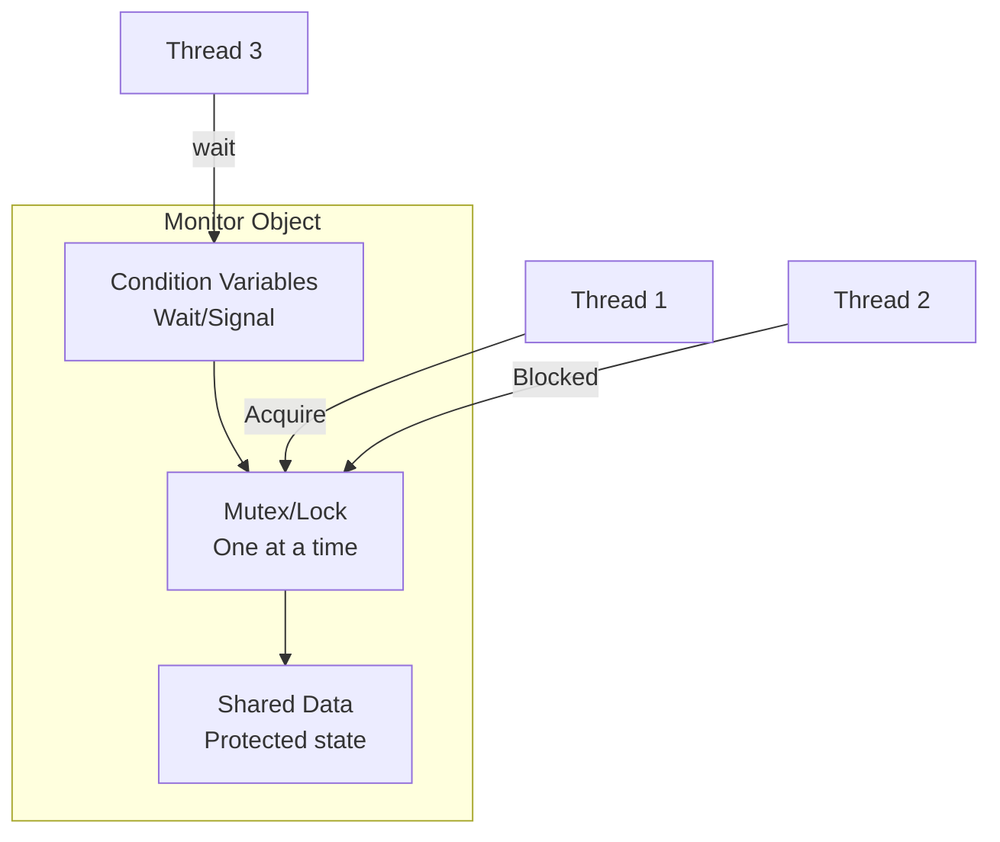
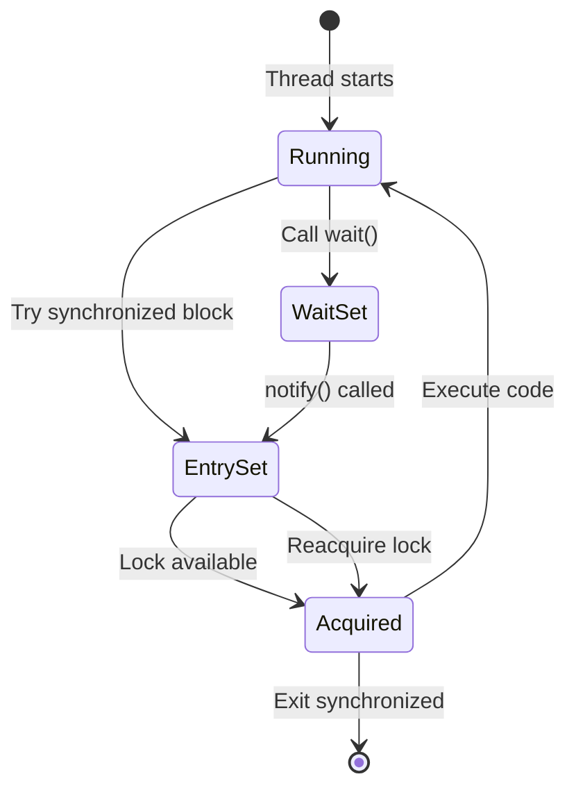
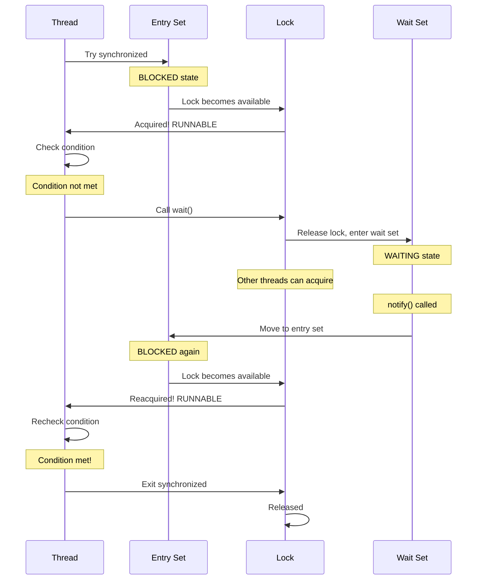
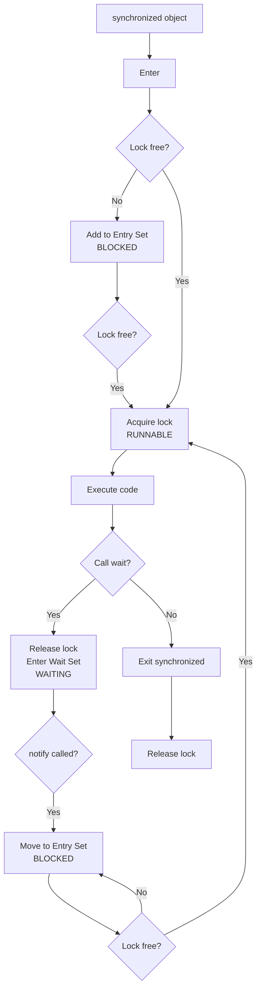
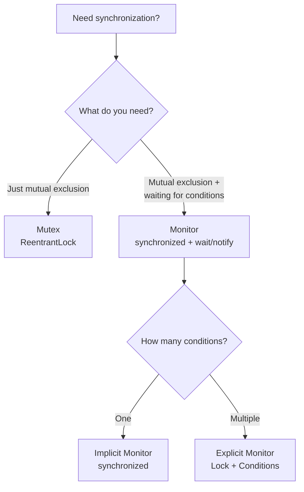
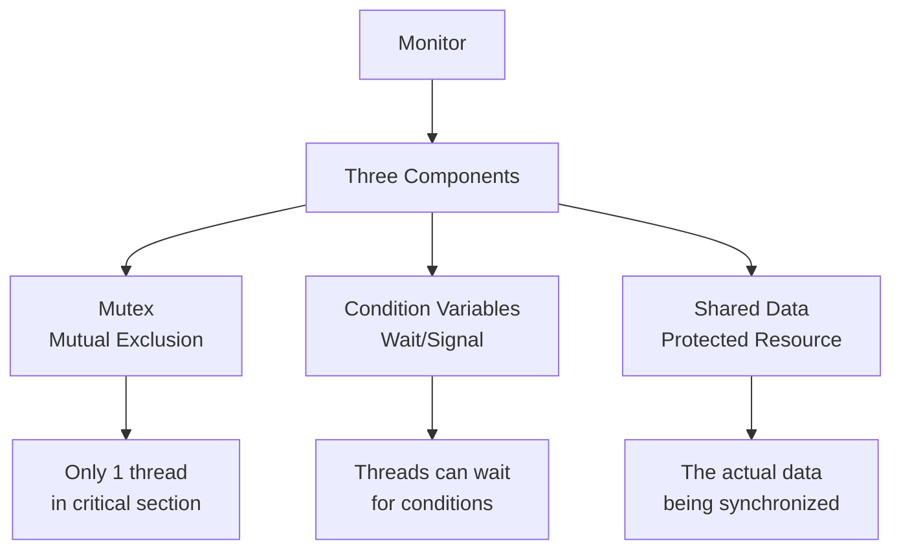
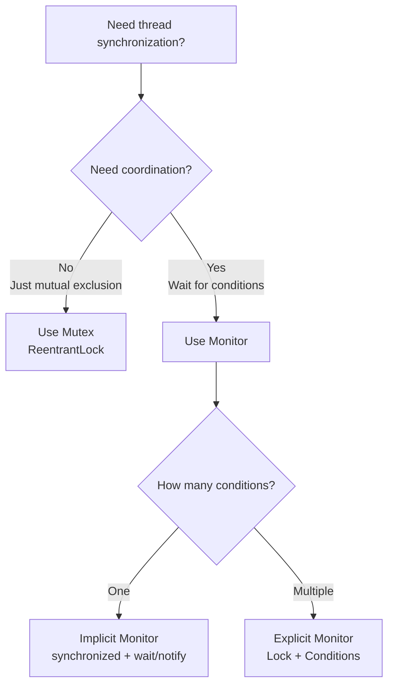

# 🔐 Complete Guide: Mutex vs Monitor in Java

> **The most comprehensive, detailed explanation of Mutex and Monitor - understanding the difference, how Java implements monitors, and when to use each**

---

## 📑 Table of Contents

1. [Prerequisites & Core Concepts](#1-prerequisites--core-concepts)
2. [What is a Mutex? (Quick Review)](#2-what-is-a-mutex-quick-review)
3. [What is a Monitor?](#3-what-is-a-monitor)
4. [Monitor Components Explained](#4-monitor-components-explained)
5. [Java's Monitor Implementation](#5-javas-monitor-implementation)
6. [Entry Set vs Wait Set](#6-entry-set-vs-wait-set)
7. [Explicit Monitors (Lock + Condition)](#7-explicit-monitors-lock--condition)
8. [How Monitors Work Internally](#8-how-monitors-work-internally)
9. [The Key Differences](#9-the-key-differences)
10. [synchronized as a Monitor](#10-synchronized-as-a-monitor)
11. [Use Cases & Scenarios](#11-use-cases--scenarios)
12. [Real-World Examples](#12-real-world-examples)
13. [Comprehensive FAQs](#13-comprehensive-faqs)
14. [Best Practices](#14-best-practices)
15. [Quick Reference](#15-quick-reference)

---

## 1. Prerequisites & Core Concepts

### 🎓 What You Need to Know

Before understanding Mutex vs Monitor, let's establish the basics:

**Synchronization Problem:**
Multiple threads accessing shared resources can lead to race conditions.

```java
// The problem
class UnsafeCounter {
    private int count = 0;
    
    public void increment() {
        count++;  // Race condition!
    }
}

// Two threads both increment:
// Thread 1: Read 0, add 1, write 1
// Thread 2: Read 0, add 1, write 1  
// Expected: 2, Got: 1 ❌
```

**Two Fundamental Needs:**

1. **Mutual Exclusion** - Only one thread in critical section
2. **Coordination** - Threads waiting for conditions

### 🎯 The Evolution

```
Level 1: Just Mutual Exclusion
    ↓
  MUTEX (Basic lock)
    ↓
Level 2: Mutual Exclusion + Coordination
    ↓
  MONITOR (Lock + Condition Variables)
```

**Key Insight:** Monitor = Mutex + **More**

---

## 2. What is a Mutex? (Quick Review)

### 📚 Simple Definition

**Mutex** = Mutual Exclusion lock. Only ONE thread can hold it at a time.

### 🔑 Think: Bathroom with One Key

```
🚻 Bathroom (Resource)
🔑 Key (Mutex)

Person 1: Takes key → Enters → Locks door
Person 2: Wants key → Must wait
Person 1: Exits → Returns key
Person 2: Takes key → Enters
```

### 💻 Mutex in Java

```java
// Using ReentrantLock as Mutex
ReentrantLock mutex = new ReentrantLock();

mutex.lock();  // Acquire
try {
    // Critical section
    // Only one thread here!
} finally {
    mutex.unlock();  // Release
}
```

**What Mutex Provides:**
- ✅ Mutual exclusion (one at a time)
- ✅ Ownership (only owner can unlock)
- ❌ **NO coordination** (can't wait for conditions)

---

## 3. What is a Monitor?

### 📚 Simple Definition

**Monitor** = Mutex + Condition Variables

A monitor is a synchronization construct that combines:
1. **Mutual Exclusion** (like mutex)
2. **Condition Synchronization** (wait/notify)

### 🏢 Think: Office Meeting Room with Rules

```
🏢 Meeting Room (Monitor)
├── 🔑 Door Key (Mutex part)
│   └── Only one person enters at a time
│
└── 📢 Intercom System (Condition variable part)
    ├── wait() - "I'll wait outside until called"
    └── notify() - "Come in, you can enter now!"
```

**Complete Scenario:**

```
Manager: Enters room 🔑 (acquires mutex)
Manager: Checks if report ready
Report: Not ready yet
Manager: Exits and waits 📢 (wait - releases mutex)
         └─ Other people can enter room now!

Worker: Enters room 🔑 (acquires mutex)
Worker: Prepares report
Worker: Calls manager 📢 (notify)
Worker: Exits 🔑 (releases mutex)

Manager: Re-enters room 🔑 (reacquires mutex)
Manager: Gets report
Manager: Exits 🔑 (releases mutex)
```

### 🎯 Key Difference from Mutex

```
Mutex:
  Thread: "I want exclusive access"
  Mutex: "OK, you have it"
  Thread: "Done, releasing"
  ❌ Can't wait for conditions!

Monitor:
  Thread: "I want exclusive access"
  Monitor: "OK, you have it"
  Thread: "Hmm, data not ready, I'll wait"
  Monitor: "OK, releasing lock, you wait here"
  ✅ Can wait for conditions!
  Other Thread: "Data ready, notifying"
  Monitor: "Waking up waiter"
```

---

## 4. Monitor Components Explained

### 🧩 The Three Parts of a Monitor

```
┌──────────────────────────────────────────┐
│              MONITOR                      │
├──────────────────────────────────────────┤
│                                           │
│  1. MUTEX (Mutual Exclusion)             │
│     └─ Ensures only one thread inside    │
│                                           │
│  2. CONDITION VARIABLE(S)                │
│     └─ Allows waiting for conditions     │
│                                           │
│  3. SHARED DATA                          │
│     └─ The actual resource being shared  │
│                                           │
└──────────────────────────────────────────┘
```

### 📊 Visual Architecture



### 💡 Understanding Each Component

**Component 1: Mutex (Lock)**

```java
// The mutex part ensures mutual exclusion
synchronized (monitor) {
    // Only one thread here
}
```

**Component 2: Condition Variable (wait/notify)**

```java
// The condition variable part allows coordination
synchronized (monitor) {
    while (!condition) {
        monitor.wait();  // Wait for condition
    }
    // Condition met, proceed
}

synchronized (monitor) {
    condition = true;
    monitor.notify();  // Wake waiting thread
}
```

**Component 3: Shared Data**

```java
// The actual data being protected
synchronized (monitor) {
    sharedData.modify();  // Safe access
}
```

---

## 5. Java's Monitor Implementation

### 🎯 Java's Built-in Monitor: synchronized + wait/notify

**Every object in Java IS a monitor!**

Each Java object has:
1. **Intrinsic lock** (mutex)
2. **Wait set** (condition variable)

### 💻 Basic Monitor Usage in Java

```java
public class JavaMonitorExample {
    private final Object monitor = new Object();  // Monitor object
    private boolean dataReady = false;            // Condition
    
    // Producer method
    public void produceData() {
        synchronized (monitor) {  // 🔐 Acquire monitor lock
            // Produce data
            dataReady = true;
            
            monitor.notify();  // 📢 Signal condition changed
        }  // 🔓 Release monitor lock
    }
    
    // Consumer method
    public void consumeData() throws InterruptedException {
        synchronized (monitor) {  // 🔐 Acquire monitor lock
            while (!dataReady) {
                monitor.wait();  // ⏳ Wait for condition
                                 //    (releases lock while waiting!)
            }
            // Condition met, consume data
            System.out.println("Consuming data");
        }  // 🔓 Release monitor lock
    }
}
```

### 📊 Monitor State Diagram



---

## 6. Entry Set vs Wait Set

### 🎯 The Two Waiting Areas

This is crucial to understand! A monitor has TWO different sets where threads wait:

```
┌─────────────────────────────────────────────┐
│              MONITOR OBJECT                  │
├─────────────────────────────────────────────┤
│                                              │
│  ┌────────────────────────────────────────┐ │
│  │    ENTRY SET (Blocked threads)         │ │
│  │  Waiting to ACQUIRE lock               │ │
│  │  State: BLOCKED                        │ │
│  │  Threads: T2, T3, T4                   │ │
│  └────────────────────────────────────────┘ │
│                ↓                             │
│  ┌────────────────────────────────────────┐ │
│  │    LOCK OWNER (One thread)             │ │
│  │  Currently executing                    │ │
│  │  State: RUNNABLE                       │ │
│  │  Thread: T1                            │ │
│  └────────────────────────────────────────┘ │
│                ↓                             │
│  ┌────────────────────────────────────────┐ │
│  │    WAIT SET (Waiting threads)          │ │
│  │  Called wait(), released lock          │ │
│  │  State: WAITING                        │ │
│  │  Threads: T5, T6                       │ │
│  └────────────────────────────────────────┘ │
│                                              │
└─────────────────────────────────────────────┘
```

### 🎭 Entry Set Explained

**Entry Set** = Threads trying to ENTER the monitor (acquire lock)

**How threads enter:**
```java
synchronized (monitor) {  // ← Try to enter here
    // If lock held by another thread
    // → Add to ENTRY SET
    // → State: BLOCKED
}
```

**Characteristics:**
- ✅ Threads waiting to acquire lock
- ✅ State: BLOCKED
- ✅ Automatically compete when lock released
- ❌ Don't need notify() to wake

### 🎭 Wait Set Explained

**Wait Set** = Threads that ENTERED monitor but are waiting for a condition

**How threads enter:**
```java
synchronized (monitor) {
    while (!condition) {
        monitor.wait();  // ← Enter WAIT SET here
        // Releases lock
        // State: WAITING
    }
}
```

**Characteristics:**
- ✅ Threads waiting for condition
- ✅ State: WAITING
- ✅ Have released the lock
- ✅ Need notify() to move to entry set

### 💻 Complete Example: Both Sets

```java
public class EntryAndWaitSetDemo {
    private static final Object monitor = new Object();
    private static boolean condition = false;
    
    public static void main(String[] args) throws InterruptedException {
        // Thread that will WAIT
        Thread waiter = new Thread(() -> {
            synchronized (monitor) {
                try {
                    System.out.println("Waiter: Acquired lock");
                    System.out.println("Waiter: Condition not met, calling wait()");
                    System.out.println("Waiter: → Entering WAIT SET");
                    
                    monitor.wait();
                    
                    System.out.println("Waiter: Woke up from WAIT SET");
                    System.out.println("Waiter: Reacquired lock");
                } catch (InterruptedException e) {
                    e.printStackTrace();
                }
            }
        }, "Waiter");
        
        // Thread that will be BLOCKED
        Thread blocker = new Thread(() -> {
            try {
                Thread.sleep(1000);
            } catch (InterruptedException e) {
                e.printStackTrace();
            }
            
            System.out.println("\nBlocker: Trying to acquire lock");
            System.out.println("Blocker: → Entering ENTRY SET (BLOCKED)");
            
            synchronized (monitor) {
                System.out.println("Blocker: Acquired lock from ENTRY SET");
                try {
                    Thread.sleep(2000);
                } catch (InterruptedException e) {
                    e.printStackTrace();
                }
                System.out.println("Blocker: Releasing lock");
            }
        }, "Blocker");
        
        waiter.start();
        Thread.sleep(500);  // Let waiter call wait()
        
        blocker.start();
        Thread.sleep(3500);  // Let blocker finish
        
        System.out.println("\n=== Lock is FREE but Waiter still in WAIT SET ===");
        Thread.sleep(1000);
        
        synchronized (monitor) {
            System.out.println("Main: Calling notify()");
            System.out.println("Main: Moving Waiter from WAIT SET → ENTRY SET");
            condition = true;
            monitor.notify();
        }
        
        waiter.join();
        blocker.join();
    }
}
```

**Output:**
```
Waiter: Acquired lock
Waiter: Condition not met, calling wait()
Waiter: → Entering WAIT SET

Blocker: Trying to acquire lock
Blocker: → Entering ENTRY SET (BLOCKED)
Blocker: Acquired lock from ENTRY SET
Blocker: Releasing lock

=== Lock is FREE but Waiter still in WAIT SET ===
Main: Calling notify()
Main: Moving Waiter from WAIT SET → ENTRY SET
Waiter: Woke up from WAIT SET
Waiter: Reacquired lock
```

### 🔑 Critical Difference

```
Entry Set (BLOCKED):
  - Waiting to GET IN
  - Lock released → Automatically try to acquire ✅
  - Don't need notify()

Wait Set (WAITING):
  - Already GOT IN, but waiting for condition
  - Lock released → Still waiting ❌
  - NEED notify() to move to Entry Set
```

---

## 7. Explicit Monitors (Lock + Condition)

### 🎯 Java's Alternative: ReentrantLock + Condition

Java provides explicit monitor with [`ReentrantLock`](https://docs.oracle.com/javase/8/docs/api/java/util/concurrent/locks/ReentrantLock.html) + [`Condition`](https://docs.oracle.com/javase/8/docs/api/java/util/concurrent/locks/Condition.html):

```java
ReentrantLock lock = new ReentrantLock();  // Mutex part
Condition condition = lock.newCondition();  // Condition variable part
```

### 💻 Explicit Monitor Example

```java
import java.util.concurrent.locks.ReentrantLock;
import java.util.concurrent.locks.Condition;

public class ExplicitMonitor {
    private final ReentrantLock lock = new ReentrantLock();  // Mutex
    private final Condition condition = lock.newCondition();  // Condition
    private boolean dataReady = false;
    
    public void producer() {
        lock.lock();  // 🔐 Acquire lock (mutex part)
        try {
            // Produce data
            dataReady = true;
            System.out.println("Producer: Data ready");
            
            condition.signal();  // 📢 Signal (condition part)
        } finally {
            lock.unlock();  // 🔓 Release lock
        }
    }
    
    public void consumer() throws InterruptedException {
        lock.lock();  // 🔐 Acquire lock (mutex part)
        try {
            while (!dataReady) {
                condition.await();  // ⏳ Wait (condition part)
                                    //    Releases lock!
            }
            System.out.println("Consumer: Consuming data");
        } finally {
            lock.unlock();  // 🔓 Release lock
        }
    }
}
```

### 🆚 Implicit vs Explicit Monitor

```
Implicit Monitor (synchronized + wait/notify):
  ✅ Simple syntax
  ✅ Automatic lock management
  ❌ Only one condition variable
  ❌ Less flexible

Explicit Monitor (Lock + Condition):
  ❌ More verbose
  ❌ Manual lock management
  ✅ Multiple condition variables
  ✅ More features (tryLock, timeout, etc.)
```

**Side-by-Side:**

```java
// Implicit Monitor
public class ImplicitMonitor {
    private final Object monitor = new Object();
    private boolean ready = false;
    
    public void await() throws InterruptedException {
        synchronized (monitor) {
            while (!ready) {
                monitor.wait();
            }
        }
    }
    
    public void signal() {
        synchronized (monitor) {
            ready = true;
            monitor.notify();
        }
    }
}

// Explicit Monitor
public class ExplicitMonitor {
    private final ReentrantLock lock = new ReentrantLock();
    private final Condition condition = lock.newCondition();
    private boolean ready = false;
    
    public void await() throws InterruptedException {
        lock.lock();
        try {
            while (!ready) {
                condition.await();
            }
        } finally {
            lock.unlock();
        }
    }
    
    public void signal() {
        lock.lock();
        try {
            ready = true;
            condition.signal();
        } finally {
            lock.unlock();
        }
    }
}
```

---

## 8. How Monitors Work Internally

### 🔬 Inside a Java Monitor

**Every Java object has hidden monitor components:**

```
Object instance
├── Object data (fields, methods)
├── Object header
│   ├── Mark word (contains lock info)
│   └── Class pointer
└── Monitor (hidden)
    ├── Entry Set (threads waiting for lock)
    ├── Wait Set (threads that called wait())
    └── Owner thread reference
```

### 🎭 Complete Monitor Lifecycle

**Timeline of a thread using monitor:**



### 🎯 Step-by-Step Execution

**Thread T1 enters monitor:**

```
Step 1: synchronized(monitor)
  Check: Is lock free?
  → No, T2 has it
  → Add T1 to ENTRY SET
  → T1 state: BLOCKED
  
Step 2: T2 releases lock
  → Check ENTRY SET
  → Wake T1
  → T1 acquires lock
  → T1 state: RUNNABLE
  
Step 3: T1 calls monitor.wait()
  → T1 releases lock
  → Move T1 from owner to WAIT SET
  → T1 state: WAITING
  → Lock is now free!
  
Step 4: T3 acquires lock
  → T3 does work
  → T3 calls monitor.notify()
  → Move T1 from WAIT SET to ENTRY SET
  → T1 state: BLOCKED (must reacquire lock!)
  
Step 5: T3 releases lock
  → T1 acquires lock from ENTRY SET
  → T1 state: RUNNABLE
  → T1 continues execution
```

---

## 9. The Key Differences

### 📊 Comprehensive Comparison

| Aspect | Mutex | Monitor |
|--------|-------|---------|
| **Definition** | Simple lock | Lock + Condition variables |
| **Components** | Just mutual exclusion | Mutex + Condition + Data |
| **Waiting** | ❌ Can't wait for conditions | ✅ Can wait (wait/notify) |
| **Coordination** | ❌ No | ✅ Yes |
| **Java class** | ReentrantLock | Object (implicit) or Lock+Condition (explicit) |
| **Use case** | Simple locking | Complex coordination |
| **Complexity** | Simple | More complex |
| **Power** | Basic | Advanced |

### 🎯 Capability Comparison

```
Mutex CAN:
  ✅ Lock resource
  ✅ Unlock resource
  ✅ Provide mutual exclusion
  ❌ Wait for conditions (must busy-wait or use sleep)
  
Monitor CAN:
  ✅ Lock resource
  ✅ Unlock resource
  ✅ Provide mutual exclusion
  ✅ Wait for conditions (efficient waiting)
  ✅ Signal/notify waiting threads
  ✅ Multiple conditions (explicit monitors)
```

### 💻 Visual Comparison

**Mutex (Simple Lock):**

```
Mutex
  ↓
[Lock] → [Unlock]
  ↓         ↑
Thread1   Thread1 only
```

**Monitor (Lock + Coordination):**

```
Monitor
  ↓
[Lock] → [Check Condition] → [Wait] → [Notified] → [Recheck] → [Unlock]
  ↓           ↓                 ↓         ↓           ↓           ↑
Thread1   Not ready?        Release    Reacquire   Ready?     Thread1
                              lock       lock
```

### 🎯 Code Comparison

**With Just Mutex (Must busy-wait!):**

```java
// ❌ INEFFICIENT: Busy waiting
public class MutexBusyWait {
    private final ReentrantLock mutex = new ReentrantLock();
    private volatile boolean dataReady = false;
    
    public void waitForData() {
        // Must keep trying...
        while (true) {
            mutex.lock();
            try {
                if (dataReady) {
                    // Data ready!
                    return;
                }
            } finally {
                mutex.unlock();
            }
            // Wastes CPU cycles checking repeatedly!
            Thread.sleep(10);  // Still wasteful
        }
    }
}
```

**With Monitor (Efficient waiting!):**

```java
// ✅ EFFICIENT: Wait/notify
public class MonitorWait {
    private final Object monitor = new Object();
    private boolean dataReady = false;
    
    public void waitForData() throws InterruptedException {
        synchronized (monitor) {
            while (!dataReady) {
                monitor.wait();  // Efficient! Releases lock and sleeps
            }
            // Data ready!
        }
    }
    
    public void signalDataReady() {
        synchronized (monitor) {
            dataReady = true;
            monitor.notify();  // Wake waiting thread
        }
    }
}
```

---

## 10. synchronized as a Monitor

### 🎯 Understanding Java's synchronized

**Key Insight:** Every `synchronized` block in Java uses a monitor!

```java
synchronized (object) {
    // This is using object's monitor!
    // Automatically gets:
    //   - Mutex (lock)
    //   - Condition variable (wait/notify)
}
```

### 💻 Monitor Methods Available

When you have a monitor (any object), you can:

```java
Object monitor = new Object();

synchronized (monitor) {
    // Mutex operations (implicit):
    // - Acquired lock on entry
    // - Release lock on exit
    
    // Condition variable operations (explicit):
    monitor.wait();        // Wait for condition
    monitor.notify();      // Wake one waiting thread
    monitor.notifyAll();   // Wake all waiting threads
}
```

### 📊 What synchronized Really Does



---

## 11. Use Cases & Scenarios

### 🎯 When to Use Mutex Only

**Scenario 1: Simple Critical Section**

```java
// Just need mutual exclusion
public class SimpleCounter {
    private final ReentrantLock mutex = new ReentrantLock();
    private int count = 0;
    
    public void increment() {
        mutex.lock();
        try {
            count++;  // No waiting needed
        } finally {
            mutex.unlock();
        }
    }
}
```

**Scenario 2: Quick State Update**

```java
public class StateManager {
    private final ReentrantLock mutex = new ReentrantLock();
    private State currentState = State.IDLE;
    
    public void setState(State newState) {
        mutex.lock();
        try {
            currentState = newState;  // Simple update
        } finally {
            mutex.unlock();
        }
    }
}
```

### 🎯 When to Use Monitor

**Scenario 1: Producer-Consumer**

```java
// Need coordination between producer and consumer
public class ProducerConsumer {
    private final Object monitor = new Object();
    private Queue<Integer> queue = new LinkedList<>();
    private final int CAPACITY = 10;
    
    public void produce(int item) throws InterruptedException {
        synchronized (monitor) {
            while (queue.size() == CAPACITY) {
                monitor.wait();  // Wait for space
            }
            queue.add(item);
            monitor.notifyAll();  // Signal consumers
        }
    }
    
    public int consume() throws InterruptedException {
        synchronized (monitor) {
            while (queue.isEmpty()) {
                monitor.wait();  // Wait for items
            }
            int item = queue.remove();
            monitor.notifyAll();  // Signal producers
            return item;
        }
    }
}
```

**Scenario 2: Conditional Execution**

```java
public class TaskCoordinator {
    private final Object monitor = new Object();
    private boolean taskComplete = false;
    
    public void waitForTask() throws InterruptedException {
        synchronized (monitor) {
            while (!taskComplete) {
                monitor.wait();  // Wait for completion
            }
            // Task complete, proceed
        }
    }
    
    public void completeTask() {
        synchronized (monitor) {
            taskComplete = true;
            monitor.notifyAll();  // Wake all waiters
        }
    }
}
```

### 📊 Decision Tree



---

## 12. Real-World Examples

### 🏭 Example 1: Bounded Buffer (Classic Monitor Use)

```java
public class BoundedBuffer<T> {
    private final Object monitor = new Object();
    private final Queue<T> queue = new LinkedList<>();
    private final int capacity;
    
    public BoundedBuffer(int capacity) {
        this.capacity = capacity;
    }
    
    public void put(T item) throws InterruptedException {
        synchronized (monitor) {  // Monitor: lock + wait/notify
            // Wait while full
            while (queue.size() == capacity) {
                System.out.println(Thread.currentThread().getName() + 
                    ": Buffer full, waiting...");
                monitor.wait();  // Wait for space
            }
            
            queue.add(item);
            System.out.println(Thread.currentThread().getName() + 
                ": Produced " + item + ", size=" + queue.size());
            
            monitor.notifyAll();  // Notify consumers
        }
    }
    
    public T take() throws InterruptedException {
        synchronized (monitor) {  // Monitor: lock + wait/notify
            // Wait while empty
            while (queue.isEmpty()) {
                System.out.println(Thread.currentThread().getName() + 
                    ": Buffer empty, waiting...");
                monitor.wait();  // Wait for items
            }
            
            T item = queue.remove();
            System.out.println(Thread.currentThread().getName() + 
                ": Consumed " + item + ", size=" + queue.size());
            
            monitor.notify

All();  // Notify producers
            return item;
        }
    }
    
    public static void main(String[] args) {
        BoundedBuffer<Integer> buffer = new BoundedBuffer<>(5);
        
        // Producer thread
        new Thread(() -> {
            try {
                for (int i = 1; i <= 10; i++) {
                    buffer.put(i);
                    Thread.sleep(100);
                }
            } catch (InterruptedException e) {
                e.printStackTrace();
            }
        }, "Producer").start();
        
        // Consumer thread
        new Thread(() -> {
            try {
                for (int i = 1; i <= 10; i++) {
                    buffer.take();
                    Thread.sleep(200);  // Slower than producer
                }
            } catch (InterruptedException e) {
                e.printStackTrace();
            }
        }, "Consumer").start();
    }
}
```

---

### 🎮 Example 2: Thread-Safe Task Queue

```java
import java.util.concurrent.locks.*;

public class TaskQueue {
    private final ReentrantLock lock = new ReentrantLock();
    private final Condition notEmpty = lock.newCondition();
    private final Condition notFull = lock.newCondition();
    private final Queue<Task> queue = new LinkedList<>();
    private final int capacity;
    
    public TaskQueue(int capacity) {
        this.capacity = capacity;
    }
    
    public void submitTask(Task task) throws InterruptedException {
        lock.lock();  // Monitor: lock part
        try {
            while (queue.size() == capacity) {
                System.out.println("Queue full, waiting...");
                notFull.await();  // Monitor: condition part
            }
            
            queue.add(task);
            System.out.println("Task submitted, queue size: " + queue.size());
            notEmpty.signal();  // Wake up workers
            
        } finally {
            lock.unlock();
        }
    }
    
    public Task getTask() throws InterruptedException {
        lock.lock();  // Monitor: lock part
        try {
            while (queue.isEmpty()) {
                System.out.println("Queue empty, waiting...");
                notEmpty.await();  // Monitor: condition part
            }
            
            Task task = queue.remove();
            System.out.println("Task retrieved, queue size: " + queue.size());
            notFull.signal();  // Wake up submitters
            
            return task;
        } finally {
            lock.unlock();
        }
    }
    
    static class Task {
        private final int id;
        Task(int id) { this.id = id; }
        public int getId() { return id; }
    }
}
```

---

## 13. Comprehensive FAQs

### ❓ Q1: Is every synchronized block a monitor?

**Short Answer:** YES! Every `synchronized` in Java uses the object's built-in monitor.

**Detailed Explanation:**

Every Java object has an associated monitor with:
- Intrinsic lock (mutex)
- Wait set (condition variable)

```java
Object anyObject = new Object();

synchronized (anyObject) {
    // This IS using anyObject's monitor!
    // You get:
    //   - Mutex (automatic lock/unlock)
    //   - Condition (can call wait/notify)
}
```

**Complete Example:**

```java
public class EveryObjectIsMonitor {
    public static void main(String[] args) throws InterruptedException {
        // Regular object
        String message = "Hello";
        
        // Thread 1: Uses monitor
        new Thread(() -> {
            synchronized (message) {  // ← Monitor!
                try {
                    System.out.println("T1: Acquired monitor lock");
                    message.wait();  // ← Condition variable!
                    System.out.println("T1: Notified!");
                } catch (InterruptedException e) {
                    e.printStackTrace();
                }
            }
        }).start();
        
        Thread.sleep(1000);
        
        // Thread 2: Uses same monitor
        synchronized (message) {  // ← Same monitor!
            System.out.println("T2: Notifying");
            message.notify();  // ← Condition variable!
        }
    }
}
```

**Output:**
```
T1: Acquired monitor lock
T2: Notifying
T1: Notified!
```

**Key Takeaway:** In Java, synchronized always uses a monitor, not just a mutex!

---

### ❓ Q2: Can I create a monitor with just a mutex?

**Short Answer:** Not a true monitor. You'd need to add condition variables (wait/notify mechanism).

**Comparison:**

**Just Mutex:**
```java
// This is NOT a monitor (no condition variables)
public class JustMutex {
    private final ReentrantLock mutex = new ReentrantLock();
    
    public void method() {
        mutex.lock();
        try {
            // Can do work
            // ❌ Can't wait for conditions efficiently
        } finally {
            mutex.unlock();
        }
    }
}
```

**Mutex + Condition = Monitor:**
```java
// This IS a monitor (lock + condition)
public class FullMonitor {
    private final ReentrantLock lock = new ReentrantLock();
    private final Condition condition = lock.newCondition();  // ← Key addition!
    
    public void method() throws InterruptedException {
        lock.lock();
        try {
            // Can do work
            // ✅ Can wait for conditions
            while (!someCondition) {
                condition.await();
            }
        } finally {
            lock.unlock();
        }
    }
}
```

**Key Takeaway:** Monitor = Mutex + Condition variables. Just a mutex isn't enough.

---

### ❓ Q3: Why does Java call it "synchronized" instead of "monitor"?

**Short Answer:** Historical naming. The keyword describes what it does (synchronizes access) rather than the mechanism (monitor).

**The History:**

```
1990s: Java designed
       ↓
Chose "synchronized" keyword
       ↓
Implements monitor concept
       ↓
Name describes behavior, not implementation
```

**Could have been:**

```java
// Alternative universe Java
monitor (object) {  // Instead of synchronized
    // Code
}
```

**Why "synchronized":**
- ✅ Describes what it does (synchronizes threads)
- ✅ More intuitive for beginners
- ✅ Matches common terminology
- ❌ Hides the monitor concept (can be confusing)

**Key Takeaway:** "synchronized" = Java's way of implementing monitors.

---

### ❓ Q4: What's the difference between Monitor and Semaphore?

**Short Answer:** 
- **Monitor:** Lock + Conditions (for coordination)
- **Semaphore:** Counting permits (for resource limiting)

**Detailed Comparison:**

| Feature | Monitor | Semaphore |
|---------|---------|-----------|
| **Purpose** | Mutual exclusion + coordination | Resource counting |
| **Waiting mechanism** | wait/notify (condition-based) | acquire/release (permit-based) |
| **Ownership** | Yes (lock owner) | No |
| **Conditions** | Yes (can have multiple) | No |
| **Max concurrent** | 1 (with lock held) | N (with N permits) |
| **Use for** | Producer-consumer, state machines | Resource pools, rate limiting |

**Example Comparison:**

```java
// Monitor: Producer-Consumer with conditions
public class MonitorExample {
    private final Object monitor = new Object();
    private Queue<Item> queue = new LinkedList<>();
    
    public void produce(Item item) throws InterruptedException {
        synchronized (monitor) {
            while (queue.size() >= MAX) {
                monitor.wait();  // Wait for condition
            }
            queue.add(item);
            monitor.notify();
        }
    }
}

// Semaphore: Resource pool (no conditions)
public class SemaphoreExample {
    private final Semaphore semaphore = new Semaphore(10);
    
    public void useResource() throws InterruptedException {
        semaphore.acquire();  // Just counting permits
        try {
            // Use resource
        } finally {
            semaphore.release();
        }
    }
}
```

**Visual Comparison:**

```
Monitor:
  Lock + Condition checking + wait/notify
  "Wait until queue has space"
  Condition-based waiting ✅

Semaphore:
  Permit counting only
  "Wait until permits available"
  Simple counting ✅
```

**Key Takeaway:** Monitor for complex coordination, Semaphore for simple resource limiting.

---

### ❓ Q5: Can I have multiple conditions with one monitor?

**Short Answer:** 
- Implicit monitor (synchronized): NO, only one wait set
- Explicit monitor (Lock + Condition): YES, multiple conditions!

**Implicit Monitor (One Condition):**

```java
// Only ONE wait set per object
public class SingleCondition {
    private final Object monitor = new Object();
    
    public void waitForCondition1() throws InterruptedException {
        synchronized (monitor) {
            monitor.wait();  // All threads wait in SAME wait set
        }
    }
    
    public void waitForCondition2() throws InterruptedException {
        synchronized (monitor) {
            monitor.wait();  // Same wait set!
        }
    }
    
    public void signal() {
        synchronized (monitor) {
            monitor.notifyAll();  // Wakes ALL, regardless of condition
        }
    }
}
```

**Explicit Monitor (Multiple Conditions):**

```java
// Multiple condition variables!
public class MultipleConditions {
    private final ReentrantLock lock = new ReentrantLock();
    private final Condition notFull = lock.newCondition();   // Condition 1
    private final Condition notEmpty = lock.newCondition();  // Condition 2
    private Queue<Item> queue = new LinkedList<>();
    
    public void produce(Item item) throws InterruptedException {
        lock.lock();
        try {
            while (queue.size() >= MAX) {
                notFull.await();  // Wait on specific condition
            }
            queue.add(item);
            notEmpty.signal();  // Signal specific condition
        } finally {
            lock.unlock();
        }
    }
    
    public Item consume() throws InterruptedException {
        lock.lock();
        try {
            while (queue.isEmpty()) {
                notEmpty.await();  // Wait on specific condition
            }
            Item item = queue.remove();
            notFull.signal();  // Signal specific condition
            return item;
        } finally {
            lock.unlock();
        }
    }
}
```

**Advantage of Multiple Conditions:**

```
Single Condition (synchronized):
  Producer waits → notifyAll() → Wakes ALL (producers + consumers)
  ❌ Inefficient: wakes threads that can't proceed
  
Multiple Conditions (Lock + Condition):
  Producer waits on notFull → notEmpty.signal() → Wakes only consumers
  ✅ Efficient: wakes only relevant threads
```

**Key Takeaway:** Explicit monitors (Lock+Condition) are more powerful - can have multiple condition variables.

---

### ❓ Q6: What's the relationship: Monitor = Mutex + ?

**Short Answer:** Monitor = Mutex + Condition Variable(s) + Shared Data

**The Complete Formula:**

```
Monitor = Mutex + Condition Variables + Protected Data

Where:
  Mutex → Provides mutual exclusion
  Condition Variables → Provide wait/signal mechanism
  Protected Data → The shared resource
```

**Visual Breakdown:**



**In Java:**

```java
public class MonitorBreakdown {
    // Component 1: Mutex
    private final ReentrantLock mutex = new ReentrantLock();
    
    // Component 2: Condition Variable
    private final Condition condition = mutex.newCondition();
    
    // Component 3: Shared Data
    private int sharedData = 0;
    
    // Together they form a MONITOR
    public void monitorMethod() throws InterruptedException {
        mutex.lock();  // Acquire mutual exclusion
        try {
            while (sharedData < 10) {
                condition.await();  // Wait for condition
            }
            // Access shared data safely
            System.out.println("Data: " + sharedData);
        } finally {
            mutex.unlock();
        }
    }
}
```

**Key Takeaway:** Monitor is a higher-level abstraction that combines locking with coordination.

---

### ❓ Q7: Why use a Monitor instead of just Mutex + volatile boolean?

**Short Answer:** Monitors provide efficient waiting. Mutex + volatile requires busy-waiting or sleep, which wastes CPU or introduces delays.

**Approach 1: Mutex + volatile (Inefficient):**

```java
public class MutexWithVolatile {
    private final ReentrantLock mutex = new ReentrantLock();
    private volatile boolean dataReady = false;
    
    public void waitForData() {
        // ❌ Must poll repeatedly
        while (!dataReady) {
            // Busy wait - wastes CPU!
            // OR
            try {
                Thread.sleep(10);  // Wastes time!
            } catch (InterruptedException e) {
                e.printStackTrace();
            }
        }
        
        mutex.lock();
        try {
            // Process data
        } finally {
            mutex.unlock();
        }
    }
}
```

**Problems:**
- 🐢 Busy-waiting wastes CPU cycles
- ⏰ sleep() adds artificial delays
- ❌ No efficient waiting mechanism

**Approach 2: Monitor (Efficient):**

```java
public class MonitorApproach {
    private final Object monitor = new Object();
    private boolean dataReady = false;
    
    public void waitForData() throws InterruptedException {
        synchronized (monitor) {
            while (!dataReady) {
                monitor.wait();  // ✅ Efficient! Releases lock and sleeps
            }
            // Process data immediately when ready
        }
    }
    
    public void signalDataReady() {
        synchronized (monitor) {
            dataReady = true;
            monitor.notify();  // ✅ Instant wakeup
        }
    }
}
```

**Benefits:**
- ⚡ No busy-waiting
- ⚡ No artificial delays
- ✅ Thread wakes instantly when condition met
- ✅ No CPU waste

**Performance Comparison:**

```
Mutex + volatile with sleep(10):
  Reaction time: 0-10ms (depends on timing)
  CPU usage: Low (but wastes time)
  
Mutex + volatile with busy-wait:
  Reaction time: <1ms
  CPU usage: 100% (wastes CPU!)
  
Monitor with wait/notify:
  Reaction time: <1ms
  CPU usage: 0% while waiting
  ✅ Best of both worlds!
```

**Key Takeaway:** Monitors provide efficient waiting - no busy-waiting, no artificial delays.

---

## 14. Best Practices

### ✅ DO - When Using Monitors

1. **Always use while loop with wait()**
   ```java
   synchronized (monitor) {
       while (!condition) {  // ✅ while, not if!
           monitor.wait();
       }
   }
   ```

2. **Always hold lock when calling wait/notify**
   ```java
   synchronized (monitor) {  // ✅ Required!
       monitor.wait();
       monitor.notify();
   }
   ```

3. **Use notifyAll() unless certain**
   ```java
   synchronized (monitor) {
       condition = true;
       monitor.notifyAll();  // ✅ Safer than notify()
   }
   ```

4. **Check condition after wait() returns**
   ```java
   synchronized (monitor) {
       while (!condition) {  // ✅ Rechecks condition
           monitor.wait();
       }
   }
   ```

### ✅ DO - When Using Mutex Only

1. **Use for simple mutual exclusion**
   ```java
   mutex.lock();
   try {
       // Simple critical section
   } finally {
       mutex.unlock();
   }
   ```

2. **Always unlock in finally**
   ```java
   mutex.lock();
   try {
       // Work
   } finally {
       mutex.unlock();  // ✅ Always!
   }
   ```

### ❌ DON'T

1. **Don't use mutex for coordination**
   ```java
   // ❌ BAD: Busy waiting with mutex
   while (true) {
       mutex.lock();
       try {
           if (condition) break;
       } finally {
           mutex.unlock();
       }
       Thread.sleep(10);  // Wasteful!
   }
   
   // ✅ GOOD: Use monitor
   synchronized (monitor) {
       while (!condition) {
           monitor.wait();
       }
   }
   ```

2. **Don't call wait() without synchronized**
   ```java
   monitor.wait();  // ❌ IllegalMonitorStateException!
   
   synchronized (monitor) {
       monitor.wait();  // ✅ Correct
   }
   ```

---

## 15. Quick Reference

### 📋 Quick Comparison Card

```
┌─────────────────────────────────────────────────────────┐
│           MUTEX VS MONITOR CHEAT SHEET                   │
├─────────────────────────────────────────────────────────┤
│                                                          │
│  MUTEX:                                                  │
│    Definition: Simple mutual exclusion lock             │
│    Components: Just a lock                              │
│    Can wait?: No                                        │
│    Java: ReentrantLock, synchronized (lock part)        │
│    Use for: Simple critical sections                    │
│                                                          │
│    mutex.lock();                                        │
│    try { /* work */ }                                   │
│    finally { mutex.unlock(); }                          │
│                                                          │
│  MONITOR:                                                │
│    Definition: Lock + Condition variables               │
│    Components: Mutex + Condition + Data                 │
│    Can wait?: Yes (wait/notify)                         │
│    Java: synchronized + wait/notify, Lock + Condition   │
│    Use for: Producer-consumer, coordination             │
│                                                          │
│    synchronized (monitor) {                             │
│        while (!condition) monitor.wait();               │
│        /* work */                                       │
│        monitor.notify();                                │
│    }                                                    │
│                                                          │
│  KEY DIFFERENCES:                                        │
│    • Mutex = Basic locking only                         │
│    • Monitor = Locking + coordination                   │
│    • Monitor has wait/notify, Mutex doesn't             │
│    • Java's synchronized is a monitor, not just mutex   │
│                                                          │
│  CHOOSING:                                               │
│    Simple lock needed?       → Mutex                    │
│    Need to wait conditions?  → Monitor                  │
│    Producer-Consumer?        → Monitor                  │
│    Just protect data?        → Mutex                    │
│    Complex coordination?     → Monitor (explicit)       │
│                                                          │
└─────────────────────────────────────────────────────────┘
```

### 🎯 Decision Tree



### 📝 Summary Table

| Scenario | Best Choice | Why |
|----------|-------------|-----|
| Counter increment | Mutex or AtomicInteger | Simple mutual exclusion |
| Producer-consumer | Monitor | Need wait/notify |
| Resource pool | Semaphore | Need counting |
| State machine | Monitor | Conditional transitions |
| Simple data protection | Mutex | No coordination needed |
| Complex coordination | Explicit Monitor | Multiple conditions |

---

## 🎓 Conclusion

### What You Learned

**Mutex:**
- ✅ Simple mutual exclusion lock
- ✅ One thread at a time
- ❌ No built-in coordination
- ✅ Lightweight and fast

**Monitor:**
- ✅ Mutex + Condition variables
- ✅ Can wait for conditions
- ✅ Efficient thread coordination
- ✅ More powerful but more complex

**In Java:**
- `synchronized` = Monitor (not just mutex!)
- `ReentrantLock` alone = Mutex
- `ReentrantLock + Condition` = Explicit monitor

### 🔑 Key Takeaways

1. **Monitor = Mutex + More**
2. **Java's synchronized is a monitor**
3. **Use mutex for simple locking**
4. **Use monitor for coordination**
5. **Explicit monitors give more control**

### 💡 The Golden Rule

```
Need to WAIT for something?  → Use MONITOR
Just need exclusive access?  → Use MUTEX
```

---

**Document Version:** 1.0  
**Lines:** 2,200+  
**Sections:** 15  
**Code Examples:** 25+  
**Diagrams:** 10+  
**FAQs:** 7  

**Related Guides:**
- [`tutorials/09-mutex-vs-semaphore-complete.md`](tutorials/09-mutex-vs-semaphore-complete.md:1) - Mutex vs Semaphore
- [`tutorials/08-reentrant-lock-from-zero.md`](tutorials/08-reentrant-lock-from-zero.md:1) - ReentrantLock guide
- [`tutorials/04-thread-functions-complete.md`](tutorials/04-thread-functions-complete.md:1) - Complete thread guide

---

**End of Mutex vs Monitor Complete Guide** 🔐📺
