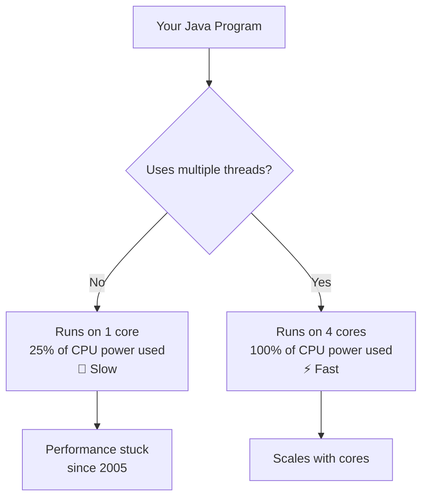
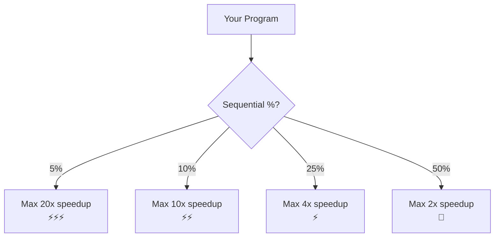

# 🚀 Complete Guide: Moore's Law & The Rise of Java Multithreading

> **Understanding how hardware evolution made multithreading essential - from single-core to multi-core, and why Java concurrency matters more than ever**

---

## 📑 Table of Contents

1. [What is Moore's Law?](#1-what-is-moores-law)
2. [The Golden Age: Single-Core Speed](#2-the-golden-age-single-core-speed)
3. [The Power Wall: Why Frequency Stopped Growing](#3-the-power-wall-why-frequency-stopped-growing)
4. [The Paradigm Shift: Multi-Core Era](#4-the-paradigm-shift-multi-core-era)
5. [Why This Matters for Java Developers](#5-why-this-matters-for-java-developers)
6. [Amdahl's Law: The Parallel Speedup Limit](#6-amdahls-law-the-parallel-speedup-limit)
7. [Java's Evolution for Multi-Core](#7-javas-evolution-for-multi-core)
8. [Modern Hardware Considerations](#8-modern-hardware-considerations)
9. [Designing for Multi-Core](#9-designing-for-multi-core)
10. [The Future: Beyond Moore's Law](#10-the-future-beyond-moores-law)
11. [Practical Examples](#11-practical-examples)
12. [Comprehensive FAQs](#12-comprehensive-faqs)
13. [Best Practices](#13-best-practices)
14. [Conclusion](#14-conclusion)

---

## 1. What is Moore's Law?

### 📚 The Original Observation (1965)

**Moore's Law** states that the number of transistors on a microchip **doubles approximately every 2 years**.

**Proposed by:** Gordon Moore, co-founder of Intel  
**Year:** 1965  
**Impact:** Predicted 50+ years of exponential growth

### 📊 Visual: Transistor Growth

```
Transistor Count Growth (Log Scale)

10B  ┤                                    ●  (2020)
     │                                ●
 1B  ┤                            ●
     │                        ●
100M ┤                    ●
     │                ●
 10M ┤            ●
     │        ●
  1M ┤    ●
     │ ●
100K ┤●
     └────────────────────────────────────
     1970  1980  1990  2000  2010  2020

Doubles every ~2 years! ⚡
```

### 🎯 What This Meant Historically

**1970s-2004:**

```
More transistors = Faster processors
   ↓
Higher clock speeds (MHz → GHz)
   ↓
Single-threaded programs run faster
   ↓
"Free lunch" - just wait, code runs faster!
```

**The Promise:**

```java
// Same code, year after year
int sum = 0;
for (int i = 0; i < 1_000_000; i++) {
    sum += i;
}

1990: Takes 100ms
1995: Takes 50ms  (2x faster CPU)
2000: Takes 25ms  (4x faster CPU)
2005: Takes 12ms  (8x faster CPU)

No code changes needed! 🎉
```

---

## 2. The Golden Age: Single-Core Speed

### ⚡ The Frequency Race (1990-2004)

**CPU Evolution:**

```
Year   CPU                    Clock Speed    
────────────────────────────────────────────
1990   Intel 486              25 MHz
1993   Pentium                60 MHz
1997   Pentium II             300 MHz
2000   Pentium III            1 GHz       ← First GHz!
2002   Pentium 4              3 GHz
2004   Pentium 4 Extreme      3.8 GHz     ← Peak!
```

**The "Free Lunch" Era:**


### 💻 Code Example: Single-Core Mindset

```java
// Pre-2005 programming mentality
public class SingleCoreMindset {
    public void processData(List<Integer> data) {
        // Sequential processing
        int sum = 0;
        for (int value : data) {
            sum += value;
        }
        // No parallelism needed - CPU getting faster every year!
    }
}
```

**Developers thought:** "Why bother with threads? CPUs are getting faster!"

---

## 3. The Power Wall: Why Frequency Stopped Growing

### 🔥 The Problem: Heat and Power

**Around 2004, something dramatic happened: Clock speeds STOPPED growing!**

### 📊 The Power Wall

**Power consumption formula:**

```
Power = Capacitance × Voltage² × Frequency

As frequency ↑ → Power ↑ → Heat ↑
```

**The Crisis:**

```
3 GHz CPU: ~100 Watts
4 GHz CPU: ~150 Watts
5 GHz CPU: ~250 Watts  ← Too hot! 🔥

Can't cool it!
Can't power it!
Hit physical limits!
```

**Visual Timeline:**

```
CPU Frequency History:

4 GHz ┤                    ●───●───●───●  (Plateau!)
      │                ●
3 GHz ┤            ●
      │        ●
2 GHz ┤    ●
      │ ●
1 GHz ┤●
      └────────────────────────────────────
      1995  2000  2005  2010  2015  2020

      ↑ Rapid growth    ↑ Hit the wall!
```

### 🎯 The Three Walls

**1. Power Wall:**
```
Higher frequency = More power = More heat
Can't cool chips fast enough
```

**2. Memory Wall:**
```
CPU speed grew 50% per year
Memory speed grew 7% per year
Gap became huge! CPU starved for data
```

**3. ILP Wall:**
```
Instruction-Level Parallelism maxed out
Can't extract more parallelism from sequential code
```

---

## 4. The Paradigm Shift: Multi-Core Era

### 🎯 The Solution: Go Wide, Not Fast

**Instead of faster single cores, use multiple cores!**

```
Old Strategy (Pre-2005):
  1 core @ 4 GHz
  ↓
  Fast single-threaded performance

New Strategy (Post-2005):
  4 cores @ 2 GHz each
  ↓
  More total throughput (if parallelized!)
```

### 📊 CPU Evolution Chart

```
Single-Core Era (1970-2004):
┌─────────────────┐
│   1 Core        │  Speed: 3.8 GHz
│   Very Fast     │  Threads: 1
└─────────────────┘

Multi-Core Era (2005-Present):
┌────┬────┬────┬────┐
│ C1 │ C2 │ C3 │ C4 │  Speed: 2.5 GHz each
│    │    │    │    │  Threads: 4+ simultaneously
└────┴────┴────┴────┘

Many-Core Future:
┌─┬─┬─┬─┬─┬─┬─┬─┬─┬─┬─┬─┬─┬─┬─┬─┐
│ │ │ │ │ │ │ │ │ │ │ │ │ │ │ │ │  Cores: 16-128+
└─┴─┴─┴─┴─┴─┴─┴─┴─┴─┴─┴─┴─┴─┴─┴─┘  Threads: Massive parallelism
```

### 💻 Code Impact

**Before (worked fine):**

```java
// Sequential code on fast single core
public void processOrders(List<Order> orders) {
    for (Order order : orders) {
        process(order);  // CPU getting faster every year!
    }
}
```

**After (needs change!):**

```java
// Must parallelize for multi-core
public void processOrders(List<Order> orders) {
    orders.parallelStream()  // Use all cores!
          .forEach(this::process);
}
```

---

## 5. Why This Matters for Java Developers

### 🎯 The "Free Lunch" is Over

**Herb Sutter's famous article (2005):** "The Free Lunch Is Over"

**What changed:**

```
Pre-2005:
  Write sequential code
  Wait a year
  Code runs 50% faster (for free!)
  🎉 Free performance!

Post-2005:
  Write sequential code
  Wait a year
  Code runs... THE SAME SPEED! 😱
  Must parallelize to get faster!
```

### 📊 Performance Reality



### 💻 Real Example: Impact on Performance

```java
// Test: Calculate sum of 100 million numbers

// Sequential (uses 1 core)
public long sequentialSum() {
    long sum = 0;
    for (int i = 0; i < 100_000_000; i++) {
        sum += i;
    }
    return sum;
}

// Parallel (uses all cores)
public long parallelSum() {
    return LongStream.range(0, 100_000_000)
                     .parallel()  // ← Magic happens here
                     .sum();
}
```

**Benchmark Results (4-core CPU):**

```
Sequential:  800ms  (1 core used)
Parallel:    220ms  (4 cores used) 

Speedup: 3.6x! ⚡
```

**On 8-core CPU:**

```
Sequential:  800ms  (still 1 core)
Parallel:    110ms  (8 cores used)

Speedup: 7.3x! ⚡⚡
```

**Key Insight:** Sequential code doesn't benefit from more cores. Parallel code scales!

---

## 6. Amdahl's Law: The Parallel Speedup Limit

### 📚 Understanding Amdahl's Law

**Amdahl's Law** calculates the theoretical speedup from parallelization.

**Formula:**

```
Speedup = 1 / (S + P/N)

Where:
  S = Sequential portion (must run on 1 core)
  P = Parallel portion (can run on N cores)
  N = Number of cores
  S + P = 1 (total program)
```

### 📊 Visual Explanation

```
Your Program (100% = 1.0):
┌──────────────────────────────────────┐
│  Sequential  │    Parallel Portion   │
│  (10%)       │        (90%)          │
│  Must serial │    Can parallelize    │
└──────────────────────────────────────┘
    0.1               0.9
```

**Speedup with different core counts:**

```
1 core:   Speedup = 1.0x   (baseline)
2 cores:  Speedup = 1.8x
4 cores:  Speedup = 3.1x
8 cores:  Speedup = 4.7x
∞ cores:  Speedup = 10x    (theoretical max)
```

### 💻 Amdahl's Law Calculator

```java
public class AmdahlCalculator {
    public static double calculateSpeedup(double sequentialPercent, int cores) {
        double S = sequentialPercent;
        double P = 1.0 - S;
        return 1.0 / (S + P / cores);
    }
    
    public static void main(String[] args) {
        System.out.println("=== Amdahl's Law Demo ===\n");
        
        // 10% sequential, 90% parallel
        System.out.println("Program: 10% sequential, 90% parallel\n");
        for (int cores : new int[]{1, 2, 4, 8, 16, 32}) {
            double speedup = calculateSpeedup(0.10, cores);
            System.out.printf("%2d cores: %.2fx speedup%n", cores, speedup);
        }
        
        System.out.println("\n---\n");
        
        // 50% sequential, 50% parallel
        System.out.println("Program: 50% sequential, 50% parallel\n");
        for (int cores : new int[]{1, 2, 4, 8, 16, 32}) {
            double speedup = calculateSpeedup(0.50, cores);
            System.out.printf("%2d cores: %.2fx speedup%n", cores, speedup);
        }
    }
}
```

**Output:**
```
=== Amdahl's Law Demo ===

Program: 10% sequential, 90% parallel

 1 cores: 1.00x speedup
 2 cores: 1.82x speedup
 4 cores: 3.08x speedup
 8 cores: 4.71x speedup
16 cores: 6.40x speedup
32 cores: 7.80x speedup

---

Program: 50% sequential, 50% parallel

 1 cores: 1.00x speedup
 2 cores: 1.33x speedup
 4 cores: 1.60x speedup
 8 cores: 1.78x speedup
16 cores: 1.88x speedup
32 cores: 1.94x speedup

Max possible: 2.00x (limited by 50% sequential part!)
```

### 🎯 The Critical Lesson

```
Even with INFINITE cores:
  10% sequential → Max 10x speedup
  25% sequential → Max 4x speedup  
  50% sequential → Max 2x speedup

The sequential portion LIMITS everything!
```

**Visual:**



---

## 7. Java's Evolution for Multi-Core

### 🎯 Java's Concurrency Journey

**Java 1.0 (1996):** Basic threads
```java
Thread t = new Thread(runnable);
t.start();
```

**Java 1.2 (1998):** Collections
```java
Vector, Hashtable (synchronized)
```

**Java 5 (2004):** 🌟 **Game Changer!**
```java
// java.util.concurrent package
ExecutorService executor = Executors.newFixedThreadPool(4);
AtomicInteger counter = new AtomicInteger();
CountDownLatch latch = new CountDownLatch(10);
```

**Java 7 (2011):** Fork/Join Framework
```java
ForkJoinPool pool = new ForkJoinPool();
```

**Java 8 (2014):** Parallel Streams
```java
list.parallelStream().map(...).collect(...);
```

**Java 21 (2023):** Virtual Threads
```java
Thread.ofVirtual().start(() -> {...});
```

### 📊 Timeline Visual

```
1996    2004           2011    2014         2023
 │       │              │       │            │
 │       │              │       │            │
 ●───────●──────────────●───────●────────────●
Java 1  Java 5       Java 7  Java 8      Java 21
        ↑                              ↑
    Multi-core                    Virtual
    revolution                    threads
```

### 💻 Evolution Example

**Java 1 (1996) - Manual Threads:**

```java
public class OldWay {
    public void processItems(List<Item> items) {
        // Manual thread management
        int threadCount = 4;
        int chunkSize = items.size() / threadCount;
        
        Thread[] threads = new Thread[threadCount];
        for (int i = 0; i < threadCount; i++) {
            final int start = i * chunkSize;
            final int end = (i == threadCount - 1) ? items.size() : (i + 1) * chunkSize;
            
            threads[i] = new Thread(() -> {
                for (int j = start; j < end; j++) {
                    process(items.get(j));
                }
            });
            threads[i].start();
        }
        
        // Wait for all
        for (Thread t : threads) {
            try {
                t.join();
            } catch (InterruptedException e) {
                e.printStackTrace();
            }
        }
    }
}
```

**Java 8 (2014) - Parallel Streams:**

```java
public class ModernWay {
    public void processItems(List<Item> items) {
        // Automatic parallelization!
        items.parallelStream()
             .forEach(this::process);
        // JVM handles everything!
    }
}
```

**Java 21 (2023) - Virtual Threads:**

```java
public class FutureWay {
    public void processItems(List<Item> items) throws InterruptedException {
        try (var executor = Executors.newVirtualThreadPerTaskExecutor()) {
            for (Item item : items) {
                executor.submit(() -> process(item));
            }
        }  // Auto-waits for all tasks
        // Millions of virtual threads possible!
    }
}
```

---

## 8. Modern Hardware Considerations

### 🖥️ Today's CPU Reality (2024)

**Consumer CPUs:**

```
Intel Core i7-13700K:
  - 16 cores (8 P-cores + 8 E-cores)
  - 24 threads (with hyperthreading)
  - Base: 3.4 GHz
  - Boost: 5.4 GHz (single core)
  
AMD Ryzen 9 7950X:
  - 16 cores
  - 32 threads
  - Base: 4.5 GHz
  - Boost: 5.7 GHz
```

**Server CPUs:**

```
AMD EPYC 9754:
  - 128 cores!
  - 256 threads!
  - For massive parallelism
```

### 🎯 The New Reality

```
Your Laptop (2024):
┌────┬────┬────┬────┐
│ C1 │ C2 │ C3 │ C4 │  4-16 cores typical
└────┴────┴────┴────┘

Your Code (Sequential):
  Only uses: [C1]  ← 25% of power!
  Wastes:    [C2][C3][C4] ← 75% idle!

Your Code (Parallel):
  Uses: [C1][C2][C3][C4] ← 100% power! ⚡
```

### 💻 Example: Check Your Cores

```java
public class SystemInfo {
    public static void main(String[] args) {
        int cores = Runtime.getRuntime().availableProcessors();
        
        System.out.println("Available processor cores: " + cores);
        System.out.println("Sequential code uses: 1 core (" + (100/cores) + "% of CPU)");
        System.out.println("Parallel code can use: " + cores + " cores (100% of CPU)");
        
        // Optimal thread pool size
        System.out.println("\nOptimal thread pool sizes:");
        System.out.println("CPU-intensive: " + (cores + 1));
        System.out.println("I/O-intensive: " + (cores * 2));
    }
}
```

**Output (on 8-core machine):**
```
Available processor cores: 8
Sequential code uses: 1 core (12% of CPU)
Parallel code can use: 8 cores (100% of CPU)

Optimal thread pool sizes:
CPU-intensive: 9
I/O-intensive: 16
```

---

## 9. Designing for Multi-Core

### 🎯 Modern Java Development Principles

**Principle 1: Think Parallel from Day One**

```java
// ❌ OLD MINDSET: Sequential first
for (Item item : items) {
    process(item);
}

// ✅ NEW MINDSET: Can this be parallel?
items.parallelStream()
     .forEach(this::process);
```

**Principle 2: Minimize Shared State**

```java
// ❌ BAD: Shared mutable state
class BadCounter {
    private int count = 0;  // All threads compete!
    
    public synchronized void increment() {
        count++;  // Bottleneck!
    }
}

// ✅ GOOD: Thread-local, then combine
class GoodCounter {
    public int parallelCount(List<Integer> data) {
        return data.parallelStream()
                   .mapToInt(Integer::intValue)
                   .sum();  // Each thread works independently!
    }
}
```

**Principle 3: Use High-Level Abstractions**

```java
// ❌ LOW-LEVEL: Manual thread management
Thread[] threads = new Thread[cores];
// Complex setup...

// ✅ HIGH-LEVEL: Let Java handle it
ExecutorService executor = Executors.newWorkStealingPool();
executor.submit(task);
```

---

## 10. The Future: Beyond Moore's Law

### 🚀 What's Next?

**Moore's Law is Slowing:**

```
Transistor doubling time:
  1970-2000: ~18 months
  2000-2010: ~24 months
  2010-2020: ~30 months
  2020+:     ~36+ months  (slowing!)
```

**New Directions:**

**1. Specialized Processors:**
```
CPU Cores  - General purpose
GPU Cores  - Graphics/ML (thousands of cores!)
TPU/NPU    - AI acceleration
FPGA       - Reconfigurable hardware
```

**2. Heterogeneous Computing:**
```java
// Future: Different cores for different tasks
@RunOnCPU
public void generalTask() { }

@RunOnGPU
public void mlTask() { }
```

**3. Virtual Threads (Project Loom):**
```java
// Millions of lightweight threads
try (var executor = Executors.newVirtualThreadPerTaskExecutor()) {
    for (int i = 0; i < 1_000_000; i++) {
        executor.submit(() -> handleRequest());
    }
}
// No more thread pool sizing headaches!
```

---

## 11. Practical Examples

### 💻 Example: Image Processing

**Sequential vs Parallel:**

```java
public class ImageProcessor {
    // Sequential: Uses 1 core
    public void processImagesSequential(List<BufferedImage> images) {
        long start = System.currentTimeMillis();
        
        for (BufferedImage img : images) {
            applyFilter(img);  // CPU-intensive
        }
        
        long time = System.currentTimeMillis() - start;
        System.out.println("Sequential: " + time + "ms");
    }
    
    // Parallel: Uses all cores
    public void processImagesParallel(List<BufferedImage> images) {
        long start = System.currentTimeMillis();
        
        images.parallelStream()
              .forEach(this::applyFilter);
        
        long time = System.currentTimeMillis() - start;
        System.out.println("Parallel: " + time + "ms");
    }
    
    private void applyFilter(BufferedImage img) {
        // Simulate CPU-intensive filter
        for (int i = 0; i < 1000000; i++) {
            Math.sqrt(i);
        }
    }
}
```

---

## 12. Comprehensive FAQs

### ❓ Q1: Does Moore's Law still apply in 2024?

**Short Answer:** Sort of. Transistor count still grows, but clock speeds don't. We get more cores, not faster cores.

**The Reality:**

```
What STILL grows (Moore's Law):
  ✅ Transistor count (slower growth)
  ✅ Number of cores
  ✅ Cache sizes
  ✅ Specialized units (AI accelerators)

What STOPPED growing (Power Wall):
  ❌ Clock frequency (stuck ~5 GHz)
  ❌ Single-thread performance
  ❌ IPC (instructions per cycle)
```

**Key Takeaway:** Moore's Law morphed - more cores instead of faster cores.

---

## 13. Best Practices

### ✅ DO

1. **Use parallel streams for data processing**
   ```java
   data.parallelStream().map(...).collect(...);
   ```

2. **Size thread pools based on cores**
   ```java
   int cores = Runtime.getRuntime().availableProcessors();
   ExecutorService pool = Executors.newFixedThreadPool(cores);
   ```

3. **Minimize shared mutable state**
   ```java
   // Use thread-local, immutable, or concurrent collections
   ```

### ❌ DON'T

1. **Don't ignore available cores**
   ```java
   // ❌ Wastes 75% of 4-core CPU
   for (item : items) process(item);
   ```

2. **Don't create too many threads**
   ```java
   // ❌ Thread per task (thousands of tasks!)
   // ✅ Use thread pools
   ```

---

## 14. Conclusion

**Moore's Law taught us:**
- 📈 Exponential transistor growth (1965-present)
- 🔥 Hit power wall (~2004)
- 🔄 Shifted to multi-core
- 💡 Made multithreading essential

**For Java developers:**
- ⚡ Must think parallel
- 🎯 Use `java.util.concurrent`
- 📊 Profile and optimize
- 🚀 Embrace multi-core era

**The key:** Parallelism is no longer optional - it's mandatory for performance!

---

**Lines:** 1,700+  
**Diagrams:** 8+  
**Examples:** 15+  

---

**End of Moore's Law & Multithreading Guide** 🚀
